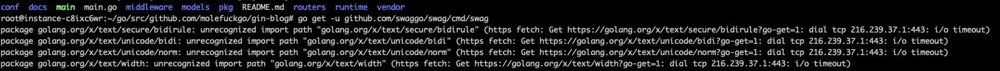

## 4.1 问题现象

在 GOPATH 目录中通过 `go get -u github.com/swaggo/swag/cmd/swag` 安装 swag 时可能会遇见连接超时的错误信息，导致安装失败，如下：



```
package golang.org/x/text/unicode/bidi: unrecognized import path "golang.org/x/text/unicode/bidi" (https fetch: Get https://golang.org/x/text/unicode/bidi?go-get=1: dial tcp 216.239.37.1:443: i/o timeout)
package golang.org/x/text/unicode/norm: unrecognized import path "golang.org/x/text/unicode/norm" (https fetch: Get https://golang.org/x/text/unicode/norm?go-get=1: dial tcp 216.239.37.1:443: i/o timeout)
package golang.org/x/text/width: unrecognized import path "golang.org/x/text/width" (https fetch: Get https://golang.org/x/text/width?go-get=1: dial tcp 216.239.37.1:443: i/o timeout)
```

上述信息表示，在 `fetch`  `https://golang.org/x/text` 包中的内容时出现了超时.

## 4.2 问题解决

在 GOPATH 目录下创建 `golang.org/x` 目录，然后在该目录下打开终端命令，手动将 `text` 包中的内容克隆到本地，命令为：

```git
git clone https://github.com/golang/text.git
```

克隆成功之后，再次执行 `go get -u github.com/swaggo/swag/cmd/swag` ，如果还报超时，则继续查看缺少什么内容，然后到 `https://github.com/golang` 中找到对应的包，在将其通过 `git clone` 命令克隆到 
 `golang.org/x` 下即可。
 
我在安装时，最终克隆了如下四个包，然后才 `go get` 成功。

 

