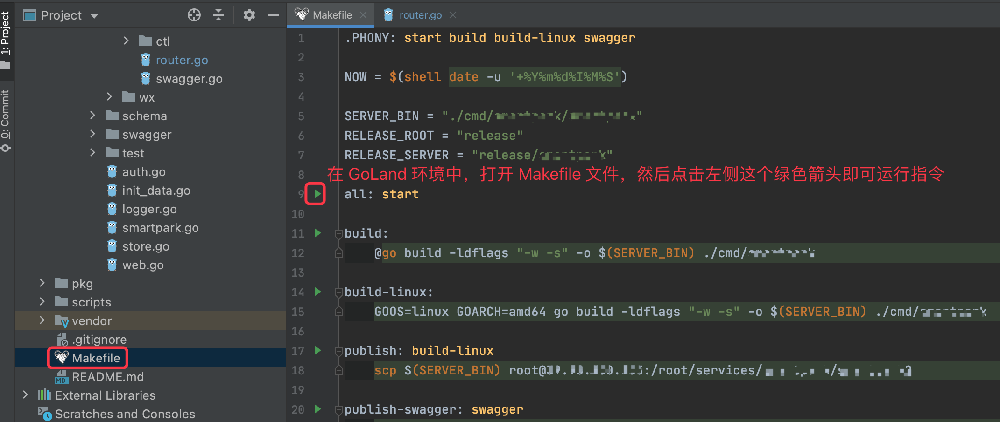
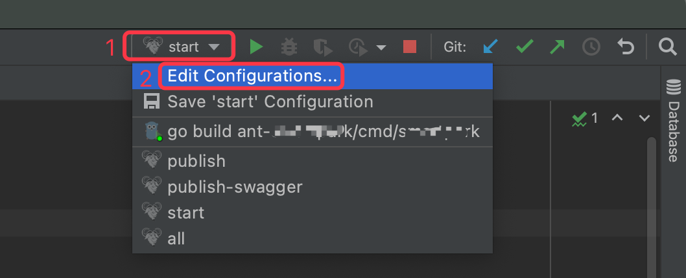
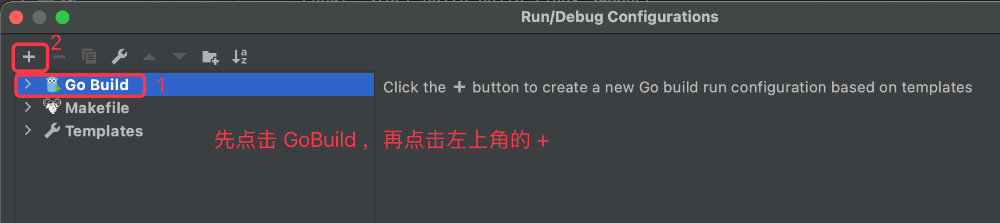
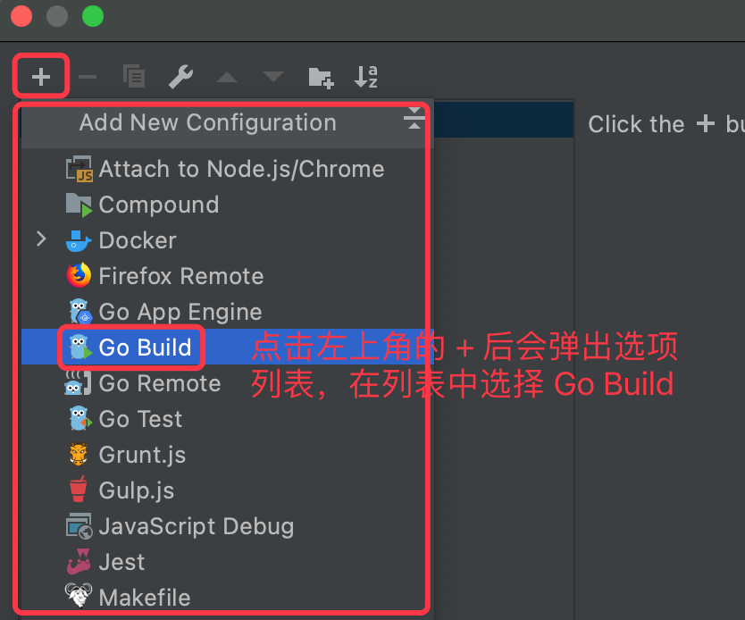
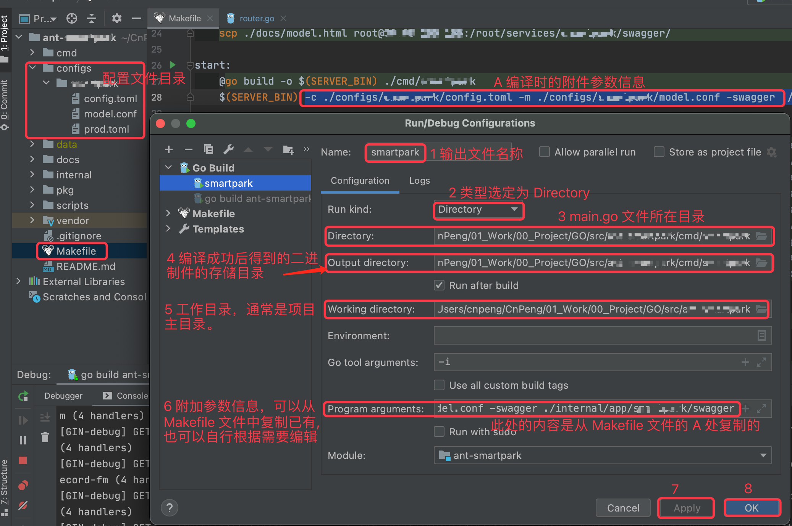
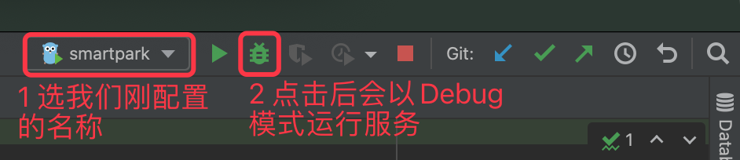

实现的目标：本地服务运行过程中，触发断点调试，及时跟踪服务运行状况。

## 5.1 现状

目前项目中，编译脚本被整合到了 `Makefile` 文件中。在 GoLand 中，我们打开该文件，点击左侧的绿色箭头就可以直接执行对应的脚本内容。如下图：

但是，这样运行服务之后，我们无法对运行中的服务进行断点调试。对于习惯了 AndroidStudio 断点调试的人来说，GoLand 中不能断点调试实在太难受，那么我们想要进行断点调试的话，该怎么做呢？

## 5.2 配置

点击下图中的 `Edit Configurations` :

在弹出的页面中先点击 `GoBuild` 再点击左上方的 `+`，如下图：

在弹出的选项列表中依旧选择 `Go Build`：

然后在弹出的配置页面中做具体配置，如下：

## 5.3 断点调试

按照上一步图片中的数字顺序配置完之后，我们会看到下面的样子：

点击上图 2 处的图标即可以 Debug 模式运行服务。然后我们在 [APIFox](https://www.apifox.cn/) 中发送接口请求，就会主动触发 GoLand 中提前打下的断点，如下图：

在上图中，触发断点之后，我们就可以及时看到程序的运行情况，方便我们更快捷的修复 BUG 。

## 5.4 参考

* [《goland本地调试》](https://blog.csdn.net/u013536232/article/details/104095253)
* [《goland远程调试》](https://blog.csdn.net/u013536232/article/details/104123861)

> 上面两个文章同一作者，远程调试我还没有尝试。