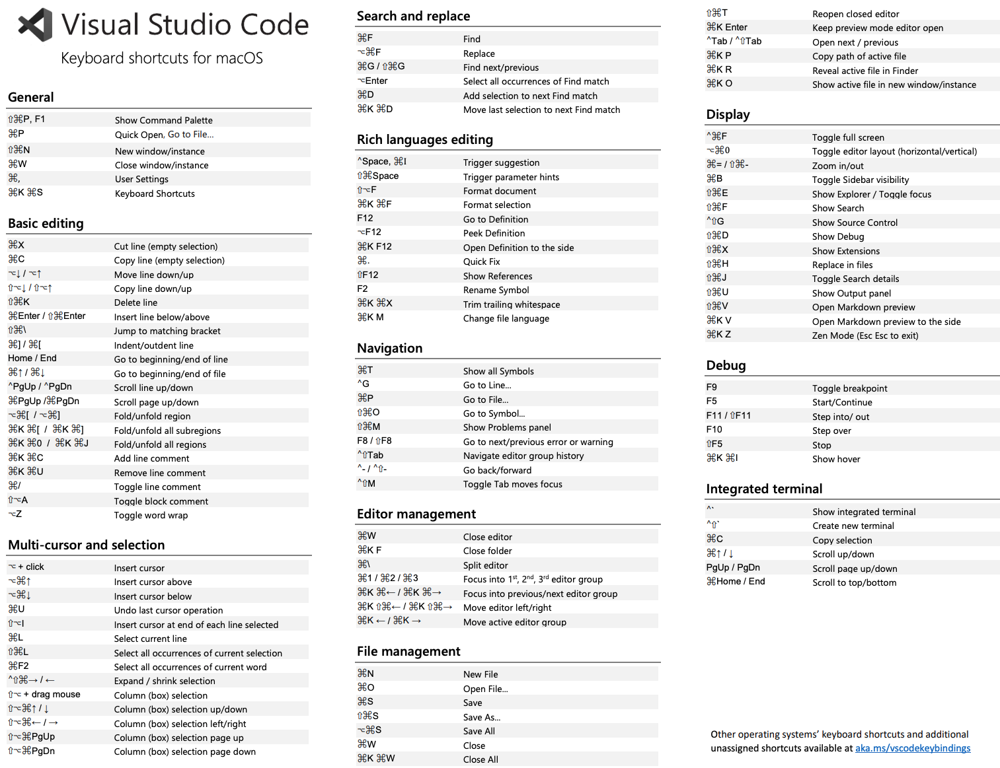

# 1. VsCode快捷键

## 1.1. 基础快捷键

命令 | 作用
---|---
`Shift+Cmd+P` | 打开 VsCode 命令面板（注意，不是终端）
`Cmd+P` | 快速打开文件，列表中优先展示最近打开的文件
重复点击 `Cmd+P` | 快速在最近打开的文件间切换
`Cmd+P`，然后输入 `?` | 可以查看与命令相关的建议
`Cmd+P`，然后输入 `term`，并输入空格 | 可以看到终端列表，点击即可打开终端
`Ctrl+R` | 以列表形式展示最近打开的文件

## 1.2. 状态栏快捷键

命令 | 作用
---|---
`F5` | 对当前程序进行调试
`Ctrl`
`Shift+Cmd+M` | 打开问题窗口（展示并跳转到项目中的错误和警告）
`Shift+Cmd+M`，然后点击 `F8` | 在错误间进行切换
`Shift+Cmd+M`，然后点击 `Shift+F8` | 在错误间进行切换
`Cmd+K M` | 切换编码语言（先按下 `Cmd+K`，紧接着按下 `M`）

## 1.3. 与自定义相关的快捷键

命令 | 作用
---|---
`Cmd+K Cmd+T` | 切换编辑器主题（先按下 `Cmd+K`，再按下 `Cmd+T`）
`Cmd+K Cmd+S` | 查看/自定义快捷键
`Cmd+K Cmd+R` | 查看默认的快捷键参考（打开官方的快捷键pdf汇总图）
`Cmd+,` | 打开用户设置界面
`Shift+Cmd+X` | 打开VsCode中的插件市场  （也可以直接去 [官方插件市场页面](https://marketplace.visualstudio.com/vscode)手动搜索和下载） 

## 1.4. 文件和文件夹

命令 | 作用
---|---
`Ctrl+~` | 打开终端（命令行工具，CLI）。`~` 为键盘最左上方的那个按键
`Cmd+B` | 打开或关闭侧边栏
`Cmd+J` | 切换面板（关闭或展开底部面板--包含问题、输出、终端、调试控制台的那个面板）
`Cmd+K Z` | 进入无干扰的禅宗模式（即只有一个代码编辑界面）。  连续按下两次 `ESC` 键可以退出禅宗模式
`Cmd+\` | 向右拆分。  拆分后，使用 `Cmd+1`、`Cmd+2`、`Cmd+3` 等可以在页签间进行切换
`Shift+Cmd+E` | 展开资源管理器
`Cmd+W` | 关闭当前文件
`Ctrl+Tab` | 在当前打开的多个文件之间进行切换
`Ctrl+-` | 返回上一个文件（向后导航）
`Shift+Ctrl+-` | 进入到下一个文件（向前导航）

## 1.5. 编辑技巧

命令 | 作用
---|---
按住`Shift+Alt`, 然后拖动光标 | 选择列、块 
`Shift+Alt+↑` | 向上复制行
`Shift+Alt+↓` | 向下复制行
`Alt+↑` | 向上移动
`Alt+↓` | 向下移动
`Ctrl+Shift+Cmd+←` | 缩小选区
`Ctrl+Shift+Cmd+→` | 扩大选区
`Shift+Cmd+O` | 在文件中搜索/跳转到文件中的指定内容（`O`是英文字母）
`Ctrl+G` | 跳转到指定行
`Alt+Shift+F` | 格式化当前文件
`Alt+Cmd+[` | 代码折叠（代码中的大括号折叠）
`Alt+Cmd+]` | 代码展开（代码中的大括号展开）
`Cmd+K Cmd+0` | 代码全部折叠
`Cmd+K Cmd+J` | 代码全部展开
`Cmd+K Cmd+L` | 折叠或展开块注释
`Cmd+L` | 逐行选中
`Cmd+↑` | 跳转到文件开头
`Cmd+↓` | 跳转到文件结尾
`Shift+Cmd+V` | 预览 markdown 文件，再次点击即关闭预览
`Cmd+K V` | 即时预览 markdown 文件，再次点击即关闭预览
`Alt+F12` | 将光标放到某个变量/方法上，然后点击快捷键之后以弹窗的形式展示其内部定义
`F12` | 将光标放到某个变量/方法上， 然后按 `F12`，可以跳转到变量/方法的定义处。 按住 `Cmd`,  然后单击该变量/方法也可以跳转到定义处。  按 `Ctrl+-` 可以回到之前的位置
`Shift+F12` | 查找引用（已浮窗形式展示）
`Shift+Alt+F12` | 查找全部引用（在左侧引用面板中展示）
`F2` | 重命名

## 1.6. 其他

命令 | 作用
---|---
`F5` | 对当前程序进行调试
`Ctrl+F5` | 运行当前程序

## 1.7. 完整快捷键截图

