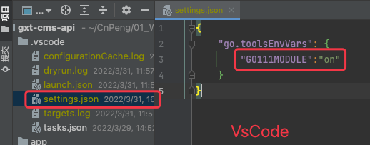
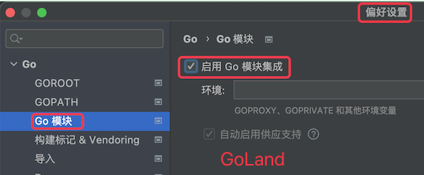

# 1. vendor 迁移到 mod

项目早期使用 vendor 管理依赖，我们想切换为 mod 。步骤大致如下

* 启用 go mod。具体参考下图：

* 不要删除现有的 vendor 目录
* 在项目根目录下执行 `go mod init` 命令
* 如果项目有引用公司内部私有代码仓库中的库，则需要配置 `GOPRIVATE` 代理。命令为：`go env -w GOPRIVATE=gogs.sdgaoxintong.com`，该命令中 `gogs.sdgaoxintong.com` 为我公司私有仓库地址
* 执行 `go env` 查看上一步的配置是否成功，如果成功则继续执行后续步骤。
* 修改 `go.mod` 文件，为引用的公司私有仓库添加 replace 语句。格式为：`replace 项目中的sdk名称sdk版本号 => 仓库中的sdk 仓库中的sdk版本`
    * `replace jgt-sdk v1.0.0 => gogs.sdgaoxintong.com/gaoxintong/jgt-sdk v1.0.19`，该命令中 `jgt-sdk` 为 go 文件中的引用名称，`gogs.sdgaoxintong.com/gaoxintong/jgt-sdk` 为仓库中的名称。
* 执行 `go mod tidy` 

执行上述命令之后，即可完成切换。