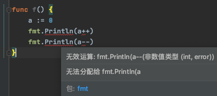

# 1. 10-Go代码断行规则

[原文：《Go代码断行规则》](https://blog.csdn.net/MiixTimer/article/details/102701324)

## 1.1. 分号插入规则

### 1.1.1. 插入规则

在很多语言中，都使用分号 `;`  作为语句终止符。但是在 Go 中不需要显示书写分号，而是会自动插入分号。

根据 [Go白皮书](https://golang.google.cn/ref/spec#Semicolons) 中的描述，Go 中自动插入分号的规则如下：

* 在 Go 代码中，除注释外，如果一个代码行的最后一个语法词段（token）为下列所示之一，则自动在此字段后（即行尾）插入一个分号：
    * 一个标识符；
    * 一个整数、浮点数、虚部、码点或者字符串字面量表示形式；
    * 这几个跳转关键字之一：break、continue、fallthrough 和 return；
    * 自增运算符 `++` 或者自减运算符 `--`；
    * 一个右括号：`)`、`]` 或 `}` 。

* 为了让一条复杂语句完全显示在一个代码行中，分号可能被插入在一个右小括号 `)` 或者右大括号 `}` 之前。

### 1.1.2. 示例1

上述第二条规则允许我们写出如下的代码：

```go
import (_ "math";"fmt")
var (a int; b string)
const (M = iota;N)
type (MyInt int;T struct{x bool;y int32})
type I interface{m1(int); m2() string}
func f() {fmt,Println("a");panic(nil)}
```

编译器在编译时刻将自动插入所需的分号，如下所示：

```go
var (a int; b string;);
const (M = iota; N;);
type (MyInt int;T struct{x bool;y int32;};);
type I interface{m1(int); m2() string;};
func f() {fmt,Println("a");panic(nil);};
```

当然了，我们实际编码中不会向上面这样子书写。

### 1.1.3. 注意1

分号自动插入规则导致的一个结果是：**自增和自减运算必须呈现为单独的语句，它们不能被当作表达式使用**。比如下面的代码是编译不通过的：

```go
func f() {
	a := 0
	fmt.Println(a++)
	fmt.Println(a--)
}
```

上面的代码编译不通过的原因是它等价于下面的代码：

```go
func f() {
	a := 0;
	fmt.Println(a++;);
	fmt.Println(a--;);
}
```



你可能会想，我们将 a++ 用小括号包裹起来会不会能编译通过？这样其实也不行：


正确写法如下：

```go
func LineBreakF3() {
	a := 0
	a++
	fmt.Println(a)
	a--
	fmt.Println(a)
}
```

### 1.1.4. 注意2

分号自动插入规则导致的另一个结果是：**我们不能在选择器中的句点 `.` 之前断行。在选择器中的句点之后断行是允许的**。比如：

正确写法：

```go
anObject.
	MethodA().
	MethodB().
	MethodC()
```

而下面这样是非法的（虽然在 Java 和其他语言中这种是合法的，但 Go 中是非法的）：

```go
anObject
	.MethodA()
	.MethodB()
	.MethodC()
```

此段代码是非法的原因是，被编译器将自动在每个右小括号 `)`后面插入一个分号，如下所示：

```go
anObject;
	.MethodA();
	.MethodB();
	.MethodC();
```

### 1.1.5. 注意3

#### 1.1.5.1. `switch-case` 断行注意

需要注意 `switch-case` 语法断行后的区别：

```go
func alwaysFalse() bool { return false }

func main() {
	switch alwaysFalse() 
	{
	case true:fmt.Println("true")
	case false:fmt.Println("fase")
	}
}
```

上述的 `switch-case` 代码块输出的是 true，而不是 flase 。此代码块和下面这个是不同的：

```go
switch alwaysFalse() {
	case true:fmt.Println("true")
	case false:fmt.Println("fase")
}
```

如果我们使用 `go fmt` 命令格式化前一个代码块，一个分号将自动添加到 `alwaysFalse()` 函数调用之后，如下所示：
 
```go
switch alwaysFalse();
{
case true:fmt.Println("true")
case false:fmt.Println("fase")
}
```

插入分号后，此代码块将和下者等价：

```
switch alwaysFalse();true {
case true:fmt.Println("true")
case false:fmt.Println("false")
}
```

这就是它为什么输出 true 的原因。常使用 `go fmt` 和 `go vet` 命令来格式化和发现可能的逻辑错误是一个好习惯。

#### 1.1.5.2. GoLand 中执行 go fmt

在 GoLand 中执行 `go fmt` 有两种方式：

* 直接使用 GoLand 的格式化快捷键，如下图：


* 在终端中切换到文件所在目录，然后手动输入 `go fmt` 命令，如下图：


### 1.1.6. 注意4

下面是一个很少见的情形，此情形中所示的代码看上去是合法的，但是实际上是编译不通过的。

```go
func f(x int) {
	switch x {
	case 1:
	{
		goto A
		A:	// 这里编译没问题
	}
	case 2:
		goto B
		B:	// syntax error：跳转标签后缺少语句.expected statement, found 'case'
	case 3:
		goto C
		C:	// 这里编译没问题
	}
}
```

GoLand 中获取到的错误信息如下：


编译错误信息表明跳转标签 B 的声明之后必须跟一条语句。

但是，看上去，上例中的三个标签声明没什么不同，它们都没有跟随一条语句。那为什么只有 `B:` 标签声明是不合法的呢？

原因是，根据前述第二条分号自动插入规则，编译器将在 `A:` 和 `C:` 标签声明之后的右大括号 `}` 字符之前插入一个分号，如下所示：

```go
func f(x int) {
	switch x {
	case 1:
	{
		goto A
		A:
	;}	// 一个分号插入到了这里
	case 2:
		goto B
		B:	// syntax error：跳转标签后缺少语句
	case 3:
		goto C
		C:
	;}	// 一个分号插入到了这里
}
```

**一个单独的分号实际上表示一条空语句**。这就是为什么 `A:` 和 `C:` 标签声明之后确实跟随了一条语句的原因，所以它们是合法的。

而 `B:` 标签声明跟随的 `case 0:` 不是一条语句，所以它是不合法的。**我们可以在 `B:` 标签声明之后手动插入一个分号使之变得合法。**

```go
func SwitchTest3(x int) {
	switch x {
	case 1:
		{
		goto A
		A:	// 这里编译没问题
		}
	case 2:
		goto B
		B:;	// 末尾加上 ; 后这里编译没问题
	case 3:
		goto C
		C:	// 这里编译没问题
	}
}
```

## 1.2. 逗号,从不会被自动插入

一些包含多个类似项目的语法形式多用逗号 `,` 作为这些项目之间的分割符.比如组合字面值和函数参数列表等。

在这样的一个语法形式中，最后一个项目总可以跟一个可选的逗号。

如果此逗号为它所在代码行的最后一个有效字符，则此逗号是必需的；否则，此逗号可以省略。编译器在任何情况下都不会自动插入逗号。

比如，下面的代码是合法的：

```go
func f1(a int,b string,) (x bool,y int,) {
	return true,789
}

var f2 func (a int,b string) (x bool,y int)
var f3 func (a int,b string,	// 最后一个逗号是必须的
) (x bool, y int,	// 最后一个逗号是必须的
)

var _ = []int{2,3,5,7,9,}	// 最后一个逗号是可选的
var _ = []int{2,3,5,7,9,	// 最后一个逗号是必须的
}

var _,_ = f1(123,"Go",)		// 最后一个逗号是可选的
var _,_ = f1(123,"Go",		// 最后一个逗号是必须的
)
```


