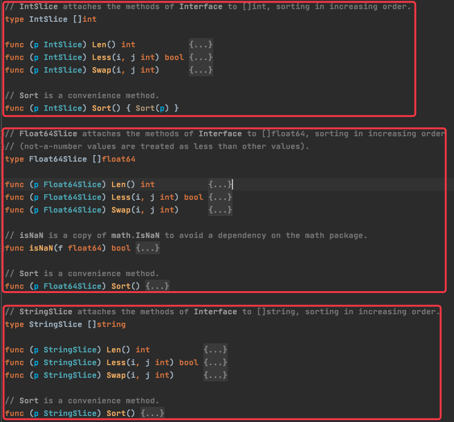
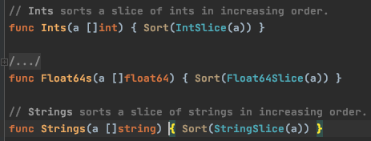
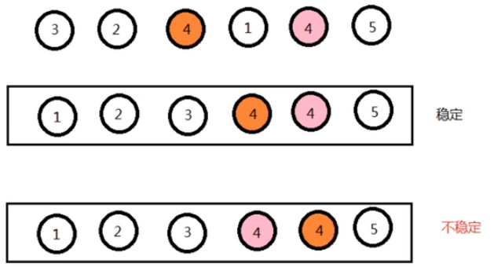
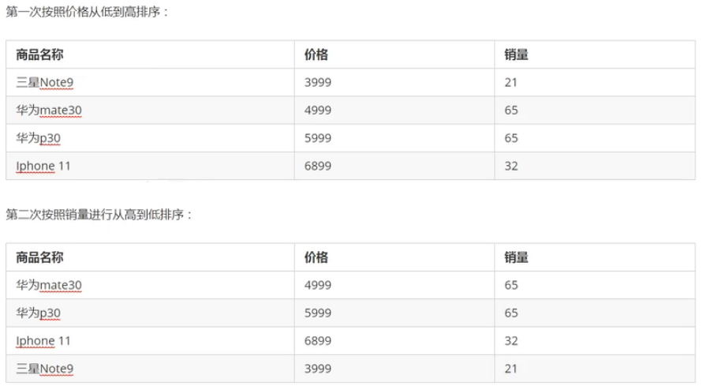

# 1. 1-sort使用

sort 包主要用来实现排序相关的操作，它实现了四种基本的排序算法：插入排序（insertionSort）、归并排序（symMerge）、堆排序（heapSort）和快速排序（quickSort）；sort 包会依据实际数据自动选择最优的排序算法。

## 1.1. sort.Interface 接口

如果某个 struct 需要排序，则必须实现 sort.Interface 接口，提供 Len、Less、Swap 三个方法的实现，然后调用 `sort.Sort()` 。Interface 的具体定义如下：

```go
type Interface interface {
	// Len is the number of elements in the collection.
	Len() int
	// Less reports whether the element with
	// index i should sort before the element with index j.
	Less(i, j int) bool
	// Swap swaps the elements with indexes i and j.
	Swap(i, j int)
}
```

假设我们需要对 []int 切片中的元素进行排序，其实现代码如下：

```go
type IntSlice []int

func (p IntSlice) Len() int           { return len(p) }
func (p IntSlice) Less(i, j int) bool { return p[i] < p[j] }
func (p IntSlice) Swap(i, j int)      { p[i], p[j] = p[j], p[i] }

func main(){
	nums := []int{2, 31, 5, 6, 3}
	sort.Sort(IntSlice(nums))
	fmt.Println("intSort:", nums) // [2,3,5,6,31]
}
```

其实，上述示例代码中定义的 IntSlice 就是 sort 包中已经提供好的内容，该包中还提供了 Float64Slice、StringSlice。如下图：



所以，我们在对 int、string、float64 的切片进行排序时就不需要再包装和实现 Interface 接口了，直接调用即可，示例如下：

```go
// []int排序
nums := []int{2, 31, 5, 6, 3}
sort.Sort(sort.IntSlice(nums))

// []string字符串排序
names := []string{"abc", "12", "kk", "Jordan", "Ko", "DD"}
sort.Sort(sort.StringSlice(nums))
```

此外，sort 包中还提供了 Ints、Float64s、Strings 函数，其定义如下：



所以，我们的排序代码还可以简化，如下：

```go
// []int排序
nums := []int{2, 31, 5, 6, 3}
sort.Ints(nums)

// []string字符串排序
names := []string{"abc", "12", "kk", "Jordan", "Ko", "DD"}
sort.Strings(nums)
```

## 1.2. sort.Reverse 逆向排序

如果需要逆向排序，则需要先使用 sort.Reverse 进行包装，获取 sort.Reverse 指针，然后再调用 sort.Sort() ，示例如下：

```go
// []int排序
nums := []int{2, 31, 5, 6, 3}
sort.Sort(sort.Reverse(sort.IntSlice(nums)))
fmt.Println(nums) //[31 6 5 3 2]
```

sort.Reverse(a) 接收的参数是实现了 sort.Interface 的数据。它只是标识需要逆序，并不执行排序操作，排序操作还是需要 sort.Sort() 来实现。

## 1.3. sort.Stable 稳定排序

### 1.3.1. 稳定排序的概念

数组 arr 中有若干元素，其中 A 元素和 B 元素相等，并且 A 元素在 B 元素前面，如果使用某种排序算法之后，能够保证 A 元素依旧在 B 元素的前面，则认为该算法是稳定的。



### 1.3.2. 稳定排序意义

如果一组数据只需要一次排序，则稳定性一般是没有意义的，如果一组数据需要多次排序，则稳定性是有意义的。

例如，要排序的内容是一组商品对象，第一次排序按照价格由低到高排序，第二次排序按照销量由高到低排序。如果第二次排序使用稳定性算法，就可以使得相同销量的对象依旧保持着价格高低的顺序展现，只有销量不同的对象才需要重新排序。这样**既可以保持第一次排序的原有意义，而且可以减少系统开销**。



上图中，第一次根据价格排序时，华为 Mate30 在华为 P30 的前面，第二次根据销量排序后，华为 Mate30 依旧在华为 P30 前面，所以，这两次排序使用了稳定排序

### 1.3.3. 常见排序算法的稳定性

* 稳定排序：冒泡排序、插入排序、归并排序
* 不稳定排序：选择排序、希尔排序、快速排序

### 1.3.4. sort.Stable 的使用

```go
package sortTest

import (
	"fmt"
	"sort"
)

type person struct {
	Name  string
	Age   int
	Score int
}

type personSort struct {
	persons []person
	// 接收函数类型的参数，这样会比较灵活，
	less func(x, y person) bool
}

var pSlice = []person{
	{
		Name:  "A",
		Age:   55,
		Score: 90,
	},
	{
		Name:  "B",
		Age:   22,
		Score: 80,
	},
	{
		Name:  "C",
		Age:   40,
		Score: 50,
	},

	{
		Name:  "D",
		Age:   22,
		Score: 80,
	},
	{
		Name:  "E",
		Age:   11,
		Score: 60,
	},
}

// 让 personSlice 实现 sort.Interface 接口
func (p personSort) Len() int {
	return len(p.persons)
}

func (p personSort) Less(a, b int) bool {
	return p.less(p.persons[a], p.persons[b])
}

func (p personSort) Swap(i, j int) {
	p.persons[i], p.persons[j] = p.persons[j], p.persons[i]
}

func StableSortTest() {
    // 根据年龄排序
	personAgeSort := personSort{
		persons: pSlice,
		less: func(x, y person) bool {
			return x.Age < y.Age
		},
	}
	sort.Stable(personAgeSort)
	// [{E 11 60} {B 22 80} {D 22 80} {C 40 50} {A 55 90}]
	fmt.Printf("StableSort1: %v \n", personAgeSort.persons)

    // 根据得分排序
	personScoreSort := personSort{
		persons: pSlice,
		less: func(x, y person) bool {
			return x.Score < y.Score
		},
	}
	sort.Stable(personScoreSort)
	//[{C 40 50} {E 11 60} {B 22 80} {D 22 80} {A 55 90}]
	fmt.Printf("StableSort2: %v \n", personScoreSort.persons)

    // 先根据年龄排序，再根据得分排序,最后根据姓名排序
	mixtureSort := personSort{
		persons: pSlice,
		less: func(x, y person) bool {
			if x.Age != y.Age {
				return x.Age < y.Age
			}
			if x.Score != y.Score {
				return x.Score < y.Score
			}
			return x.Name < y.Name
		},
	}
	sort.Stable(mixtureSort)
	fmt.Printf("StableSort2: %v \n", personScoreSort.persons)
}
```

上述代码中，我们定义了一个 personSort 结构体，它有两个成员变量，一个是 person 切片，一个是函数类型的 less 。personSort 实现了 sort.Interface 接口，所以可以对 personSort 中的内容进行排序。

在排序时，Less 条件由 personSort 的成员 less 决定，这样我们就可以根据实际需要动态的定义排序条件。

## 1.4. sort.IsSort 是否有序

sort.Sort(a) 函数只用来判断 a 是否有序，并不执行排序操作，其定义如下：

```go
// IsSorted reports whether data is sorted.
func IsSorted(data Interface) bool {
	n := data.Len()
	for i := n - 1; i > 0; i-- {
		if data.Less(i, i-1) {
			return false
		}
	}
	return true
}
```
