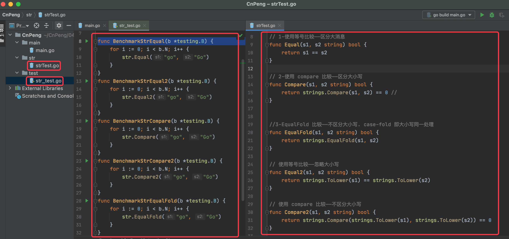
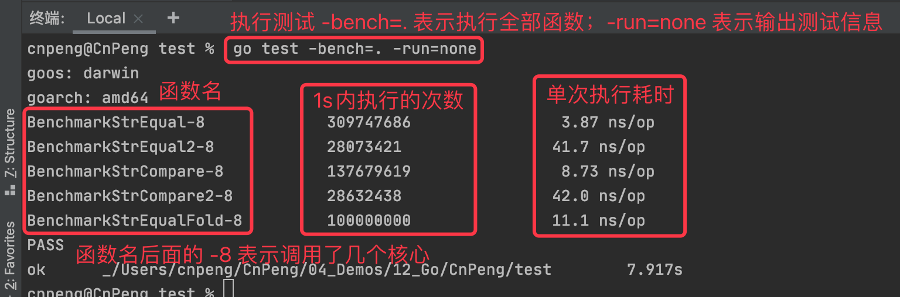

## 2.1 比较方式

在 go 语言中字符串比较的方式有如下三种：

* `==` 直接比较，区分大小写
* `strings.Compare(a,b)` 该函数返回值为 int, 0 表示两数相等，1 表示 a>b, -1 表示 a<b。区分大小写
* `strings.EqualFold(a,b)` 直接返回是否相等，不区分大小写。

示例如下：

```go
// 1-使用等号比较——区分大消息
func Equal(s1, s2 string) bool {
	return s1 == s2
}

// 2-使用 compare 比较——区分大小写
func Compare(s1, s2 string) bool {
	return strings.Compare(s1, s2) == 0 //
}


//3-EqualFold 比较——不区分大小写. case-fold 即大小写同一处理
func EqualFold(s1, s2 string) bool {
	return strings.EqualFold(s1, s2)
}

// 使用等号比较——忽略大小写
func Equal2(s1, s2 string) bool {
	return strings.ToLower(s1) == strings.ToLower(s2)
}

// 使用 compare 比较——不区分大小写
func Compare2(s1, s2 string) bool {
	return strings.Compare(strings.ToLower(s1), strings.ToLower(s2)) == 0
}


func StringCompareTest() {
	fmt.Println("== 区分大小写", Equal("go", "Go")) 	//false
	fmt.Println("== 忽略大小写",Equal2("go", "Go"))  //true
	fmt.Println("compare 区分大小写",Compare("go", "Go")) //false
	fmt.Println("compare 忽略大小写",Compare2("go", "Go")) //true
	fmt.Println("EqualFold 忽略大小写",EqualFold("go", "Go")) // true
}
```

## 2.2 性能比较

下面的代码使用 Benchmark 做简单的性能比较，测试项目的目录结构为：



详细代码：


```go
package test

import (
	"../str"
	"testing"
)

func BenchmarkStrEqual(b *testing.B) {
	for i := 0; i < b.N; i++ {
		str.Equal("go", "Go")
	}
}
func BenchmarkStrEqual2(b *testing.B) {
	for i := 0; i < b.N; i++ {
		str.Equal2("go", "Go")
	}
}
func BenchmarkStrCompare(b *testing.B) {
	for i := 0; i < b.N; i++ {
		str.Compare("go", "Go")
	}
}
func BenchmarkStrCompare2(b *testing.B) {
	for i := 0; i < b.N; i++ {
		str.Compare2("go", "Go")
	}
}
func BenchmarkStrEqualFold(b *testing.B) {
	for i := 0; i < b.N; i++ {
		str.EqualFold("go", "Go")
	}
}
```

测试结果如下：



通过上图可以看出，**效率最高的还是 ==**

## 2.3 源码分析

### 2.3.1 strings.Compare

```go

package strings

// Compare returns an integer comparing two strings lexicographically.
// The result will be 0 if a==b, -1 if a < b, and +1 if a > b.
//
// Compare is included only for symmetry with package bytes.
// It is usually clearer and always faster to use the built-in
// string comparison operators ==, <, >, and so on.
func Compare(a, b string) int {
	// NOTE(rsc): This function does NOT call the runtime cmpstring function,
	// because we do not want to provide any performance justification for
	// using strings.Compare. Basically no one should use strings.Compare.
	// As the comment above says, it is here only for symmetry with package bytes.
	// If performance is important, the compiler should be changed to recognize
	// the pattern so that all code doing three-way comparisons, not just code
	// using strings.Compare, can benefit.
	if a == b {
		return 0
	}
	if a < b {
		return -1
	}
	return +1
}
```

如上所示，我们发现，`Compare` 内部也是调用了 `==` , 而且该函数的注释中也说了，这个函数 `only for symmetry with package bytes`。而且推荐我们直接使用 `==` 和 `>`、`<`。

### 2.3.2 strings.EqualFold

```go
// EqualFold reports whether s and t, interpreted as UTF-8 strings,
// are equal under Unicode case-folding, which is a more general
// form of case-insensitivity.
func EqualFold(s, t string) bool {
	for s != "" && t != "" {
		// Extract first rune from each string.
		var sr, tr rune
		if s[0] < utf8.RuneSelf {
			sr, s = rune(s[0]), s[1:]
		} else {
			r, size := utf8.DecodeRuneInString(s)
			sr, s = r, s[size:]
		}
		if t[0] < utf8.RuneSelf {
			tr, t = rune(t[0]), t[1:]
		} else {
			r, size := utf8.DecodeRuneInString(t)
			tr, t = r, t[size:]
		}

		// If they match, keep going; if not, return false.

		// Easy case.
		if tr == sr {
			continue
		}

		// Make sr < tr to simplify what follows.
		if tr < sr {
			tr, sr = sr, tr
		}
		// Fast check for ASCII.
		if tr < utf8.RuneSelf {
			// ASCII only, sr/tr must be upper/lower case
			if 'A' <= sr && sr <= 'Z' && tr == sr+'a'-'A' {
				continue
			}
			return false
		}

		// General case. SimpleFold(x) returns the next equivalent rune > x
		// or wraps around to smaller values.
		r := unicode.SimpleFold(sr)
		for r != sr && r < tr {
			r = unicode.SimpleFold(r)
		}
		if r == tr {
			continue
		}
		return false
	}

	// One string is empty. Are both?
	return s == t
}
```

这个函数中做了一系列操作，将两个字符串转换成 `utf-8` 字符串进行比较，并且比较时忽略大小写。