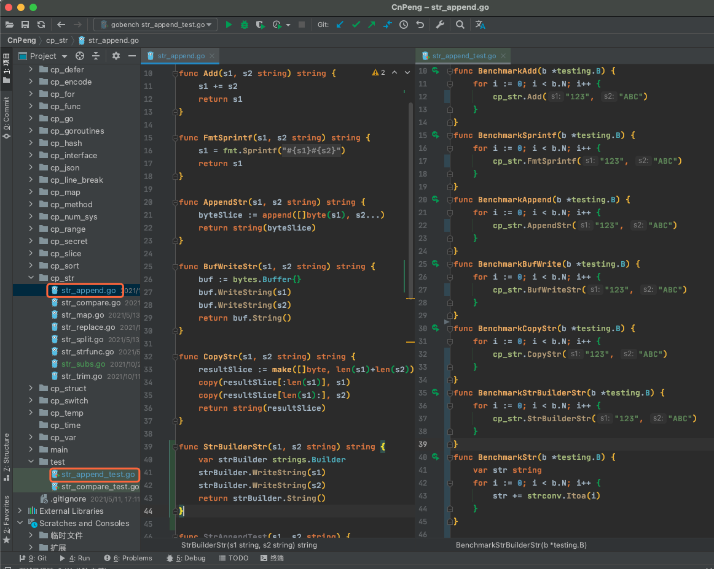
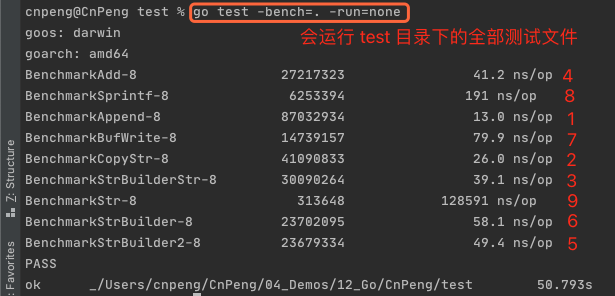

## 1. 拼接方式

> 2021-10-29 补充 strings.Builder

* `+=`
* append(,)
* buf.WriteString()
* fmt.Sprintf(,,)
* copy(,)
* strings.Builder

示例代码如下：

```go
package str

import (
	"bytes"
	"fmt"
	"time"
)

func Add(s1, s2 string) string {
	s1 += s2
	return s1
}

func FmtSprintf(s1, s2 string) string {
	s1 = fmt.Sprintf("%s%s", s1, s2)
	return s1
}

func AppendStr(s1, s2 string) string {
	byteSlice := append([]byte(s1), s2...)
	return string(byteSlice)
}

func BufWriteStr(s1, s2 string) string {
	buf := bytes.Buffer{}
	buf.WriteString(s1)
	buf.WriteString(s2)
	return buf.String()
}

func CopyStr(s1, s2 string) string {
	resultSlice := make([]byte, len(s1)+len(s2))
	copy(resultSlice[:len(s1)], s1)
	copy(resultSlice[len(s1):], s2)
	return string(resultSlice)
}


func StrBuilderStr(s1, s2 string) string {
	var strBuilder strings.Builder
	strBuilder.WriteString(s1)
	strBuilder.WriteString(s2)
	return strBuilder.String()
}
```

## 2. 效率分析

完整目录结构：



在 `test` 包中新建 `str_append_test.go` 文件，并在其中编写 Benchmark 测试代码，如下：

```go
package test

import (
	"../cp_str"
	"strconv"
	"strings"
	"testing"
)

func BenchmarkAdd(b *testing.B) {
	for i := 0; i < b.N; i++ {
		cp_str.Add("123", "ABC")
	}
}
func BenchmarkSprintf(b *testing.B) {
	for i := 0; i < b.N; i++ {
		cp_str.FmtSprintf("123", "ABC")
	}
}
func BenchmarkAppend(b *testing.B) {
	for i := 0; i < b.N; i++ {
		cp_str.AppendStr("123", "ABC")
	}
}
func BenchmarkBufWrite(b *testing.B) {
	for i := 0; i < b.N; i++ {
		cp_str.BufWriteStr("123", "ABC")
	}
}

func BenchmarkCopyStr(b *testing.B) {
	for i := 0; i < b.N; i++ {
		cp_str.CopyStr("123", "ABC")
	}
}

func BenchmarkStrBuilderStr(b *testing.B) {
	for i := 0; i < b.N; i++ {
		cp_str.StrBuilderStr("123", "ABC")
	}
}

func BenchmarkStr(b *testing.B) {
	var str string
	for i := 0; i < b.N; i++ {
	    // 这个特别特别慢。。。
		str += strconv.Itoa(i)
	}
}

func BenchmarkStrBuilder(b *testing.B) {
	var strB strings.Builder
	for i := 0; i < b.N; i++ {
		strB.WriteString(strconv.Itoa(i))
	}
}

func BenchmarkStrBuilder2(b *testing.B) {
	var strB strings.Builder
	for i := 0; i < b.N; i++ {
		strB.WriteString(strconv.Itoa(i))
	}
	// 加上这句竟然比不加还快，为什么呢？
	strB.String()
}
```

然后在终端中通过 `cd` 命令切换到 `str_append_test.go` 文件所在目录，并执行：` go test -bench=. -run=none`。得到运行结果如下图：



通过上图我们可以看出，执行效率从高到低依次是：**`append` > `copy`>`strings.Builder`>`+=` > `buf.Writestring` > `fmt.Sprintf`**

## 3. 3.3 源码简单分析

### 3.1. fmt.Sprintf

```go
// Sprintf formats according to a format specifier and returns the resulting string.
func Sprintf(format string, a ...interface{}) string {
	p := newPrinter()
	p.doPrintf(format, a)
	s := string(p.buf)
	p.free()
	return s
}
```

该函数先构建了一个 `newPrinter()` 对象，然后调用了其 `doPrintf(format, a)` 函数，该函数内部是对 format 和 a 的解析和转换，函数内部最终调用 `append()` 拼接得到一个字节切片，并将该切片赋值给 `p.buf`，所以在上面的代码中就有了 `s := string(p.buf)`

### 3.2. buf.Writestring

```go
// WriteString appends the contents of s to the buffer, growing the buffer as
// needed. The return value n is the length of s; err is always nil. If the
// buffer becomes too large, WriteString will panic with ErrTooLarge.
func (b *Buffer) WriteString(s string) (n int, err error) {
	b.lastRead = opInvalid
	m, ok := b.tryGrowByReslice(len(s))
	if !ok {
		m = b.grow(len(s))
	}
	return copy(b.buf[m:], s), nil
}
```

上面的代码中，先调用了 `b.tryGrowByReslice(len(s))` 判断 `b` 中类型为 `[]byte` 的 `buf` 是否有足够的空间容纳新增的 `s`, 如果空间不足（即 `!ok`）就调用 `b.grow` 扩充 `buf` 的空间。

变量 `m` 表示 `b.buf` 中现有内容所占的长度（len)。

最后，调用 `copy` 函数将 `s` 拷贝到 `b.buf` 的后半部分，即 `b.buf[m:]` 中。

需要注意：`WriteString` 函数的方法注释有说当 `buffer` 变得很大时，可能会抛出 `ErrTooLarge` 错误。所以，该方法需要慎用。

补充：一个切片有类型、大小（len）、容量（cap）三个基本要素。容量表示其最大能存储多少数据，大小表示已经存储的数量。

### 3.3. append

```go
// The append built-in function appends elements to the end of a slice. If
// it has sufficient capacity, the destination is resliced to accommodate the
// new elements. If it does not, a new underlying array will be allocated.
// Append returns the updated slice. It is therefore necessary to store the
// result of append, often in the variable holding the slice itself:
//	slice = append(slice, elem1, elem2)
//	slice = append(slice, anotherSlice...)
// As a special case, it is legal to append a string to a byte slice, like this:
//	slice = append([]byte("hello "), "world"...)
func append(slice []Type, elems ...Type) []Type
```

`append` 是一个内嵌函数，我们看不到其底层实现。

但根据注释可知，该函数会返回一个新的切片，所以，我们必须用变量接收该返回值。而且，第二个入参可以是字符串解构。

### 3.4. copy

```go
// The copy built-in function copies elements from a source slice into a
// destination slice. (As a special case, it also will copy bytes from a
// string to a slice of bytes.) The source and destination may overlap. Copy
// returns the number of elements copied, which will be the minimum of
// len(src) and len(dst).
func copy(dst, src []Type) int
```

`copy` 也是一个内嵌函数。

返回值是一个 int, 表示 src 中有多少数据被拷贝到 dst 中了，取值为 `len(src)` 和 `len(dst)` 中小的那个。

### 3.5. strings.Builder.WriteString

```go
// WriteString appends the contents of s to b's buffer.
// It returns the length of s and a nil error.
func (b *Builder) WriteString(s string) (int, error) {
	b.copyCheck()
	b.buf = append(b.buf, s...)
	return len(s), nil
}
```

从上述代码可以看出，其底部也是用了 `append(,)`

## 4. 总结

前面我们已经知道，执行效率从高到低依次是：**`append` > `copy`>`+=` > `buf.Writestring` > `fmt.Sprintf`**。

所以，我们应该优先使用 `append`、`copy` 、或 `+=`。`buf.Writestring` 不但效率低，而且可能还会出错。所以，尽量不要用。


