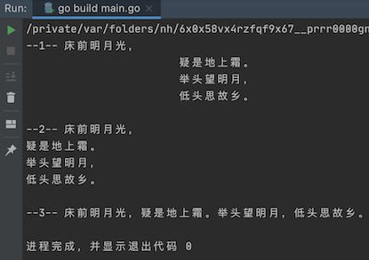

# 1. 去除字符串中的换行和空格等

go 语言中字符串有两种呈现形式，一种是使用双引号包裹的，一种是使用反引号包裹的（称为多行字符串或原样字符串）。

根据两种呈现形式，在去除字符串中的换行和空格等特殊符号时，也需要做不同的处理。

## 1.1. 去除普通字符串中的换行和空格等

在普通字符串中，换行符使用 `\n` 表示，而缩进符（即TAB）使用 `\t` 表示。所以，在去除换行符和缩进符时，就需要将 `\n` 和 `\t` 替换掉。

```go
// strReplace1 双引号字符串中空格和换行的替换
func strReplace1() {
	str := " \t\n Hello, Gophers \n\tABC"
	fmt.Println("-1-", str)

	// 1-去除空格
	temp := strings.Replace(str, " ", "", -1)
	fmt.Println("-2-", temp)

	// 2-去除 \n 换行符
	temp2 := strings.Replace(temp, "\n", "", -1)
	fmt.Println("-3-", temp2)

	// 3-去除 \t 缩进符（TAB）
	temp3 := strings.Replace(temp2, "\t", "", -1)
	/*
	 * 输出结果：-4- Hello,GophersABC
	 */
	fmt.Println("-4-", temp3)
}
```


## 1.2. 去除多行字符串中的换行和空格等

### 1.2.1. 有物理换行的字符串

下列代码中，在每一句后面都使用了换车（换行），我们暂且把这种称为物理换行。

```go
func strReplace2() {
	str := `床前 明月光，
			疑是 地上霜。
			举头 望明月，
			低头 思故乡。
	`
	// 去除空格
	temp1 := strings.Replace(str, " ", "", -1)
	fmt.Println("--1--", temp1)

	// 去除 tab 缩进
	temp2 := strings.Replace(temp1, "\t", "", -1)
	fmt.Println("--2--", temp2)

	// 去除换行
	temp3 := strings.Replace(temp2, "\n", "", -1)
	// 输出结果：--3-- 床前明月光，疑是地上霜。举头望明月，低头思故乡。
	fmt.Println("--3--", temp3)
}
```

运行结果：



### 1.2.2. 去除多行字符串中的 `\n`、`\t` 字符

下列代码中，`\n`、`\t` 会在控制台中原样显示，如果我们想将其去除，有两种方式，推荐使用下列方式中的 `strReplace3` 方式。

```go

// strReplace3 替换使用反引号 `` 包裹的字符串的显示 \n、\t、\r
func strReplace3() {
	str := ` \t\n Hello, Gophers \n\tABC`

	// 去除空格
	temp1 := strings.Replace(str, " ", "", -1)
	// 输出结果：--1-- \t\nHello,Gophers\n\tABC
	fmt.Println("--1--", temp1)

	// 去除 \n
	temp2 := strings.Replace(temp1, `\n`, "", -1)
	// 输出结果：--2-- \tHello,Gophers\tABC
	fmt.Println("--2--", temp2)

	// 去除\t
	temp3 := strings.Replace(temp2, `\t`, "", -1)
	// 输出结果：--3-- Hello,GophersABC
	fmt.Println("--3--", temp3)
}


// strReplace4 替换使用反引号 `` 包裹的字符串中的显示 \n、\t、\r
func strReplace4() {
	str := ` \\t\\n Hello, Gophers \n\tABC`

	// 去除空格
	temp1 := strings.Replace(str, " ", "", -1)
	// 输出结果：--1-- \t\nHello,Gophers\n\tABC
	fmt.Println("--1--", temp1)

	temp2 := strings.Replace(temp1, "\\n", "", -1)
	// 输出结果：--2-- \tHello,Gophers\tABC
	fmt.Println("--2--", temp2)

	temp3 := strings.Replace(temp2, "\\t", "", -1)
	// 输出结果：--3-- Hello,GophersABC
	fmt.Println("--3--", temp3)
}
```

## 1.3. 补充：strings.TrimXxx

### 1.3.1. strings.TrimSpace

去除字符串起始和结尾中的空格、换行等符号（\n、\t、\r）。

注意：**无法 trim 字符串中间的这些符号**

```go
// strTrimSpace 仅能 trim 字符串起始和结尾中的空格、换行等符号（\n、\t、\r）, 无法 trim 字符串中间的这些符号
func strTrimSpace() {
	str3 := " \t\n Hello, Gophers \n\t\rABC"
	/*
	* 输出结果：
	*-1-
	* Hello, Gophers
	*ABC
	*/
	fmt.Println("-1-", str3)
	/*
	* 输出结果：
	*-2- Hello, Gophers
	*ABC
	*/
	fmt.Println("-2-",strings.TrimSpace(str3))
}
```

### 1.3.2. strings.TrimRight(,)

```go
func strTrimRight() {
	// 找到最后一个不是B或A的字符位置，从该位置开始，删除其后所有的B或A
	fmt.Println("\nTrimRight1:", strings.TrimRight("ABBA", "BA"))   // 得到空串
	fmt.Println("TrimRight2:", strings.TrimRight("1ABBA", "BA"))    // 1
	fmt.Println("TrimRight3:", strings.TrimRight("1ABBABA", "BA"))  // 1
}
```

### 1.3.3. strings.TrimLeft(,)

```go
func strTrimLeft() {
    // 找到第一个不是B或A的字符位置，从该位置开始，删除其前面所有的B或A
	fmt.Println("\nTrimLeft1:", strings.TrimLeft("ABBA", "BA"))   // 输出空串
	fmt.Println("TrimLeft2:", strings.TrimLeft("1ABBA", "BA"))    // 1ABBA
	fmt.Println("TrimLeft3:", strings.TrimLeft("BA1ABBA", "BA"))  // 1ABBA
	fmt.Println("TrimLeft4:", strings.TrimLeft("BA1ABCBA", "BA")) // 1ABCBA
	fmt.Println("TrimLeft7:", strings.TrimLeft("BABA1ABCA", "BA"))  // 1ABCA
}
```

### 1.3.4. strings.TrimSuffix(,)

```go
func strTrimSuffix() {
    // 去除后缀
	fmt.Println("TrimSuffix1:", strings.TrimSuffix("ABBA", "BA"))   // AB
	fmt.Println("TrimSuffix2:", strings.TrimSuffix("1ABBA", "BA"))  // 1AB
	fmt.Println("TrimSuffix3:", strings.TrimSuffix("1ABBA", "BA"))  // 1AB
	fmt.Println("TrimSuffix4:", strings.TrimSuffix("1ABBABA", "BA")) // 1ABBA
	fmt.Println("TrimSuffix4:", strings.TrimSuffix("1ABBABAC", "BA")) // 1ABBABAC
}
```