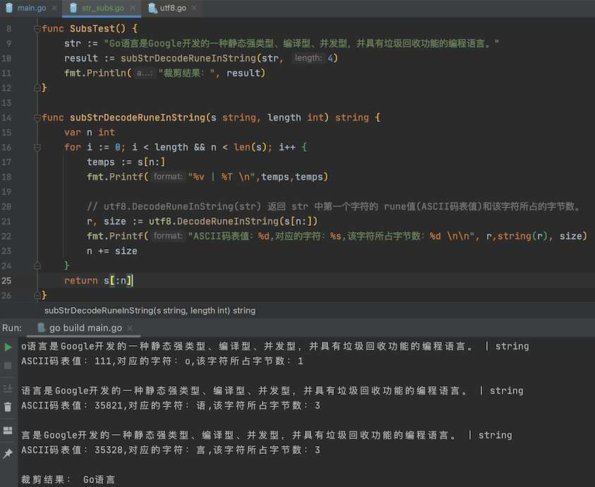

# 1. 高效截取字符串的一些思考

[原文链接：《高效截取字符串的一些思考》](https://blog.thinkeridea.com/201910/go/efficient_string_truncation.html)

最近我在 [Go Forum](https://forum.golangbridge.org/) 中发现了 [SOLVED: String size of 20 character](https://forum.golangbridge.org/t/solved-string-size-of-20-character/15783) 的问题，“hollowaykeanho” 给出了相关的答案，而我从中发现了截取字符串的方案并非最理想的方法，因此做了一系列实验并获得高效截取字符串的方法，这篇文章将逐步讲解我实践的过程。

## 1.1. 字节切片截取

这正是 “hollowaykeanho” 给出的第一个方案，我想也是很多人想到的第一个方案，利用 go 的内置切片语法截取字符串：

```go
s := "abcdef"
fmt.Println(s[1:4])
```

我们很快就了解到这是**按字节截取**，在处理 ASCII 单字节字符串截取，没有什么比这更完美的方案了。

但是，中文往往占多个字节，在 utf8 编码中是3个字节，如下程序我们将获得乱码数据：

```go
s := "Go 语言"
fmt.Println(s[1:4])
```

## 1.2. 杀手锏 - 类型转换 []rune

“hollowaykeanho” 给出的第二个方案就是将字符串转换为 `[]rune`，然后按切片语法截取，再把结果转成字符串。

```go
s := "Go 语言"
rs := []rune(s)
fmt.Println(strings(rs[1:4]))
```

首先我们得到了正确的结果，这是最大的进步。不过我对类型转换一直比较谨慎，我担心它的性能问题，因此我尝试在搜索引擎和各大论坛查找答案，但是我得到最多的还是这个方案，似乎这已经是唯一的解。

我尝试写个性能测试评测它的性能：

```go
package benchmark

import (
	"testing"
)

var benchmarkSubString = "Go语言是Google开发的一种静态强类型、编译型、并发型，并具有垃圾回收功能的编程语言。为了方便搜索和识别，有时会将其称为Golang。"
var benchmarkSubStringLength = 20

func SubStrRunes(s string, length int) string {
	if utf8.RuneCountInString(s) > length {
		rs := []rune(s)
		return string(rs[:length])
	}

	return s
}

func BenchmarkSubStrRunes(b *testing.B) {
	for i := 0; i < b.N; i++ {
		SubStrRunes(benchmarkSubString, benchmarkSubStringLength)
	}
}
```

我得到了让我有些吃惊的结果：

```
goos: darwin
goarch: amd64
pkg: github.com/thinkeridea/go-extend/exunicode/exutf8/benchmark
BenchmarkSubStrRunes-8            872253              1363 ns/op             336 B/op          2 allocs/op
PASS
ok      github.com/thinkeridea/go-extend/exunicode/exutf8/benchmark     2.120s
```

对 69 个的字符串截取前 20 个字符需要大概 1.3 微秒，这极大的超出了我的心里预期，我发现**因为类型转换带来了内存分配，这产生了一个新的字符串，并且类型转换需要大量的计算**。

## 1.3. 救命稻草 - utf8.DecodeRuneInString

我想改善类型转换带来的额外运算和内存分配，我仔细的梳理了一遍 strings 包，发现并没有相关的工具。

这时我想到了 utf8 包，它提供了多字节计算相关的工具，实话说我对它并不熟悉，或者说没有主动（直接）使用过它。

我查看了它所有的文档发现 `utf8.DecodeRuneInString` 函数可以**将传入的字符串中的第一个字符转换为 rune，并给出字符占用字节的数量**，我尝试了如此下的实验：

```go
package benchmark

import (
	"testing"
	"unicode/utf8"
)

var benchmarkSubString = "Go语言是Google开发的一种静态强类型、编译型、并发型，并具有垃圾回收功能的编程语言。为了方便搜索和识别，有时会将其称为Golang。"
var benchmarkSubStringLength = 20

func SubStrDecodeRuneInString(s string, length int) string {
	var size, n int
	for i := 0; i < length && n < len(s); i++ {
		_, size = utf8.DecodeRuneInString(s[n:])
		n += size
	}

	return s[:n]
}

func BenchmarkSubStrDecodeRuneInString(b *testing.B) {
	for i := 0; i < b.N; i++ {
		SubStrDecodeRuneInString(benchmarkSubString, benchmarkSubStringLength)
	}
}
```

运行它之后我得到了令我惊喜的结果：

```go
goos: darwin
goarch: amd64
pkg: github.com/thinkeridea/go-extend/exunicode/exutf8/benchmark
BenchmarkSubStrDecodeRuneInString-8     10774401               105 ns/op               0 B/op          0 allocs/op
PASS
ok      github.com/thinkeridea/go-extend/exunicode/exutf8/benchmark     1.250s
```

补充示例：



较 `[]rune` 类型转换效率提升了 13倍，消除了内存分配，它的确令人激动和兴奋，我迫不及待的回复了 “hollowaykeanho” 告诉他我发现了一个更好的方法，并提供了相关的性能测试。

我有些小激动，兴奋的浏览着论坛里各种有趣的问题，在查看一个问题的帮助时 (忘记是哪个问题了-_-||) ，我惊奇的发现了另一个思路。

## 1.4. 良药不一定苦 - range 字符串迭代

许多人似乎遗忘了 **range 是按字符迭代的**，并非字节。

使用 range 迭代字符串时返回字符起始索引和对应的字符，我立刻尝试利用这个特性编写了如下用例：

```go
package benchmark

import (
	"testing"
)

var benchmarkSubString = "Go语言是Google开发的一种静态强类型、编译型、并发型，并具有垃圾回收功能的编程语言。为了方便搜索和识别，有时会将其称为Golang。"
var benchmarkSubStringLength = 20

func SubStrRange(s string, length int) string {
	var n, i int
	for i = range s {
		if n == length {
			break
		}

		n++
	}

	return s[:i]
}

func BenchmarkSubStrRange(b *testing.B) {
	for i := 0; i < b.N; i++ {
		SubStrRange(benchmarkSubString, benchmarkSubStringLength)
	}
}
```

我尝试运行它，这似乎有着无穷的魔力，结果并没有令我失望。

```
goos: darwin
goarch: amd64
pkg: github.com/thinkeridea/go-extend/exunicode/exutf8/benchmark
BenchmarkSubStrRange-8          12354991                91.3 ns/op             0 B/op          0 allocs/op
PASS
ok      github.com/thinkeridea/go-extend/exunicode/exutf8/benchmark     1.233s
```

它仅仅提升了13%，但它足够的简单和易于理解，这似乎就是我苦苦寻找的那味良药。

如果你以为这就结束了，不、这对我来只是探索的开始。

## 1.5. 终极时刻 - 自己造轮子

喝了 range 那碗甜的腻人的良药，我似乎冷静下来了，我需要造一个轮子，它需要更易用，更高效。

于是乎我仔细观察了两个优化方案，它们似乎都是为了查找截取指定长度字符的索引位置，如果我可以提供一个这样的方法，是否就可以提供用户一个简单的截取实现 `s[:strIndex(20)]` ，这个想法萌芽之后我就无法再度摆脱，我苦苦思索两天来如何来提供易于使用的接口。

之后我创造了 [exutf8.RuneIndexInString](https://godoc.org/github.com/thinkeridea/go-extend/exunicode/exutf8#RuneIndexInString) 和 [exutf8.RuneIndex](https://godoc.org/github.com/thinkeridea/go-extend/exunicode/exutf8#RuneIndex) 方法，分别用来计算字符串和字节切片中指定字符数量结束的索引位置。

我用 [exutf8.RuneIndexInString](https://godoc.org/github.com/thinkeridea/go-extend/exunicode/exutf8#RuneIndexInString) 实现了一个字符串截取测试：

```go
package benchmark

import (
	"testing"
	"unicode/utf8"

	"github.com/thinkeridea/go-extend/exunicode/exutf8"
)

var benchmarkSubString = "Go语言是Google开发的一种静态强类型、编译型、并发型，并具有垃圾回收功能的编程语言。为了方便搜索和识别，有时会将其称为Golang。"
var benchmarkSubStringLength = 20

func SubStrRuneIndexInString(s string, length int) string {
	n, _ := exutf8.RuneIndexInString(s, length)
	return s[:n]
}

func BenchmarkSubStrRuneIndexInString(b *testing.B) {
	for i := 0; i < b.N; i++ {
		SubStrRuneIndexInString(benchmarkSubString, benchmarkSubStringLength)
	}
}
```

尝试运行它，我对结果感到十分欣慰：

```go
goos: darwin
goarch: amd64
pkg: github.com/thinkeridea/go-extend/exunicode/exutf8/benchmark
BenchmarkSubStrRuneIndexInString-8      13546849                82.4 ns/op             0 B/op          0 allocs/op
PASS
ok      github.com/thinkeridea/go-extend/exunicode/exutf8/benchmark     1.213s
```

性能较 range 提升了 10%，让我很欣慰可以再次获得新的提升，这证明它是有效的。

它足够的高效，但是却不够易用，我截取字符串需要两行代码，如果我想截取 10~20之间的字符就需要 4 行代码，这并不是用户易于使用的接口，我参考了其它语言的 `sub_string` 方法，我想我应该也设计一个这个样的接口给用户。

[exutf8.RuneSubString](https://godoc.org/github.com/thinkeridea/go-extend/exunicode/exutf8#RuneSubString) 和 [exutf8.RuneSub](https://godoc.org/github.com/thinkeridea/go-extend/exunicode/exutf8#RuneSub) 是我认真思索后编写的方法：

```go
func RuneSubString(s string, start, length int) string
```

它有三个参数：

* s : 输入的字符串
* start : 开始截取的位置，如果 start 是非负数，返回的字符串将从 string 的 start 位置开始，从 0 开始计算。例如，在字符串 “abcdef” 中，在位置 0 的字符是 “a”，位置 2 的字符串是 “c” 等等。 如果 start 是负数，返回的字符串将从 string 结尾处向前数第 start 个字符开始。 如果 string 的长度小于 start，将返回空字符串。
* length：截取的长度，如果提供了正数的 length，返回的字符串将从 start 处开始最多包括 length 个字符（取决于 string 的长度）。 如果提供了负数的 length，那么 string 末尾处的 length 个字符将会被省略（若 start 是负数则从字符串尾部算起）。如果 start 不在这段文本中，那么将返回空字符串。 如果提供了值为 0 的 length，返回的子字符串将从 start 位置开始直到字符串结尾。

我为他们提供了别名，根据使用习惯大家更倾向去 strings 包寻找这类问题的解决方法，我创建了 [exstrings.SubString](https://godoc.org/github.com/thinkeridea/go-extend/exstrings#SubString) 和 [exbytes.Sub](https://godoc.org/github.com/thinkeridea/go-extend/exbytes#Sub) 作为更易检索到的别名方法。

最后我需要再做一个性能测试，确保它的性能：

```go
package benchmark

import (
	"testing"

	"github.com/thinkeridea/go-extend/exunicode/exutf8"
)

var benchmarkSubString = "Go语言是Google开发的一种静态强类型、编译型、并发型，并具有垃圾回收功能的编程语言。为了方便搜索和识别，有时会将其称为Golang。"
var benchmarkSubStringLength = 20

func SubStrRuneSubString(s string, length int) string {
	return exutf8.RuneSubString(s, 0, length)
}

func BenchmarkSubStrRuneSubString(b *testing.B) {
	for i := 0; i < b.N; i++ {
		SubStrRuneSubString(benchmarkSubString, benchmarkSubStringLength)
	}
}
```

运行它，不会让我失望：

```go
goos: darwin
goarch: amd64
pkg: github.com/thinkeridea/go-extend/exunicode/exutf8/benchmark
BenchmarkSubStrRuneSubString-8          13309082                83.9 ns/op             0 B/op          0 allocs/op
PASS
ok      github.com/thinkeridea/go-extend/exunicode/exutf8/benchmark     1.215s
```

虽然相较 [exutf8.RuneIndexInString](https://godoc.org/github.com/thinkeridea/go-extend/exunicode/exutf8#RuneIndexInString) 有所下降，但它提供了易于交互和使用的接口，我认为这应该是最实用的方案，如果你追求极致仍然可以使用 [exutf8.RuneIndexInString](https://godoc.org/github.com/thinkeridea/go-extend/exunicode/exutf8#RuneIndexInString)，它依然是最快的方案。

## 1.6. 总结

当看到有疑问的代码，即使它十分的简单，依然值得深究，并不停的探索它，这并不枯燥和乏味，反而会有极多收获。

从起初 `[]rune` 类型转换到最后自己造轮子，不仅得到了 16 倍的性能提升，我还学习了 `utf8` 包、加深了 `range`  遍历字符串的特性，并为  [go-extend](https://github.com/thinkeridea/go-extend) 仓库收录了多个实用高效的解决方案，让更多  [go-extend](https://github.com/thinkeridea/go-extend) 的用户得到成果。

## 1.7. 补充：go-extend 库

[点击跳转到 go-extend 的 github 库](https://github.com/thinkeridea/go-extend) 

文中相关函数的摘录：

* go-extend/blob/main/exstrings/strings.go

```go
// SubString 是 exutf8.RuneSubString 的别名，提供字符数量截取字符串的方法，针对多字节字符安全高效的截取
// 如果 start 是非负数，返回的字符串将从 string 的 start 位置开始，从 0 开始计算。例如，在字符串 “abcdef” 中，在位置 0 的字符是 “a”，位置 2 的字符串是 “c” 等等。
// 如果 start 是负数，返回的字符串将从 string 结尾处向前数第 start 个字符开始。
// 如果 string 的长度小于 start，将返回空字符串。
//
// 如果提供了正数的 length，返回的字符串将从 start 处开始最多包括 length 个字符（取决于 string 的长度）。
// 如果提供了负数的 length，那么 string 末尾处的 length 个字符将会被省略（若 start 是负数则从字符串尾部算起）。如果 start 不在这段文本中，那么将返回空字符串。
// 如果提供了值为 0 的 length，返回的子字符串将从 start 位置开始直到字符串结尾。
func SubString(s string, start, length int) string {
	return exutf8.RuneSubString(s, start, length)
}
```

* go-extend/blob/main/exunicode/exutf8/utf8.go

```go
package exutf8

import (
	"unicode/utf8"
)

const (
	// t1 = 0x00 // 0000 0000
	// tx = 0x80 // 1000 0000
	// t2 = 0xC0 // 1100 0000
	// t3 = 0xE0 // 1110 0000
	// t4 = 0xF0 // 1111 0000
	// t5 = 0xF8 // 1111 1000
	//
	// maskx = 0x3F // 0011 1111
	// mask2 = 0x1F // 0001 1111
	// mask3 = 0x0F // 0000 1111
	// mask4 = 0x07 // 0000 0111
	//
	// rune1Max = 1<<7 - 1
	// rune2Max = 1<<11 - 1
	// rune3Max = 1<<16 - 1

	// The default lowest and highest continuation byte.
	locb = 0x80 // 1000 0000
	hicb = 0xBF // 1011 1111

	// These names of these constants are chosen to give nice alignment in the
	// table below. The first nibble is an index into acceptRanges or F for
	// special one-byte cases. The second nibble is the Rune length or the
	// Status for the special one-byte case.
	xx = 0xF1 // invalid: size 1
	as = 0xF0 // ASCII: size 1
	s1 = 0x02 // accept 0, size 2
	s2 = 0x13 // accept 1, size 3
	s3 = 0x03 // accept 0, size 3
	s4 = 0x23 // accept 2, size 3
	s5 = 0x34 // accept 3, size 4
	s6 = 0x04 // accept 0, size 4
	s7 = 0x44 // accept 4, size 4
)

// first is information about the first byte in a UTF-8 sequence.
var first = [256]uint8{
	//   1   2   3   4   5   6   7   8   9   A   B   C   D   E   F
	as, as, as, as, as, as, as, as, as, as, as, as, as, as, as, as, // 0x00-0x0F
	as, as, as, as, as, as, as, as, as, as, as, as, as, as, as, as, // 0x10-0x1F
	as, as, as, as, as, as, as, as, as, as, as, as, as, as, as, as, // 0x20-0x2F
	as, as, as, as, as, as, as, as, as, as, as, as, as, as, as, as, // 0x30-0x3F
	as, as, as, as, as, as, as, as, as, as, as, as, as, as, as, as, // 0x40-0x4F
	as, as, as, as, as, as, as, as, as, as, as, as, as, as, as, as, // 0x50-0x5F
	as, as, as, as, as, as, as, as, as, as, as, as, as, as, as, as, // 0x60-0x6F
	as, as, as, as, as, as, as, as, as, as, as, as, as, as, as, as, // 0x70-0x7F
	//   1   2   3   4   5   6   7   8   9   A   B   C   D   E   F
	xx, xx, xx, xx, xx, xx, xx, xx, xx, xx, xx, xx, xx, xx, xx, xx, // 0x80-0x8F
	xx, xx, xx, xx, xx, xx, xx, xx, xx, xx, xx, xx, xx, xx, xx, xx, // 0x90-0x9F
	xx, xx, xx, xx, xx, xx, xx, xx, xx, xx, xx, xx, xx, xx, xx, xx, // 0xA0-0xAF
	xx, xx, xx, xx, xx, xx, xx, xx, xx, xx, xx, xx, xx, xx, xx, xx, // 0xB0-0xBF
	xx, xx, s1, s1, s1, s1, s1, s1, s1, s1, s1, s1, s1, s1, s1, s1, // 0xC0-0xCF
	s1, s1, s1, s1, s1, s1, s1, s1, s1, s1, s1, s1, s1, s1, s1, s1, // 0xD0-0xDF
	s2, s3, s3, s3, s3, s3, s3, s3, s3, s3, s3, s3, s3, s4, s3, s3, // 0xE0-0xEF
	s5, s6, s6, s6, s7, xx, xx, xx, xx, xx, xx, xx, xx, xx, xx, xx, // 0xF0-0xFF
}

// acceptRange gives the range of valid values for the second byte in a UTF-8
// sequence.
type acceptRange struct {
	lo uint8 // lowest value for second byte.
	hi uint8 // highest value for second byte.
}

// acceptRanges has size 16 to avoid bounds checks in the code that uses it.
var acceptRanges = [16]acceptRange{
	0: {locb, hicb},
	1: {0xA0, hicb},
	2: {locb, 0x9F},
	3: {0x90, hicb},
	4: {locb, 0x8F},
}

// RuneIndex 返回 p 中第 n 个字符的位置索引，可以通过索引位置截取 []byte
// 如果 n 超过 p 中字符的数量，则第二个参数返回 false
// 错误的或短的编码被当做宽度为一个字节的单一字符。
func RuneIndex(p []byte, n int) (int, bool) {
	var i int
	for ; n > 0 && i < len(p); n-- {
		if p[i] < utf8.RuneSelf {
			// ASCII fast path
			i++
			continue
		}

		x := first[p[i]]
		if x == xx {
			i++ // invalid.
			continue
		}

		size := int(x & 7)
		if i+size > len(p) {
			i++ // Short or invalid.
			continue
		}
		accept := acceptRanges[x>>4]
		if c := p[i+1]; c < accept.lo || accept.hi < c {
			size = 1
		} else if size == 2 {
		} else if c := p[i+2]; c < locb || hicb < c {
			size = 1
		} else if size == 3 {
		} else if c := p[i+3]; c < locb || hicb < c {
			size = 1
		}
		i += size
	}

	return i, n <= 0
}

// RuneIndexInString 返回 s 中第 n 个字符的位置索引，可以通过索引位置截取字符串
// 如果 n 超过 s 中字符的数量，则第二个参数返回 false
// 错误的或短的编码被当做宽度为一个字节的单一字符。
func RuneIndexInString(s string, n int) (int, bool) {
	var i int
	for ; n > 0 && i < len(s); n-- {
		if s[i] < utf8.RuneSelf {
			// ASCII fast path
			i++
			continue
		}

		x := first[s[i]]
		if x == xx {
			i++ // invalid.
			continue
		}

		size := int(x & 7)
		if i+size > len(s) {
			i++ // Short or invalid.
			continue
		}
		accept := acceptRanges[x>>4]
		if c := s[i+1]; c < accept.lo || accept.hi < c {
			size = 1
		} else if size == 2 {
		} else if c := s[i+2]; c < locb || hicb < c {
			size = 1
		} else if size == 3 {
		} else if c := s[i+3]; c < locb || hicb < c {
			size = 1
		}
		i += size
	}

	return i, n <= 0
}

// RuneSub 提供符文数量截取字节数组的方法，针对多字节字符安全高效的截取
// 如果 start 是非负数，返回的字符串将从 string 的 start 位置开始，从 0 开始计算。例如，在字符串 “abcdef” 中，在位置 0 的字符是 “a”，位置 2 的字符串是 “c” 等等。
// 如果 start 是负数，返回的字符串将从 string 结尾处向前数第 start 个字符开始。
// 如果 string 的长度小于 start，将返回空字符串。
//
// 如果提供了正数的 length，返回的字符串将从 start 处开始最多包括 length 个字符（取决于 string 的长度）。
// 如果提供了负数的 length，那么 string 末尾处的 length 个字符将会被省略（若 start 是负数则从字符串尾部算起）。如果 start 不在这段文本中，那么将返回空字符串。
// 如果提供了值为 0 的 length，返回的子字符串将从 start 位置开始直到字符串结尾。
func RuneSub(p []byte, start, length int) []byte {
	if len(p) == 0 {
		return []byte{}
	}

	if start < 0 {
		start = utf8.RuneCount(p) + start
	}

	if start < 0 {
		return []byte{}
	}

	if start > 0 {
		n, _ := RuneIndex(p, start)
		p = p[n:]
	}

	if len(p) == 0 {
		return []byte{}
	}

	if length == 0 {
		return p
	}

	if length < 0 {
		length = utf8.RuneCount(p) + length
	}

	if length <= 0 {
		return []byte{}
	}

	n, _ := RuneIndex(p, length)
	return p[:n]
}

// RuneSubString 提供符文数量截取字符串的方法，针对多字节字符安全高效的截取
// 如果 start 是非负数，返回的字符串将从 string 的 start 位置开始，从 0 开始计算。例如，在字符串 “abcdef” 中，在位置 0 的字符是 “a”，位置 2 的字符串是 “c” 等等。
// 如果 start 是负数，返回的字符串将从 string 结尾处向前数第 start 个字符开始。
// 如果 string 的长度小于 start，将返回空字符串。
//
// 如果提供了正数的 length，返回的字符串将从 start 处开始最多包括 length 个字符（取决于 string 的长度）。
// 如果提供了负数的 length，那么 string 末尾处的 length 个字符将会被省略（若 start 是负数则从字符串尾部算起）。如果 start 不在这段文本中，那么将返回空字符串。
// 如果提供了值为 0 的 length，返回的子字符串将从 start 位置开始直到字符串结尾。
func RuneSubString(s string, start, length int) string {
	if s == "" {
		return ""
	}

	if start < 0 {
		start = utf8.RuneCountInString(s) + start
	}

	if start < 0 {
		return ""
	}

	if start > 0 {
		n, _ := RuneIndexInString(s, start)
		s = s[n:]
	}

	if s == "" {
		return ""
	}

	if length == 0 {
		return s
	}

	if length < 0 {
		length = utf8.RuneCountInString(s) + length
	}

	if length <= 0 {
		return ""
	}

	n, _ := RuneIndexInString(s, length)
	return s[:n]
}
```