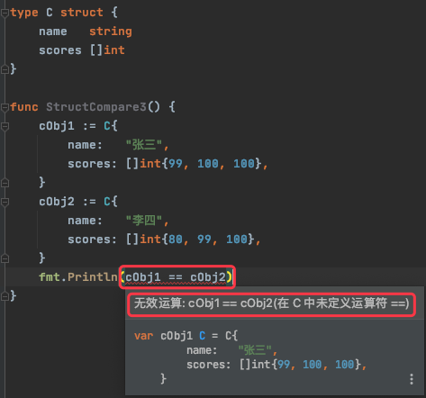
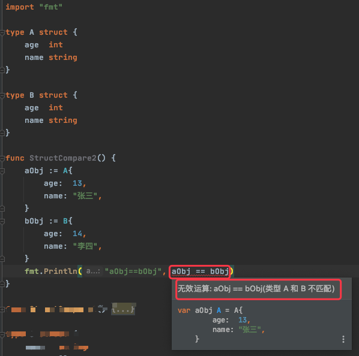
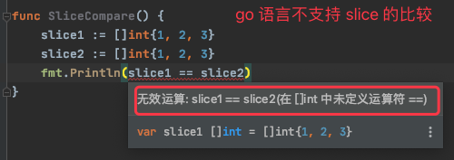

## 1. struct 能不能进行比较？

* 不同类型的 struct 之间不能进行比较，编译期就会报错（GoLand 会直接提示）
* 同类型的 struct 也分为两种情况，
    * struct 的所有成员都是可以比较的，则该 strcut 的不同实例可以比较
    * struct 中含有不可比较的成员（如 Slice），则该 struct 不可以比较

### 1.1. 同类型 struct 比较

```go
import "fmt"

type A struct {
	age  int
	name string
}

func StructCompare1() {
	aObj1 := A{
		age:  13,
		name: "张三",
	}
	aObj2 := A{
		age:  13,
		name: "张三",
	}
	fmt.Println(aObj1 == aObj2) // true

	aObj3 := &A{
		age:  13,
		name: "张三",
	}
	aObj4 := &A{
		age:  13,
		name: "张三",
	}

	fmt.Println(aObj3 == aObj4) // false

	var aObj5 A
	fmt.Println(aObj5) //{0 } ，未明确初始化时，struct 实例的成员取各自的零值
	//fmt.Println( aObj5 == nil)  // 报错，无法将 nil 转换为类型 A

	var aObj6 *A
	fmt.Println(aObj6)        // <nil> ，指针类型数据的零值为 nil
	fmt.Println(aObj6 == nil) //  true，指针类型的数据可以和 nil 比较
}
```

### 1.2. struct 包含不可比较的成员



### 1.3. 不同类型 struct 不能比较



## 2. 扩展：不可比较的类型

### 2.1. Slice

go 语言中规定 slice 之间不能比较，因此我们不能使用==操作符来判断两个slice是否含有全部相等元素。



但标准库提供了高度优化的 bytes.Equal 函数来判断两个字节型 slice 是否相等( []byte ):

```go
func SliceCompare() {
	slice1 := []byte{1, 2, 3}
	slice2 := []byte{1, 2, 3}
	fmt.Println(bytes.Equal(slice1, slice2)) // true
}
```

对于其他类型的 slice，我们必须自己展开每个元素进行比较，如：

```go
func equal(x, y []string) bool {
    if len(x) != len(y) {
        return false
    }
    for i := range x {
        if x[i] != y[i] {
            return false
        }
    }
    return true 
}
```

为何slice不直接支持比较运算符呢?

* slice 的元素是间接引用的，一个 slice 甚至可以包含自身。虽然有很多办法处理这种情形，但是没有一个是简单有效的。
* 由于 slice 的元素是间接引用的，一个固定的 slice 值(指slice本身的值，不是元素的值)在不同的时刻可能包含不同的元素，因为底层数组的元素可能会被修改.

slice 唯一合法的比较操作是和 nil 比较，一个 slice 的零值为 nil 。

一个 nil 值的 slice 并没有底层数组。一个 nil 值的 slice 的长度和容量都是0，但是也有非 nil 值的 slice 的长度和容量也是 0 的，例如 `[]int{}` 或 `make([]int, 3)[3:]` 。

与任意类型的 nil 值一样，我们可以用 `[]int(nil)` 类型转换表达式来生成一个对应类型 slice 的 nil 值。

### 2.2. Map

和 slice 一样，map 之间也不能进行相等比较; 唯一的例外是和 nil 进行比较。

要判断两个 map 是否包含相同的 key 和 value，我们必须通过一个循环实现:

```go
func equal(x, y map[string]int) bool {
    if len(x) != len(y) {
        return false
    }
    for k, xv := range x {
        if yv, ok := y[k]; !ok || yv != xv {
            return false
        }
    }
    return true 
}
```

上述例子中在判断 xv 和 yv 是否相等时，先通过 ok 判断了 yv 是否存在，这一步判断是必须的，如果简单地用 xv != y[k] 则可能会出现错误的结果，比如下面的例子：

```go
equal(map[string]int{"A": 0}, map[string]int{"B": 42})
```

在比较上面这两个 map 时，如果没有对 ok 进行判断，那么从后面的 map 中取 `y["A"]` 时，由于后面的 map 中不存在 A 这个键，所有会拿到值类型的零值，即0，此时 `x["A"]` 的值恰好也是 0 ，这样就会出现错误的结果。

### 2.3. 函数类型的变量

在 go 语言中，函数可以作为变量的类型，如 `var f func(int) int`，该语句声明了一个变量 f ，其类型为接收 int 类型参数且返回值为 int 的函数。

```go
// squares返回一个匿名函数。
// 该匿名函数每次被调用时都会返回下一个数的平方。 
func squares() func() int {
    var x int
    return func() int {
        x++
        return x * x 
    }
}

func main() {
    f := squares()
    fmt.Println(f()) // "1"
    fmt.Println(f()) // "4"
    fmt.Println(f()) // "9"
    fmt.Println(f()) // "16"
}
```

在上述示例中，将函数赋值给变量 f 时，函数内部的成员变量 x 的生命周期会受变量 f 的生命周期影响，所以输出结果依次是 1、4、9、16。也就是说，函数类型的值不仅仅是一串代码，还记录了状态。在 squares 中定义的匿名内部函数可以访问和更新 squares 中的局部变量，这意味着匿名函数和 squares 中，存在变量引用。这就是函数值属于引用类型和函数值不可比较的原因。

在上上述示例中，如果不将函数赋值给变量，而是直接调用，其写法和运行结果如下

```go
fmt.Println(Squares()())    //1
fmt.Println(Squares()())    //1
```

## 3. 扩展：空结构体


`struct{}` 空结构体

### 3.1. 空结构体的用途

在使用 chan 时，如果不关心 chan 传递的数据，只关心 chan 中是否有数据的情况时，这个数据就被称为信号，推荐用空结构体做这个信号。

在定义 chan 时我们可能用使用 `chan bool` 但是在结构中看到 chan bool 的定义时，有时不容易理解如何使用该值，例如：

```go
type Service struct {
    deleteCh chan bool // what does this bool mean? 
}
```

我们可以将其改为明确的 `chan struct {}`  来使其更清楚：我们不在乎值（它始终是 struct {}），我们关心可能发生的事件，例如：

```go
type Service struct {
    deleteCh chan struct{} // ok, if event than delete something.
}
```

### 3.2. 空结构体的注意事项

在使用 go/src/buildIn 中的 print 函数对空结构体实例的内存地址判等时，会得到 false , 如下：

```go
func EmptyStruct1() {
	var a, b struct{}
	// go/src/buildIn 中的 print
	print(&a, "\n", &b, "\n") // Prints same address
	print(&a == &b, "\n")     //false
	print(a == b, "\n")       // true

	fmt.Println(&a == &b) // false
	fmt.Println(a == b)   // true
}

func EmptyStruct2() {
	var a, b struct{}
	fmt.Printf("%p\n%p\n", &a, &b) // Again, same address
	fmt.Println(&a == &b)          //  true
	fmt.Println(a == b)            //  true
}
```