# 1. 使用可变长度的func类型参数提升函数的友好度

[原文：《Functional options for friendly APIs》](https://dave.cheney.net/2014/10/17/functional-options-for-friendly-apis)

原文核心思想：使用`可变长度的函数类型`数据作为参数，从而提升方法/函数的扩展性和灵活性。

> 注意：原文为英文，以下内容是 google 翻译机翻的结果。虽然读起来有些不通顺，但主体意思能看明白。——如果有能力，还是看原文吧！

---

我想以一个故事开始我的谈话。

2014 年底，您的公司正在推出一个革命性的新型分布式社交网络。明智的是，您的团队选择了 Go 作为该产品的语言。

## 1.1. v1版本的函数

您的任务是编写关键的服务器组件。可能它看起来有点像这样。

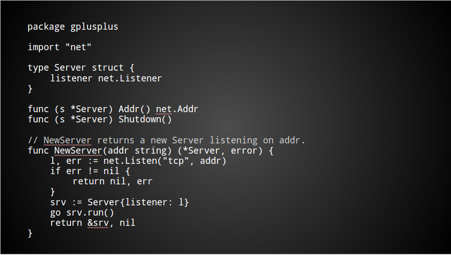

有一些未导出的字段需要初始化，并且必须启动一个 goroutine 来为传入的请求提供服务。

该软件包具有简单的 API，非常易于使用。

## 1.2. v2 版本的函数

但有个问题。在您宣布第一个 Beta 版发布后不久，功能请求就开始滚滚而来。

移动客户端的响应速度通常很慢，或者完全停止响应——您需要添加对断开这些慢速客户端的支持。

在这种安全意识增强的环境中，您的错误跟踪器开始满足支持安全连接的需求。

然后，您会收到一个在非常小的 VPS 上运行您的服务器的用户的报告。他们需要一种方法来限制并发客户端的数量。

接下来是对僵尸网络所针对的一组用户的并发连接进行速率限制的请求。

……然后继续。

现在，您需要更改 API 以合并所有这些功能请求。

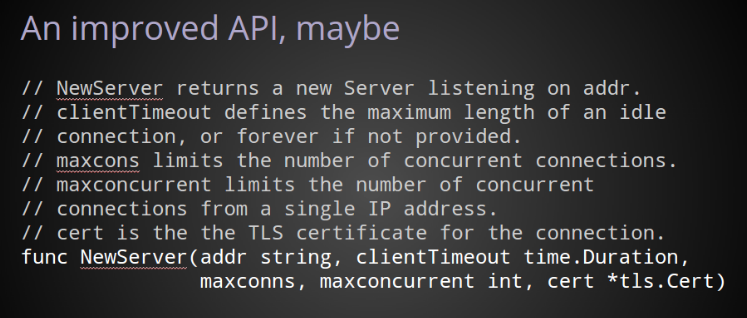

这个函数看起来并不怎么高效和易读。

举手，谁用过这样的API？

谁写过这样的 API？

有谁在依赖这样的 API 时代码出错了？

显然，这种解决方案既麻烦又脆弱。它也不易读。

你的包的新手不知道哪些参数是可选的，哪些是强制性的。

比如我想创建一个 Server 实例进行测试，是否需要提供真实的 TLS 证书？如果没有，我应该提供什么？

如果我不在乎 maxconns，或者 maxconcurrent 我应该使用什么值？我使用零吗？零听起来很合理，但取决于该功能的实现方式，这可能会将您的并发连接总数限制为零。

在我看来，编写这样的 API 很容易；只要你让调用者有责任正确使用它。

## 1.3. v3 版本的函数

虽然上面的例子可能被认为是一种夸大其词、恶意构建和糟糕的文档，但我相信它表明了像这样华丽、脆弱的 API 的真正问题。

现在让我们看看一些解决方案。

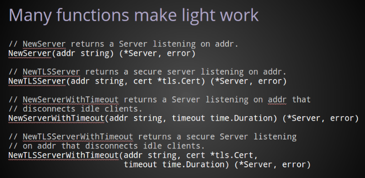

与其试图提供一个必须满足每个排列的单一函数，不如创建一组函数。

通过这种方法，当调用者需要安全服务器时，他们可以调用 TLS 变体。

当他们需要为空闲连接建立最长持续时间时，他们可以使用超时的变体。

不幸的是，如您所见，提供所有可能的排列很快就会变得势不可挡。

## 1.4. v4

让我们继续使用其他方式使您的 API 可配置。

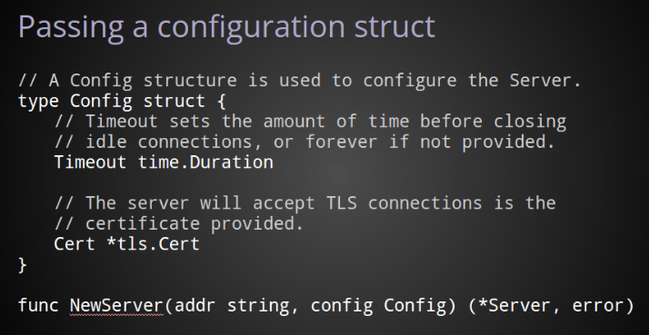

一个非常常见的解决方案是使用配置结构。

这有一些优点。

使用这种方法，随着新选项的添加，配置结构可以随着时间的推移而增长，而用于创建服务器本身的公共 API 保持不变。

这种方法可以产生更好的文档。

曾经是 NewServer 函数上的大量注释块，现在变成了一个很好的文档结构。

它还可能使调用者能够使用零值来表示他们想要特定配置选项的默认行为。

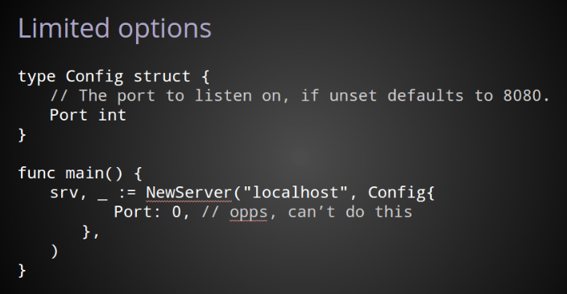

然而，这种模式并不完美。

默认值有问题，特别是如果零值具有很好理解的含义。

例如，在此处显示的配置结构中，当 Port 未提供时，NewServer 将返回一个 `*Server` 用于侦听端口 8080。

但这有一个缺点，您不能再显式设置 Port 为 0 并让操作系统自动选择一个空闲端口，因为显式 0 与字段的零值无法区分。

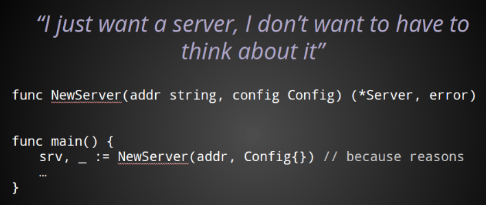

大多数情况下，您的 API 用户会期望使用其默认行为。

即使他们不打算更改任何配置参数，这些调用者仍然需要为第二个参数传递一些东西。

因此，当人们阅读您的测试或示例代码，试图弄清楚如何使用您的包时，他们会看到这个神奇的空值，并且它会被铭记在集体无意识中。

对我来说，这只是感觉不对。

**为什么你的 API 的用户需要构造一个空值，只是为了满足函数的签名？**

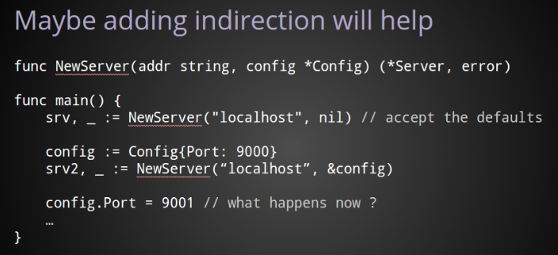

这个空值问题的一个常见解决方案是传递一个指向该值的指针，从而使调用者能够使用 nil 而不是构造一个空值。

在我看来，这种模式具有前一个示例的所有问题，并且增加了一些问题。

我们还是要过的东西这个函数的第二个参数，但现在这个值可能是 nil，大部分的时间将是 nil 为那些想要的默认行为。

它提出了一个问题，传递 nil 和传递指向空值的指针有区别吗？

包的作者及其调用者更关心的是服务器和调用者现在可以共享对相同配置值的引用。这引发了一个问题，**如果这个值在传递给 NewServer 函数后发生变异会发生什么**？

我相信编写良好的 API 不应该要求调用者创建虚拟值来满足那些罕见的用例。

我相信，作为 Go 程序员，我们应该努力确保 nil 永远不是需要传递给任何公共函数的参数。

当我们确实想要传递配置信息时，它应该尽可能地自我解释和表达。

所以现在考虑到这些要点，我想谈谈我认为一些更好的解决方案。

## 1.5. v5

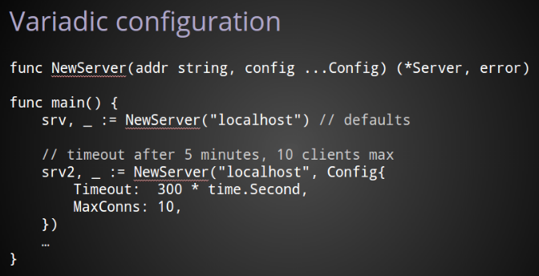

为了消除那个强制性但经常未使用的配置值的问题，我们可以更改 NewServer 函数以接受可变数量的参数。

与传递 nil 或一些零值作为您想要默认值的信号不同，该函数的可变参数性质意味着您根本不需要传递任何东西。

在我的书中，这解决了两个大问题。

首先，对默认行为的调用变得尽可能简洁。

其次，NewServer 现在只接受 Config 值，而不是指向配置值的指针，删除 nil 作为可能的参数，并确保调用者不能保留对服务器内部配置的引用。

我认为这是一个很大的改进。

但如果我们是迂腐的，它仍然有一些问题。

显然，期望是您最多提供一个 Config 值。但由于函数签名是可变参数，因此必须编写实现以应对传递多个可能相互矛盾的配置结构的调用者。

有没有办法在需要时使用可变参数函数签名并提高配置参数的表达能力？

我认为有。

## 1.6. v6

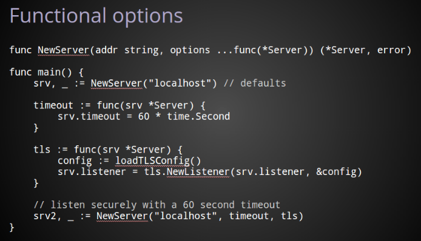

在这一点上，我想明确指出，功能选项的想法来自一篇标题为的博客文章。Rob Pike 于今年 1 月出版的[《自引用函数和设计》](http://commandcenter.blogspot.com.au/2014/01/self-referential-functions-and-design.html)。我鼓励这里的每个人都阅读它。

与前面的示例以及实际上到目前为止的所有示例的主要区别在于，服务器的自定义不是使用存储在结构中的配置参数来执行的，而是使用对值本身进行操作的函数来执行的 Server。

和以前一样，函数签名的可变参数特性为我们提供了默认情况下的紧凑行为。

当需要配置时，我传递给 NewServer 将 Server 值作为参数进行操作的函数。

该 timeout 函数只是更改传递给它 timeout 的任何 `*Server` 值的字段。

该 tls 功能是一个比较复杂的。它接受一个`*Server`值并将原始 listener 值包装在 a 中 tls.Listener，从而将其转换为安全的侦听器。

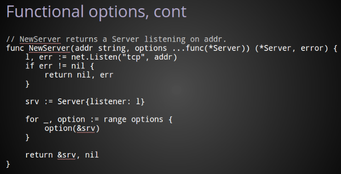

在里面 NewServer，应用这些选项很简单。

通过 `net.Listener` 构造一个监听器，然后基于 listener 获取 Server 实例。

然后，对于提供给 的每个选项函数 NewServer，我们调用该函数，传入一个指向 Server 刚刚声明的值的指针。

显然，如果没有提供选项功能，则在此循环中没有工作要做，因此 srv不变。

仅此而已。

使用这种模式，我们可以制作一个具有

* 合理的默认值
* 高度可配置
* 可以随着时间的推移而增长
* 自我记录
* 对新人安全
* 并且从不需要 nil 或空值来让编译器满意

## 1.7. 实例

在剩下的几分钟内，我想向您展示我如何通过将其转换为使用功能选项来改进我自己的一个包。

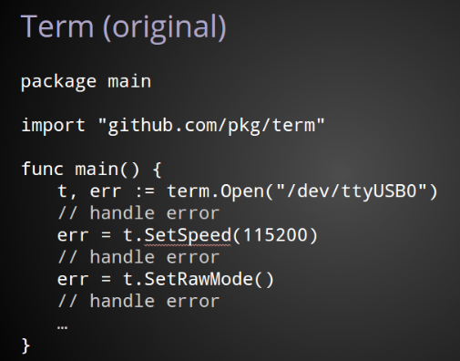

我是一名业余硬件黑客，我使用的许多设备都使用 USB 串行接口。所以几个月前我写了一个 [终端处理包](https://github.com/pkg/term)。

在此包的先前版本中，要打开串行设备、更改速度并将终端设置为原始模式，您必须单独执行这些步骤中的每一个，并在每个阶段检查错误。

即使这个包试图在更低级别的界面上提供更友好的界面，它仍然给用户留下了太多的程序问题。

让我们来看看应用功能选项模式后的包。

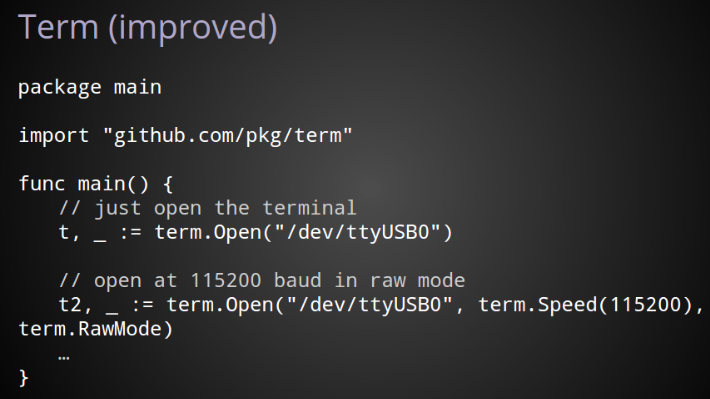 

通过将 Open 函数转换为使用函数值的可变参数，我们得到了一个更清晰的 API。

事实上，不仅仅是 OpenAPI 改进了，设置选项、检查错误、设置下一个选项、检查错误的工作也没有了。

默认情况下，仍然只需要一个参数，即设备的名称。

对于更复杂的用例，在term包中定义的配置函数被传递给Open函数并在返回之前按顺序应用。

这与我们在前面的示例中看到的模式相同，唯一不同的是不是匿名，而是公共函数。在所有其他方面，它们的操作是相同的。

我们将在下一张幻灯片中了解Speed、RawMode和Open是如何实现的。

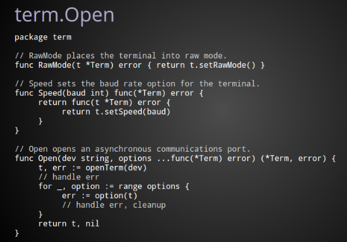

RawMode是最容易解释的。它只是一个签名与 Open 兼容的函数。

因为 RawMode 在与 相同的包中声明 Term，它可以访问私有字段并调用在Term类型上声明的私有方法，在这种情况下调用私有setRawMode帮助程序。

Speed也只是一个常规函数，但它不符合签名Open要求。这是因为Speed它本身需要一个论证；波特率。

Speed返回一个与Open函数签名兼容的匿名函数，它关闭波特率参数，在应用函数时捕获它以备后用。

在对 的调用中Open，我们首先使用openTerm助手打开终端设备。

接下来，就像以前一样，我们遍历选项函数的切片，依次调用每个函数，传入t指向我们term.Term值的指针。

如果在应用任何函数时出现错误，那么我们会在该点停止，清理并将错误返回给调用者。

否则，从函数返回，我们现在已经根据调用者的规范创建和配置了一个 Term 值。

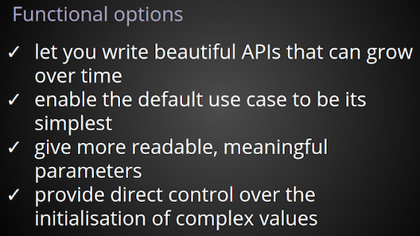

总之

* 功能选项可让您编写可随时间增长的 API。
* 它们使默认用例成为最简单的。
*  它们提供有意义的配置参数。
* 最后，它们使您可以使用语言的全部功能来初始化复杂的值。

在本次演讲中，我介绍了许多现有的配置模式，这些模式被认为是惯用的和今天普遍使用的，并在每个阶段提出了如下问题：

* 这可以简化吗？
* 那个参数是必需的吗？
* 此函数的签名是否使其易于安全使用？
* API 是否包含会令人沮丧的陷阱或令人困惑的误导？

我希望我能激励你做同样的事情。重新审视您过去编写的代码，并向自己提出同样的问题，从而改进它。