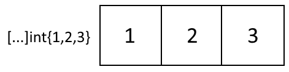
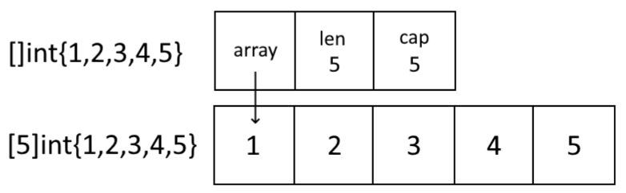

# 1. 盘点学习Go语言时遇到的那些陷阱[译]

* [译文链接-Part1](https://tonybai.com/2021/03/29/darker-corners-of-go-part1/)
* [译文链接-Part2](https://tonybai.com/2021/03/29/darker-corners-of-go-part2/)
* [原文V1版本](http://devs.cloudimmunity.com/gotchas-and-common-mistakes-in-go-golang/)
* [原文V2版本](https://rytisbiel.com/2021/03/06/darker-corners-of-go/)

本文翻译自Rytis Bieliunas的文章[《Darker Corners of Go》](https://rytisbiel.com/2021/03/06/darker-corners-of-go/)。

译注：若干年前，Kyle Quest曾发过一篇名为“[50 Shades of Go: Traps, Gotchas, and Common Mistakes for New Golang Devs](http://devs.cloudimmunity.com/gotchas-and-common-mistakes-in-go-golang/)”的文章，仿效著名的《[C Traps and Pitfalls](https://www.cs.tufts.edu/comp/40/docs/CTrapsAndPitfalls.pdf)》编写了50条Go语言的陷阱与缺陷，一时在Go社区广为流传。而本文是又一篇较为系统总结Go陷阱的文章，不同于50 Shades of Go的按初中高级陷阱的分类方式，本文是按类别对Go陷阱做讲解。

## 1.1. 代码格式化(Code formatting)

### 1.1.1. gofmt

在 Go 中，gofmt 工具将许多预定好的代码格式“强加”于你的代码。

gofmt 对源文件进行机械性的更改，例如对包导入声明进行排序和对代码应用缩进等。这是自从切片面包诞生以来最好的事情，因为它可以节省开发人员大量无关紧要的争论所消耗的工作量。例如，它使用制表符来缩进，使用空格来对齐– 对代码风格的争论到此为止。

您可以完全不使用 gofmt 工具，但如果使用它，你却无法对其所实施的代码格式化样式进行配置。该工具完全没有提供任何代码格式化选项，这才是重点。提供一种“足够好”的统一代码格式样式，它可能是没人喜欢的样式，但是 Go 开发人员认为统一胜于完美。

共享样式和自动代码格式化的好处包括：

* 无需花费任何时间在代码审查上来解决格式问题。
* 它可以使您免于与一起工作的同事争论大括号到底放在哪里，缩进使用制表符还是空格。你所有的激情和精力都可以得到更有效的利用。
* 代码更易于编写：像代码格式这样的次要工作已经有工具帮你完成。
* 代码更容易阅读：您无需从心理上解析你不熟悉的别人的代码格式。
* 大多数流行的 IDE 都具有 Go 插件，这些插件会在保存源文件时自动运行 gofmt。

诸如 goformat 之类的第三方工具允许你在 Go 中使用自定义代码样式格式。但你真的希望那样做么？

### 1.1.2. 长代码行

Gofmt 不会尝试为您分解很长的代码。有诸如 [golines](https://github.com/segmentio/golines) 之类的第三方工具可以做到这一点。

### 1.1.3. 大括号

在 Go 中，**必须在行的末尾放置大括号**。有趣的是，这不是 gofmt 强制执行的，而是 Go 词法分析器实现方式的副作用。有或没有 gofmt，都不能将大括号放在新行上。

```go
package main

// missing function body
func main()
// syntax error: unexpected semicolon or newline before {
{
}

// all good!
func main() {
}
```

### 1.1.4. 多行声明中的逗号

在初始化切片、数组、map 或结构体时，**Go 要求在换行符前加逗号**。

在多种语言中都允许使用尾部逗号，并且在某些样式指南中鼓励使用逗号。在 Go 中，它们是强制性的。这样在重新排列行或添加新行时就无需修改不相关的行。这也意味着更少的代码审核差异。

```go
// all of these are OK
a := []int{1, 2}

b := []int{1, 2,}

c := []int{
    1,
    2}

d := []int{
    1,
    2,
}

// syntax error without trailing comma
e := []int{
    1,
    // syntax error: unexpected newline, expecting comma or }
    2
}
```

结构体也使用相同规则：

```go
type s struct {
    One int
    Two int
}

f := s{
    One: 1,
    // syntax error: unexpected newline, expecting comma or }
    Two: 2
}
```

## 1.2. 包导入(Import)

### 1.2.1. 未使用的导入包

未使用导入包的 Go 程序无法编译。这是该语言的故意设定，因为**导入包会降低编译器的速度**。在大型程序中，未使用的导入包可能会对编译时间产生重大影响。

为了使编译器在开发过程中感到happy^_^，您可以通过以下方式引用该软件包：

```go
package main

import (
    "fmt"
    "math"
)

// Reference unused package
var _ = math.Round

func main() {
    fmt.Println("Hello")
}
```
### 1.2.2. goimports

更好的解决方案是使用 goimports 工具。goimports **会为您删除未引用的导入包**。更好的是，它尝试**自动查找并添加缺失的包导入**。

```go
package main

import "math" // imported and not used: "math"

func main() {
    fmt.Println("Hello") // undefined: fmt
}
```

运行 goimports 之后：

```
./goimports main.go
```

```go
package main

import "fmt"

func main() {
    fmt.Println("Hello")
}
```

大多数流行的 IDE 的 Go 插件在保存源文件时**会自动运行 goimports**。

### 1.2.3. 下划线导入

以下划线方式导入包仅是出于对其副作用的依赖。这意味着它将**创建程序包级变量并运行包的 init 函数**：

```go
package package1

func package1Function() int {
    fmt.Println("Package 1 side-effect")
    return 1
}

var globalVariable = package1Function()

func init() {
    fmt.Println("Package 1 init side effect")
}
```

导入 package1：

```go
package package2

import _ package1
```

这将打印消息并初始化 globalVariable：

```
Package 1 side-effect
Package 1 init side effect
```

**多次导入一个包（例如，在主程序包以及在其主要引用的程序包中）只运行一次该包的init函数。**

下划线导入在 Go 运行时库中有使用。例如，导入 `net/http/pprof` 调用其 `init`函数，该函数公开 HTTP 端点，这些端点可以提供有关应用程序的调试信息：

```go
import _ "net/http/pprof"
```

### 1.2.4. 点导入

点导入允许**在不使用限定符的情况下访问导入包中的标识符**：

```go
package main

import (
    "fmt"
    . "math"
)

func main() {
    fmt.Println(Sin(3)) // references math.Sin
}
```

是否应从Go语言中完全删除点导入一直存在公开辩论。**Go 团队不建议在测试包以外的任何地方使用它们**：

因为它使得程序可读性大大下降，我们很难知道一个 Quux 之类的名称是当前程序包中还是导入程序包中的顶层标识符 – https://golang.org/doc/faq

另外，如果您使用 `go-lint` 工具，那么在测试文件之外使用点导入时，它会显示警告，并且您无法轻易将其关闭。

Go 团队建议在测试中使用点可以避免包的循环依赖：

```go
// foo_test package tests for foo package
package foo_test

import (
    "bar/testutil" // also imports "foo"
    . "foo"
)
```

该测试文件不能成为 foo 包的一部分，因为它引用了 bar/testutil，而 bar/testutil 又引用了 foo 并导致了循环依赖。

在这种情况下，首先要考虑的是，是否有一种更好的方法来构建可避免循环依赖的软件包。将 bar/testutil 使用的内容从 foo 移动到 foo 和 bar/testutil 都可以导入的第三个包可能更好，这样就可以将测试以正常方式写在 foo 包中。

如果重构没有意义，并且使用点导入将测试移至单独的程序包，则 foo_test 程序包至少可以假装为 foo 程序包的一部分。注意，它无法访问foo包的未导出类型和函数。

可以说，在域特定语言编程中，点导入是一个很好的用例。例如，Goa 框架将其用于配置。如果没有点导入，它看起来不会很好：

```go
package design

import . "goa.design/goa/v3/dsl"

// API describes the global properties of the API server.
var _ = API("calc", func() {
    Title("Calculator Service")
    Description("HTTP service for adding numbers, a goa teaser")
    Server("calc", func() {
        Host("localhost", func() { URI("http://localhost:8088") })
    })
})
```

## 1.3. 变量

### 1.3.1. 未使用的变量

带有未使用变量的 Go 程序无法编译：

如果存在未使用的变量，则可能表示有 bug[…] 。Go 拒绝使用未使用的变量或导入来编译程序，并且不会为了短期的便利性去换取更高的构建速度和程序的清晰性。- https://golang.org/doc/faq

**该规则的例外是全局变量和函数参数**：

```go
package main

var unusedGlobal int // this is ok

func f1(unusedArg int) { // unused function arguments are also ok
    // error: a declared but not used
    a, b := 1,2
    // b is used here, but a is only assigned to, does not count as “used”
    a = b
}
```

### 1.3.2. 短变量声明

声明变量的简写形式**仅在函数内部起作用**：

```go
package main

v1 := 1 // error: non-declaration statement outside function body
var v2 = 2 // this is ok

func main() {
    v3 := 3 // this is ok
    fmt.Println(v3)
}
```

设置结构体字段值时，它也不起作用：

```go
package main

type myStruct struct {
    Field int
}

func main() {
    var s myStruct

    // error: non-name s.Field on the left side of :=
    s.Field, newVar := 1, 2 

    var newVar int
    s.Field, newVar = 1, 2 // this is actually ok
}
```

### 1.3.3. 变量遮蔽

令人遗憾的是，Go 中允许使用变量遮蔽。您需要经常注意这一点，因为它可能导致难以发现的问题。发生这种情况是因为，为方便起见，如果至少有一个变量是新变量，Go 允许使用短变量声明形式：

```go
package main

import "fmt"

func main() {
    v1 := 1
    // v1 is not actually redeclared here, only gets a new value set
    v1, v2 := 2, 3
    fmt.Println(v1, v2) // prints 2, 3
}
```

但是，**如果声明在另一个代码块内部，则它将声明一个新变量**，从而可能导致严重的错误：

```go
package main

import "fmt"

func main() {
    v1 := 1
    if v1 == 1 {
        v1, v2 := 2, 3
        fmt.Println(v1, v2) // prints 2, 3
    }
    fmt.Println(v1) // prints 1 !
}
```

一个更现实的示例，假设您有一个返回错误的函数：

```go
package main

import (
    "errors"
    "fmt"
)

func func1() error {
   return nil
}

func errFunc1() (int, error) {
   return 1, errors.New("important error")
}

func returnsErr() error {
    err := func1()
    if err == nil {
        // 此处会重新声明一个 err 局部变量
        v1, err := errFunc1()
        if err != nil {
            fmt.Println(v1, err) // prints: 1 important error
        }
    }

    // 此处拿到的是 err:=func1() 声明的 err
    return err // this returns nil!
}

func main() {
    fmt.Println(returnsErr()) // prints nil
}
```

一种解决方案是不要在嵌套代码块内使用短变量声明：

```go
func returnsErr() error {
    err := func1()
    var v1 int

    if err == nil {
        v1, err = errFunc1()
        if err != nil {
            fmt.Println(v1, err) // prints: 1 important error
        }
    }

    return err // returns "important error"
}
```

或者在上述示例的情况下，更好的方法是尽早退出：

```go
func returnsErr() error {
    err := func1()
    if err != nil {
        return err
    }

    v1, err := errFunc1()
    if err != nil {
        fmt.Println(v1, err) // prints: 1 important error
        return err
    }

    return nil
}
```

也有可以提供帮助的工具。在 `go vet` 工具中曾有一个实验性的变量遮蔽检测，后来将其删除。在撰写本文时，这是您可以安装和运行该工具的方式：

```
go get -u golang.org/x/tools/go/analysis/passes/shadow/cmd/shadow
go vet -vettool=$(which shadow)
```

打印：

```
.\main.go:20:7: declaration of "err" shadows declaration at line 17
```

## 1.4. 运算符

### 1.4.1. 运算符优先级

Go 运算符的优先级与其他语言不同：

优先级 | 操作符
---|---
5    |   `* / % << >> & &^`
4    |   `+ - | ^`
3    |   `== != < <= > >=`
2    |   `&&`
1    |   `||`

将其与基于 C 的语言进行比较：

优先级 | 操作符
---|---
10   |      `*, /, %`
9     |      `+, -`
8     |      `<<, >>`
7     |      `<, <=, >, >=`
6     |      `==, !=`
5     |      `&`
4     |      `^`
3     |      `|`
2     |      `&&`
1     |      `||`

对于相同的表达式，这可能导致不同的结果：

In Go:  `1 << 1 + 1 // (1<<1)+1 = 3`
In C: `1 << 1 + 1 // 1<<(1+1) = 4`

### 1.4.2. 自增和自减

与许多其他语言不同，Go 没有前缀自增或自减运算符：

```go
var i int
++i // syntax error: unexpected ++, expecting }
--i // syntax error: unexpected --, expecting }
```

尽管 Go 确实具有这些运算符的后缀版本，但 Go 不允许在表达式中使用它们：

```go
slice := []int{1,2,3}
i := 1
slice[i++] = 0  // syntax error: unexpected ++, expecting :
```

### 1.4.3. 三元运算符

Go 语言不支持三元运算符，像下面这样的代码：

```go
// 错误示例：Go 语言不支持三元运算
result := a ? b : c
```

在 Go 中没有，你也不要费力寻找。您必须使用 if-else 代替。Go 语言设计人员认为此运算符经常导致难看的代码，最好不要使用它。

### 1.4.4. 按位非

在 Go 中，XOR 运算符 `\^` 被用作`一元NOT运算符`，而不是像许多其他语言使用 `〜` 符号。

In Go:  `^1 // -2`
In C:  `~1 // -2`

**用于二元计算时，XOR 运算符仍用作 XOR(异或)运算符**。

```go
3^1 // 2
```

## 1.5. 常量

### 1.5.1. iota

iota 开始在 Go 中进行常量编号。它“从零开始”，它 `是当前 const 块中常量的索引`：

```go
const (
    myconst = "c"
    myconst2 = "c2"
    two = iota // 2
)
```

两次使用 iota 不会重置编号：

```go
const (
    zero = iota // 0
    one // 1
    two = iota // 2
)
```

## 1.6. 切片和数组

### 1.6.1. 切片和数组

在 Go 中，切片和数组的用途相似。它们的声明方式几乎相同：

```go
package main

import "fmt"

func main() {
    slice := []int{1, 2, 3}
    array := [3]int{1, 2, 3}
    // let the compiler work out array length
    // this will be an equivalent of [3]int
    array2 := [...]int{1, 2, 3}

    // [1 2 3] [1 2 3] [1 2 3]
    fmt.Println(slice, array, array2)
}
```

切片感觉像是在顶部具有有用功能的数组。他们在实现的内部使用指向数组的指针。但是，切片要方便得多，以至于我们很少在 Go 中直接使用数组。

### 1.6.2. 数组

数组是有着固定大小内存的一组同类型元素的集合。不同长度的数组被认为是不同的不兼容类型。

与 C 语言不同，**创建数组时，Go 会将数组元素初始化为零值**，因此我们无需再显式地执行此初始化操作。

另外，与 C 不同的是，`Go 数组是值类型`，它不是指向内存块第一个元素的指针。

**如果将数组传递给函数，则将复制整个数组**。您仍然可以传递指向数组的指针以使其不被复制。



### 1.6.3. 切片

切片是数组段的描述符。这是一个非常有用的数据结构，但可能有点不寻常。有几种可以让你掉入坑中的场景，但如果您知道切片的内部工作原理，则可以避免这些“坑”。这是 Go 源代码中切片的实际定义：

```go
type slice struct {
    array unsafe.Pointer
    len   int
    cap   int
}
```



**Slice 本身是一个值类型，但它使用指针引用它使用的数组。**

与数组不同，如果`将切片传递给函数，则会获得数组指针，len 和 cap 属性的副本（上图中的第一个块）`，但是数组本身的数据不会被复制，切片的两个副本都指向同一数组。

**当您“切片”一个切片时，也会发生同样的事情。Go 会创建一个新的切片，该切片仍指向相同的数组：**

```go
package main

import "fmt"

func f1(s []int) {
    // slicing the slice creates a new slice
    // but does not copy the array data
    s = s[2:4]
    // modifying the sub-slice
    // changes the array of slice in main function as well
    for i := range s {
        s[i] += 10
    }
    fmt.Println("f1", s, len(s), cap(s))
}

func main() {
    s := []int{1, 2, 3, 4, 5}
    // passing a slice as an argument
    // makes a copy of the slice properties (pointer, len and cap)
    // but the copy shares the same array
    f1(s)
    fmt.Println("main", s, len(s), cap(s))
}
```

运行结果：

```
f1 [13 14] 2 3
main [1 2 13 14 5] 5 5
```

### 1.6.4. 获取包括其数据的切片的副本

要获取切片及其数据的副本，您需要做一些工作。您可以将元素手动复制到新切片或使用复制(`copy`)或追加(`append`)：

```go
package main

import "fmt"

func f1(s []int) {
    s = s[2:4]
    s2 := make([]int, len(s))
    copy(s2, s)

    // or if you prefer less efficient, but more concise version:
    // s2 := append([]int{}, s[2:4]...)

    for i := range s2 {
        s2[i] += 10
    }

    fmt.Println("f1", s2, len(s2), cap(s2))
}

func main() {
    s := []int{1, 2, 3, 4, 5}
    f1(s)
    fmt.Println("main", s, len(s), cap(s))
}
```

输出结果：

```
f1 [13 14] 2 3
main [1 2 3 4 5] 5 5
```

### 1.6.5. 使用append扩充切片

**切片最有用的属性是它可以为您自动管理数组的增长。但当它需要超过现有数组容量时，它会分配一个全新的数组。**

如果您希望切片的两个副本共享数组，那么这也可能是陷阱：

```go
package main

import "fmt"

func main() {
    // make a slice with length 3 and capacity 4
    s := make([]int, 3, 4)

    // initialize to 1,2,3
    s[0] = 1
    s[1] = 2
    s[2] = 3

    // capacity of the array is 4
    // adding one more number fits in the initial array
    s2 := append(s, 4)

    // modify the elements of the array
    // s and s2 still share the same array
    for i := range s2 {
        s2[i] += 10
    }

    fmt.Println(s, len(s), cap(s))    // [11 12 13] 3 4
    fmt.Println(s2, len(s2), cap(s2)) // [11 12 13 14] 4 4

    // append 之后超出了原始容量，所以会重新构建一个底层数组
    s3 := append(s2, 5)

    // modify the elements of the array to see the result
    for i := range s3 {
        s3[i] += 10
    }

    fmt.Println(s, len(s), cap(s)) // still the old array [11 12 13] 3 4
    fmt.Println(s2, len(s2), cap(s2)) // the old array [11 12 13 14] 4 4

    // array was copied on last append [21 22 23 24 15] 5 8
    fmt.Println(s3, len(s3), cap(s3))
}
```

### 1.6.6. nil切片

**无需检查切片是否为 nil 值，也不必对其初始化**。

len，cap 和 append 等功能在 nil slice 上同样可以正常工作：

```go
package main

import "fmt"

func main() {
    var s []int // nil slice
    fmt.Println(s, len(s), cap(s)) // [] 0 0

    // nil 切片也可以 append 
    s = append(s, 1)
    fmt.Println(s, len(s), cap(s)) // [1] 1 1
}
```

**空切片(empty slice)与 nil 切片不是同一回事：**

```go
package main

import "fmt"

func main() {
    var s []int // this is a nil slice
    s2 := []int{} // this is an empty slice

    // looks like the same thing here:
    fmt.Println(s, len(s), cap(s)) // [] 0 0
    fmt.Println(s2, len(s2), cap(s2)) // [] 0 0

    // but s2 is actually allocated somewhere
    fmt.Printf("%p %p", s, s2) // 0x0 0x65ca90
}
```

**如果您非常在意性能和内存使用情况，那么初始化一个空切片可能不如使用 nil 切片理想。**

### 1.6.7. make陷阱

要创建一个新的切片，可以将 make 与切片类型以及切片的初始长度和容量一起使用。容量参数是可选的：

```go
func make([]T, len, cap) []T
```

这样做太简单了：

```go
package main

import (
    "fmt"
)

func main() {
    s := make([]int, 3)
    s = append(s, 1)
    s = append(s, 2)
    s = append(s, 3)
    fmt.Println(s)
}
```

输出结果：

```
[0 0 0 1 2 3]
```

示例2：

```go
func SliceTest3() {

	// 初始化一个长度为 2 的切片，其两个元素为 int 默认值-0，
	slice1:=make([]int,2)
	// append 此时会把元素追加到初始化时两个默认 0 的后面
	slice1 = append(slice1, 1)
	slice1 = append(slice1, 2)
	//slice1: [0 0 1 2]
	fmt.Println("slice1:",slice1)

	var slice3 []int
	slice3 = append(slice3, 1)
	slice3 = append(slice3, 2)
	//slice3: [1 2]
	fmt.Println("slice3:",slice3)
}
```

### 1.6.8. 未使用的切片的数组数据

由于**对数组进行切片会创建一个新的切片，但会共享底层数组，因此有可能在内存中保留比你预期更多的数据**。

这是一个愚蠢的例子：

```go
// 错误示例
package main

import (
    "bytes"
    "fmt"
    "io/ioutil"
    "os"
)

func getExecutableFormat() []byte {
    // read our own executable file into memory
    bytes, err := ioutil.ReadFile(os.Args[0])
    if err != nil {
        panic(err)
    }
    return bytes[:4]
}

func main() {
    format := getExecutableFormat()

    if bytes.HasPrefix(format, []byte("ELF")) {
        fmt.Println("linux executable")
    } else if bytes.HasPrefix(format, []byte("MZ")) {
        fmt.Println("windows executable")
    }
}
```

在上面的代码中，只要该 format 变量在范围内并且不能被垃圾回收，则整个可执行文件（可能几兆字节的数据）将必须保留在内存中。要修复它，请复制实际需要的字节。

### 1.6.9. 多维切片

**目前，Go中没有这样的东西。**

可能某天会有，但是此时此刻您需要自己计算元素索引来手动将一维切片用作多维切片，或者使用“锯齿状”切片（锯齿状切片是切片的切片）：

```go
package main

import "fmt"

func main() {
    x := 2
    y := 3
    s := make([][]int, y)
    for i := range s {
        s[i] = make([]int, x)
    }
    fmt.Println(s)
}
```

运行结果：

```
[[0 0] [0 0] [0 0]]
```

## 1.7. 字符串和字节数组

### 1.7.1. Go中的字符串

Go 字符串的内部定义如下所示：

```go
type StringHeader struct {
    Data uintptr
    Len  int
}
```

字符串本身是一个值类型，**它具有一个指向字节数组的指针和固定长度**。

字符串中的“零字节”不像在 C 中那样标记着字符串的结尾。

字符串内可以有任何数据。通常，该数据被编码为 UTF-8 字符串，但不一定如此。

### 1.7.2. 字符串不能为nil

字符串在 Go 中永远不会为 nil。`字符串的默认值是一个空字符串，而不是nil`：

```go
package main

import "fmt"

func main() {
    var s string
    fmt.Println(s == "") // true

    s = nil // error: cannot use nil as type string in assignment
}
```

### 1.7.3. 字符串是不可变的（某种）

Go 不想让您修改字符串：

```go
package main

func main() {
    str := "darkercorners"
    str[0] = 'D' // error: cannot assign to str[0]
}
```

不可变的数据更易于推理，因此产生的问题更少。

缺点是每次您想在字符串中添加或删除某些内容时，都必须分配一个全新的字符串。

如果确实需要，可以通过 unsafe 包来修改字符串，但是如果您这这样做的话，你可能就是聪明过头了。

您可能要担心分配的最常见情况是，**需要将许多字符串连接在一起**。有一个 `string.Builder` 类型用于此目的。

**strings.Builder批量分配内存，而不是每次添加字符串时分配内存**：

```go
package main

import (
    "strconv"
    "strings"
    "testing"
)

func BenchmarkString(b *testing.B) {
    var str string
    for i := 0; i < b.N; i++ {
        str += strconv.Itoa(i)
    }
}

func BenchmarkStringBuilder(b *testing.B) {
    var str strings.Builder
    for i := 0; i < b.N; i++ {
        str.WriteString(strconv.Itoa(i))
    }
}
```

```go
BenchmarkString-8 401053 147346 ns/op 1108686 B/op 2 allocs/op
BenchmarkStringBuilder-8 29307392 44.9 ns/op 52 B/op 0 allocs/op
```

在此示例中，使用 `strings.Builder` 比简单添加字符串（并每次分配新的内存）快 3000 倍。


在某些情况下，Go 编译器会优化这些分配：

* 比较字符串和字节切片时：`str == string(byteSlice)`
* 当使用 `[]byte` 键在 `map[string]` 中查找条目时：`m[string(byteSlice)]`
* 在将字符串转换为字节的 `range` 子句中：对于 `i，v：= range []byte(str) {…}`

Go 编译器的新版本可能会添加更多优化，因此，如果性能至关重要，那么最好始终使用基准测试和剖析器(profiler)。

### 1.7.4. 字符串与 []byte

修改字符串的一种方法是**先将其转换为字节切片，然后再转换回字符串**。

如下例所示，将字符串转换为字节切片并向后复制整个字符串和字节切片。原始字符串不变：

```go
package main

import (
    "fmt"
)

func main() {
    str := "darkercorners"
    bytes := []byte(str)

    bytes[0] = 'D'
    str2 := string(bytes)

    bytes[6] = 'C'
    // prints: darkercorners Darkercorners DarkerCorners
    fmt.Println(str, str2, string(bytes))
}
```

使用 unsafe 包可以（但显然不安全）直接修改字符串而无需分配内存。但不推荐这么做。

>导入 unsafe 包可能是不可移植的，并且不受 Go 1 兼容性准则的保护。 – https://golang.org/pkg/unsafe/

```go
package main

import (
    "fmt"
    "unsafe"
)

func main() {
    buf := []byte("darkercorners")
    buf[0] = 'D'

    // make a string that points to the same data as buf byte slice
    str := *(*string)(unsafe.Pointer(&buf))

    // modifying byte slice
    // it now points to the same memory as the string does
    // str is modified here as well
    buf[6] = 'C'

    fmt.Println(str, string(buf)) // DarkerCorners DarkerCorners
}
```

### 1.7.5. UTF-8的那些事

Unicode 和 UTF-8 是一个“有故事”的主题。

要了解 Unicode 和 UTF-8 的总体工作原理，您可能需要阅读 Joel Spolsky 的博客文章“[每个软件开发人员的绝对最低限度，绝对，肯定地必须了解Unicode和字符集（无借口！）](https://www.joelonsoftware.com/2003/10/08/the-absolute-minimum-every-software-developer-absolutely-positively-must-know-about-unicode-and-character-sets-no-excuses/)”。

下面是简短回顾：

* Unicode是“一种用于不同语言和脚本的国际编码标准，通过该标准，为每个字母，数字或符号分配了适用于不同平台和程序的唯一数值”。本质上，这是一张“码点”的大表。它包含所有语言的大多数（但不是全部）字符。该表中的每个码点都有一个索引，您有时可以看到使用 `U+` 表示法指定的索引，例如字母 A 的 `U+0041`。
* 通常，码点是指一个字符，例如汉字⻯（`U+2EEF`），但是它可以是几何形状或字符修饰符（例如，德语 ä，ö 和 ü 等字母的变音符号）。由于某种原因，它甚至可能是便便图标（U+1F4A9）。
* UTF-8 是将大 Unicode 表的元素编码为计算机可以使用的实际字节的一种方法（也是最常见的一种方法）。
* **使用 UTF-8 编码时，单个 Unicode 码点可能占用1到4个字节**。
* 数字和拉丁字母（az，AZ，0-9）编码为1个字节。许多其他语言的字母将以 UTF-8 编码占用1个以上的字节。
* 如果您不了解上面这点，则一旦有人需要将其与其他语言一起使用时，您的 Go 程序可能会中断。除非您当然会仔细阅读本章的其余部分。

### 1.7.6. Go中的字符串编码

**Go 中的字符串是字节数组**。字符串本身对编码一无所知。它不必是 UTF-8 编码的。尽管某些库函数甚至是一种语言功能（for range循环）都假设它是 utf-8 编码的。

相信 Go 字符串都是 UTF-8 并不少见。字符串字面量(literals)使这一混乱增加了很多。尽管字符串本身没有任何特定的编码，但是** Go 编译器始终将源代码解释为UTF-8。**

定义字符串字面量后，您的编辑器会将其与其余代码一样保存为 UTF-8 编码的 Unicode 字符串。一旦 Go 解析了程序，它将被编译到您的程序中。编译器或 Go 字符串处理代码与最终编码为 UTF-8 的字符串无关-这只是文本编辑器将字符串写入磁盘的方式：

```go
package main

import (
    "fmt"
)

func main() {
    // a string literal with Unicode characters
    s := "English 한국어"

    // prints the expected Unicode string: English 한국어
    fmt.Println(s)
}
```

只是为了证明一点，这是定义非 UTF-8 字符串的方法：

```go
package main

import (
    "fmt"
    "unicode/utf8"
)

func main() {
    s := "\xe2\x28\xa1"

    fmt.Println(utf8.ValidString(s)) // false

    fmt.Println(s) // �(�
}
```

### 1.7.7. rune类型

**Go 中的 Unicode 码点以 `rune` 类型表示，而 rune 又是 32 位整数。**

### 1.7.8. 字符串长度

在字符串上调用 len 将返回字符串中的字节数，而不是字符数。

获取字符数可能会十分复杂。在您的用例中，对字符串中的 rune 进行计数可能不够好：

```go
package cp_str

import (
	"fmt"
	"unicode/utf8"
)

func LenTest() {
	s1 := "한국어"
	// 9 3 3
	lenTest(s1)

	s2 := "你好啊"
	//9 3 3
	lenTest(s2)

	s3 := "hello"
	//5 5 5
	lenTest(s3)

	s4 := "hello,世界"
	//12 8 8
	lenTest(s4)
}

func lenTest(str string) {
	byteLen := len(str)
	runeLen := utf8.RuneCountInString(str)
	runeLen2 := len([]rune(str)) // same thing as doing RuneCountInString

	fmt.Println(byteLen, runeLen, runeLen2)
}
```

不幸的是，**某些 Unicode 字符跨越多个代码点，因此跨越多个 rune。**

需要做一些可怕的事情来计算出人类能感知的 Unicode 字符串中的字符数。如 Unicode 标准中所述。Go 库并没有真正提供一种简单的方法。这是方法之一：

```go
package main

import (
    "fmt"
    "unicode/utf8"
    "golang.org/x/text/unicode/norm"
)

// 计算真实字符信息
func normlen(s string) int {
    var ia norm.Iter
    ia.InitString(norm.NFKD, s)
    nc := 0

    for !ia.Done() {
        nc = nc + 1
        ia.Next()
    }

    return nc
}

func main() {
    str := "é́́" // a particularly strange character

    fmt.Printf(
        "%d bytes, %d runes, %d actual character",
        len(str),
        utf8.RuneCountInString(str),
        normlen(str))
}
```

输出结果：

```go
7 bytes, 4 runes, 1 actual character
```

### 1.7.9. 字符串下标运算符和 for…range

简而言之，**字符串下标运算符返回字符串的`字节数组下标处的字节`**。而 **for range 则在字符串中的 rune 上进行迭代，将字符串解释为 UTF-8 编码的文本**：

```go
package main

import (
    "fmt"
)

func main() {
    s := "touché"

    // prints every byte
    // touché
    for i := 0; i < len(s); i++ {
        fmt.Print(string(s[i]))
    }
    fmt.Println()

    // prints every rune
    // touché
    for _, r := range s {
        fmt.Print(string(r))
    }
    fmt.Println()

    // convert a string to rune slice to access by index
    // touché
    r := []rune(s)
    for i := 0; i < len(r); i++ {
        fmt.Print(string(r[i]))
    }
}
```

## 1.8. map

### 1.8.1. map 迭代顺序是随机的（不是真的）

从技术上讲，map 的迭代顺序是“未定义的”。Go map 在内部使用哈希表，并且通常按照 map 元素在该表中的排列顺序进行 map 迭代。当将新元素添加到 map时，由于哈希表需要增长，因此不能依赖此顺序并进行更改。

在 Go 的早期，这对于那些不阅读语言文档并以某种方式依赖于按一定顺序进行迭代的程序员来说是一个严重的陷阱。为了帮助及早发现这些问题，而不是在生产中发现这些问题，Go 开发人员将 map 迭代设为随机：

```go
package main

import "fmt"

func main() {
    // add sequential elements
    // to make it seem like maybe maps are iterated in order
    m := map[int]int{0: 0, 1: 1, 2: 2, 3: 3, 4: 4, 5: 5}
    for i := 0; i < 5; i++ {
        for i := range m {
            fmt.Print(i, " ")
        }
        fmt.Println()
    }

    // add more elements
    // to make the hash table of the map grow and reorder elements
    m[6] = 6
    m[7] = 7
    m[8] = 8

    for i := 0; i < 5; i++ {
        for i := range m {
            fmt.Print(i, " ")
        }
        fmt.Println()
    }
}
```

```
3 4 5 0 1 2
5 0 1 2 3 4
0 1 2 3 4 5
1 2 3 4 5 0
0 1 2 3 4 5
0 1 3 6 7 2 4 5 8
1 3 6 7 0 4 5 8 2
2 4 5 8 0 1 3 6 7
0 1 3 6 7 2 4 5 8
0 1 3 6 7 2 4 5 8
```

在上面的示例中，

* 当使用项目 1 到 5 初始化map时，它们将以该顺序添加到哈希表中。前五个打印行都是按顺序写入的数字 0 到 5 。Go 仅随机化迭代从哪个元素开始。
* **向 map 添加更多元素会使 map 的哈希表增加。从而对整个哈希表进行重新排序**。最后 5 条输出不再以任何明显的顺序排列。如果需要，您可以在 Go maps 的源代码中找到有关它的全部信息。

### 1.8.2. 检查 map 键是否存在

**访问不存在的 map 元素将返回 map 值类型的默认值(零值)**。如果它是整数 map，则将返回 0，对于引用类型，它将为 nil 。

当您要检查 map 中是否存在某个元素时，有时默认值就足够了。例如，如果您有一个指向结构的指针的 map，然后在访问 map 时获得 nil 值，则可以确保这意味着您要查找的元素不在 map 中。例如，在布尔值 map 的情况下，默认值不足以判断元素值是否为“false”或 map 中是否缺少该元素。

访问 map 元素会返回一个可选的第二个参数，该参数可以告诉您该元素是否确实在 map 中：

```go
package main

import "fmt"

func main() {
    m := map[int]bool{1: false, 2: true, 3: true}

    // prints false, but not clear if the value of
    // the element is false or map item doesn’t exist
    // and the default was returned
    fmt.Println(m[1]) 

    val, exists := m[1]
    fmt.Println(val, exists) // prints false true
}
```

**切片类型是具有指向数组的指针的结构（值类型），而 map 本身是指针**。切片的零值已经完全可用，您可以使用 append 添加元素并获取其长度。但 map 是不同的。Go 开发人员希望使 map 零值完全可用，但他们不知道如何有效地实现它。**Go 中的 Map 关键字是 `*runtime.hmap` 类型的别名。它的零值为 nil。可以读取nilmap，但不能将其写入：**

```go
package main

import "fmt"

func main() {
    var m map[int]int // a nil map

     // taking len of a nil map is OK. prints 0
    fmt.Println(len(m))
    // reading nil map is OK. prints 0 (the default of the map value type)
    fmt.Println(m[10])

    m[10] = 1 // panic: assignment to entry in nil map
}
```

可以读取 nil map，因为 map 项是使用类似下面这样的函数访问的（来自runtime/map.go）：

```go
func mapaccess1(t *maptype, h *hmap, key unsafe.Pointer) unsafe.Pointer
```

此函数将检查 map 是否为 nil，如果为 nil，则返回零值。请注意，它无法为您创建 map。**要拥有完全可用的 map，必须调用 make**：

```go
package main

import "fmt"

func main() {
    m := make(map[int]int)
    m[10] = 11         // now all is well
    fmt.Println(m[10]) // prints 11
}
```

**当将指向 map 的指针传递给函数时，该指针的值将被复制（ Go 通过值（包括指针）传递所有内容）**。

```go
package main

import "fmt"

func f1(m map[int]int) {
    m[5] = 123
}

func main() {
    m := make(map[int]int)
    f1(m)
    fmt.Println(m[5]) // prints 123
}
```

如果要在函数内部创建新的 map，并更改指针副本的值。这样，修改该副本中的数据时并不会影响原 map :

```go
package main

import "fmt"

func f1(m map[int]int) {
    m = make(map[int]int)
    m[5] = 123
}

func main() {
    var m map[int]int
    f1(m)
    fmt.Println(m[5])     // prints 0
    fmt.Println(m == nil) // true
}
```

### 1.8.3. struct{}类型

Go没有集合数据结构（类似于带有键的map，但没有C++中实现的std::set或在C＃中实现的HashSet）。使用map替代非常简单。一个小技巧是在这种情况下使用struct{}类型作为map值：

package main

import (
    "fmt"
)

func main() {
    m := make(map[int]struct{})
    m[123] = struct{}{}
    _, keyexists := m[123]
    fmt.Println(keyexists)
}

通常在此处会使用bool值，但是具有struct{}值类型的map将使用更少的内存。struct{}类型实际上为零字节：

package main

import (
    "fmt"
    "unsafe"
)

func main() {
    fmt.Println(unsafe.Sizeof(false)) // 1
    fmt.Println(unsafe.Sizeof(struct{}{})) // 0
}
4) map容量
map是一个相当复杂的数据结构。虽然可以在创建map时指定map的初始容量，但以后无法获取其容量（至少不能使用cap函数）：

package main

import (
    "fmt"
)

func main() {
    m := make(map[int]bool, 5) // initial capacity of 5
    fmt.Println(len(m)) // len is fine
    fmt.Println(cap(m)) // invalid argument m (type map[int]bool) for cap
}

5) map值不可寻址
Go Map是用哈希表实现的，当map需要增长或缩小时，哈希表需要移动其元素。因此，Go不允许使用map元素的地址：

package main

import "fmt"

type item struct {
    value string
}

func main() {
    m := map[int]item{1: {"one"}}

    fmt.Println(m[1].value) // reading a struct value is fine
    addr := &m[1]           // error: cannot take the address of m[1]
    // error: cannot assign to struct field m[1].value in map
    m[1].value = "two"
}

有一种建议允许给一个结构体字段赋值（m[1].value =”two”），因为在这种情况下，不保留指向值字段的指针，只能通过它进行分配。尽管由于“微不足道的情况”，目前尚无具体计划何时或是否实施。

解决方法是将整个结构重新分配回map：

package main

type item struct {
    value string
}

func main() {
    m := map[int]item{1: {"one"}}
    tmp := m[1]
    tmp.value = "two"
    m[1] = tmp
}

或者，指向结构体的指针map也将起作用。在这种情况下，m[1]的“值”的类型为*item。Go不需要带一个指向map值的指针，该值本身已经是一个指针。哈希表将在内存中移动指针，但是如果您复制值m[1]的副本，它将继续指向同一项目，因此一切都很好：

package main

import "fmt"

type item struct {
    value string
}

func main() {
    m := map[int]*item{1: {"one"}}
    // Go does not need to take address of m[1] here
    // as it is a pointer already
    m[1].value = "two"
    fmt.Println(m[1].value) // two

    addr := &m[1] // still same error: cannot take the address of m[1]
}

值得注意的是，切片和数组没有此问题：

package main

import "fmt"

func main() {
    slice := []string{"one"}

    saddr := &slice[0]
    *saddr = "two"

    fmt.Println(slice) // [two]
}
6) 数据竞态
常规的Go map对于并发访问并不安全。map通常用于在goroutine之间共享数据，但是对map的访问必须通过sync.Mutex，sync.RWMutex，其他一些内存屏障或与Go channel进行协调来阻止并发访问。除了以下例外：

仅当发生更新时，map访问才是不安全的。只要所有goroutine仅读取（在map中查找元素，包括使用for range 循环对其进行遍历）， 并且不通过分配元素或进行删除来更改map，则对于它们来说，在不同步的情况下并发访问map是安全的。 – https://golang.org/doc/faq

package main

import (
    "math/rand"
    "time"
)

func readWrite(m map[int]int) {
    // do some random reads and writes to the map
    for i := 0; i < 100; i++ {
        k := rand.Int()
        m[k] = m[k] + 1
    }
}

func main() {
    m := make(map[int]int)

    // start goroutines to read and write map concurrently
    for i := 0; i < 10; i++ {
        go readWrite(m)
    }

    time.Sleep(time.Second)
}

fatal error: concurrent map read and map write
fatal error: concurrent map writes
…
在这种情况下，map访问可以用互斥对象同步。下面的代码将按预期工作：

package main

import (
    "math/rand"
    "sync"
    "time"
)

var mu sync.Mutex

func readWrite(m map[int]int) {
    mu.Lock()
    // defer unlock mutex will unlock mutex
    // even if this goroutine would panic
    defer mu.Unlock()

    for i := 0; i < 100; i++ {
        k := rand.Int()
        m[k] = m[k] + 1
    }
}

func main() {
    m := make(map[int]int)
    for i := 0; i < 10; i++ {
        go readWrite(m)
    }

    time.Sleep(time.Second)
}

7) sync.Map
sync包中有一个特殊版本的map，可以安全地被多个goroutine并发使用。但是，Go文档建议在大多数情况下使用Mutex的常规map。sync.Map是类型不安全的，它类似于map[interface{}]interface{}。sync.Map文档有这段描述：

Map类型针对两种常见使用场景进行了优化：（1）给定键的条目仅写入一次但读取多次，例如在仅增长的高速缓存中；（2）当多个goroutine进行读取，写入和覆盖不相交的键集的条目。在这两种情况下，与单独的Mutex或RWMutex配对的Go map相比，使用Map可以显着减少锁争用。 – https://github.com/golang/go/blob/master/src/sync/map.go

9. 循环(loop)
1) range迭代器返回两个值
初学者的陷阱。Go中的For-range与其他语言中的for-range略有不同。它返回一个或两个变量，第一个是迭代索引（如果迭代的对象是map，第一个值则是map键），第二个是值。如果仅使用一个变量，那么它是索引：

package main

import "fmt"

func main() {
    slice := []string{"one", "two", "three"}

    for v := range slice {
        fmt.Println(v) // 0, 1, 2
    }

    for _, v := range slice {
        fmt.Println(v) // one two three
    }
}

2) For循环迭代器变量被重用
在循环中，每次迭代都重复使用相同的迭代器变量。如果使用其地址，则每次都将是相同的地址，这意味着迭代器变量的值将在每次迭代时复制到相同的内存位置。它使循环更有效，但它也是Go中最常见的陷阱之一。这是Go Wiki的示例：

package main

import "fmt"

func main() {
    var out []*int
    for i := 0; i < 3; i++ {
        out = append(out, &i)
    }
    fmt.Println("Values:", *out[0], *out[1], *out[2])
    fmt.Println("Addresses:", out[0], out[1], out[2])
}
Values: 3 3 3
Addresses: 0xc0000120e0 0xc0000120e0 0xc0000120e0
一种解决方案是在循环内部声明一个新变量。在代码块内部声明的变量即使在循环中也不会被重用：

package main

import "fmt"

func main() {
    var out []*int
    for i := 0; i < 3; i++ {
        i := i // copy i into a new variable
        out = append(out, &i)
    }
    fmt.Println("Values:", *out[0], *out[1], *out[2])
    fmt.Println("Addresses:", out[0], out[1], out[2])
}
现在，它可以按预期工作：

Values: 0 1 2
Addresses: 0xc0000120e0 0xc0000120e8 0xc0000120f0
在使用for-range子句的情况下，将同时使用索引和值变量。

在循环中启动goroutine是类似的事情：

package main

import (
    "fmt"
    "time"
)

func main() {
    for i := 0; i < 3; i++ {
        go func() {
            fmt.Print(i)
        }()
    }
    time.Sleep(time.Second)
}
333
这些goroutine是在此循环中创建的，但是它们开始运行需要花费一些时间。由于它们捕获单个i变量，因此Println会在执行goroutine时打印其具有的任何值。

在这种情况下，您可以像前面的示例一样在代码块内创建一个新变量，或者将iterator变量作为参数传递给goroutine：

package main

import (
    "fmt"
    "time"
)

func main() {
    for i := 0; i < 3; i++ {
        go func(i int) {
            fmt.Print(i)
        }(i)
    }
    time.Sleep(time.Second)
}
012

在这里，goroutine i的参数是一个新变量，它是从迭代器变量中复制的，这是创建goroutine的一部分。

如果循环不是启动goroutine，而是调用一个简单的函数，则代码将按预期工作：

for i := 0; i < 3; i++ {
    func() {
        fmt.Print(i)
    }()
}

012
变量i像以前一样被重用。但是，这些函数调用中的每一个都不会让循环继续进行，直到函数完成执行为止，在这段时间内，我将获得期望的值。

它变得有些棘手。通过在struct上调用一个方法来看看这个例子：

package main

import (
    "fmt"
    "time"
)

type myStruct struct {
    v int
}

func (s *myStruct) myMethod() {
    // print the value of myStruct and its address
    fmt.Printf("%v, %p\n", s.v, s)
}

func main() {
    byValue := []myStruct{{1}, {2}, {3}}
    byReference := []*myStruct{{1}, {2}, {3}}

    fmt.Println("By value")

    for _, i := range byValue {
        go i.myMethod()
    }
    time.Sleep(time.Millisecond * 100)

    fmt.Println("By reference")

    for _, i := range byReference {
        go i.myMethod()
    }
    time.Sleep(time.Millisecond * 100)
}

By value
3, 0xc000012120
3, 0xc000012120
3, 0xc000012120
By reference
1, 0xc0000120e0
3, 0xc0000120f0
2, 0xc0000120e8

我们看到：通过引用使用myStruct时，它的工作就像没有陷阱一样！这与创建goroutines有关。在创建goroutine时会对goroutine参数进行求值。方法接收者（myMethod的myStruct）实际上是一个参数。

当按值调用时：由于myMethod的参数s是一个指针，因此i的地址被视为作为参数传递给goroutine，我们知道迭代器变量被重用，因此每次它都是相同的地址。当迭代器运行时，它将复制新的myStruct值到i变量的相同地址。打印的值是执行goroutine时i变量具有的值。

当通过引用调用时：参数已经是一个指针，因此在创建goroutine时将指针值压入新的goroutine的堆栈中。这恰好是我们想要的地址，并打印了期望值。

3) 带label的break和continue
Go可能鲜为人知的功能是能够为for, switch和select语句加上label，并在这些label上使用break和continue，这是我们常用的跳出外循环的方法：

loopi:
    for x := 0; x < 3; x++ {
        for y := 0; y < 3; y++ {
            fmt.Printf(x, y)
            break loopi
        }
    }

0 0
continue也可以类似的方式使用：

loopi:
    for x := 0; x < 3; x++ {
        for y := 0; y < 3; y++ {
            fmt.Printf(x, y)
            continue loopi
        }
    }
0 0
1 0
2 0

label也可以与switch和select语句一起使用。在这里，没有label的break只会脱离select语句并进入for循环：

package main

import (
    "fmt"
    "time"
)

func main() {
loop:
    for {
        select {
        case <-time.After(time.Second):
            fmt.Println("timeout reached")
            break loop
        }
    }
    fmt.Println("the end")
}

timeout reached
the end

正如前面提到的，switch和select语句也可以加上label，因此我们可以将上面的示例写成：

package main

import (
    "fmt"
    "time"
)

func main() {
myswitch:
    switch {
    case true:
        for {
            fmt.Println("switch")
            break myswitch // would not be able to “continue” in this case
        }
    }
    fmt.Println("the end")
}

switch
the end
容易将前面示例中的“label语句”与将使用goto的label混淆。实际上，您可以对break/continue和goto使用相同的标签，但是行为会有所不同。在下面的代码中，虽然break会脱离标记循环，但是goto会将代码执行转移到标签的位置（并在下面的代码中导致无限循环）：

package main

import (
    "fmt"
    "time"
)

func main() {
loop:
    switch {
    case true:
        for {
            fmt.Println("switch")
            break loop // breaks the “labeled statement”
        }
    }
    fmt.Println("not the end")
    goto loop // jumps to “loop” label
}

switch
not the end
switch
not the end
…

10. Switch和Select
1) case语句会默认break
与基于C的语言不同，Go中的case语句默认情况下会break。要使case语句向下继续执行，请使用fallthrough关键字：

package main

import (
    "fmt"
    "time"
)

func main() {
    // this will not work, in case of Saturday nothing will be printed
    switch time.Now().Weekday() {
    case 6: // this case will break out of switch without doing anything
    case 7:
        fmt.Println("weekend")
    }

    switch time.Now().Weekday() {
    case 1:
        break // this break does nothing because case would break anyway
    case 2:
        fmt.Println("weekend")
    }

    // fallthrough keyword will make Saturday print weekend as well
    switch time.Now().Weekday() {
    case 6:
        fallthrough
    case 7:
        fmt.Println("weekend")
    }

    // case can also have multiple values
    switch time.Now().Weekday() {
    case 6, 7:
        fmt.Println("weekend")
    }

    // conditional breaks are still useful
    switch time.Now().Weekday() {
    case 6, 7:
        day := time.Now().Format("01-02")
        if day == "12-25" || day == "12-26" {
            fmt.Println("Christmas weekend")
            break // do not also print "weekend"
        }

        // a regular weekend
        fmt.Println("weekend")
    }
}

2) 带label的break
如之前在循环一章中提到的那样，switch和select也可以执行带label的break来中断外部循环，而不是switch或select语句本身：

package main

import (
    "fmt"
    "strings"
)

func main() {
    s := "The quick brown Waldo fox jumps over the lazy dog"

findWaldoLoop:
    for _, w := range strings.Split(s, " ") {
        switch w {
        case "Waldo":
            fmt.Println("found Waldo!")
            break findWaldoLoop
        default:
            fmt.Println(w, "is not Waldo")
        }
    }
}

The is not Waldo
quick is not Waldo
brown is not Waldo
found Waldo!

11. 函数
1) defer语句
Defer似乎没有很大的陷阱，但还是有值得一提的是细微之处。

摘自安德鲁·格朗（Andrew Gerrand）关于该主题的出色文章：

defer语句将函数调用推送到列表上。包裹函数返回后，将执行保存的呼叫列表。Defer通常用于简化执行各种清理操作的功能。

要注意的最重要的几点：

虽然在原始函数返回时调用了deferred函数，但在调用defer时会对其参数求值
package main

import (
    "fmt"
)

func main() {
    s := "defer"
    defer fmt.Println(s)
    s = "original"
    fmt.Println(s)
}
original
defer
原始函数返回后，延迟函数将按照后进先出的顺序执行
package main

import (
    "fmt"
)

func main() {
    defer fmt.Println("one")
    defer fmt.Println("two")
    defer fmt.Println("three")
}

three
two
one
延迟函数可以访问和修改命名函数参数
package main

import (
    "fmt"
    "time"
)

func timeNow() (t string) {
    defer func() {
      t = "Current time is: " + t
    }()
  return time.Now().Format(time.Stamp)
}

func main() {
    fmt.Println(timeNow())
}

Current time is: Feb 13 13:36:44

Defer不适用于代码块，仅适用于整个函数
与变量声明不同，defer语句的作用域不限于代码块：

package main

import (
    "fmt"
)

func main() {
    for i := 0; i < 9; i++ {
        if i%3 == 0 {
            defer func(i int) {
                fmt.Println("defer", i)
            }(i)
          }
    }
    fmt.Println("exiting main")
}

exiting main
defer 6
defer 3
defer 0
在此示例中，当i为0、3和6时，延迟函数调用将添加到列表中。但是，仅当主函数退出时（而不是在if语句的末尾，即离开代码块时）才调用该函数。

recover函数仅在延迟函数内部起作用，而在原始函数中则无济于事
它实际上没有其他任何意义，但是如果您正在寻找等效的try … catch语句，那么Go中没有这种语句。Go使用延迟函数内部的recover捕获panic。

package main

import (
    "fmt"
)

func panickyFunc() {
    panic("panic!")
}

func main() {
    defer func() {
      r := recover()
      if r != nil {
        fmt.Println("recovered", r)
      }
    }()

    panickyFunc()

    fmt.Println("this will never be printed")
}

recovered panic!

12. Goroutines
1) 什么是goroutines
在大多数情况下，goroutines可以视为轻量级线程。它们可以快速启动，最初只使用2kb的堆栈内存（可以增加或缩小）。它们由Go运行时（而不是操作系统）管理，它们之间的上下文切换损耗很低。Goroutine是为并发而构建的，当在多个硬件线程上运行时，它们还将并行运行。

并发就是一次处理很多事情。并行是关于一次做很多事情 – 罗伯·派克

它们的效率令人吃惊，当与channel结合使用时，它们很可能是Go的最佳特性。它们在Go中无处不在，但是goroutine的一个好问题的一个极端示例可能是管理大量并发Websocket连接的服务器。它们需要分别进行单独管理，但是它们也很可能大部分闲置（不占用大量CPU或内存）。为每个线程创建一个线程，一旦连接到数千个连接都会引起问题，而使用goroutine可能会产生数十万个连接。

关于goroutines如何工作的更详细的帖子可以在这里找到。

2) 运行goroutines不会阻止程序退出
当主函数退出时，Go程序退出。在后台运行的所有goroutine都会安静地停止。以下程序将退出而不打印任何内容

package main

import (
    "fmt"
    "time"
)

func goroutine1() {
    time.Sleep(time.Second)
    fmt.Println("goroutine1")
}

func goroutine2() {
    time.Sleep(time.Second)
    fmt.Println("goroutine2")
}

func main() {
    go goroutine1()
    go goroutine2()
}

为了确保这些goroutine完成，需要添加一些同步措施，例如使用channel或sync.WaitGroup：

package main

import (
    "fmt"
    "sync"
    "time"
)

func goroutine1(wg *sync.WaitGroup) {
    time.Sleep(time.Second)
    fmt.Println("goroutine1")
    wg.Done()
}

func goroutine2(wg *sync.WaitGroup) {
    time.Sleep(time.Second)
    fmt.Println("goroutine2")
    wg.Done()
}

func main() {
    wg := &sync.WaitGroup{}
    wg.Add(2)

    go goroutine1(wg)
    go goroutine2(wg)

    wg.Wait()
}

goroutine2
goroutine1
3) panic的goroutine会使整个应用程序崩溃
goroutine中的panic情况必须使用defer和recover处理。否则，整个应用程序将崩溃：

package main

import (
    "fmt"
    "time"
)

func goroutine1() {
    panic("something went wrong")
}

func main() {
    go goroutine1()
    time.Sleep(time.Second)
    fmt.Println("will never get here")
}

panic: something went wrong

goroutine 6 [running]:
main.goroutine1()
        c:/projects/test/main.go:9 +0x45
created by main.main
        c:/projects/test/main.go:13 +0x45

13. 接口
1) 检查接口变量是否为nil
这无疑是Go中最常见的陷阱之一。Go中的接口不像某些其他语言，它不仅仅是指向内存位置的指针。

Go接口具有：

静态类型（接口本身的类型）
动态类型
值(value)
接口类型的变量的动态类型和值均为nil时，其值才等于nil

package main

import (
    "fmt"
)

type ISayHi interface {
    Say()
}

type SayHi struct{}

func (s *SayHi) Say() {
    fmt.Println("Hi!")
}

func main() {
    // at this point variable “sayer” only has the static type of ISayHi
    // dynamic type and value are nil
    var sayer ISayHi

    // as expected sayer equals to nil
    fmt.Println(sayer == nil) // true

    // a nil variable of a concrete type
    var sayerImplementation *SayHi

    // dynamic type of the interface variable is now SayHi
    // the actual value interface points to is still nil
    sayer = sayerImplementation

    // sayer no longer equals to nil, because its dynamic type is set
    // even though the value it points to is nil
    // which is not what most people would expect here
    fmt.Println(sayer == nil) // false
}
接口值设置为nil结构体。接口不能用于任何东西，那么为什么它不等于nil？与其他语言相比，这是Go的另一个区别。在C＃中对nil类调用方法时，无论情况好坏，都会引发异常，在Go中它是允许的。因此，当接口设置了动态类型时，即使该值为nil，有时也可以使用。因此，您可以争辩说接口不是真的“nil”：

package main

import (
    "fmt"
)

type ISayHi interface {
    Say()
}

type SayHi struct{}

func (s *SayHi) Say() {
    // this function is not accessing s
    // even if s is nil this will work
    fmt.Println("Hi!")
}

func main() {
    var sayer ISayHi
    var sayerImplementation *SayHi
    sayer = sayerImplementation

    // the value of SayHi on sayer interface is nil
    // in Go it's OK to call methods on a nil struct
    // this line will work fine, because Say function is not accessing s
    sayer.Say()
}

奇怪的是，没有简单的方法可以检查接口指向的值是否为nil。关于该主题的讨论正在进行很长时间，而且似乎没有任何进展。因此，在可预见的将来，您可以执行以下操作：

最少的选择1：永远不要将具体类型的零值赋值给接口
如果您从不将具体类型的零值赋值给接口变量（设计用于nil接收器的类型除外），则简单的“== nil”检查将始终有效。例如，永远不要这样做：

func MyFunc() ISayHi {
    var result *SayHi
    if time.Now().Weekday() == time.Sunday {
      result = &SayHi{}
    }
    // if it’s not Sunday, this returns an interface that is not
    // equal to nil, but has a nil value for its concrete type
    // (MyFunc() == nil would be false)
    return result
}

而是返回实际的nil：

func MyBetterFunc() ISayHi {
    if time.Now().Weekday() != time.Sunday {
      // if it’s not Sunday
      // MyBetterFunc() == nil would be true
      return nil
  }
    return &SayHi{}
}

即使它不是理想的，它也可能是最好的可用解决方案，因为那时每个人都必须意识到它，并在代码审查等中对其进行监视，并以某种方式完成计算机可以完成的工作。

在特殊情况下可以选择2：反射
如果需要，可以通过反射检查接口的基础值是否为零。这会很慢，并且用以下函数调用来填充代码可能不是一个好主意：

func IsInterfaceNil(i interface{}) bool {
    if i == nil {
      return false
    }
    rvalue := reflect.ValueOf(i)
    return rvalue.Kind() == reflect.Ptr && rvalue.IsNil()
}
检查value的Kind()是否是指针是必要的，因为IsNil会对无法为nil的类型（例如简单的int）抛出panic。

请不要执行此选项3：将IsNil添加到您的struct接口中
这样，您可以在不使用反射的情况下检查接口是否为零：

type ISayHi interface {
    Say()
    IsNil() bool
}

type SayHi struct{}

func (s *SayHi) Say() {
    fmt.Println("Hi!")
}

func (s *SayHi) IsNil() bool {
    return s == nil
}

也许考虑选项1和选项4：声明具体类型
如果知道接口值应该是哪种类型，则可以通过首先使用类型开关(type switch)或类型断言获取具体类型的值来检查接口值是否为零：

func main() {
    v := MyFunc()
    fmt.Println(v.(*SayHi) == nil)
}

如果您真的知道自己在做什么，可能会很好，但是在许多情况下，这种方法超出了使用接口开始的目的。考虑添加ISayHi的新实现时会发生什么。您是否需要记住查找此代码并为新结构添加另一个检查？您会为每个新实现执行此操作吗？如果此代码正在处理很少发生的事件并且仅在代码投入生产后很长时间才发现未检查新添加的实现，该怎么办？

2) 接口隐式满足
与许多其他语言不同，您不需要显式指定结构体实现接口。编译器可以自己做出来。这非常有意义，也是非常方便的做法：

package main

import (
    "fmt"
)

// an interface
type ISayHi interface {
    Say()
}

// this struct implements ISayHi even if it doesn't know it
type SayHi struct{}

func (s *SayHi) Say() {
    fmt.Println("Hi!")
}

func main() {
    var sayer ISayHi // sayer is an interface
    sayer = &SayHi{} // SayHi implicitly implements ISayHi
    sayer.Say()
}

有时让编译器检查结构体是否实现了接口可能会很有用：

// verify at compile time that *SayHi implements ISayHi
var _ ISayHi = (*SayHi)(nil) 

3) 在错误类型上的类型断言
有一个单变量和两变量版本的类型断言。当动态类型与要断言的类型不匹配时，单变量版本会抛出panic：

func main() {
      var sayer ISayHi
      sayer = &SayHi{}

      // t will be a zero value (nil in this case) of type *SayHi2
      // ok will be false
      t, ok := sayer.(*SayHi2)
      if ok {
          t.Say()
      }

      // panic: interface conversion:
      // main.ISayHi is *main.SayHi, not *main.SayHi2
      t2 := sayer.(*SayHi2)
      t2.Say()
}

14 继承
1) 重新定义与嵌入类型
Go类型系统是…务实。它不是面向对象的，而C++或Java是面向对象的。你真的不能继承结构体或接口（没有子类），但你可以把它们放在一起（嵌入），以生成更多的复杂结构体或接口。

嵌入与子类是两种不同的方式。当我们嵌入一个类型时，该类型的方法成为外部类型的方法，但是当调用它们时，该方法的接收者是内部类型，而不是外部类型。- https://golang.org/doc/effective_go

在嵌入类型旁边，Go允许重新定义类型。重新定义继承类型的字段，但不继承其方法

package main

type t1 struct {
    f1 string
}

func (t *t1) t1method() {
}

// embedding type
type t2 struct {
    t1
}

// redefining type
type t3 t1 

func main() {
    var mt1 t1
    var mt2 t2
    var mt3 t3

    // fields are inherited in all the cases
    _ = mt1.f1
    _ = mt2.f1
    _ = mt3.f1

    // these work ok
    mt1.t1method()
    mt2.t1method()

    // mt3.t1method undefined (type t3 has no field or method t1method)
    mt3.t1method()
}

15. 相等性
1) Go的相等性
在Go中比较事物的方式有多种，但没有一种是完美的。

2) 运算符==和!=
相等运算符是在Go中比较事物的最简单且通常是最有效的方法，但它仅适用于某些事物。最值得注意的是，它不适用于切片或map。切片和map只能以这种方式与nil进行比较。

使用==可以比较基本类型，例如int和string，还可以比较其中包含可以使用==进行比较的元素的数组和结构：

package main

import "fmt"

type compareStruct1 struct {
    A int
    B string
    C [3]int
}

func main() {
    s1 := compareStruct1{}
    s2 := compareStruct1{}
    fmt.Println(s1 == s2) // works fine, prints true
}

一旦将无法使用==比较的字段添加到结构体中，就需要使用其他方法进行比较：

package main

import "fmt"

type compareStruct2 struct {
    A int
    B string
    C []int // changed type of C from array to slice
}

func main() {
    s1 := compareStruct2{}
    s2 := compareStruct2{}

    // invalid operation: s1 == s2
    // (struct containing []int cannot be compared)
    fmt.Println(s1 == s2)
}

2. 编写特定代码
如果性能很重要，并且您需要比较稍微复杂一些的类型，那么最好的选择就是手动比较：

type compareStruct struct {
    A int
    B string
    C []int
}

func (s *compareStruct) Equals(s2 *compareStruct) bool {
    if s.A != s2.A || s.B != s2.B || len(s.C) != len(s2.C) {
        return false
    }

    for i := 0; i < len(s.C); i++ {
        if s.C[i] != s2.C[i] {
            return false
        }
    }

    return true
}
上面代码中的比较功能可以自动生成，但是在撰写本文时，我还不知道有哪个工具可以做到这一点。

3) Reflection.DeepEqual
DeepEqual是在Go中比较事物的最通用方法，它可以处理大多数事物。但重点是：

var (
    c1 = compareStruct{
        A: 1,
        B: "hello",
        C: []int{1, 2, 3},
    }
    c2 = compareStruct{
        A: 1,
        B: "hello",
        C: []int{1, 2, 3},
    }
)

func BenchmarkManual(b *testing.B) {
    for i := 0; i < b.N; i++ {
        c1.Equals(&c2)
    }
}

func BenchmarkDeepEqual(b *testing.B) {
    for i := 0; i < b.N; i++ {
        reflect.DeepEqual(c1, c2)
    }
}
BenchmarkManual-8 217182776 5.51 ns/op 0 B/op 0 allocs/op
BenchmarkDeepEqual-8 2175002 559 ns/op 144 B/op 8 allocs/op
在此示例中，DeepEqual的速度比手工比较慢了100倍。

请注意，DeepEqual还将比较结构体中的未导出（头母小写）的字段。而且，即使两个不同的类型具有相同字段及值，也永远不会被视为相等。

4) 无法比较的事情
有些事情无法比较，甚至与自己都不相等。例如，具有NaN值的浮点变量或func类型。例如，如果在结构体中具有此类字段，则使用DeepEqual比较该结构将不等于其自身：

func TestF(t *testing.T) {
    x := math.NaN
    fmt.Println(reflect.DeepEqual(x, x)) // false
    fmt.Println(reflect.DeepEqual(TestF, TestF)) // false
}

5) bytes.Equal
bytes.Equal是比较字节切片的一种特殊方法。这比简单地将两个切片与使用for循环进行比较要快得多。

值得一提的是bytes.Equal函数认为empty slice和nil slice相等，而reflect.DeepEqual则认为不相等。

16.内存管理
1) 结构体应该通过值还是通过引用传递
Go函数的参数始终按值传递。当将结构体（或数组）类型变量传递给函数时，整个结构都将被复制。如果传递了指向结构的指针，则会复制该指针，但指向它的结构体不会被复制。复制8个字节的内存（对于64位体系结构），而不用考虑该结构的大小。那么这是否意味着最好将结构作为指针传递？看下面考量。

获取指向结构（或数组）的指针意味：

将其放置在堆内存中，而不是通常放在栈中
垃圾收集器来管理该堆分配
如果您想复习一下堆与栈的差别，请看看stackoverflow上的这个帖子。就本章而言，了解这些就足够了：栈-快，堆-慢。

这意味着，如果您只是分配结构体，而不是将其作为参数传递，则可以更快地将它们复制到栈中：

package test

import (
    "testing"
)

type myStruct struct {
    a, b, c int64
    d, e, f string
    g, h, i float64
}

func byValue() myStruct {
    return myStruct{
        a: 1, b: 1, c: 1,
        d: "foo", e: "bar", f: "baz",
        g: 1.0, h: 1.0, i: 1.0,
    }
}

func byReference() *myStruct {
    return &myStruct{
        a: 1, b: 1, c: 1,
        d: "foo", e: "bar", f: "baz",
        g: 1.0, h: 1.0, i: 1.0,
    }
}

func BenchmarkByValue(b *testing.B) {
    var s myStruct

    for i := 0; i < b.N; i++ {
        // make a copy of the whole struct
        // but do it through stack memory
        s = byValue()
    }

    _ = s
}

func BenchmarkByReference(b *testing.B) {
    var s *myStruct

    for i := 0; i < b.N; i++ {
        // allocate struct on the heap
        // and only return a pointer to it
        s = byReference()
    }

    _ = s
}

BenchmarkByValue-8 476965734 2.499 ns/op 0 B/op 0 allocs/op
BenchmarkByReference-8 24860521 45.86 ns/op 96 B/op 1 allocs/op

在这个demo示例中，按值传递（不涉及堆或垃圾收集器）的速度快18倍。

为了说明这一点，让我们做一个相反的示例，一次分配该结构，然后仅将其传递给函数：

var s = myStruct{
    a: 1, b: 1, c: 1,
    d: "foo", e: "bar", f: "baz",
    g: 1.0, h: 1.0, i: 1.0,
}

func byValue() myStruct {
    return s
}

func byReference() *myStruct {
    return &s
}

BenchmarkByValue-8 471494428 2.509 ns/op 0 B/op 0 allocs/op
BenchmarkByReference-8 1000000000 0.2484 ns/op 0 B/op 0 allocs/op

当只传递而不是分配时，通过引用它会更快。

有关更多详细信息，请查看Vincent Blanchon撰写的精彩文章。

尽管本章讨论的是哪一个更快，但是在许多应用程序中，代码的清晰度和一致性比性能更重要，但这是一个单独的讨论。总之，不要以为复制会很慢，如果性能很重要，请使用Go profiler。

2) 给C开发人员的提示
Go在内存管理上要严格得多。不允许使用指针算术，并且不可能有悬空的指针。这样的事情非常好：

func byReference() *myStruct {
    return &myStruct{
        a: 1, b: 1, c: 1,
        d: "foo", e: "bar", f: "baz",
        g: 1.0, h: 1.0, i: 1.0,
    }
}
Go编译器足够聪明，可以将结构移动到堆中。

17. 日志
1) log.Fatal和log.Panic
使用Go日志包记录日志时，log.Fatal和log.Panic函数中有一个陷阱在等你。与您可能期望的日志记录功能不同，它们不只是简单地记录具有不同日志级别的消息，它们还会终止整个应用程序。以下是Go日志包中的这两个函数的定义：

// Fatal is equivalent to Print() followed by a call to os.Exit(1).
func Fatal(v ...interface{}) {
    std.Output(2, fmt.Sprint(v...))
    os.Exit(1)
}

// Panic is equivalent to Print() followed by a call to panic().
func Panic(v ...interface{}) {
    s := fmt.Sprint(v...)
    std.Output(2, s)
    panic(s)
}

18.时间
1) time.LoadLocation从文件读取
这是我个人最喜欢的Go陷阱之一。要在时区之间进行转换，您首先需要加载位置信息。事实证明time.LoadLocation每次被调用时都会读取一个文件。格式化大型CSV报告的每一行时，最好的做法不是：

package main

import (
    "testing"
    "time"
)

func BenchmarkLocation(b *testing.B) {
    for n := 0; n < b.N; n++ {
        loc, _ := time.LoadLocation("Asia/Kolkata")
        time.Now().In(loc)
    }
}

func BenchmarkLocation2(b *testing.B) {
    loc, _ := time.LoadLocation("Asia/Kolkata")
    for n := 0; n < b.N; n++ {
        time.Now().In(loc)
    }
}
BenchmarkLocation-8 16810 76179 ns/op 58192 B/op 14 allocs/op
BenchmarkLocation2-8 188887110 6.97 ns/op 0 B/op 0 allocs/op