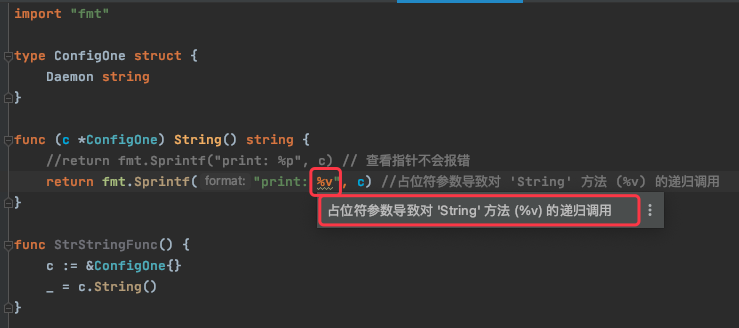

# 1. 18

## 1.1. 问题

### 1.1.1. 问题1

interface{} 是可以指向任意对象的 Any 类型，是否正确？
A. false
B. true

### 1.1.2. 问题2

下面的代码有什么问题？

```go
type ConfigOne struct {
    Daemon string
}

func (c *ConfigOne) String() string {
    return fmt.Sprintf("print: %v", c)
}

func main() {
    c := &ConfigOne{}
    c.String()
}
```

## 1.2. 答案

### 1.2.1. 答案1

B

### 1.2.2. 答案2

参考答案及解析：无限递归循环，栈溢出。知识点：类型的 String() 方法。

**如果类型定义了 String() 方法，使用 Printf()、Print() 、 Println() 、 Sprintf() 等格式化输出时会自动使用 String() 方法。**

