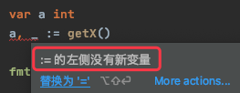

# 1. 23

## 1.1. 问题

### 1.1.1. 问题1

1.下面代码有什么问题，请说明？

```go
func main() {
    runtime.GOMAXPROCS(1)

    go func() {
        for i:=0;i<10 ;i++  {
            fmt.Println(i)
        }
    }()

    for {}
}
```


### 1.1.2. 问题2

2.假设 x 已声明，y 未声明，下面 4 行代码哪些是正确的。错误的请说明原因？

```go
x, _ := f()  // 1
x, _ = f()  // 2
x, y := f()  // 3
x, y = f()  // 4
```

## 1.2. 答案

### 1.2.1. 答案1

参考答案及解析：`for {}` 独占 CPU 资源导致其他 Goroutine 饿死。

可以通过阻塞的方式避免 CPU 占用，修复代码：

```go
func main() {
    runtime.GOMAXPROCS(1)

    go func() {
        for i:=0;i<10 ;i++  {
            fmt.Println(i)
        }
        os.Exit(0)
    }()

    select {}
}
```

引自《Go语言高级编程》

### 1.2.2. 答案2

参考答案及解析：2、3正确。知识点：简短变量声明。使用简短变量声明有几个需要注意的地方：

* 只能用于函数内部；
* 短变量声明语句中至少要声明一个新的变量；(`_` 表示忽略值，不是新变量)



