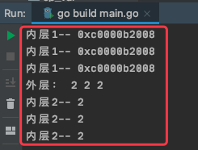

# 1. 28

## 1.1. 问题

### 1.1.1. 下面代码有什么问题吗？

```go
func main()  {

    for i:=0;i<10 ;i++  {
    loop:
        println(i)
    }
    goto loop
}
```

### 1.1.2. 下面代码输出什么，请说明。

```go
func main() {
    x := []int{0, 1, 2}
    y := [3]*int{}
    for i, v := range x {
        defer func() {
            println("A",v)
        }()
        y[i] = &v
    }
    println(*y[0], *y[1], *y[2])
}
```

## 1.2. 答案

### 1.2.1. 答案1

参考答案及解析：goto 不能跳转到其他函数或者内层代码。编译报错：goto loop jumps into block starting at

### 1.2.2. 答案2

参考答案及解析：

```
2 2 2
A 2
A 2
A 2
```

知识点：defer()、for-range。**for-range 虽然使用的是 :=，但是 v 不会重新声明，所以其内存地址也不会变**。

```go
func For3Test() {
	x := []int{0, 1, 2}
	y := [3]*int{}
	for i, v := range x {
		// 注意：可能发生资源泄漏，在 'for' 循环中调用了 'defer'
		defer func() {
			println("内层2--",v)
		}()

		// 注意：此处取的是 v 的指针
		y[i] = &v
		println("内层1--",y[i])
	}
	println("外层：",*y[0], *y[1], *y[2])
}
```

运行结果：




