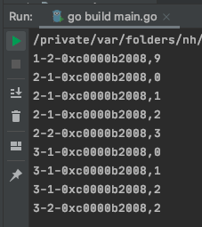

# 1. 34

## 1.1. 问题

### 1.1.1. 下面这段代码输出什么？

```go
func main() {
    var k = 1
    var s = []int{1, 2}
    k, s[k] = 0, 3
    fmt.Println(s[0] + s[1])
}
```

### 1.1.2. 下面代码输出什么？

```go
func main() {
    var k = 9
    for k = range []int{} {}
    fmt.Println(k)

    for k = 0; k < 3; k++ {
    }
    fmt.Println(k)


    for k = range (*[3]int)(nil) {
    }
    fmt.Println(k)
}
```

## 1.2. 答案

### 1.2.1. 答案1

参考答案及解析：4。

知识点：多重赋值。

多重赋值分为两个步骤，有先后顺序：

* 计算等号左边的索引表达式和取址表达式，
* 接着计算等号右边的表达式
* 赋值

所以本例，会先计算 s[k]，等号右边是两个表达式是常量，所以赋值运算等同于 k, s[1] = 0, 3。

### 1.2.2. 答案2

答案：932

根据下面示例，即可明白为什么输出的是 932

```go
func VarTest4() {
	var k = 9
	for k = range []int{} {
		fmt.Printf("1-1-%p,%d \n", &k, k)
	}
	fmt.Printf("1-2-%p,%d  \n", &k, k)

	for k = 0; k < 3; k++ {
		fmt.Printf("2-1-%p,%d  \n", &k, k)
	}
	fmt.Printf("2-2-%p,%d  \n", &k, k)

	for k = range (*[3]int)(nil) {
		fmt.Printf("3-1-%p,%d  \n", &k, k)
	}
	fmt.Printf("3-2-%p,%d  \n", &k, k)
}
```



在上述结果中，由于第一个 for 循环中的 `[]int{}` 切片为空，所以，不会执行其中的打印语句。