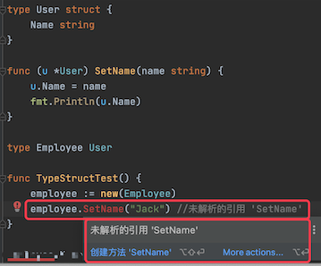

# 1. 4

## 1.1. 问题

### 1.1.1. 问题1

关于 main() 函数，下面说法正确的是？

A.不能带参数；
B.不能定义返回值；
C.所在的包必须为 main 包；
D.可以使用 flag 包来获取和解析命令行参数；

### 1.1.2. 问题2

下面代码能编译通过吗？请简要说明。

```go
type User struct {
    Name string
}

func (u *User) SetName(name string) {
    u.Name = name
    fmt.Println(u.Name)
}

type Employee User

func main() {
    employee := new(Employee)
    employee.SetName("Jack")
}
```


## 1.2. 答案

### 1.2.1. 答案1

参考答案及解析：ABCD。

### 1.2.2. 答案2

参考答案及解析：**编译不通过。当使用 type 声明一个新类型，它不会继承原有类型的方法集。**



如果需要给 emplyee 实例的 name 赋值，代码如下：

```go
employee.Name = "Jack1"
fmt.Println(employee.Name) // Jack1
```