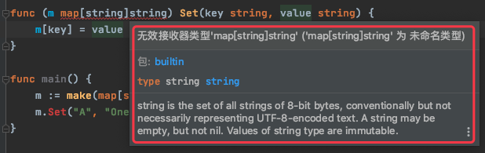

# 1. 6

## 1.1. 问题

### 1.1.1. 问题1

下面两段代码能否编译通过？请简要说明。

第一段：

```go
func f() {}
func f() {}
func main() {}
```

第二段：

```go
func init(){}
func init(){}
func main() {}
```

### 1.1.2. 问题2

下面代码有什么问题？请指出。

```go
func (m map[string]string) Set(key string, value string) {
    m[key] = value
}

func main() {
    m := make(map[string]string)
    m.Set("A", "One")
}
```


## 1.2. 答案

### 1.2.1. 答案1

第二段代码能通过编译。**除 init() 函数之外，一个包内不允许有其他同名函数**。

### 1.2.2. 答案2

Unnamed Type 不能作为方法的接收者，详细错误如下：



用 Named Type 来修复代码：

```go
type User map[string]string

func (m User) Set(key string, value string) {
    m[key] = value
}

func main() {
    m := make(User)
    m.Set("A", "One")
}
```


