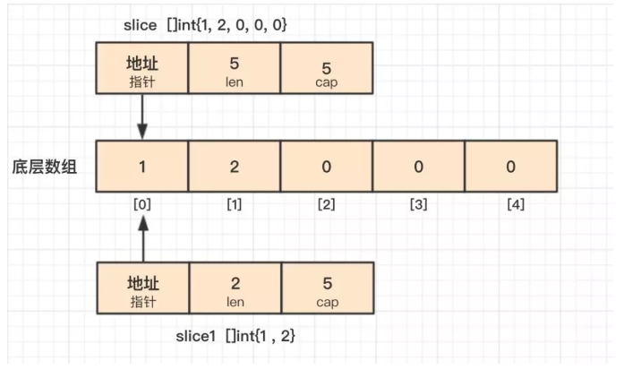
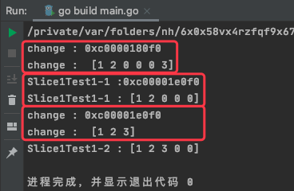

# 1. 64

## 1.1. 问题

### 1.1.1. 下面这段代码输出什么？

```go
func change(s ...int) {
    s = append(s,3)
}

func main() {
    slice := make([]int,5,5)
    slice[0] = 1
    slice[1] = 2
    change(slice...)
    fmt.Println(slice)
    change(slice[0:2]...)
    fmt.Println(slice)
}
```

### 1.1.2. 下面这段代码输出什么？

```go
func main() {
    var a = []int{1, 2, 3, 4, 5}
    var r [5]int

    for i, v := range a {
        if i == 0 {
            a[1] = 12
            a[2] = 13
        }
        r[i] = v
    }
    fmt.Println("r = ", r)
    fmt.Println("a = ", a)
}
```


## 1.2. 答案

### 1.2.1. 答案1

参考答案及解析：

```
[1 2 0 0 0]
[1 2 3 0 0]
```

知识点：可变函数、append()操作。

Go 提供的语法糖 `…`，可以将 slice 传进可变函数，不会创建新的切片。

第一次调用 change() 时，append() 操作使切片底层数组发生了扩容，原 slice 的底层数组不会改变；第二次调用change() 函数时，使用了操作符[i,j]获得一个新的切片，假定为 slice1，它的底层数组和原切片底层数组是重合的，不过 slice1 的长度、容量分别是 2、5，所以在 change() 函数中对 slice1 底层数组的修改会影响到原切片。



完整运行代码：

```go
package cp_slice

import "fmt"

func change(s ...int) {
	s = append(s, 3)
	fmt.Printf("change : %p \n", s)
	fmt.Println("change : ", s)
}

func Slice1Test1() {
	slice := make([]int, 5, 5)
	slice[0] = 1
	slice[1] = 2

	change(slice...)
	fmt.Printf("Slice1Test1-1 :%p \n", slice) 
	fmt.Println("Slice1Test1-1 :",slice)

	change(slice[0:2]...)
	fmt.Println("Slice1Test1-2 :",slice)
}
```



如上图可知，第一次 change 时 change() 中的 s 的地址值与 slice 的地址值不一样；但是第二次 change 时，通过切片拿到的地址值则是一致的。

### 1.2.2. 答案2

参考答案及解析：

```
r =  [1 12 13 4 5]
a =  [1 12 13 4 5]
```

此处 a 是一个切片，那切片是怎么实现的呢？切片在 go 的内部结构有一个指向底层数组的指针，**当 range 表达式发生复制时，副本的指针依旧指向原底层数组，所以对切片的修改都会反应到底层数组上，所以通过 v 可以获得修改后的数组元素**。


