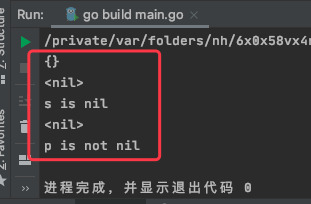

# 1. 69

## 1.1. 问题

### 1.1.1. 下面这段代码输出什么？

```go
const (
    a = iota
    b = iota
)
const (
    name = "name"
    c    = iota
    d    = iota
)
func main() {
    fmt.Println(a)
    fmt.Println(b)
    fmt.Println(c)
    fmt.Println(d)
}
```

### 1.1.2. 下面这段代码输出什么？为什么？

```go
type People interface {
    Show()
}

type Student struct{}

func (stu *Student) Show() {

}

func main() {

    var s *Student
    if s == nil {
        fmt.Println("s is nil")
    } else {
        fmt.Println("s is not nil")
    }
    
    var p People = s
    if p == nil {
        fmt.Println("p is nil")
    } else {
        fmt.Println("p is not nil")
    }
}
```

## 1.2. 答案

### 1.2.1. 答案1

参考答案及解析：0 1 1 2。

知识点：iota 的用法。

* iota 是 golang 语言的常量计数器，只能在常量的表达式中使用。
* ** iota 在 const 关键字出现时将被重置为0，const中每新增一行常量声明将使 iota 计数一次。**

推荐阅读：[https://studygolang.com/articles/2192](https://studygolang.com/articles/2192)

### 1.2.2. 答案2

参考答案及解析：s is nil 和 p is not nil。

这道题会不会有点诧异，我们分配给变量 p 的值明明是 nil，然而 p 却不是 nil。

记住一点，**当且仅当动态值和动态类型都为 nil 时，接口类型值才为 nil**。

上面的代码，给变量 p 赋值之后，p 的动态值是 nil，但是动态类型却是 `*Student`，是一个 nil 指针，所以相等条件不成立


```go
import "fmt"

type People interface {
	Show()
}

type Student struct{}

func (stu *Student) Show() {
}

func Struct1Test1() {
	var s1 Student
	fmt.Println(s1)

	var s *Student
	fmt.Println(s)

	if s == nil {
		fmt.Println("s is nil")
	} else {
		fmt.Println("s is not nil")
	}

	var p People = s
	fmt.Println(p)

	if p == nil {
		fmt.Println("p is nil")
	} else {
		fmt.Println("p is not nil")
	}
}
```

运行结果如下：

