[该系列笔记基于 B 站中的《使用Swift学习制作今日头条》整理](https://www.bilibili.com/video/BV1Ge411s7N7)

## 1.1 使用 storyboard 搭建框架

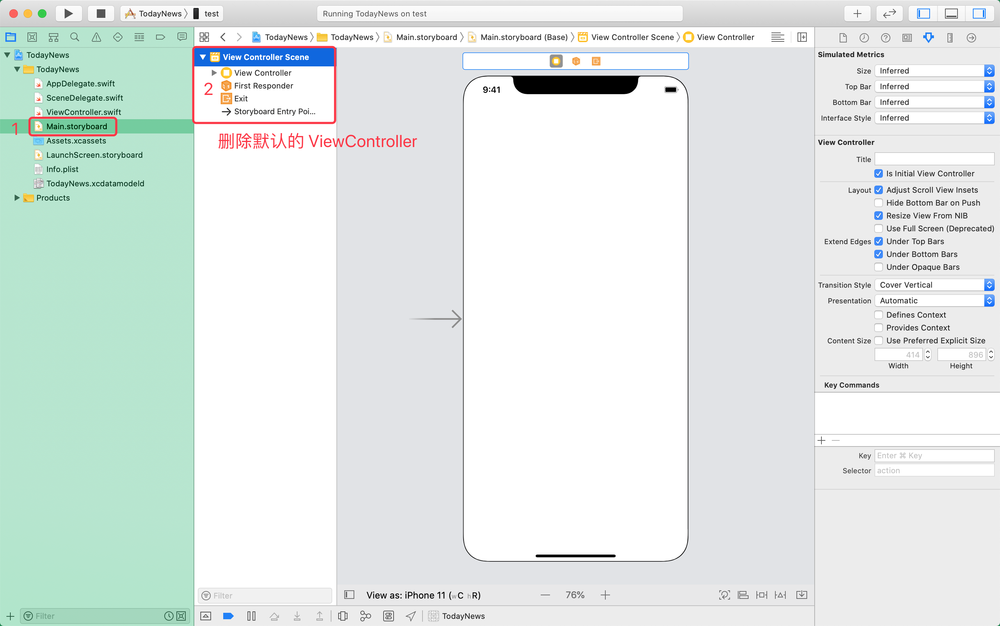

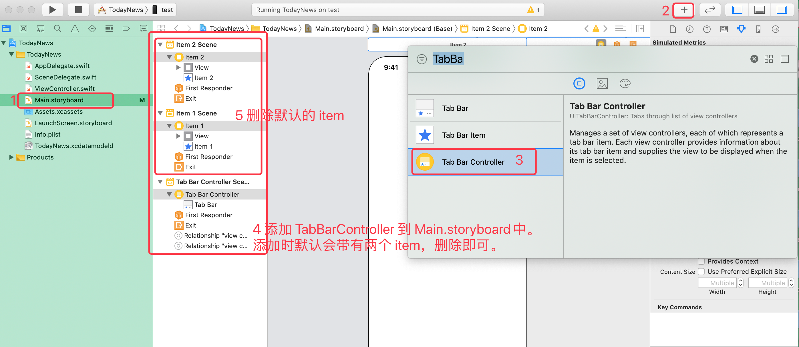

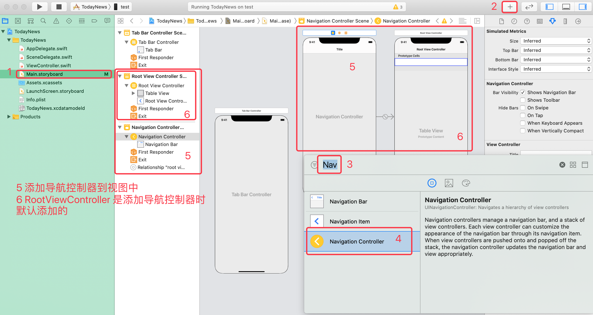

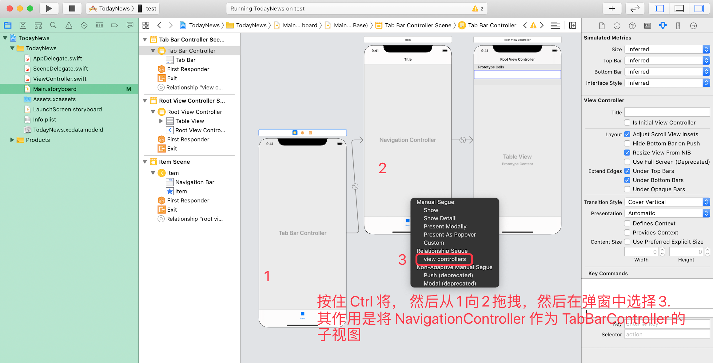

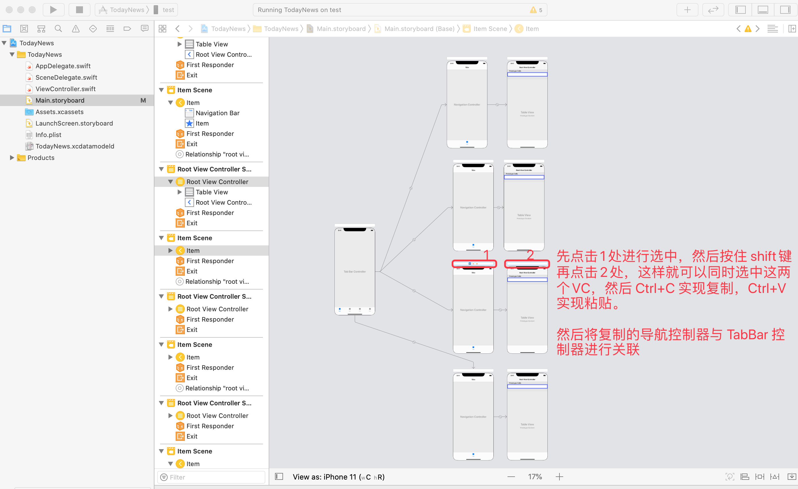

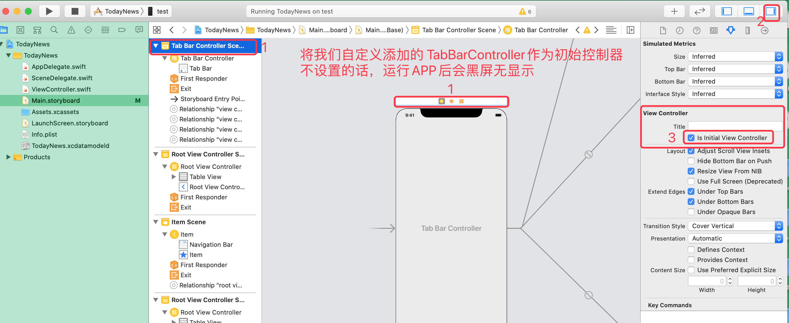

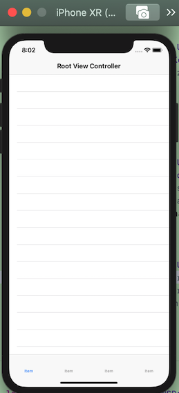

> storyboard 中，按住 `shift+option` ，然后拖动控件可以实现复制

## 1.2 使用纯代码搭建框架

### 1.2.1 删除默认主界面

使用纯代码搭建框架前，先删除默认的主页面：

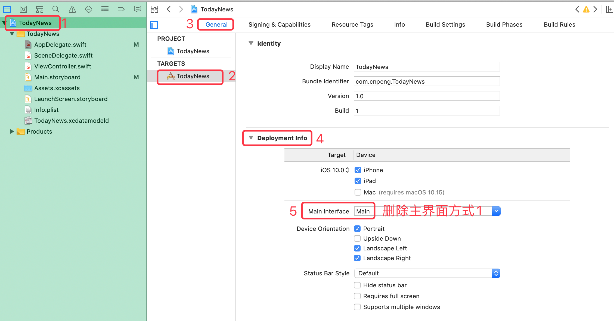

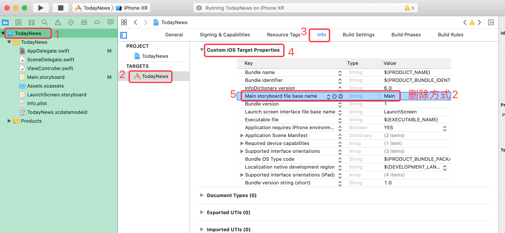

### 1.2.2 创建自定义的 Controller 类

然后创建自定义 TabBarController:

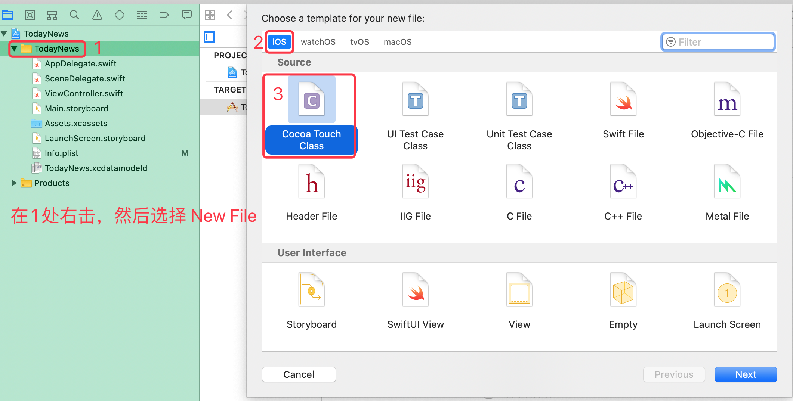

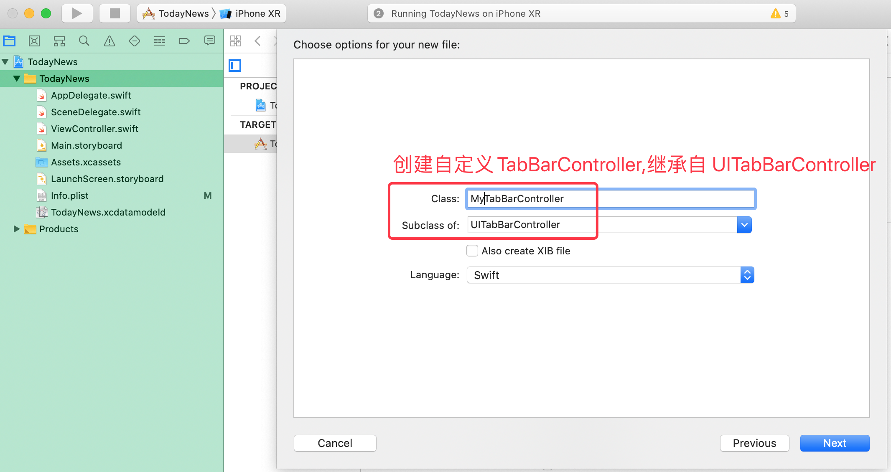

在创建自定义 NavigationController ：


然后再添加如下四个 ViewController

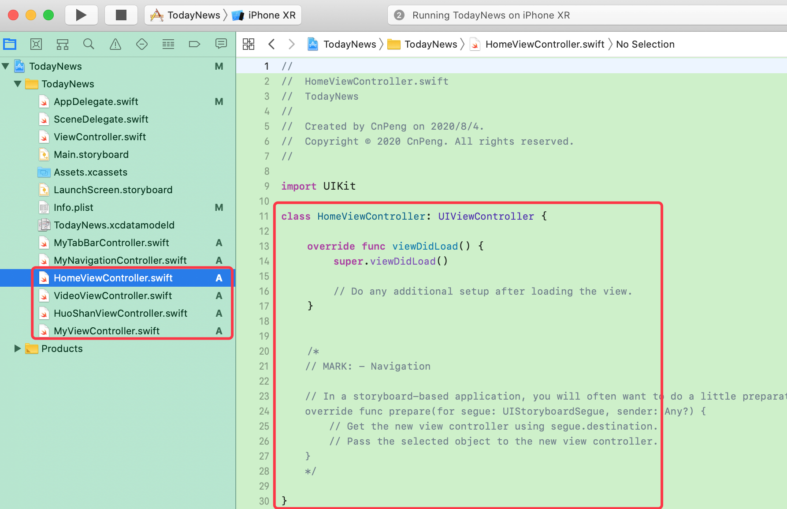

### 1.2.3 添加图片资源文件

项目源码和图片资源可以直接到 [百度网盘 ](https://pan.baidu.com/s/1a4FjAoF0Bpr20sZYt9Qi4A ) 下载，提取码：`D8s3`

其中的 `1-项目搭建资源文件.rar` 是搭建过程中所需要的资源内容；`TodayNews-master.rar` 是全部源码内容.

> 导入图片资源时可以直接下载全部源码，然后将其中的 `Assets.xcassets` 的内容整体复制到项目中。

[我的百度网盘转存地址](https://pan.baidu.com/disk/home?#/all?vmode=list&path=%2F01_%E7%BC%96%E7%A8%8B%E5%AD%A6%E4%B9%A0(%E8%A7%86%E9%A2%91)%2F08_IOS)

### 1.2.4 修改 `AppDelegate.swift`

修改 `AppDelegate.swift` 文件：构建一个 window 对象，并将其最底层的 ViewController 设置为我们自定义的 `MyTabBarController`

```swift

import UIKit
import CoreData

@UIApplicationMain
class AppDelegate: UIResponder, UIApplicationDelegate {
    
    var window: UIWindow?
    
    func application(_ application: UIApplication, didFinishLaunchingWithOptions launchOptions: [UIApplication.LaunchOptionsKey: Any]?) -> Bool {
        
        //构建一个与视窗同等大小的 window
        window=UIWindow(frame: UIScreen.main.bounds)
        //将我们自定义的 MyTabBarController 作为根视图的 Controller
        window?.rootViewController=MyTabBarController()
        //让window可见
        window?.makeKeyAndVisible()
        
        return true
    }
	/// 其他内容省略
}    
```

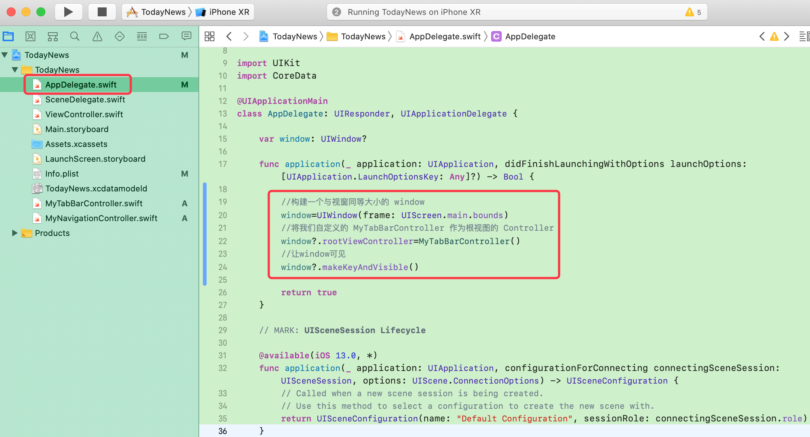

### 1.2.5 为 `MyTabBarController` 添加子视图

```swift

import UIKit

class MyTabBarController: UITabBarController {

    override func viewDidLoad() {
        super.viewDidLoad()

        addChildViewControllers()
    }
    
    func addChildViewControllers() {
        addChildViewController(childController: HomeViewController(), title: "首页", imageName: "home_tabbar_32x32_", selectedImageName: "home_tabbar_press_32x32_")
        addChildViewController(childController: VideoViewController(), title: "视频", imageName: "video_tabbar_32x32_", selectedImageName: "video_tabbar_press_32x32_")
        addChildViewController(childController: HuoShanViewController(), title: "小视频", imageName: "huoshan_tabbar_32x32_", selectedImageName: "huoshan_tabbar_press_32x32_")
        addChildViewController(childController: MyViewController(), title: "我的", imageName: "mine_tabbar_32x32_", selectedImageName: "mine_tabbar_press_32x32_")
    }
    
    ///添加单个子视图 VC
    func addChildViewController(childController:UIViewController,title:String,imageName:String,selectedImageName:String) {
        // 设置 tabbar
        childController.tabBarItem.image=UIImage(named: imageName)
        childController.tabBarItem.selectedImage=UIImage(named: selectedImageName)
        childController.title=title
        
        // 将 childController 作为 NavigationController 子视图
        let navVc=MyNavigationController(rootViewController: childController)
        
        // 将 NavigationController 作为 TabBarController 子视图
        addChild(navVc)
    }
}
```

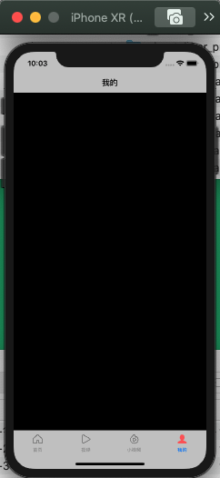

### 1.2.6 问题修改

#### 1.2.6.1 图标颜色异常的修改

在视频中，运行项目之后，TabBar 中选中后的图标颜色不是我们图标原始的红色，而是蓝色，此时，可以通过如下步骤修改

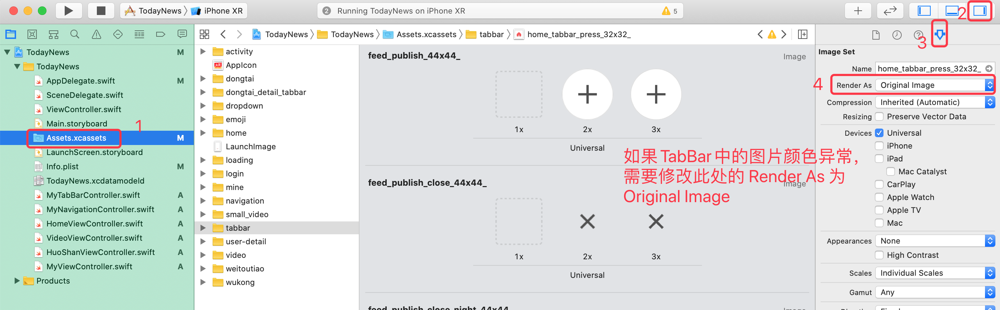

#### 1.2.6.2 TabBar 中字体颜色的修改

在 `MyTabBarController` 的 `viewDidLoad() ` 中添加如下代码：

```swift
// 修复 TabBar 中文本颜色不对的问题
let tabBarApperance=UITabBar.appearance()
tabBarApperance.tintColor=UIColor(red: 245/255.0, green: 90/255.0, blue: 93/255.0, alpha: 1.0)
```

完整代码如下:

```swift

import UIKit

class MyTabBarController: UITabBarController {

    override func viewDidLoad() {
        super.viewDidLoad()
        // 修复 TabBar 中文本颜色不对的问题
        let tabBarApperance=UITabBar.appearance()
        tabBarApperance.tintColor=UIColor(red: 245/255.0, green: 90/255.0, blue: 93/255.0, alpha: 1.0)
        
        // 添加子视图的 VC
        addChildViewControllers()
    }
    
    func addChildViewControllers() {
        addChildViewController(childController: HomeViewController(), title: "首页", imageName: "home_tabbar_32x32_", selectedImageName: "home_tabbar_press_32x32_")
        addChildViewController(childController: VideoViewController(), title: "视频", imageName: "video_tabbar_32x32_", selectedImageName: "video_tabbar_press_32x32_")
        addChildViewController(childController: HuoShanViewController(), title: "小视频", imageName: "huoshan_tabbar_32x32_", selectedImageName: "huoshan_tabbar_press_32x32_")
        addChildViewController(childController: MyViewController(), title: "我的", imageName: "mine_tabbar_32x32_", selectedImageName: "mine_tabbar_press_32x32_")
    }
    
    ///添加单个子视图 VC
    func addChildViewController(childController:UIViewController,title:String,imageName:String,selectedImageName:String) {
        // 设置 tabbar
        childController.tabBarItem.image=UIImage(named: imageName)
        childController.tabBarItem.selectedImage=UIImage(named: selectedImageName)
        childController.title=title
        
        // 将 childController 作为 NavigationController 子视图
        let navVc=MyNavigationController(rootViewController: childController)
        
        // 将 NavigationController 作为 TabBarController 子视图
        addChild(navVc)
    }
}
```

运行效果如下：

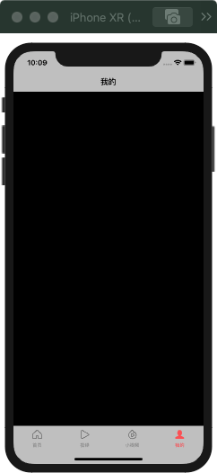