# 1. 注册开发者账号

> 编辑日期：2022-06-06

> 提交 App 到应用市场时，使用正式版 Xcode ，不建议使用 beta 版，否则，不确定会出什么问题。

## 1.1. 账号分类

iOS 的开发者账号分为两大类：[Apple Developer Program](https://developer.apple.com/cn/programs/)  和 [Apple Developer Enterprise Program](https://developer.apple.com/cn/programs/enterprise/) 。

### 1.1.1. Apple Developer Program

 [Apple Developer Program](https://developer.apple.com/cn/programs/) 将开发出来的 App 放在 在 AppStore 面向公众分发，也可以在 TestFlight 进行 Beta 测试。 
 
Apple Developer Program 又分为 `个人账号` 和 `组织账号`。

类别 | 申请场景 | 费用 | 备注
---|---|---|---
个人账号 | 个人或独资企业/一人公司可以申请个人账号 | 688元/年 | 折合99美元/年
组织账号 | 非营利组织、合资企业、合伙企业或政府组织可以申请组织账号 | 688元/年 | 折合99美元/年； 非营利、教育或政府组织，可以选择[申请豁免会费](https://developer.apple.com/cn/support/membership-fee-waiver/)。

通常情况下，我们的 App 更多的是在 App Store 面向公众分发的，因此会根据情况申请上述两个子类中的一种。

### 1.1.2. Apple Developer Enterprise Program

[Apple Developer Enterprise Program](https://developer.apple.com/cn/programs/enterprise/) 仅将开发出来的 App 向企业内部员工分发，不对外公开，也不可以在 TestFlight 进行 Beta 测试。

费用为 299美元/年。

> 实际在公司中进行开发时，我们通常都是申请 Apple Developer Program 中的 `组织账号`，后续内容以此为例。

## 1.2. 组织账号注册

### 1.2.1. 申请 AppleID

> 可以在 iPhone 端申请，也可以从 Mac 电脑端申请。此处以 Mac 电脑端为例。

注册为开发者之前需要先有 AppleID，[点击申请 AppleID](http://developer.apple.com/programs/register)

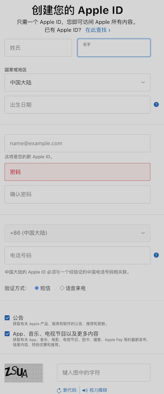

### 1.2.2. 开启双重认证

[官方参考文档](https://support.apple.com/zh-cn/HT204915)

>以 iPhone 手机端为例，型号 iPhoneX，系统版本 15.2 。

#### 1.2.2.1. 清理手机已有账号信息

为了保证后续注册过程的顺畅，我们需要先清理手机中的已有账号信息。

* 前往 `设置` > `[你的姓名]` > `退出登录`
* 打开 `App Store`，然后选择 `App` 页签，点击右侧头像，选择新页面底部的 `退出登录`
* 检查手机是否已经安装 `Developer` 应用，如果有，卸载该 App
* 重启手机
* 前往 `设置` > `登录 iPhone`，使用新申请的 AppleID 进行登录
* 打开 `App Store`，使用新申请的 AppleID 进行登录
* 打开 `App Store`，重新下载 `Developer` 应用
* 打开 `Developer` ，使用新申请的 AppleID 进行登录

>之所以执行这里的清理操作，是为了避免出现奇奇怪怪的问题。我一开始未清理，直接注册时碰到的问题是：在付款的前一步一直提示 AppleID 有问题，如下图：
>
>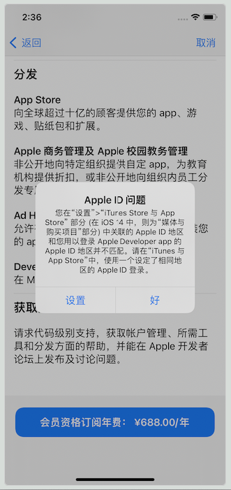
>
>此外，在执行后续的注册操作时，会使用到  `Developer` 应用，在手机端和电脑端都可以通过 AppStore 安装该应用。但在电脑端安装时要求 MacOS 不能低于 12.0。

#### 1.2.2.2. 获取邓白氏码

Apple 官方介绍：[邓白氏码](https://developer.apple.com/cn/support/D-U-N-S/)

`D-U-N-S Number`，全称：Data Universal Numbering System。它是一个独一无二的 9 位数字全球编码系统，对于企业而言就像是一种身份识别码（类似个人身份证）。邓白氏编码被广泛应用于企业识别、商业信息的组织及整理，在与国外企业交流或注册国外相关账号时会使用到该编码。

在注册 Apple 开发者账号时，需要填写该编码信息。

##### 1.2.2.2.1. 查找是否已有邓白氏码

点击 [检查自己所在组织是否已拥有 D-U-N-S 编号](https://developer.apple.com/enroll/duns-lookup/#!/search)；

* 填写信息时，名称、地址都需要使用英文；名字和姓氏使用拼音。
* 在填写检查信息时 `法人实体` 一项需要填写公司全名（需要**将中文名称翻译为英文**）
* 填写信息过程中要求的工作邮箱是用来接收邓白氏码的
* 如果查找成功，会将信息列出来，选择正确的结果即可将邓白氏码发送到前面填写的邮箱中

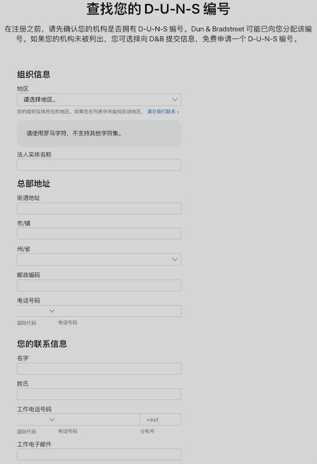

##### 1.2.2.2.2. 申请邓白氏码

如果前一步已经查找到对应的邓白氏码，不需要再申请了。

如果查找失败，先确认填写的查找信息是否有误。 如果确实没有查找到，则需要 [向 D&B 发出申请](https://support.dnb.com/?CUST=APPLEDEV)，大约需要 5 个工作日。

如果上面的链接无法申请，还可以[点击此处进入 apple 帮助中心](https://developer.apple.com/contact/topic/select)，然后选择 `会员资格和账户`>`D-U-N-S编号`，如下：

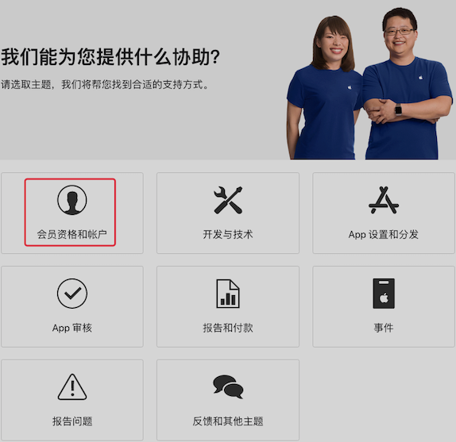

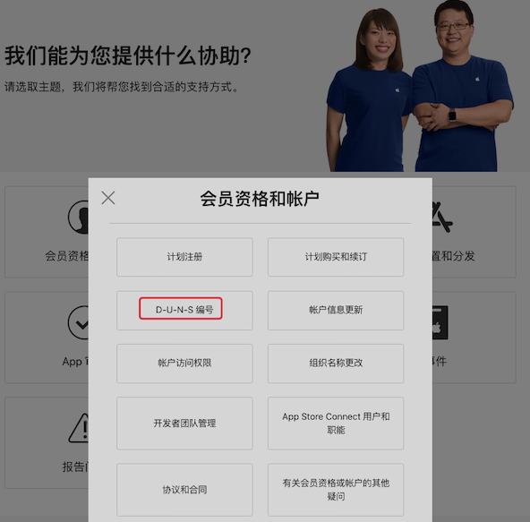

然后在弹出的页面中选择合适的联系方式告知 apple 我们需要申请邓白氏码：  

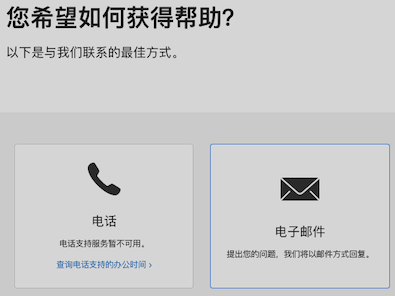

后续按照沟通内容如实提交相关申请信息即可。

#### 1.2.2.3. 开启双重认证

* 前往 `设置` > `[你的姓名]` > `密码与安全性`
* 轻点 `开启双重认证`>`继续`

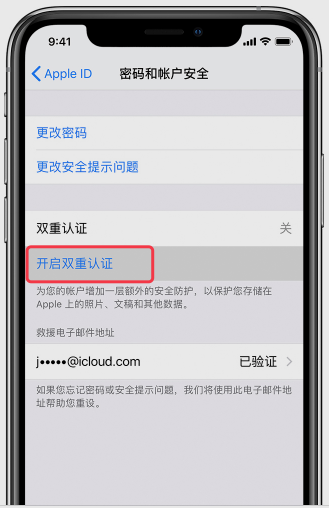

* 然后填写一个用来在登录时接收验证码的电话号码。（您可以选择是通过短信还是自动语音来电接收验证码。）
* 然后点击 `下一步`。
* 输入验证码以验证您的电话号码，然后打开双重认证。

>系统可能会要求我们回答 Apple ID 安全提示问题

### 1.2.3. 注册开发者

* 点击进入[开发者注册中心](https://developer.apple.com/cn/programs/)
* 点击页面右上角的 `注册` 按钮，如下图：

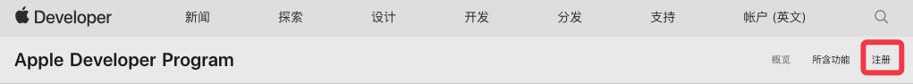

* 点击页面底部的 `开始注册`，如下图：

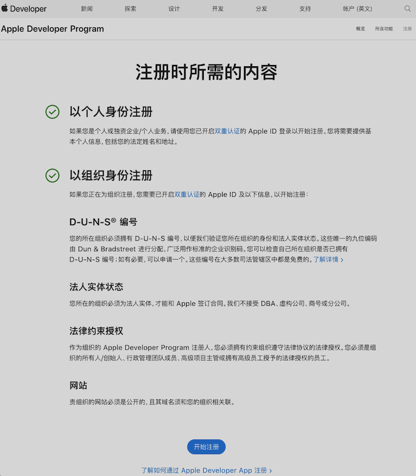

* 在 iPhone 手机端打开 `Developer` 应用，并选择 `账户` 选项卡
* 点击 `账户` 页面中的 `立即注册` 条目
* 在新页面中按照提示填写相关信息
    * 注意：相关信息需要填写英文，不能使用汉字
    * 此处填写的邮箱和电话需要真实可用，后续需要用来接口注册结果及相关反馈
    * 填写邓白氏码以及地址信息时，必须使用总公司的，不支持分公司
        * 分公司不属于完整的法人实体，只有完整的法人实体才可以申请组织账号
    * 公司网站需要填写完整
        * 尤其是全域名解析的网站要格外注意
        * 如果总公司没有网站，但分公司有，也可以使用分公司网站

> 补充：全域名解析和泛域名解析：
>
> * 在浏览器中直接输入 baidu.com ，不需要加 www 或其他前缀就能直接解析并进入，这种形式称为`泛域名解析`
> * 在浏览器中完整输入 www.baidu.com 才能正常打开网站，不加 www 或其他前缀无法解析并进入，这种称为 `全域名解析`
>
> 域名解析方式在购买域名时自主选择，支持泛域名解析的域名价格更高。

### 1.2.4. 资料审核和确认

上一步的相关信息提交成功之后，苹果官方会将审核结果反馈到上一步填写的邮箱中。

* 如果提交的注册资料有问题，会在邮件中说明，按照邮件中的提示修改后重新提交即可。

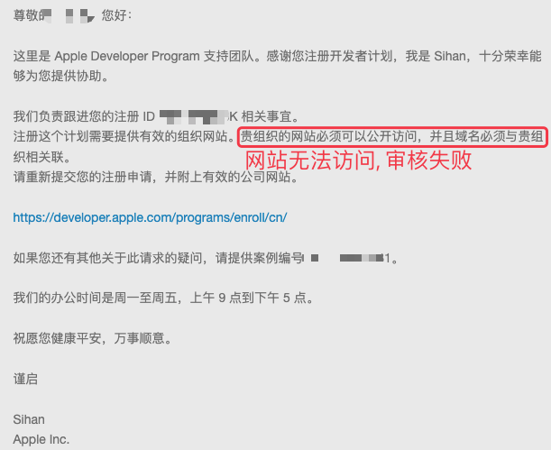

* 如果提交的资料没有问题，并且审核通过，会要求你与 apple 方电话联系，以确认注册信息。

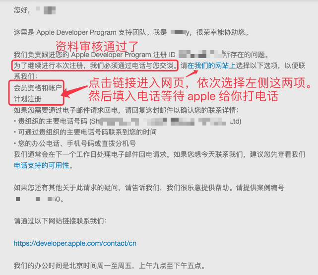

* 电话联系完成以后，会收到注册申请通过的邮件，如下：

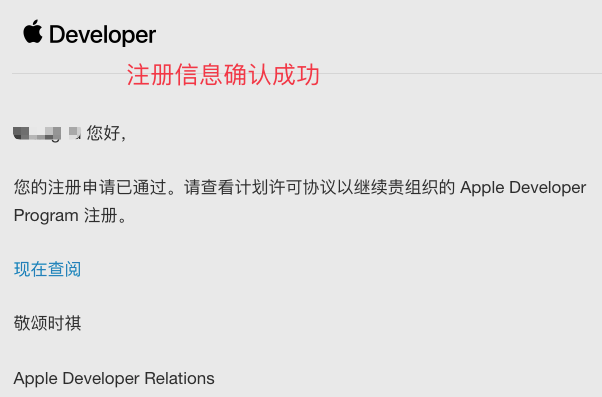

### 1.2.5. 付费

>在上一步注册申请已经通过的反馈邮件中，有一个 `现在查阅` 的超链接，点击该链接之后，还是会打开 `Developer` 应用，只有在该应用中才能继续完成后续操作。

* 在 iPhone 手机端打开 `Developer` 应用
* 选择 `账户` 选项卡
* 点击 `继续注册` 条目
* 按照要求填写并提交相关信息
* 最后付费即可

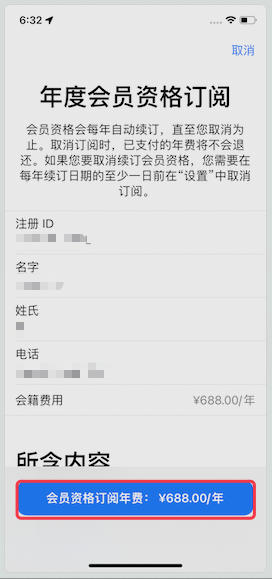

## 1.3. 其他相关

### 1.3.1. 法人实体

只有总公司才算有效的法人实体，才能注册企业（组织）账号。

商号或分公司不属于完全法人实体，即便它们也有各自的工商营业执照。

### 1.3.2. 企业网站

企业网站必须是可以公开访问的，且网站域名的所有者必须是该企业。

> 特殊情况：如果总公司没有网站，使用分公司的网站也可以。——邓白氏码使用总公司的。

### 1.3.3. 更新邓白氏码

注意：如果现有的企业信息和邓白氏码系统中的信息不一致，在提交申请注册信息时就会提示 `档案信息与D&B中的信息不一致`

此时，我们就到 [https://developer.apple.com/enroll/duns-update](https://developer.apple.com/enroll/duns-update) 页面提交联系人、邮箱、电话信息，然后就会收到如下反馈。

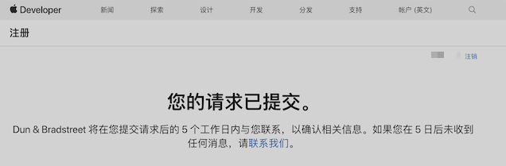

后续根据 `D&B` 的联系情况更新相关信息即可。

### 1.3.4. 自动订阅（续费）

根据 [续订您的年度会员资格订阅](https://developer.apple.com/cn/support/app-account/) 中的说明，通过 `Developer` 应用完成注册的，会员资格到期后会自动续期。

如果不想自动续期，可以根据 [取消 Apple 提供的订阅](https://support.apple.com/zh-cn/HT202039) 中的说明进行操作。

### 1.3.5. 转让管理员

在某些特殊情况下， 可以按照 [转让管理员（帐户持有人职能转让）](https://developer.apple.com/cn/support/account-holder-transfer/) 中的说明对管理员身份进行转让。

### 1.3.6. 开发者账号分类

Apple 官方关于[账号分类以及注册过程](https://developer.apple.com/cn/support/app-account/) 的说明

### 1.3.7. 开发者帮助中心

* [开发者帮助中心](https://help.apple.com/developer-account/#/dev2b5e6d209)

### 1.3.8. 关于发票

通过 App 申请的开发者账号不能够开具发票，仅能提供收款收据和无法开具发票的说明。

如果必须发票进行报销，则需要从官网联系客服获取网址，网站申请的账号可以开具发票，样式如下：

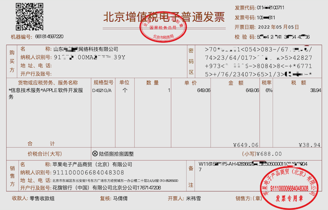