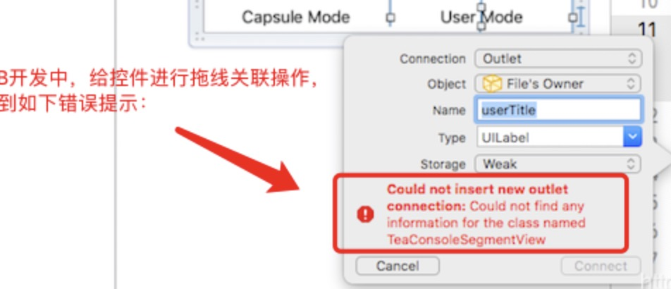

[iOS开发：用XIB拖控件关联时报错：“Could not insert new outlet connection…”解决方法](https://www.jianshu.com/p/be00d167705a)

## 1.解决步骤

1、退出Xcode

2、然后鼠标放在”Finder”图标上面右键单击，会出现一个菜单栏，然后在菜单栏里面选择“前往文件夹”（Go To Folder）选项，或者使用Mac电脑的快捷键“Shift+Command+G”打开。

3、会打开一个前往文件的路径输入弹框，这里可以输入想要进入文件的链接，直接进入对应的文件，这里输入”~/Library/Developer/XCode/DerivedData”，然后进入对应的文件目录中。

4、根据文件路径进入对应目录下之后，找到报错项目的名称的那个文件夹，这个文件夹的命名规则是按照“项目名称-英文字母随机排布”的形式，然后确认无误之后直接点击删除该文件夹即可。

## 2.相关参考：

[iOS xib报错 "could not insert new action connection"的解决办法](https://www.jianshu.com/p/6796513e7cd3) 完整内容如下：

我们在使用xib编辑页面的时候，通过 Ctrl+拖拽 的方式拖住控件常会遇到以下错误：`Could not insert new outlet connection: Could not find any information for the class named "xxx"`

以下列出几种解决方案供大家参考：

第一种：新建类时有没有把对应的类添加到对应的“target”中。
步骤：选中目标类，在xcode右侧的“File inspector”界面的“Target Membership”中确认对应的“target”选中没有，没有选中的话就勾选上，这是最简单的情况

第二种：重新将文件加入项目中试一下
步骤：选中目标文件的.h和.m文件，点击 delete，选择“Remove Reference”，这样只会删除引用不会真正的删除目标文件。接着点击“File”点击 “Add Files to ...”，在文件选择界面选择刚才的.m文件和.h文件将他们重新加入项目中。然后重新编译，重新操作一遍。

第三种：直接删除DeriveData
步骤：退出Xcode，然后通过终端或者是Finder找到进入下面的目录：`~/Library/Developer/XCode/DerivedData` 在里面找到以你的项目开头的文件，将他们删除，然后重新启动Xcode。

