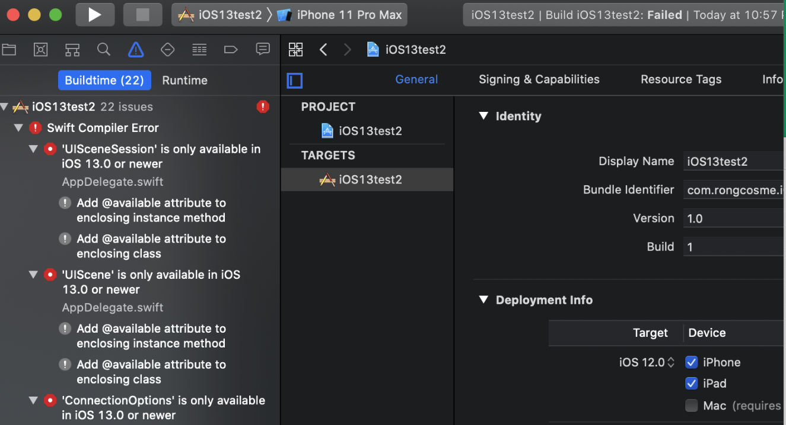
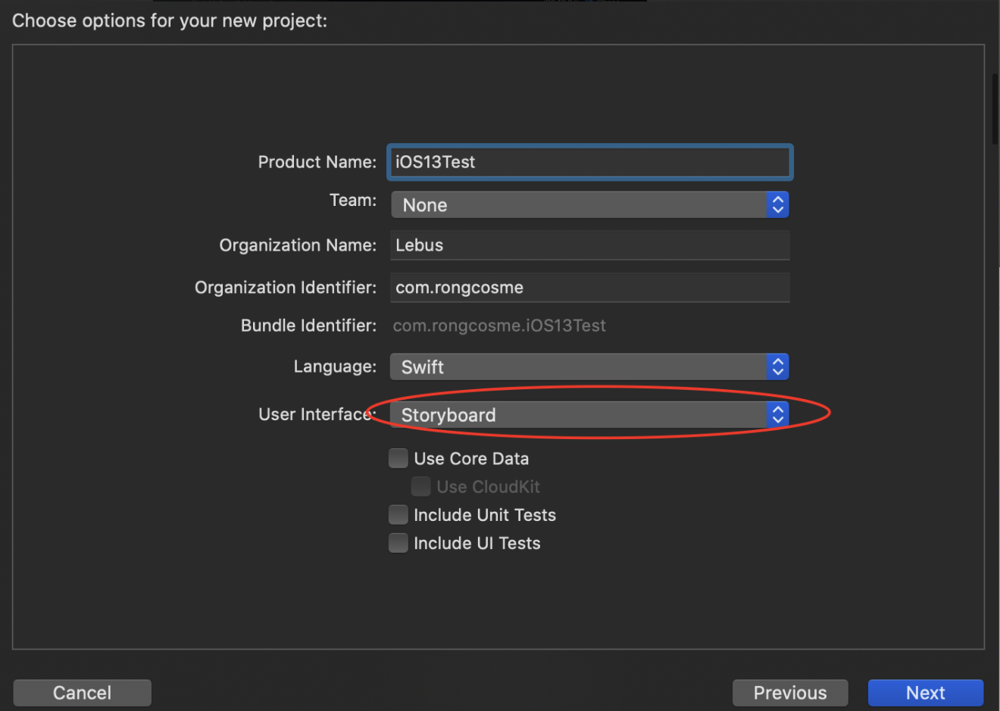
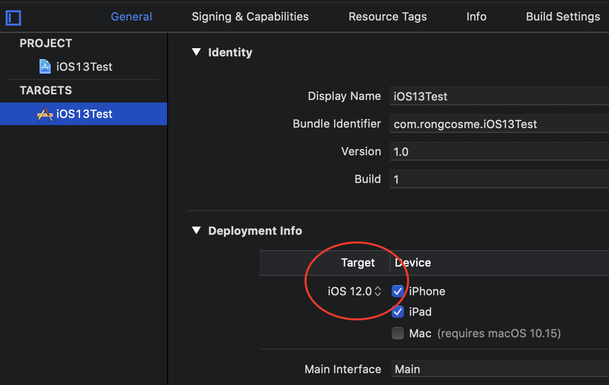
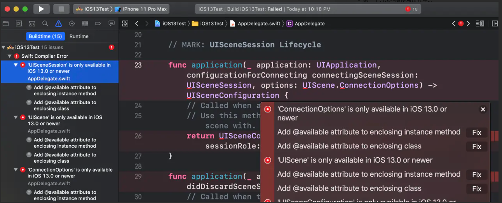
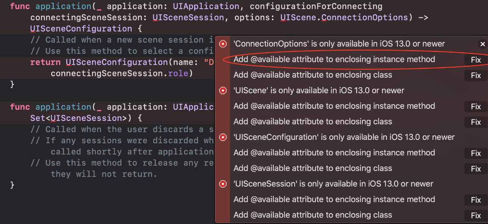
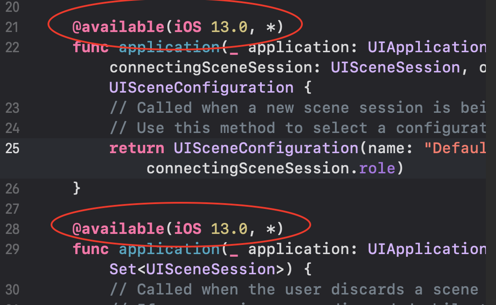
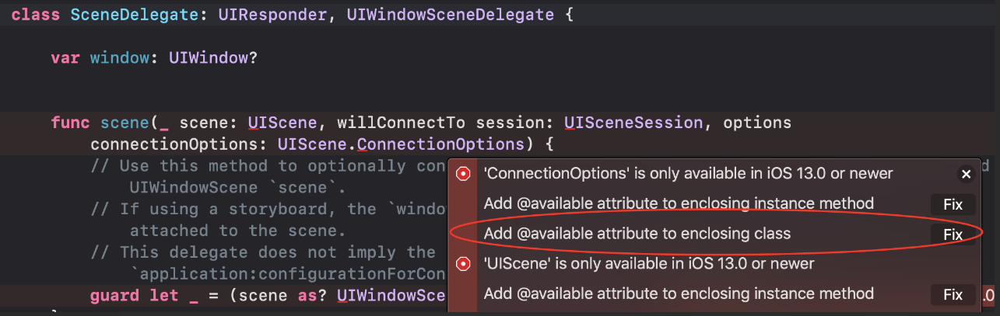
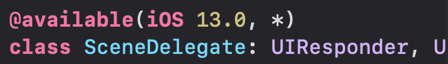
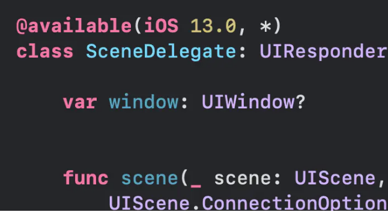

原文[《在Xcode11上开发“面向低于iOS13版本的App”时的一些注意点，提示'UIScene' is only available in iOS 13.0...》](https://juejin.im/post/6844903953071767566)

比如公司现在新开一个项目，使用此 App 的最低版本要求是 iOS12。
（也就是说这个App上架后，只有 iPhone 的 iOS 版本是 12 以上的用户才能在 App Store 里面看到并下载）
这个时候如果我们使用的是最新版 Xcode11 并且只按默认配置开发的话，会出现以下错误：

```swift
'ConnectionOptions' is only available in iOS 13.0 or newer
'UIScene' is only available in iOS 13.0 or newer
'UISceneConfiguration' is only available in iOS 13.0 or newer
'UISceneSession' is only available in iOS 13.0 or newer 
'UIWindowScene' is only available in iOS 13.0 or newer
 ...
``` 



需要做一些小小的改动：
1.新建项目时，在User Interface这里选择Storyboard



说明：
Xcode11默认使用SwiftUI来做App的界面，但SwiftUI这个功能的最低要求版本是iOS13。
目前SwiftUI还有很多地方不太完善，个人建议如果是商业项目的话，还是选择Storyboard。因为他目前仍旧是苹果性价比比较高的一种快速开发界面的方法（较成熟+上手快）。

2.项目target这里的Deployment Target选择App要求的最低版本，比如上文提到的iOS12



说明：
这个相信大家应该轻车熟路了：App要求的最低版本是多少，这里就选多少，不再赘述。
本以为这样就差不多了吧。
Surprise！编译之后错误依旧



罪魁祸首其实就是这两个文件：AppDelegate.swift和SceneDelegate.swift。

好，继续。
3.从左边的错误点进去或者直接点目录进入AppDelegate.swift文件，拉到最后的两个方法那里：
第一个方法--随便点击其中一个错误的红圈白点
选择Add @available attribute to enclosing instance method，点Fix



第二个方法同理。
说明：
--从错误的字面意义上就可以得知，无非就是一些类型只能在iOS13上使用，我们现在要在低版本的iOS上使用，他自然不干。
--Add @available attribute to enclosing instance method的意思是：在class的某个方法前面加上@available(iOS 13.0, *)，表明只有版本大于等于iOS13的时候才加载这个方法。



--因为AppDelegate.swift里的didFinishLaunchingWithOptions方法是无论什么版本的iOS都需要用的，所以我们在Fix的时候不能选择Add @available attribute to enclosing class（在整个class前面加上@available(iOS 13.0, *)）

4.从左边的错误点进去或者直接点目录进入SceneDelegate.swift文件，选择任意一个红圈白点，点击Add @available attribute to enclosing class的Fix




说明：
SceneDelegate.swift文件是iOS13新登场的，所以给整个class加上@available(iOS 13.0, *)是OK的：




好
选择低于iOS13版本的模拟器或者真机运行之后，还是不行：
黑屏
并且控制台会出现:

`The app delegate must implement the window property if it wants to use a main storyboard file`

原因：

在iOS13中，AppDelegate把iOS13之前的那些管理整个App生命周期等的任务都委托给了SceneDelegate，所以原来AppDelegate的window属性自然也就跑到SceneDelegate里面去了：

而这个SceneDelegateclass又被我们标注了只能iOS13可以用，也就是说iOS13以下版本的iPhone是不会执行整个SceneDelegateclass的代码的，所以在低版本中系统就找不到window属性。


解决方案：

在 AppDelegate 的 class 里面声明 window 属性：



其实很容易理解，窗口没了，我们自然看不到外面的风景了，取而代之的就是黑屏
这样之后：
iOS13以下版本的时候，window就走AppDelegate这里，不会黑屏；
iOS13或以上版本的时候，window就走SceneDelegate（被委托人）这里，不会黑屏；
 