[原文：《轻松搞定Charles的HTTPS抓包（iOS13可用）》](https://blog.csdn.net/y277an/article/details/103573163)

抓包工具在APP开发过程中使用非常频繁，对开发者理解网络传输原理以及分析定位网络方面的问题非常有帮助。

笔者一直比较喜欢Wireshark，但由于最近的项目是短连接项目，Wireshark太过重量。所以笔者选择Charles进行App的抓包，配置也更加简单。

## 14.1 HTTP抓包配置

1.1 查看当前wifi的IP地址

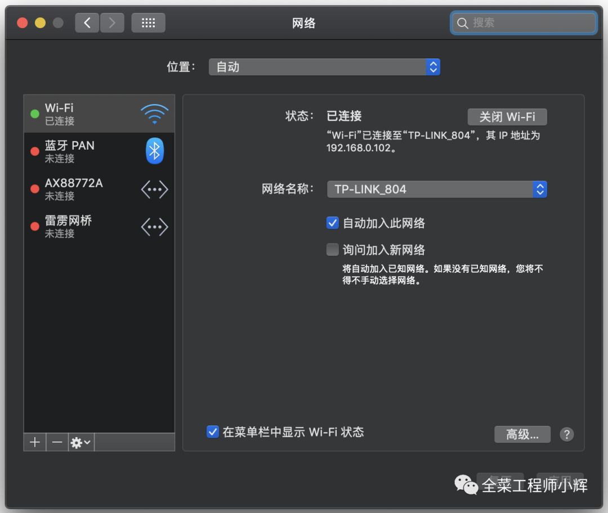

1.2 设置手机HTTP代理

iOS手机，连接与电脑同一个WiFi。然后点击“设置->无线局域网->连接的WiFi”，设置HTTP代理。

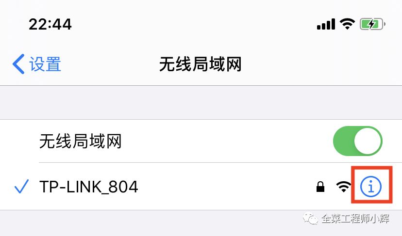

进入wifi的配置设置。

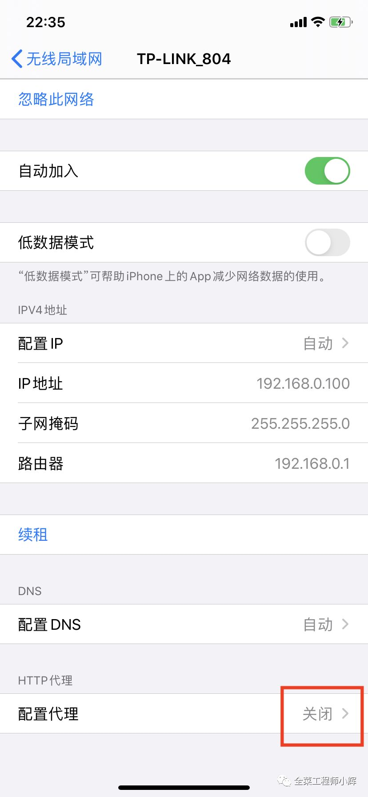

增加代理信息并保存。

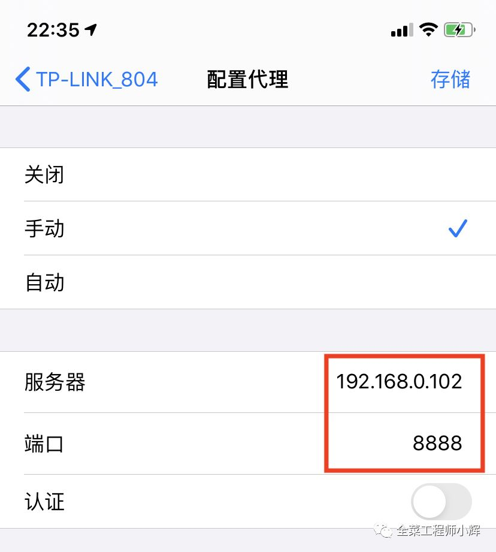

服务器为电脑IP地址：如 `192.168.0.102` 端口：8888

>端口默认为8888，设置的IP要与电脑的IP一样

>配置代理之后，电脑必须打开Charles才能上网。所以抓包结束后，要将配置代理关闭。

1.3 电脑上打开Charles进行HTTP抓包

打开Charles。

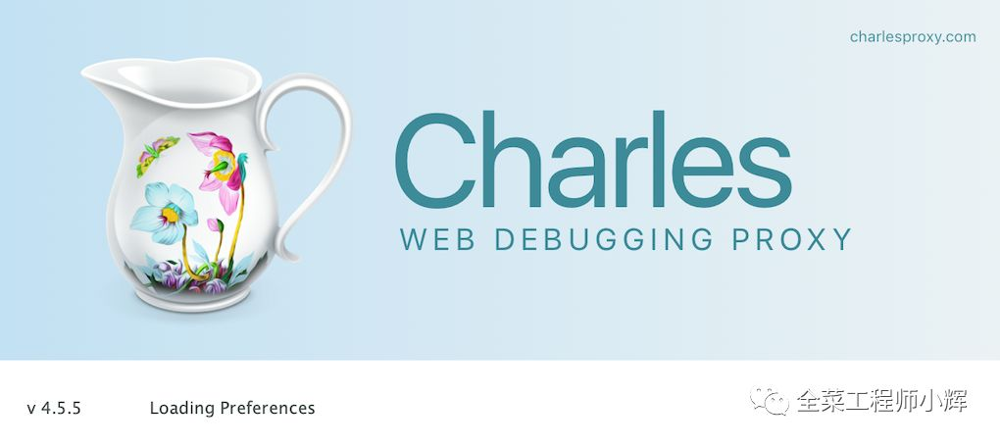

手机配置成功后会弹出提示，点击“Allow”即可。

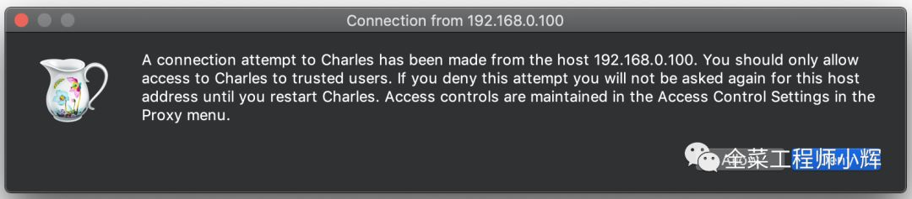

此时，HTTP的网络包已经可以查看，但是HTTPS的依旧不可以。

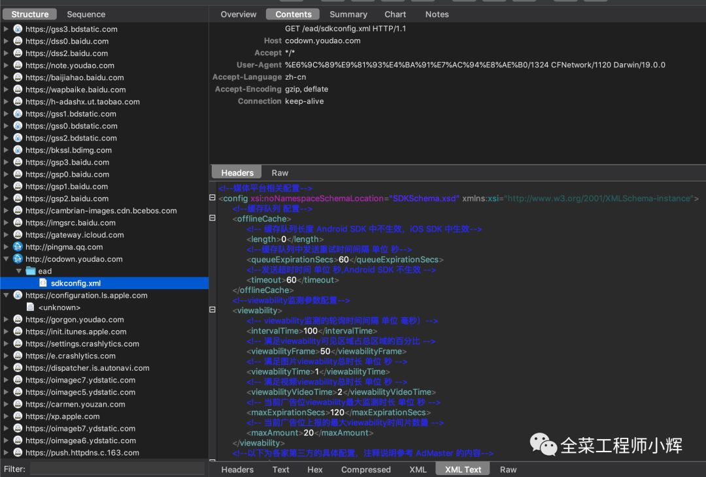

## 14.2 HTTPS抓包配置

想要HTTPS抓包，首先要按照顺序完成上面的HTTP的配置。

2.1 手机配置加密证书

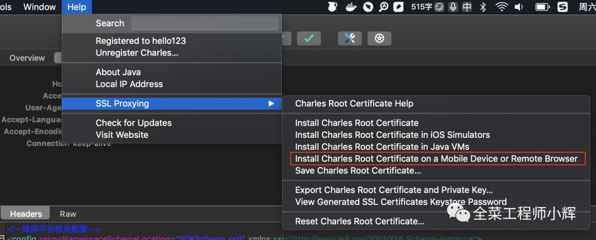

点击上面选项后，Charles会弹出提示。

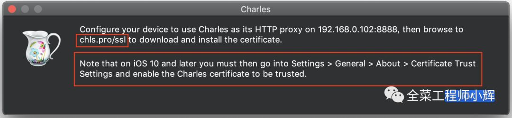

在手机Safari浏览器输入地址 "chls.pro/ssl"，出现证书安装页面，点击安装

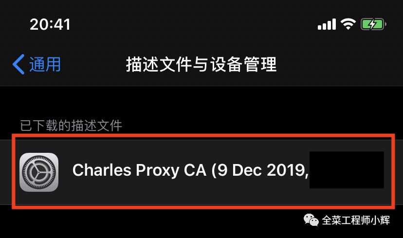

点击安装。

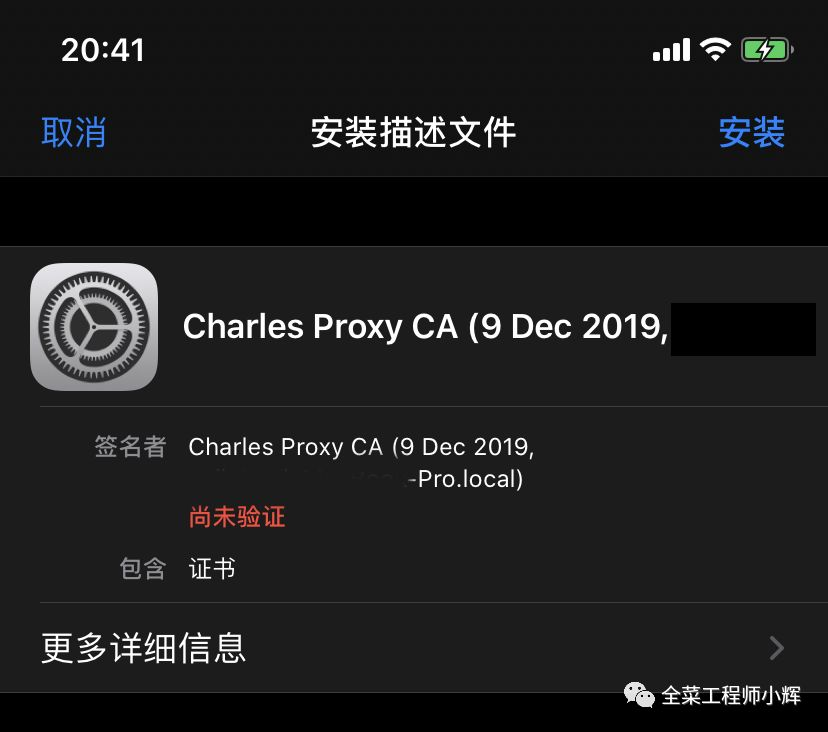

对于iOS10之后的系统版本，需要进行下面的操作——对根证书进行信任操作。

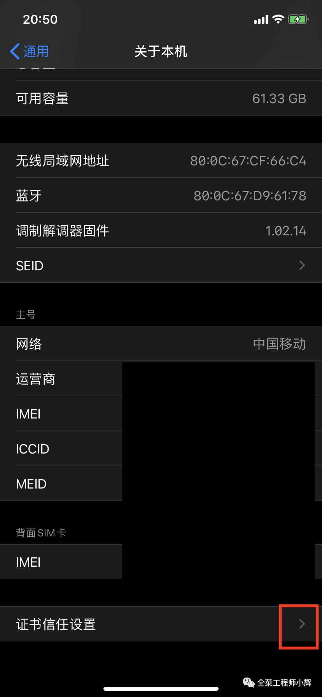

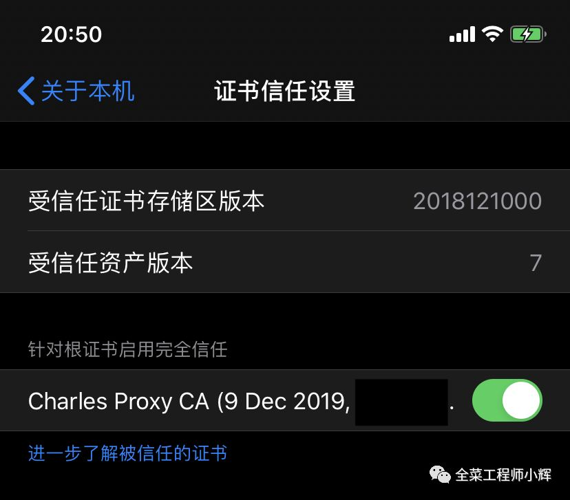

2.2 Charles配置加密

开启“SSL Proxying”

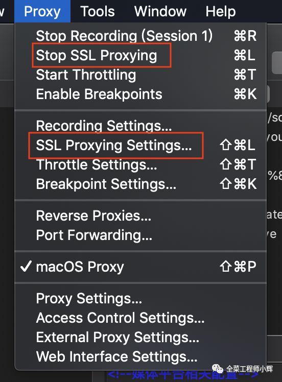

点击“SSL Proxying Setting”，增加SSL拦截规则，像笔者比较懒，就如图将所有443端口的请求都进行了拦截。

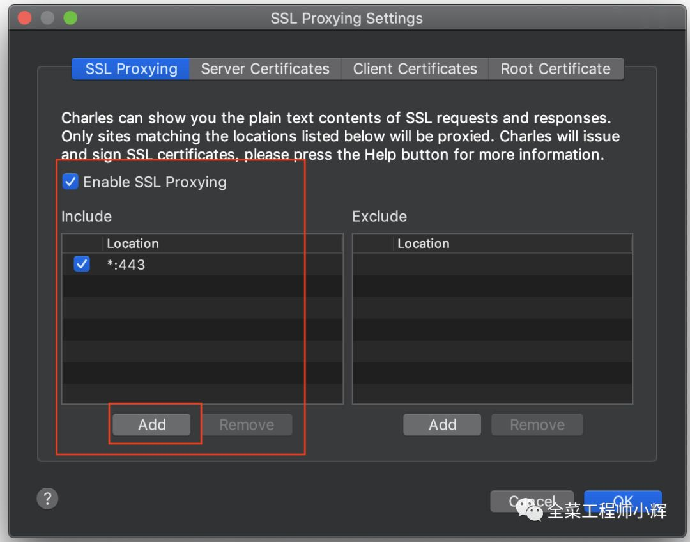

不需要重启Charles，此时开始，所有的HTTPS的请求也是可见的了。

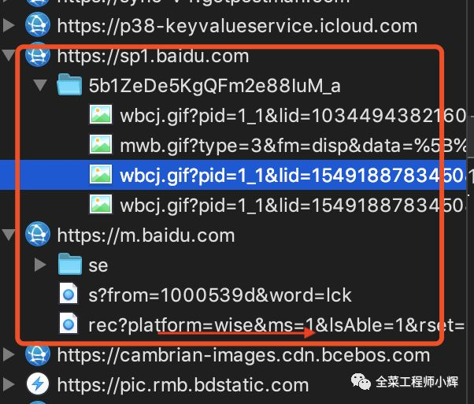

## 14.3 注意

抓包结束后一定要关闭wifi的代理配置，否则Charles关闭后，手机将无法用这个wifi上网。