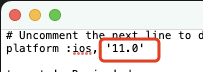

# 1. 017-No such module

## 1.1. 现象

将代码仓库中的项目 clone 到本地，执行 `pod install` 之后，运行项目，提示：`No such module`

## 1.2. 解决

> 搜索发现，该问题的解决方案不通用。该方案不一定适合其他场景。

手动找到项目目录，从中找到 `Podfile`，然后右击以文本编辑器打开。

手动将 `platform` 后的版本由原来的 10.0 修改为 11.0 ，重新运行即可。

