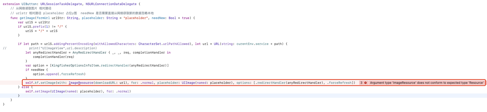
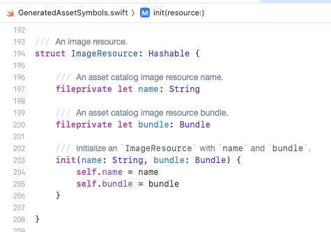
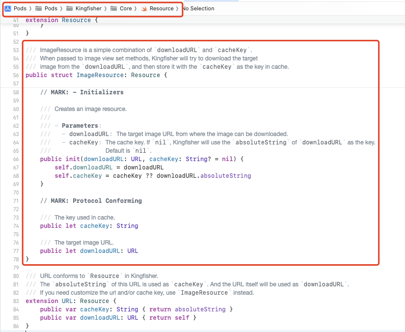
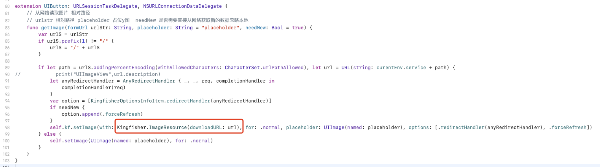

# 1. 018-Xcode15使用Kingfisher加载图片时提示ImageResource无法确认为Resource

## 1.1. 问题现象

升级 Xcode 为 15.0 之后，项目中使用 Kingfisher 加载图片的位置报错，提示：`Argument type 'ImageResource' does not conform to expected type 'Resource'`，具体代码如下:



## 1.2. 问题原因

Xcode 15 引入了一些[新的特性](https://developer.apple.com/videos/play/wwdc2023/10165/?time=225)，允许开发者在使用图片资源时避免使用文件名称硬编码。

引用图片资源时的旧有方式：

```swift
// “demoAsset” 为 Assets 目录下图片文件的名称
UIImage(named: "demoAsset")
```

升级到 Xcode15 之后，我们可以使用如下方式进行引用：

```swift
// Xcode15 为 Assets 下的颜色和图片资源自动生成了一个引用 （Swift Symbols），我们使用某个文件时，直接使用该引用即可。
UIImage(resource: .demoAsset)
```

使用这种资源引用的方式调用资源时，如果我们给资源重命名，重新构建项目时 Xcode 会有编译提示，提示我们哪些地方使用了该资源，并由我们决定是否要进行修改。

Xcode 对 Assets 下图片资源生成的引用符号就是 `ImageSource`:



然而，`Kingfisher` 中也有一个 `ImageResource` ：



所以，二者产生了冲突，Xcode 无法获取我们到底使用的是哪个 `ImageResource` 。

## 1.3. 解决方案

在使用 `Kingfisher` 中的 `ImageResource` 时，为其添加 `Kingfisher.` 前缀，这样 Xcode 就知道我们使用的是谁了：




## 1.4. 参考


* [https://github.com/onevcat/Kingfisher/issues/2090](https://github.com/onevcat/Kingfisher/issues/2090)
* [https://github.com/onevcat/Kingfisher/issues/2095](https://github.com/onevcat/Kingfisher/issues/2095)

