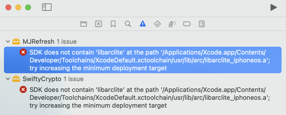
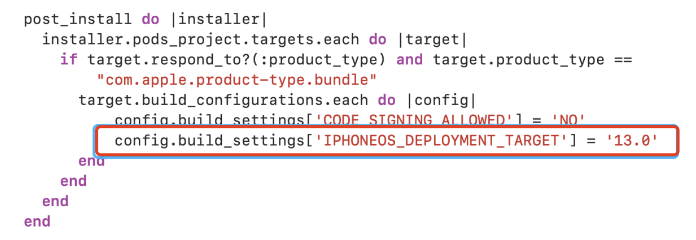

# 1. 019-Xcode15找不到libarclite的修复


## 1.1. 问题现象

升级到 Xcode15 之后，编译项目时会有如下提示：

`
SDK does not contain 'libarclite' at the path '/Applications/Xcode.app/Contents/Developer/Toolchains/XcodeDefault.xctoolchain/usr/lib/arc/libarclite_iphoneos.a'; try increasing the minimum deployment target
`



> 从低版本升级到 Xcode14.3 时会出现该问题；从 Xcode14.3 升级到 Xcode15 时还是会出现该问题。

## 1.2. 问题原因

libarclite_iphoneos 缺失。

> 为什么缺失不知道

## 1.3. 解决方案

### 1.3.1. 方案1

```bash
# 切换目录
cd /Applications/Xcode.app/Contents/Developer/Toolchains/XcodeDefault.xctoolchain/usr/lib/
# 新增 arc 目录
sudo mkdir arc
# 进入新建的 arc 目录
cd  arc

# 克隆远程仓库中的内容到 arc 目录
sudo git clone https://github.com/kamyarelyasi/Libarclite-Files.git
```

终端修改这个目录可能会遇到没有权限的情况，可以通过 `sudo chmod +x` 添加权限


我们也可以手动下载 [https://github.com/kamyarelyasi/Libarclite-Files.git](https://github.com/kamyarelyasi/Libarclite-Files.git) 中的文件，然后将其拷贝到 `arc` 文件夹下。


### 1.3.2. 方案2

> 该方案暂未测试，不确定是否可用。

有的三方库支持版本过低，在 `podfile` 文件中指定版本

```
post_install do |installer|
    installer.generated_projects.each do |project|
          project.targets.each do |target|
              target.build_configurations.each do |config|
                  config.build_settings['IPHONEOS_DEPLOYMENT_TARGET'] = '13.0'
               end
          end
   end
end
```




## 1.4. 参考


* [Missing file libarclite_iphoneos.a (Xcode 14.3)](https://www.jianshu.com/p/ea42360fbf7b)
* [Xcode14.3坑爹问题汇总与解决](https://juejin.cn/post/7224378915484172347)
