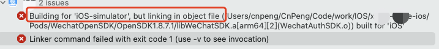
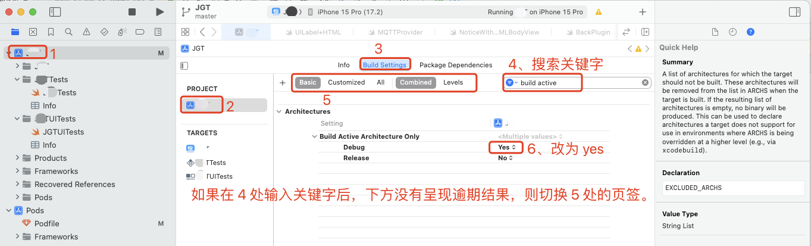
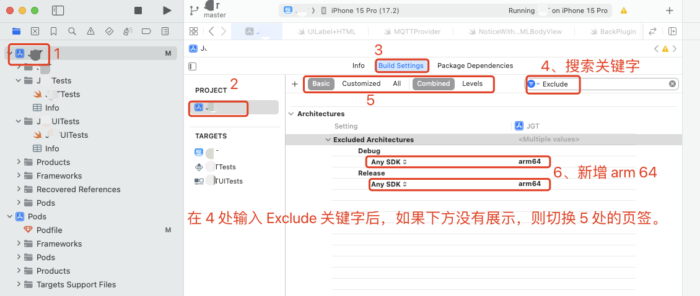

# 1. 020-but linking in object file

> macOS 14.4.1 (23E224) 
> Xcode Version 15.3 (15E204a)

## 1.1. 问题现象

将项目安装到真机时正常，但安装到模拟器时，报如下错误：



```
Building for 'iOS-simulator', but linking in object file (/Users/cnpeng/CnPeng/Code/work/IOS/xxx-ios/Pods/WechatOpenSDK/OpenSDK1.8.7.1/libWeChatSDK.a[arm64][2](WechatAuthSDK.o)) built for 'iOS'
```

## 1.2. 问题原因

模拟器已经用 arm 架构来编译项目了，但 link 链接的还是 x86 架构。

所以，要么查看对应的依赖项是否有有 arm64 架构的，有则更新替换；要么直接强制将所有依赖项都按照 arm64 架构来处理。

此处介绍的是第二种——强制所有依赖按照 arm64 处理。注意：这种方式虽然能解决模拟器安装问题，但向真机安装时必须还原下面第二幅图中的设置，否则真机将安装失败。

## 1.3. 解决方案

现在 `Build Settings` 中 搜索 `Build Active Architecture Only` ，设置成 `yes`。



然后搜索 `Exclude Architectures`，在下面添加 `Any SDK`，并设置其值为 `arm64`：



## 1.4. 注意

按照上述修改之后，这种方式虽然能解决模拟器安装问题，但向真机安装时必须还原第二幅图中的设置，否则真机将安装失败。

## 1.5. 参考

* [知乎-《iOS building for iOS Simulator, but linking in》](https://zhuanlan.zhihu.com/p/351404238)
* [CSDN-《Xcode14 解决 Building for iOS Simulator, but ... , file for architecture arm64》](https://blog.csdn.net/sirodeng/article/details/130189018)