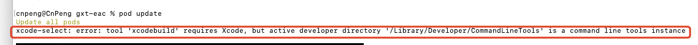
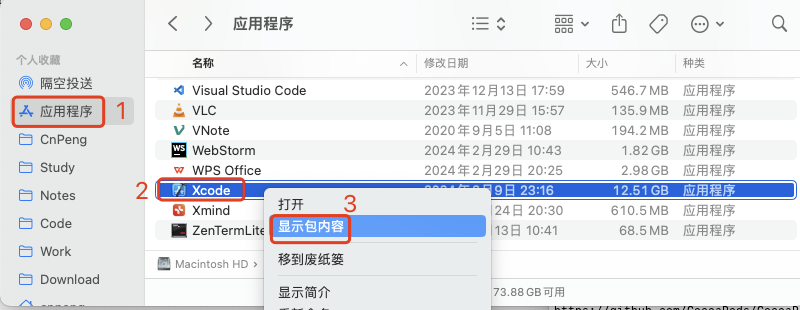
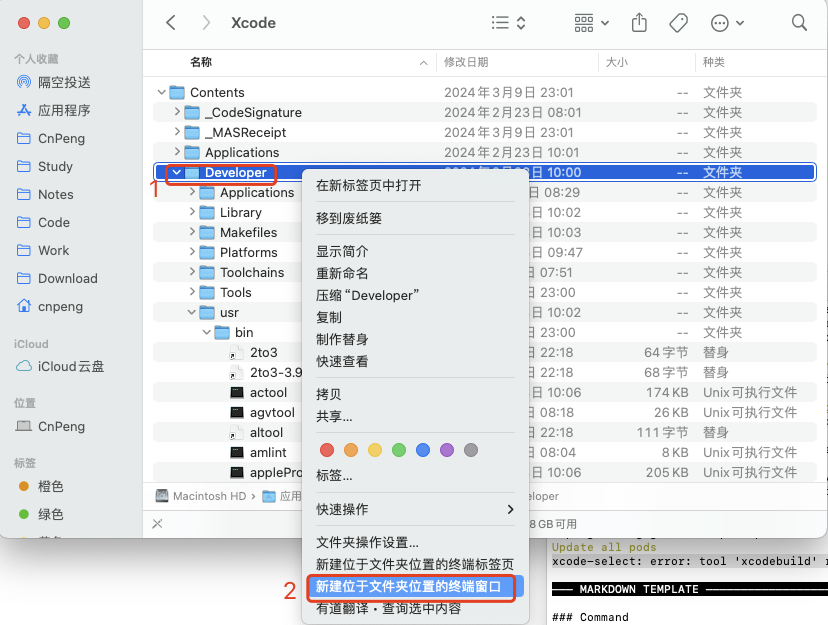
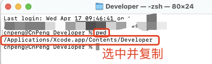
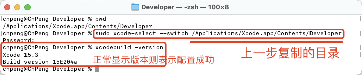

# 1. 021-xcode-select error

## 1.1. 现象

在 Xcode 15.3 (15E204a) 使用 `pod update` 更新依赖库版本时，出现如下错误：

`xcode-select: error: tool 'xcodebuild' requires Xcode, but active developer directory '/Library/Developer/CommandLineTools' is a command line tools instance`

## 1.2. 原因

`xcodebuild` 工具需要 Xcode ，但在 '/Library/Developer/CommandLineTools' 目录下找不到 Xcode , 需要重新指定 Xcode 目录。

## 1.3. 解决

* 从 `应用程序` 中找到 `Xcode` ，然后右击选择 `显示包内容`：

* 进入 `Contents` 目录，右击 `Developer` 目录并选择 `新建...终端窗口`：

* 在终端中输入 `pwd` 命令，查看 `Developer` 目录的完整路径：

* 在终端执行 `sudo xcode-select --switch Developer目录`：

执行完成之后，再执行 `xcodebuild -version` 确认是否配置成功。

