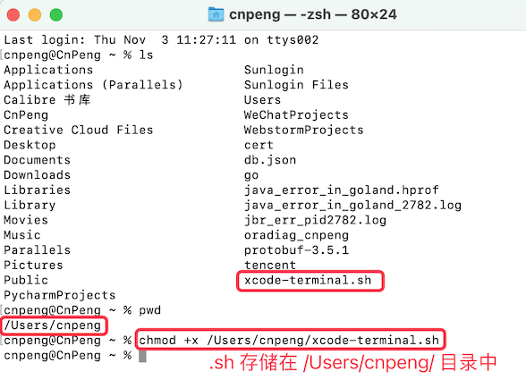
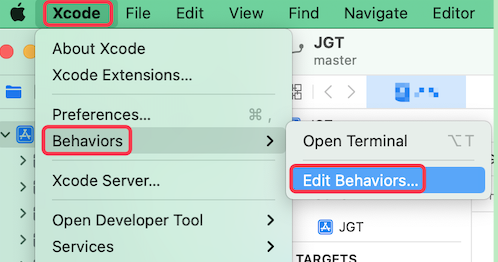
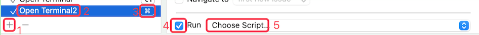

## 1. Xcode 如何打开终端

[点击查看原文](https://medium.com/rosberryapps/lets-optimize-the-work-with-terminal-for-xcode-developers-194623da55d4)

### 1.1. 步骤1：新建 `xcode-terminal.sh` 脚本文件

切换到任意目录，然后新建一个 `xcode-terminal.sh` 的脚本文件，并编辑其内容。

内容如下：

```
#!/bin/sh

if [ -n "$XcodeProjectPath" ]; then	
  open -a Terminal "$XcodeProjectPath"/..
else
  open -a Terminal "$XcodeWorkspacePath"/..
fi
```

另外，`.sh` 前面的文件名称可以自定义，但是下面步骤2中修改权限时，名称必须一致。

### 1.2. 步骤2：修改权限

打开终端，并在其中执行如下命令：

```
chmod +x 路径名/.sh文件名
```

如:



### 1.3. 步骤3：添加到 Xcode 中

依次打开 ： **Xcode menu > Behaviors > Edit Behaviors…**, 



然后点击下图左下角的 `+` :



然后输入自定义的 Behavior 名称（对应上图中的 2），并指定一个快捷键（对应上图中的3）。

然后勾选上图右侧的 `Run`（对应上图中的4）, 并双击 `Run` 右侧的下拉框（对应上图中的 5 ），指定该 Behavior 对应的脚本文件——也就是刚才创建的 `xcode-terminal.sh`。

至此，配置完成。在 Xcode 编辑器中，按下自定义的快捷键就可以调出终端了。

## 2. 其他脚本

### 2.1. 执行 `pod install` 的脚本

脚本如下：

```bin
#!/bin/sh
# 改脚本用于Xcode 执行快捷键执行 pod install 

path=""
if [ -n "$XcodeProjectPath" ]; then
    path=$XcodeProjectPath
else
    path=$XcodeWorkspacePath	
fi
# 执行 AppleScript 打开 Terminal 进行 podinstall
osascript <<EOF
    tell application "Terminal"
        activate
        do script with command "cd \"$path\"/..;pod install"
    end tell
EOF
```

## 3. 总结

任意需求都可以通过脚本实现，然后可以将其关联到 Xcode 的 behavious 中，并为其关联快捷键。