# 1. 003-商务分发

原文 ：[掘金-《2023苹果商务管理模式分发app完全指南》](https://juejin.cn/post/7231804508082225211)

随着苹果对企业级开发证书的管控越来越严格，越来越多的企业级证书到期后，苹果不再予以续约，但是很多app都有企业内部分发需求，不希望自己的应用被公开上架。这时候，我们可以参考苹果官方的建议，使用商务管理模式来分发我们的内部应用

## 1.1. 效果

先说最终效果，使用商务管理模式分发 app 成功以后，我们会得到一个 excel，里面包含兑换码和兑换链接，如下所示

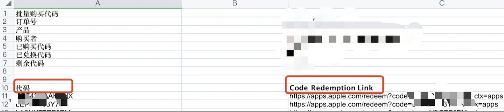

用户使用苹果手机打开 `App Store`，点击`设置`，打开找到 `兑换充值卡或代码` 一栏，输入兑换码，兑换下载即可。**或者在浏览器输入兑换链接**，会自动打开 App Store 并兑换下载，下载后即可正常使用。

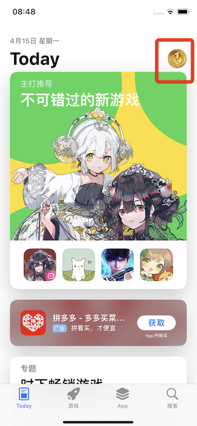     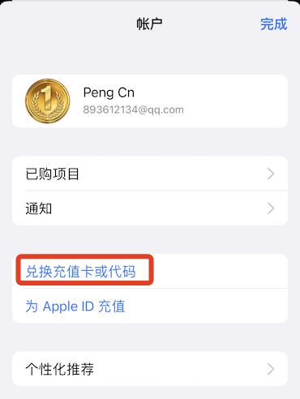

## 1.2. 步骤简述

截至 2023 年5月 的操作方法如下：

* 注册苹果商务账号
* 设置苹果商务管理组织
* 设置开发者账号
* App Store Connect 新建应用与设置
* Xcode 打包应用并上传到 App Store Connect
* App Store Connect 选择构建版本，填写应用相关信息，提交审核
* 通过苹果的应用上架审核
* 在商务账号下找到上传的应用，下载兑换分发excel文件
* 用户在 App Store 兑换下载

这是设置商务分发的完整步骤，正在进行的小伙伴可以按照步骤找到自己正处于哪一步。

## 1.3. 详细说明

接下来对每一步进行详细描述，避免大家踩坑：

### 1.3.1. 注册苹果商务账号

首先申请者身份必须是组织，不接受个人身份申请。我们需要先准备好以下资料：

* 邓白氏编码：如果有企业账号的话，就不需要重新再申请了，可以和企业账号公用一个邓白氏编码，没有的话则需要点击 [申请邓白氏链接](https://developer.apple.com/enroll/duns…) 进行申请。
* appleId
* 公司相关的网站域名
* 域名邮箱：就是你公司的企业邮箱，要和开发者账号的邮箱区分开，最好用一个新邮箱
* 公司的座机电话
* 你的个人信息、验证联系人的个人信息(两个信息不能相同，注意：验证联系人的职务应该为 CEO、COO、IT 经理等管理者，普通员工不具备做验证人的权限)

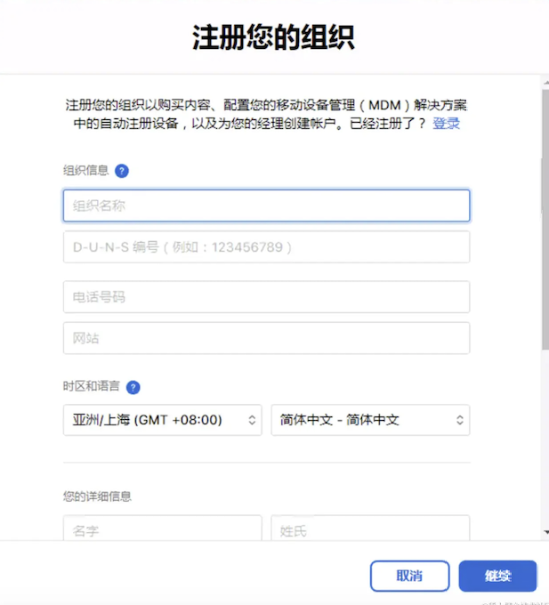

审核时间一般 2-3 天，最长不超过 7 天。苹果会在验证邓白氏编码、公司信息等通过后，致电您公司的座机（可能是申请邓白氏编码的座机，也可能是申请苹果商务时填写的座机），并和 `验证联系人` 通话。

苹果和验证人通话时，可能会询问下列问题:

* 验证人姓名、职务(职务应该为 CEO、COO、IT 经理等管理者，普通员工不具备做验证人的权限)
* 正在申请苹果商务管理账号的员工，是否可以代表公司同意苹果的协议(如果回答不能，苹果会拒绝通过审核)
* 申请苹果商务管理账号的目的(可以回答：您公司的员工需要使用定制应用、其他公司为您的公司开发了定制应用等。如果回答作为开发者为其他公司开发并分发定制应用，苹果可能拒绝通过申请，并提示苹果商务账号应当由你的客户自己去申请。

### 1.3.2. 设置苹果商务管理组织

注册地址：[https://business.apple.com/](https://business.apple.com/)

如果电话验证通过，苹果会向验证人、申请人的邮箱发送确认邮件。点击邮件的 `开始使用` 按钮(要及时点击，**超过一周即过期**)，跳转到管理式 Apple ID 的创建表单，填写该苹果商务管理账号的管理员信息，姓名、工作邮箱、密码、手机号码等信息。

>tips：因为这里需要新创建一个 `管理式 AppleID` ，所以此处的邮箱不能填写提交申请时的 AppleID 或者其他已经存在的 AppleID，**需要一个新的邮箱**（可以是公司网址为后缀的工作邮箱地址，也可以是163等公共邮箱）。

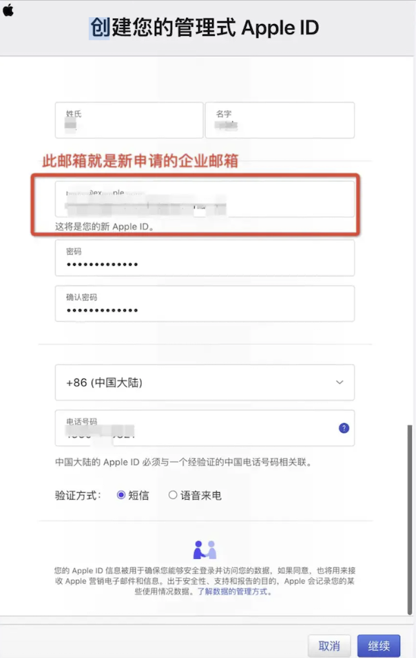

填好信息后点击`继续`。随后页面会跳转至输入短信和邮箱验证码的页面，根据提示填入验证码，并点击继续按钮。然后会出现下图所示的提示信息:

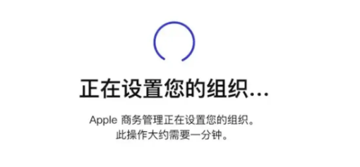

最后，页面会显示条款与条件，必须同意苹果的使用条款才能使用苹果商务管理账号。 勾选所有协议，点击右下方同意按钮。

我们使用注册好的管理式 Apple ID 登陆[商务管理网站](https://business.apple.com/)，在`设置`-`组织信息`（或 `注册信息`）中 ，可以看到我们的组织信息：

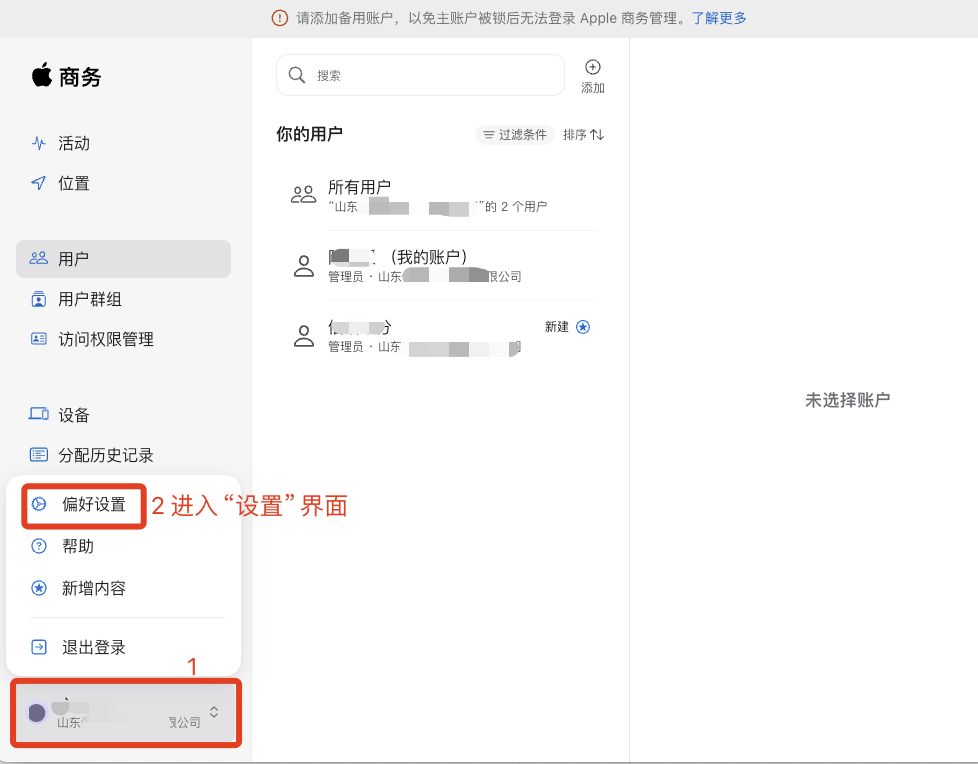

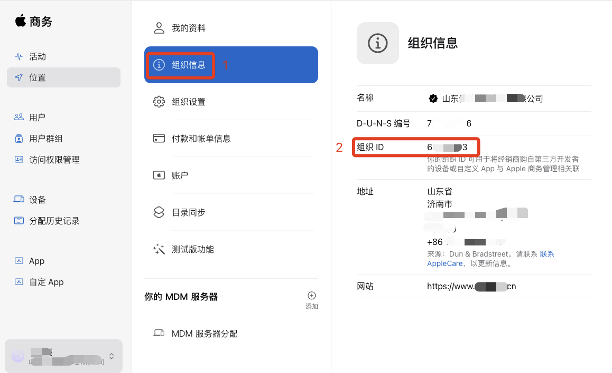

我们把组织 ID 和组织名保存好，在后续步骤中会用到。

### 1.3.3. 设置开发者账号

如果我们的组织之前就有开发者账号，那就直接使用即可；如果没有就要注册一个新的开发者账号了。

账号的注册过程我们不在本文讲述，只贴一个不同类型的开发者账号对比：

|         账号类型         |      费用      | 发布AppStore |                                                                      申请条件                                                                       |         证书类型          |           协作人数            |
| ------------------- | ----------- | ------------- | ----------------------------------------------------------------------------------------------------- | ------------------- | ---------------------- |
| 个人账号  Individual | 99美元/年   | 可以               | 无限制                                                                                                                                               | Ad-hoc，App Store | 1(开发者自己)               |
| 公司账号Company   | 99美元/年   | 可以               | 邓白氏编码                                                                                                                                         | Ad-hoc，App Store | 多人，可设置团队          |
| 企业账号Enterprise  | 299美元/年 | 不可以            | 邓白氏编码                                                                                                                                         | Ad-hoc，In House   | 多人，可设置团队          |
| 教育账号                 | 0                | 可以               | 只能教育机构或者学院内部使用， 必须是苹果 iOS 开发者计划授权机构， 不能对外正式发布iOS应用程序 | Ad-hoc，App Store | 未知（查不到相关资料） |

假设我们为客户开发应用，由客户提供开发者资质，那我们需要让客户把我们拉入开发者团队。

## 1.4. App Store Connect 新建应用与设置

打开 [appstoreconnect.apple.com/](appstoreconnect.apple.com/)，登陆自己的开发者账号。这里要使用具有管理权限的账号登陆，如果是仅有开发权限的账号，那么登陆成功了你也打不开 `我的App` 模块（点击以后会自动跳回首页）。

### 1.4.1. 新建app并创建证书等

在 `我的App` 模块，点击 `+` 号，选择 `新建app` :

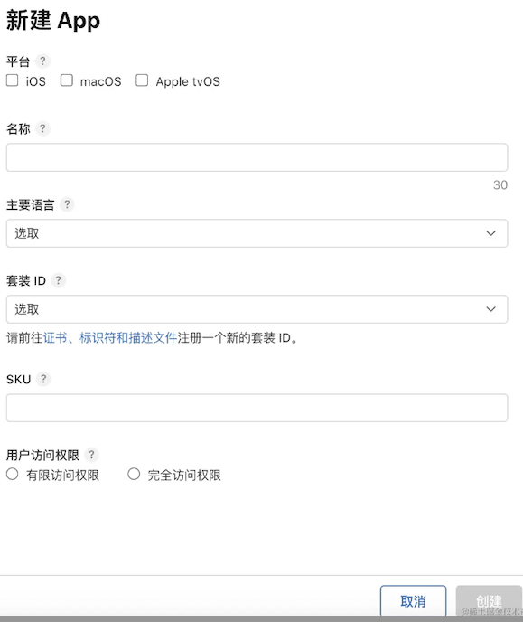

如上图：

* 我们选择 ios 平台；

* 起一个不会重复的 app 名称(常见的名称很容易重复)；

* 语言选取简体中文；

* 套装id要使用和 Xcode 项目一致的 `bundleId`，因为是第一次使用 App Store Connect，所以我们要点击 `证书、标识符和描述文件` 来注册一个 `bundleId` 。这里的 `bundleId` 要注册一个不同于之前企业证书分发的新 bundleId，因为会重复。 `Capabilities` 一般选择 `Access WiFi Information`、`Push Notifications` 即可，其他的按自己应用需求来选。注册好这个套装id 以后，记得把**证书文件（`.p12文件`）、密码和`.mobileprovision文件`**保存下来，下一步会用。注册好以后返回到新建页面，选择你刚注册好的套装id；

* SKU输入一个你的应用的专属的 id；

* 用户访问权限设为完全访问权限。

然后点击 `创建` 即可创建出一个新的 app。

### 1.4.2. 设置价格与销售范围

点击这个app 进入该 app 的信息管理页面，点击 `价格与销售范围` 进行设置：

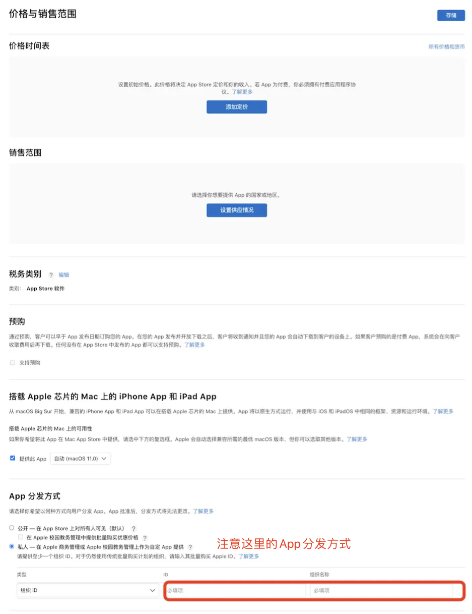

app定价与销售范围都选择适合自己应用的内容，一般都是中国大陆；

最重要的是 `App分发方式` ，要勾选 `私人`—`在Apple商务管理...`,填写我们在商务账号注册时的组织名称与组织id。

点击`存储`保存即可。

### 1.4.3. 设置app管理员

如果我们自己本身就是这个管理权限的开发者账号拥有者，自己填写 app 详细信息的话，那不必看这里。

如果我们 app 详细信息不由自己来填写（因为信息较为繁琐），而是由团队其他人来写的话，需要在 `用户和访问` 那里，找到团队成员 X，编辑用户访问权限，将 X 设为我们新建 app 的管理员，这样 X 就可以进行应用详细信息的填写了。

## 1.5. Xcode打包应用并上传到App Store Connect

### 1.5.1. 更新 macOS 与 Xcode 到最新版本

这一步看似没必要，但其实是最重要的！！！因为如果你不更新，到了最后一步上传，苹果会提示你，应用必须支持最新的 ios SDK 才能上传，要想支持最新的 ios SDK 那你就必须使用最新的 Xcode，如果要使用最新的 Xcode，那你就要有最新的 Mac OS。为了不浪费时间，请第一时间保证你的系统和 Xcode 是最新版本！

### 1.5.2. 证书导入与选择

将我们注册 App 时得到的证书文件导入`钥匙串`，成功后打开 Xcode，在【TARGETS】>【Signing & Capabilities】下，填写 Bundle Identifier（值与新建 app 时设置的套装id保持一致）；`Provisioning Profile` 选择新建 app 时得到的 `mobileprovision文件`，会自动带出下方的 `Team` 与 `Signing Certificate` 信息。

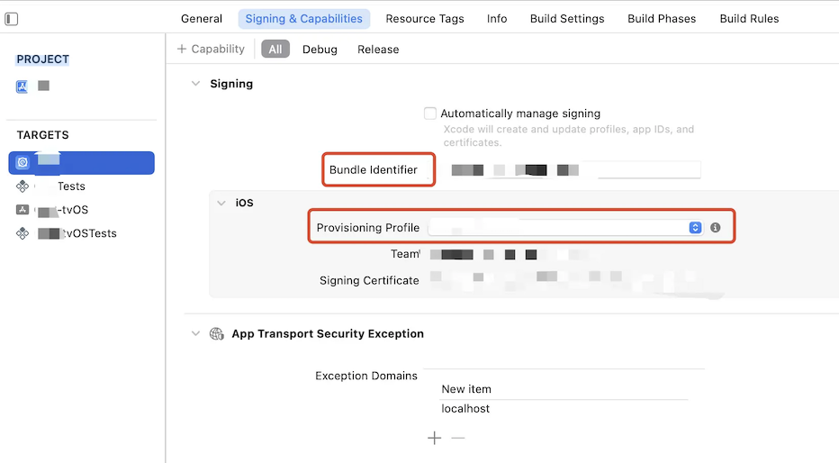

### 1.5.3. Info.list 设置必要的权限提示信息与加密信息

这里本来是不需要这一步的，但是我在上传后遇到了一些问题与权限提示和加密信息有关，所以最好在这一步就处理好这方面的问题，避免反复操作。

这是 `Info.list` 需要注意的两项内容：

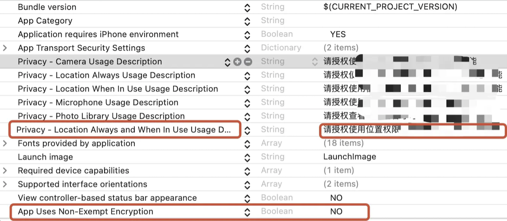

这里如果权限申请描述信息没写，是不能通过 AppStoreConnect 的审核的，原本我的权限申请了位置信息权限，`NSLocationAlwaysUsageDescription` 和 `NSLocationWhenInUseUsageDescription` 都是有的，但是审核时发邮件提示`NSLocationAlwaysAndWhenInUseUsageDescription` 也必须要有。

指定 `ITSAppUsesNonExemptEncryption` 的原因时是上传成功以后，选择构建版本时，还需要手动指定出口合规证明信息才行，比较麻烦，所以我们直接在 `info.list` 就做好制定。

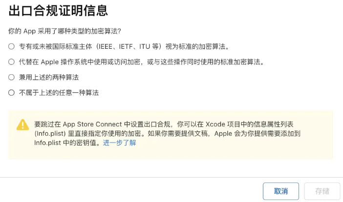

### 1.5.4. 应用打包与上传

应用开发完成后，Xcode 点击【Product】> 【Archive】进行打包操作，打包完成后，**选择【Custom】点击next 才能进入商务管理模式的分发上传**。如果点前两项都会报错，应该是直接去了官方的分发路径。如下图：

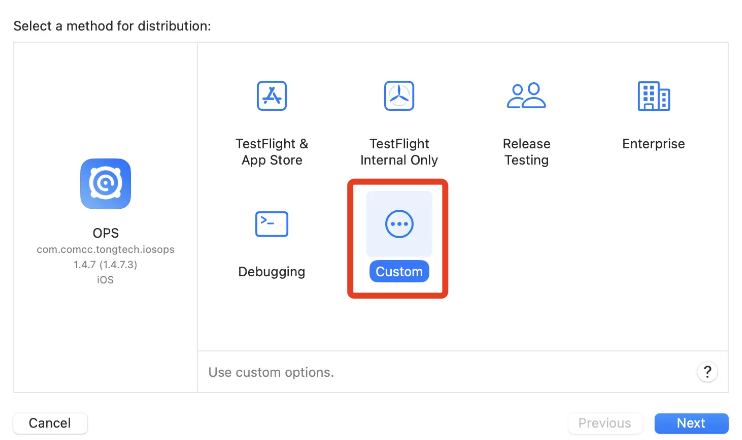

> 注意：因为我们是走的商务分发，所以要选择 `Custom`，如果正常分发，走前两项即可。

上传完成后，会看到如下界面：

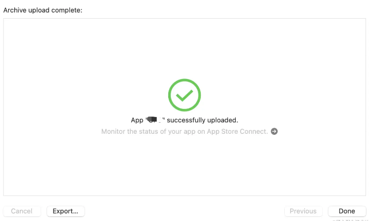

### 1.5.5. 准备应用截屏与隐私政策

这是下一步需要的资料，放在这一步是因为在这里做好准备比较方便。

### 1.5.6. 应用截屏

首先需要 iPhone5.5 英寸与 6.5 英寸的显示屏截屏，每个尺寸准备4、5张应用截图。
截图我们直接使用对应屏幕大小的 ios 模拟器点击截图即可：

* 5.5英寸对应机型：6plus、6s plus、7plus、8plus
* 6.5英寸对应机型：iphone Xs Max、iphone 11Pro Max

### 1.5.7. 隐私政策：

现在主流的 app 应用合规隐私政策都需要做成网页对外提供一个 url 来访问了，苹果也不例外。所以我们需要一份基于自己 app 的隐私政策文档，然后把它转为 html 网页放到一个对外的服务器上，直接访问这个 url 链接可以看到该应用的隐私政策。

## 1.6. App Store Connect 选择构建版本，填写应用相关信息，提交审核

### 1.6.1. 选择构建版本

这时我们登陆 App Store Connect 点进去对应的 app 界面，发现状态还是准备提交？我们的上传的 app 包去哪了呢？往下滑动，找到【构建版本】，这里应该有你刚刚上传好的 app 文件，需要勾选构建版本才行；如果在这里也没看到 app 文件，那说明你上传的文件可能有点小问题。点击【TestFlight】,来这里查看你的 ios 构建版本。

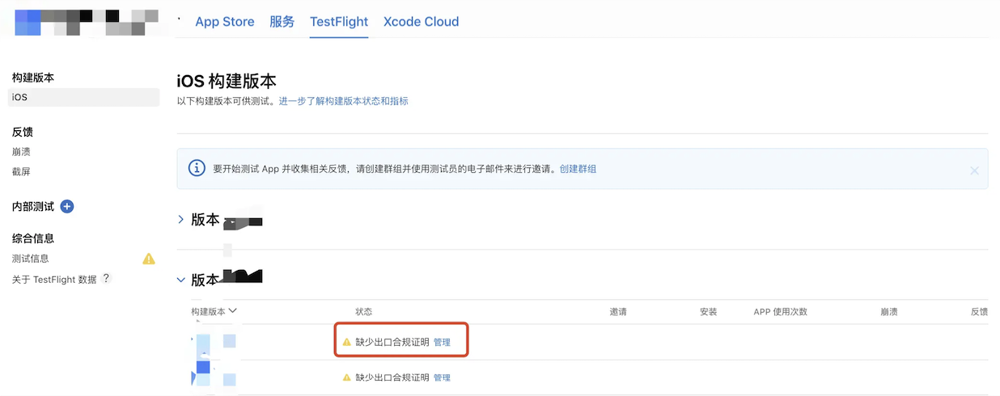

可以看到有一个缺少出口合规证明的警告，如果我们在前面 《Info.list 设置必要的权限提示信息与加密信息》中提前编辑过合规证明，此处就不会有这个警告信息。如果前面没有设置过，此处手动选择你的 app 使用了哪种类型的加密算法就可以了，选择后回到 App Store 下的构建版本，这时就出现了可供你构建的应用版本。

### 1.6.2. 填写应用相关信息

这里我们需要填写的东西还是很多的，我们只说必填项：

填写项目 | 说明
---|---
ios预览与截屏 | 对应前面步骤中保存好的 5.5寸和 6.5寸应用截图
描述 | 对你 App 的描述，用以详细说明特性和功能。
关键词 | 添加一个或多个关键词以描述你的 App。关键词将使 App Store 搜索结果更加准确。关键词之间用英文逗号或中文逗号（或两者混合使用）分隔。
技术支持网址 (URL) | 你的 App 技术支持信息网址 (URL)。该网址 (URL) 会在 App Store 中显示。
版本 | 你要添加的 App 的版本号。编号应遵循软件版本规范。
版权 | 拥有你的 App 专有权的人员或实体的名称，前面是获得权利的年份（例如“2008 Acme Inc.”）。请勿提供网址 (URL)。
App 审核信息 | 如果需要你的app使用需要登录的话，那就要提供一个测试账号与登录密码，联系信息也要填好
备注 | 备注这一项不是必填的，但是如果你的应用有某些特殊之处，需要在这里说明。这里写对审核过程会有所帮助的 App 额外信息例如，App 特有的设置，它仅对审核人员可见，最终不会在app store下载界面被人看到。
隐私政策 | 链接至你的隐私政策的网址 (URL)。所有 App 都必须提供隐私政策。
收集数据类型 | 根据你的 app 的实际使用数据，如实填写从 app 收集的数据类型以及数据是否与用户身份关联、用途、是否用于追踪目的等信息。

填写完以后点击 `提交审核` 即可。

## 1.7. 通过苹果的应用上架审核

我们已经提交了应用上架审核，这时候就静静等待审核结果吧，一般是在一个工作日以内就会有反馈。我们在【App 审核】界面可以看到审核的结果，一般来说很难一次通过，根据苹果的要求来进行修改提交就好，如果有你不认同的驳回理由，也要据理力争。总之，来回沟通以后，如果审核成功了，会看到一个已批准的标识。

## 1.8. 在商务账号下找到上传的应用，下载兑换分发excel文件

审核成功后，登陆我们的商务管理账号，在【自定App】下就可以看到我们的app了，这期间也可能会有数小时的延迟。

在【购买许可下】，选择许可类型为兑换码，设置兑换码的数量，单次兑换码购买量需要在 1-25000 之间。注意，同一件免费项目的订购数量每周不能超过 25000 份。**如果想突破 25000 的限制，可以给苹果商务账号多增加一些子账号，每个子账号每周都可以买25000个兑换码。**

点击【获取】按钮，会在下方显示出刚刚购买的兑换码，点击右侧下载按钮，就可以下载到包含兑换码和链接的 excel文件了。（获取成功后，可能下载按钮不会立刻显示，可能需要等待几分钟）。

## 1.9. 用户在App Store兑换下载

兑换的步骤我们在开头的【效果】中已经讲过，不再赘述。

这里再说一点，App升级后，之前购买的兑换码仍然有效，用户使用之前的兑换码下载到的 app 是升级后的最新版本。 已经下载的用户可以通过 App Store 自动或手动升级（取决于用户的设置），具体方式和 App Store 下载的应用更新方式相同。
