# 1. 005-1-安装Cocoapods

[原文：《最新版的 MacOS Catalina 的 CocoaPods 安装步骤 pod install/pod update 更新慢等问题》](https://blog.csdn.net/long4512524/article/details/129733643)

## 1.1. CocoaPods的简介

当你开发iOS应用时，会经常使用到很多第三方开源类库，比如JSONKit，AFNetWorking等等。如果使 用他们，传统的方法是，在git上把他们下载下来，然后去配置。这个工作很繁琐，而且也容易出错。不 过有了Cocoapods你就会从这些繁琐的工作中解脱出来。

## 1.2. CocoaPods的安装及使用

### 1.2.1. 第一步：[安装RVM](https://so.csdn.net/so/search?q=RVM&spm=1001.2101.3001.7020)

RVM：[Ruby](https://so.csdn.net/so/search?q=Ruby&spm=1001.2101.3001.7020) Version Manager，中文为Ruby版本管理器，包括Ruby的版本管理和Gem库管理。

先在终端执行：

```bash
$ curl -L get.rvm.io | bash -s stable
```

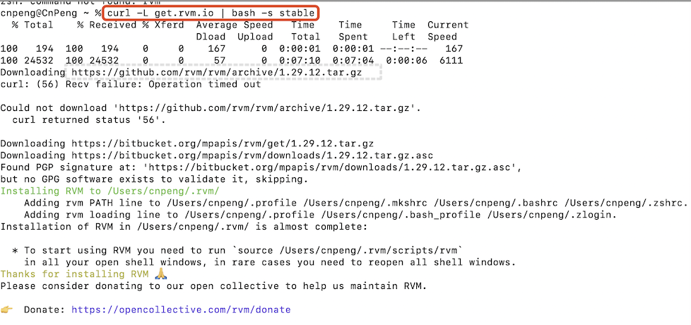

执行需要一段时间，执行完成后再执行如下命令：

```bash
# 让修改立即生效
$ source ~/.bashrc
$ source ~/.bash_profile
```


等待终端加载完毕，后输入

```bash
# 查看 ruby 的版本
rvm -v
```

如图所示：

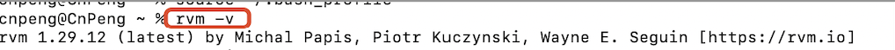

如上图所示，能显示版本号，即是安装成功了。

如果受到防火墙的影响，出现

```
kinglyimac@192 ~ % curl -L get.rvm.io | bash -s stable % Total % Received % Xferd Average Speed Time Time Time Current Dload Upload Total Spent Left Speed 100 194 100 194 0 0 289 0 --:--:-- --:--:-- --:--:-- 289 0 0 0 0 0 0 0 0 --:--:-- --:--:-- --:--:-- 0 curl: (7) Failed to connect to raw.githubusercontent.com port 443: Connection refused
```

可以 [在mac环境下安装离线安装 rvm](https://my.oschina.net/kinglyphp/blog/4257822)

### 1.2.2. 第二步：升级Ruby的版本

> 不同的 Mac 系统版本带的 Ruby 不同，需要进行具体查看。

CocoaPods 目前安装需要 Ruby 的版本大于 2.2.2 ,不然会报错：Error installing pods: activesupport requires Ruby version >= 2.2.2。目前 Mac 系统默认自带是 2.0，所以需要升级。

* 查看当前 ruby 版本

```bash
ruby -v
```

* 获取 rvm 列表，列表里会显示最新版 Ruby 版本

```bash
rvm list known
```

如下图所示：

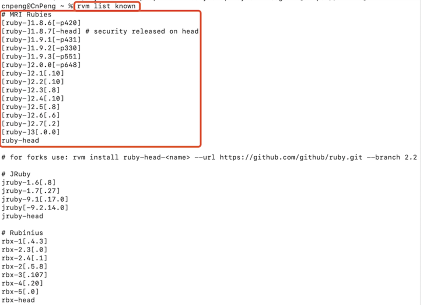

* 选择安装最新版 Ruby

根据 rvm 列表里 `# MRI Rubies` 一栏里显示的的 Ruby 版本号，比如要安装最新的 3.0.0 版本，命令如下：

```bash
rvm install 3.0.0
```

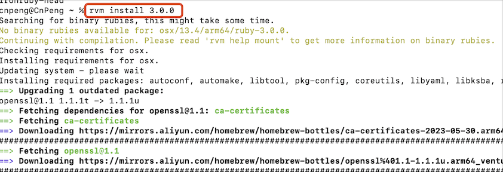


安装完成后，使用 `ruby -v` 命令，出现下图所示版本号信息时，则表示安装成功。

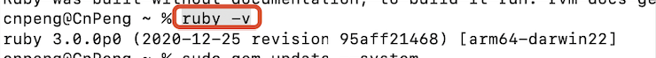


#### 1.2.2.1. 问题解决

在执行 `rvm install 3.0.0` 安装的过程中，可能出现的问题，如下所示：

```
Error running ‘__rvm_make -j 1’,showing last 15 lines of /Users/GDarkness/.rvm/log/1474100434_ruby-2.4.1/make.log
```

安装 `xcode command line` 即可解决

命令如下：

```bash
xcode-select --install
```

此时会弹出一个软件安装信息 ，点击安装 ，安装结束后，重新在终端输入：`rvm install 3.0.0` 继续执行安装。


### 1.2.3. 第三步：升级RubyGems版本和更改gem源

#### 1.2.3.1. 升级 RubyGems 版本

```bash
sudo gem update --system
```

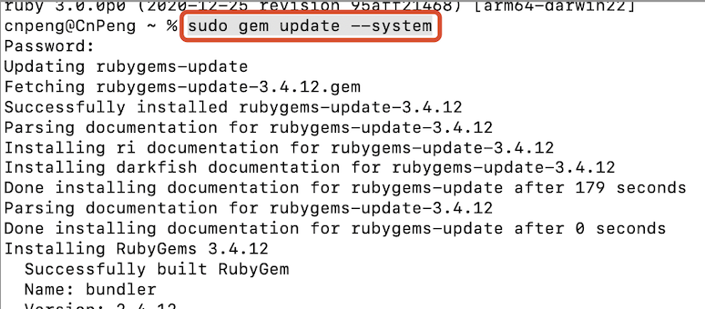


* 使用 `gem -v` 查看一下 gem 版本，要 2.6 以上才可以

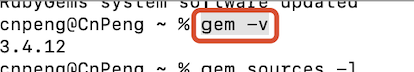


#### 1.2.3.2. 修改  gem 源

先看一下当前的 gem 源：

`gem sources -l`

如果显示的源为 ：`https://rubygems.org/` 则执行下面的命令更新为国内镜像：

```bash
gem sources --add https://gems.ruby-china.com/ --remove https://rubygems.org/
```

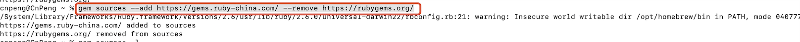

使用 `gem sources -l` ，查看是否添加成功

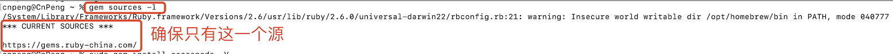

确保最新的源只有一个。

有关 最新 RubyGems 镜像- Ruby China ，请见 [https://gems.ruby-china.com/](https://gems.ruby-china.com/)


### 1.2.4. 第四步：安装CocoaPods

安装CocoaPods：

```bash
sudo gem install -n /usr/local/bin cocoapods  --pre
```

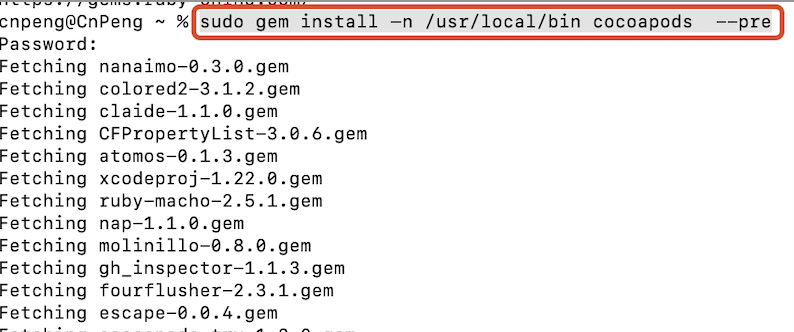

安装完成之后，手动执行一次初始化：

```bash
pod setup
```

可能下载需要很久，根据网速的快慢而定，因为下载镜像索引大概有1个多G的大小，如果比较慢的话，建议使用VPN。

```
Setting up CocoaPods master repo
  $ /usr/bin/git clone https://github.com/CocoaPods/Specs.git master --progress
  Cloning into 'master'...
  remote: Counting objects: 1113358, done.
  remote: Compressing objects: 100% (255/255), done.
  remote: Total 1113358 (delta 87), reused 1 (delta 1), pack-reused 1113090
  Receiving objects: 100% (1113358/1113358), 381.32 MiB | 349.00 KiB/s, done.
  Resolving deltas: 100% (520388/520388), done.
  Checking out files: 100% (140115/140115), done.
Setup completed
```

出现如上所示，恭喜你，CocoaPods 已经安装并下载镜像索引成功了。

我们还可以通过 `pod search 第三方库名称` 来验证一下是否安装成功。例如：执行 `$pod search KYBarrageKit`

出现如下所示，即表明您安装成功了.

```
kinglydeMacBook-Pro:~ kingly$ pod search KYBarrageKit

-> KYBarrageKit (1.0.2)
   KYBarrageKit this is a high availability, easy to use barrage Framework
   Library.
   pod 'KYBarrageKit', '~> 1.0.2'
   - Homepage: https://github.com/kingly09/KYBarrageKit
   - Source:   https://github.com/kingly09/KYBarrageKit.git
   - Versions: 1.0.2, 1.0.1, 0.0.9, 0.0.7, 0.0.6, 0.0.5, 0.0.4, 0.0.3, 0.0.2,
   0.0.1 [master repo]
(END)
```

>CnPeng: 即便三方库存在，`pod search 库名` 也可能会失败。如果按照步骤进行安装，即便 search 失败也可以正常使用 `pod` 相关命令。

## 1.3. 如何使用CocoaPods？

好了，安装好 CocoPods 之后，接下来就是使用它。所幸，使用 CocoPods 和安装它一样简单，也是通过一两行命令就可以搞定。

在这里用两种使用场景来具体说明如何使用 CocoaPods。

### 1.3.1. 利用 CocoaPods，在项目中导入 YYKit 类库

为了确定 YYKit 是否支持 CocoaPods ，可以用 CocoaPods 的搜索功能验证一下。在终端中输入：

```bash
pod search YYKit
```

出现如下：

```
-> YYKit (1.0.9)
   A collection of iOS components.
   pod 'YYKit', '~> 1.0.9'
   - Homepage: https://github.com/ibireme/YYKit
   - Source:   https://github.com/ibireme/YYKit.git
   - Versions: 1.0.9, 1.0.8, 1.0.7, 1.0.6, 1.0.5, 1.0.4, 1.0.3, 1.0.2, 1.0.1,
   1.0, 0.9.12, 0.9.11, 0.9.10, 0.9.9, 0.9.8, 0.9.7, 0.9.6, 0.9.5, 0.9.4, 0.9.3,
   0.9.2, 0.9.1, 0.9.0, 0.2.0 [master repo]
   - Subspecs:
     - YYKit/no-arc (1.0.9)

-> YYKit-fork (1.0.9.3)
```

这说明，YYKit 是支持 CocoaPods ，所以我们可以利用 CocoaPods 将 YYKit 导入到项目中。

### 1.3.2. 生成 Podfile 文件，每个项目只需要一个 Podfile 文件

在终端切换到项目目录：

```bash
# 切换目录
kinglydeMacBook-Pro:~ kingly$ cd /Users/kingly/Documents/项目/app/BCWebBrowser/WKWebViewOC

# 查看目录下的文件和目录
kinglydeMacBook-Pro:WKWebViewOC kingly$ ls
WKWebViewOC		WKWebViewOCTests
WKWebViewOC.xcodeproj	WKWebViewOCUITests

# 查看目录下的文件、目录及其信息
kinglydeMacBook-Pro:WKWebViewOC kingly$ ls -l
total 0
drwxr-xr-x@ 12 kingly  staff  408 11  1 15:47 WKWebViewOC
drwxr-xr-x   5 kingly  staff  170 11  2 09:20 WKWebViewOC.xcodeproj
drwxr-xr-x@  4 kingly  staff  136  4 11  2017 WKWebViewOCTests
drwxr-xr-x@  4 kingly  staff  136 10 31 09:27 WKWebViewOCUITests
```

使用如下命令创建一个 Podfile 文件：

```bash
pod init
```

示例如下：

```bash
# 创建 Podfile 文件
kinglydeMacBook-Pro:WKWebViewOC kingly$ pod init

# 查看目录下的文件、目录及其信息
kinglydeMacBook-Pro:WKWebViewOC kingly$ ls -l
total 8
-rw-r--r--   1 kingly  staff  438 11  2 13:04 Podfile
drwxr-xr-x@ 12 kingly  staff  408 11  1 15:47 WKWebViewOC
drwxr-xr-x   5 kingly  staff  170 11  2 09:20 WKWebViewOC.xcodeproj
drwxr-xr-x@  4 kingly  staff  136  4 11  2017 WKWebViewOCTests
drwxr-xr-x@  4 kingly  staff  136 10 31 09:27 WKWebViewOCUITests
```

此时我们会发现在项目根目录中，出现一个名字为 `Podfile` 的文件。该文件和项目的工程文件 `.xcodeproj` 在同一个目录下。

### 1.3.3. 修改Podfile文件

```vim
vi  Podfile
```

修改如下 ：

```vim
# Uncomment the next line to define a global platform for your project
platform :ios, '8.0'

target 'WKWebViewOC' do
  # Uncomment the next line if you're using Swift or would like to use dynamic frameworks
  use_frameworks!

  # Pods for WKWebViewOC

  inhibit_all_warnings!
  pod 'YYKit', '~> 1.0.9'


  target 'WKWebViewOCTests' do
    inherit! :search_paths
    # Pods for testing
  end

  target 'WKWebViewOCUITests' do
    inherit! :search_paths
    # Pods for testing
  end
end
```

然后保存退出。vim 环境下，保存退出命令是：`:wq!`

这时候，你就可以利用 CocoPods 下载 YYKit 类库了。

### 1.3.4. 下载  YYKit 类库

还是在终端中的当前项目目录下，运行以下命令：

```bash
pod install
```

因为是在你的项目中导入 YYKit ，这就是为什么这个命令需要你进入你的项目所在目录中运行。

运行上述命令之后，终端出现以下信息：

```bash
Integrating client project

[!] Please close any current Xcode sessions and use `WKWebViewOC.xcworkspace` for this project from now on.

Integrating target `Pods-WKWebViewOC` (`WKWebViewOC.xcodeproj` project)
  Adding Build Phase '[CP] Embed Pods Frameworks' to project.
  Adding Build Phase '[CP] Copy Pods Resources' to project.
  Adding Build Phase '[CP] Check Pods Manifest.lock' to project.

Integrating target `Pods-WKWebViewOCTests` (`WKWebViewOC.xcodeproj` project)
  Adding Build Phase '[CP] Embed Pods Frameworks' to project.
  Adding Build Phase '[CP] Copy Pods Resources' to project.
  Adding Build Phase '[CP] Check Pods Manifest.lock' to project.

Integrating target `Pods-WKWebViewOCUITests` (`WKWebViewOC.xcodeproj` project)
  Adding Build Phase '[CP] Embed Pods Frameworks' to project.
  Adding Build Phase '[CP] Copy Pods Resources' to project.
  Adding Build Phase '[CP] Check Pods Manifest.lock' to project.
  - Running post install hooks
    - cocoapods-stats from
    `/Users/kingly/.rvm/gems/ruby-2.4.1@global/gems/cocoapods-stats-1.0.0/lib/cocoapods_plugin.rb`

Sending stats
      - YYKit, 1.0.9

-> Pod installation complete! There is 1 dependency from the Podfile and 1 total pod installed.
kinglydeMacBook-Pro:WKWebViewOC kingly$ 
```

出现上述信息，证明下载导入 YYKit 类库成功了。

这个过程如果比较慢，也许需要十几秒，取决于你的网络状况。

#### 1.3.4.1. 解决 Analyzing dependencies 卡住的问题

使用 CocoaPods 来添加第三方类库，无论是执行 `pod install` 还是 `pod update` 都卡在了 Analyzing dependencies 不动。

原因在于当执行以上两个命令的时候会升级 CocoaPods 的 spec 仓库，加一个参数可以省略这一步，然后速度就会提升不少。加参数的命令如下：

```bash
pod install --verbose --no-repo-update
pod update --verbose --no-repo-update
```

或者

```bash
pod install --no-repo-update
pod update --no-repo-update
```

注意最后一句话，意思是：以后打开项目就用 WKWebViewOC`.xcworkspace` 打开，而不是之前的 `.xcodeproj` 文件。

你也许会郁闷，为什么会出现 `.xcodeproj` 文件呢。这正是你刚刚运行 `$ pod install` 命令产生的新文件。除了这个文件，你会发现还多了另外一个文件 `Podfile.lock` 和一个文件夹`Pods`。

### 1.3.5. 打开项目

点击 WKWebViewOC`.xcworkspace` 打开之后工程之后，项目 Xcode 目录结构如下图：

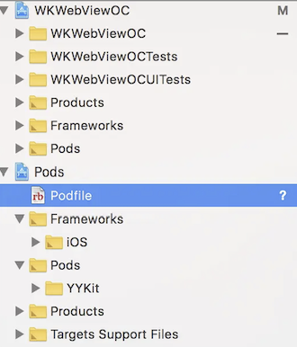

你会惊喜地发现，YYKit 已经成功导入项目了。

现在，你就可以开始使用YYKit类库啦。

在你的项目需要使用的地方中输入如下的导入语句即可：

```
#import <YYKit/YYKit.h>
```

#### 1.3.5.1. 解决 file not found

如果发现如下所示的问题，编译报 `file not found` 错误：

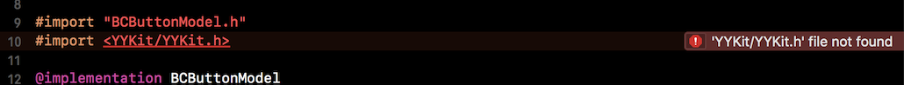

解决：

`Project->Info->Configurations` 中，在 `Configurations` 里面把 `Debug` 和 `Release` 的 `Tests` 的 `None` 改为 `pods` ，`clean`一下即可。

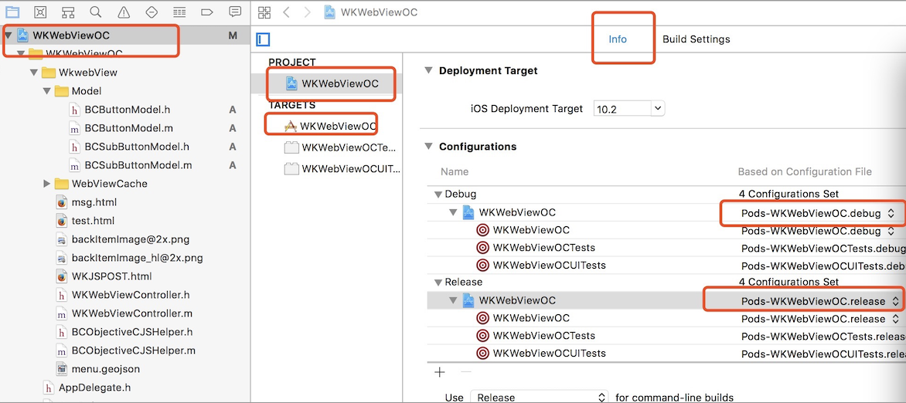

## 1.4. 更多

更多 pods 相关内容可查看官方介绍：[https://guides.cocoapods.org/](https://guides.cocoapods.org/)

> CnPeng：下面这两个云山雾绕的，没看明白。

### 1.4.1. podfile 中指定source

最新版的MacOS Catalina系统命令行执行pod setup命令直接结束啦；
莫着急，我们手动安装本地库，速度绝对快

命令行执行以下操作

```bash
git clone https://github.com/CocoaPods/Specs.git ~/.cocoapods/repos/trunk --depth 1

git clone https://github.com/CocoaPods/Specs.git master --depth 1

git clone --depth=1  https://github.com/CocoaPods/Specs.git master

git clone git://github.com/CocoaPods/Specs.git ~/.cocoapods/repos/trunk
```


CDN: trunk URL couldn’t be downloaded: https://raw.githubusercontent.com/CocoaPods/Specs/master/Specs/f/e/9/CocoaMQTT/1.0.0/CocoaMQTT.podspec.json

由于项目是用 CocoaPods 管理，CocoaPods 1.8 以后将 CDN 切换为默认的 spec repo 源，并附带一些增强功能！

CDN支持最初是在 1.7 版本中引入的，最终在 1.7.2 中完成。 它旨在大大加快初始设置和依赖性分析。

按照官方文档 podfile 文件中添加 source 源：

`source ‘https://github.com/CocoaPods/Specs.git’`

### 1.4.2. 修复 pod search 异常

podfile 文件中添加 source 源后，`pod install` 和 `pod update` 可以正常操作，但是 `pod search` 有些库却不正常

解决办法：

* podfile 文件中指定 source 源为 master ：

`source ‘https://github.com/CocoaPods/Specs.git’`

* 执行 `pod repo remove trunk` 移除 trunk 源

执行完后，pod search 就都正常了！

```bash
kinglydeMacBook-Pro:repos kingly$ pod repo list

master
- Type: git (master)
- URL:  https://github.com/CocoaPods/Specs.git
- Path: /Users/kingly/.cocoapods/repos/master

1 repo
kinglydeMacBook-Pro:repos kingly$
```

注意：podfile 文件中一定要指定 master 源，因为现在默认是 trunk 源.
