# 1. 005-初次运行新下载项目

> 基于 Xcode 14.3，项目使用 pod 进行依赖管理。

clone 项目到本地后，如果是初次运行，大致需要执行如下步骤：

## 1.1. 安装 cocoapods

如果有梯子，可以参考[cocoapods.org](https://cocoapods.org/)官方文档，在终端中执行：`sudo gem install cocoapods`。

如果没有梯子可以参考：[《005-1-安装Cocoapods》](./005-1-安装Cocoapods.md)

## 1.2. 安装依赖

打开终端，切换到项目根目录下，然后执行 `pod install` 命令，该命令用于安装项目所需的依赖，安装过程可能会较长。

如果在执行上述命令是出现：` Couldn't determine repo type for URL: `https://cdn.cocoapods.org/`: Net::OpenTimeout` 的报错，具体如下：


则找到项目目录中的 `Podfile` 文件，使用文本编辑器打开该文件，并在其中添加 `source 'https://cdn.cocoapods.org/'` 以启用  CDN 支持（[Cocoapds 从 1.7.2 开始支持 CDN 模式](https://blog.cocoapods.org/CocoaPods-1.7.2/)）。保存并退出后，重新执行 `pod install` 即可。


## 1.3. 打开项目

打开 xcode ，然后选择 `open project or file` , 在弹出的目录选择框中切换到项目目录，然后选择 `项目名.xcworkspace` 进行打开。

选择 `项目名.xcworkspace` 进行打开！
选择 `项目名.xcworkspace` 进行打开！
选择 `项目名.xcworkspace` 进行打开！

## 1.4. 打包的前提操作

务必切换设备为 `Any iOS Device(arm64)` ，否则可能会提示找不到匹配的设备


## 1.5. 解决 no such module

在修改前，先确认是不是通过 `项目名.xcworkspace` 打开的项目！！！

在 build 或 archive 打包时，可能会出现 `no such module xxx` 的错误情况，此时，我们在 Finder (即 访达) 中切换到该项目根目录，然后右键点击 `Podfile` 文件，在右键菜单中选择 `文本编辑` 进入编辑状态。然后按照下图修改：


## 1.6. 解决 PhaseScriptExecution

打包过程冲如果出现 `PhaseScriptExecution` 错误，按照如下步骤修改：

在项目中搜索：  `source="$(readlink "${source}")"`

然后将搜索的结果替换为：`source="$(readlink -f "${source}")"`

## 1.7. 解决 File not fount：xx.a

打包过程中如果出现如下错误提示：

```
File not found: /Applications/Xcode-beta.app/Contents/Developer/Toolchains/XcodeDefault.xctoolchain/usr/lib/arc/libarclite_iphoneos.a
```


这是因为 更新到 xcode 14.3 后， arc 路径缺失导致 pod 的引用路径全部无法正常找到，需要重新创建该路径及文件。

步骤如下：

* 下载 [https://github.com/kamyarelyasi/Libarclite-Files](https://github.com/kamyarelyasi/Libarclite-Files) 中的内容，并解压缩。
* 切换到 `/Applications/Xcode.app/Contents/Developer/Toolchains/XcodeDefault.xctoolchain/usr/lib` 目录
* 检查上述目录中是否有 `arc` 目录，没有则创建
* 将第一步解压出来的 `.a` 文件拷贝到 `arc` 目录中

完成上述操作后，依次点击 `product`-`clean build folder`进行项目缓存清理。清理完成后，重新执行 `product`-`archive` 即可。


## 1.8. 其他报错

### 1.8.1. Kingfisher 报错

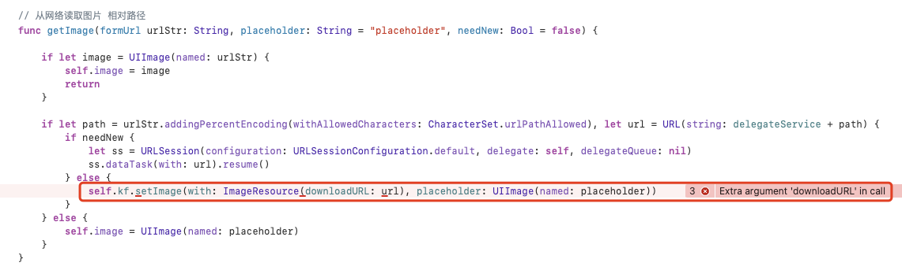

修改方式如下：

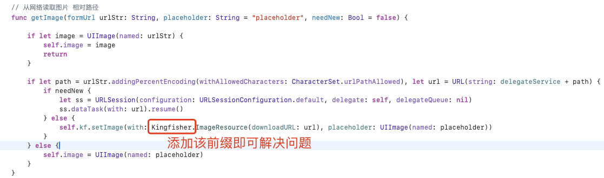

### 1.8.2. No Account for Team ...


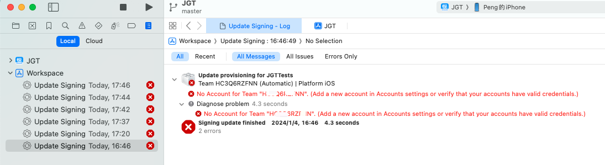

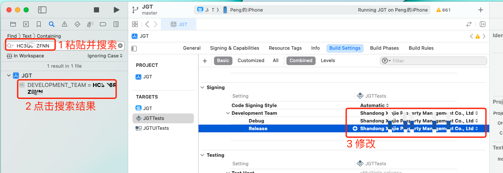

### 1.8.3. Sandbox: bash(53270) deny(1) file-read-data

Xcode15 编译报错

Sandbox: bash(53270) deny(1) file-read-data /Users/lzm/Desktop/CompanyProject/XXXX/Pods/Target Support Files/Pods-HuatiPro/Pods-XXXX-frameworks.sh

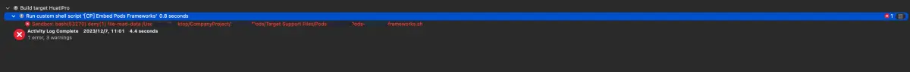

解决：
`build setting` 搜索 `ENABLE_USER_SCRIPT_SANDBOXING` ，将 `YES`（默认）改成`NO`

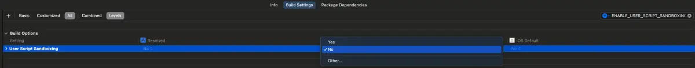

[https://www.jianshu.com/p/b3714f9c980a](https://www.jianshu.com/p/b3714f9c980a)

### 1.8.4. 升级到Xcode14和iOS16之后项目崩溃的解决

升级之后，在该环境下运行项目时进入 App 就会崩溃。错误信息提示为：

```
# 不再支持 VOIP!
Linked against modern SDK, VOIP socket will not wake. Use Local Push Connectivity instead
```

经过分析（全局搜索 voip）发现，项目中通过 pod 依赖的 `CocoaAsyncSocket` 库有使用 `VOIP` ,  `CocoaMQTT` 库又使用了 `CocoaAsyncSocket` ，MQTT 相关的内容都是基于 `CocoaMQTT` 编写的。

#### 1.8.4.1. 方案1

在当前项目中 MQTT 已经没有继续使用，所以可以将相关代码和依赖删除。

从 `Podfile` 文件中删除对 `CocoaAsyncSocket`、`CocoaMQTT`  的依赖，然后在终端中执行 `pod install` 彻底删除（该命令也是安装依赖的命令）。

然后删除项目中 MQTT 相关的代码。

重新运行项目，不再崩溃。

#### 1.8.4.2. 方案2

手动以本地项目的形式对 `CocoaAsyncSocket` 进行依赖，然后基于 iOS 版本确定继续使用 `VOIP` 还是使用 `Local Push Connectivity`。

> 具体实现方式待研究。

### 1.8.5. 管理私有仓库依赖项

注意：如果添加的是远程私有仓库，那么该仓库的访问地址必须是 `https` 协议的。

#### 1.8.5.1. 添加依赖项方式1：

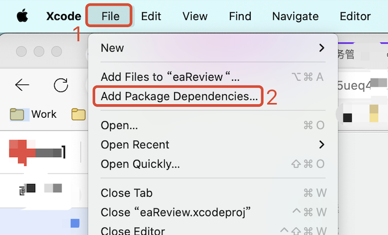

#### 1.8.5.2. 添加/删除依赖项方式2：

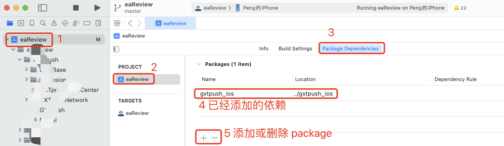

假如项目中之前使用的是网络依赖，但是由于某些原因网络依赖无法访问时（如：域名到期、Https证书到期等），此时，我们可以将 `package` 下载到本地，然后按照上面的方式2先删除原有的依赖，然后再添加本地依赖，具体如下：

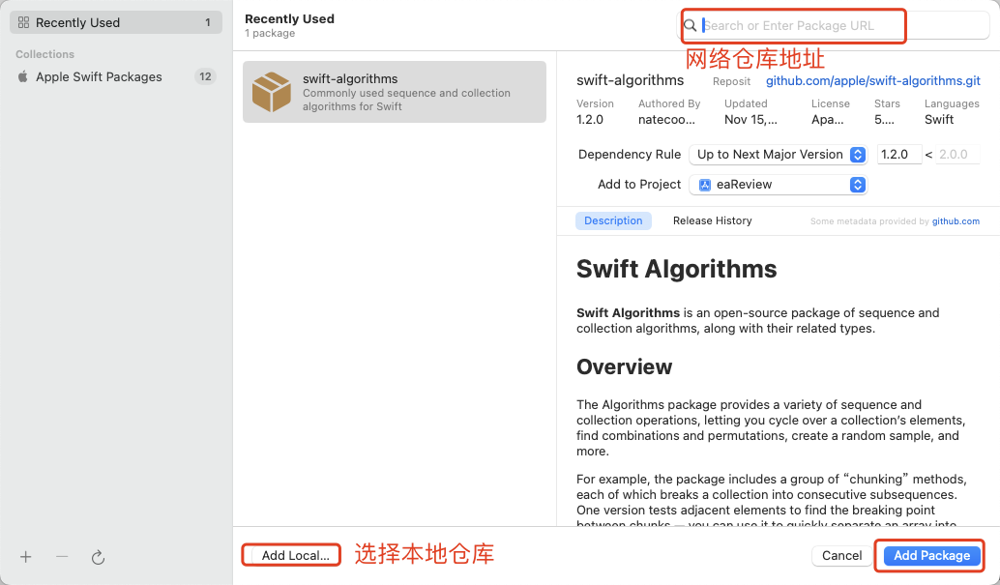

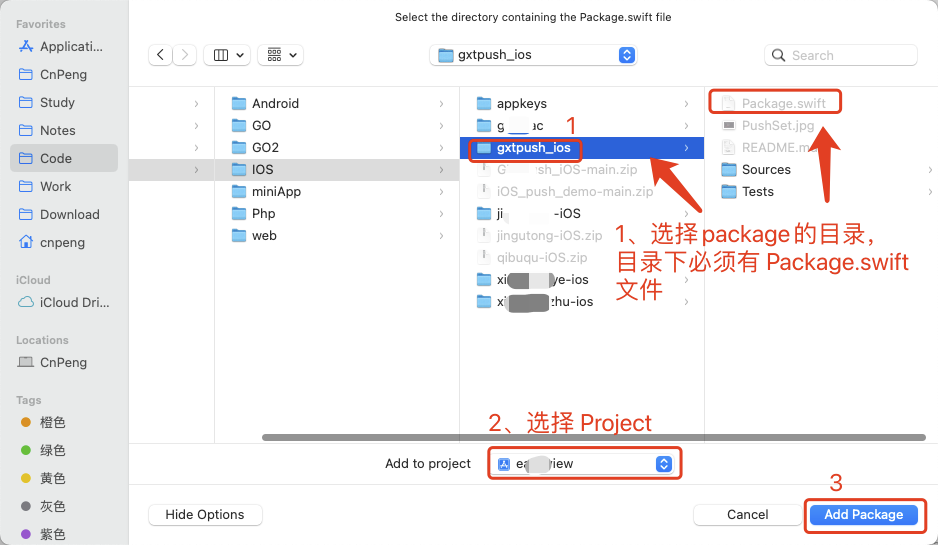

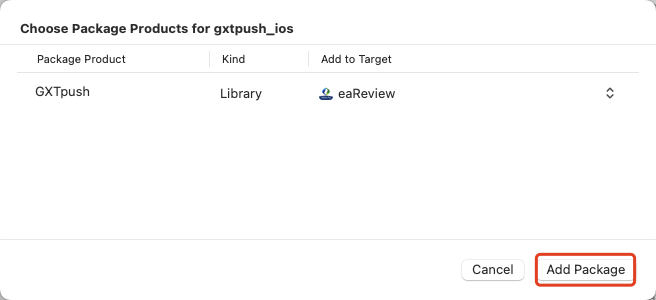

