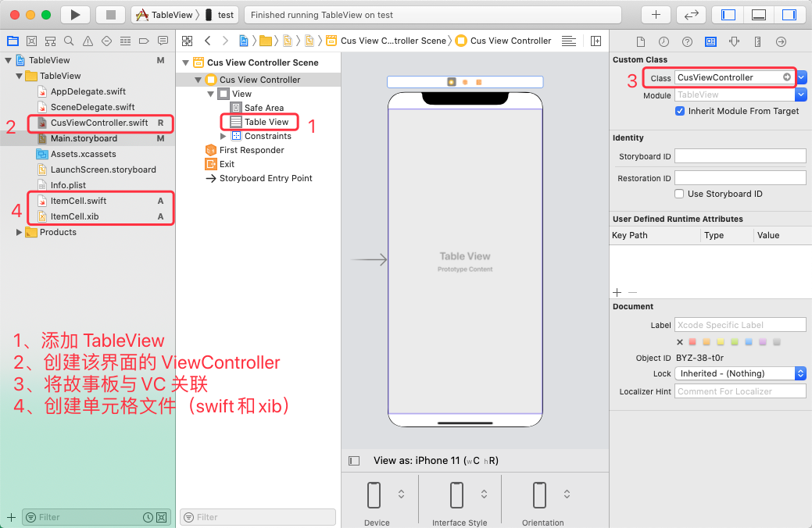
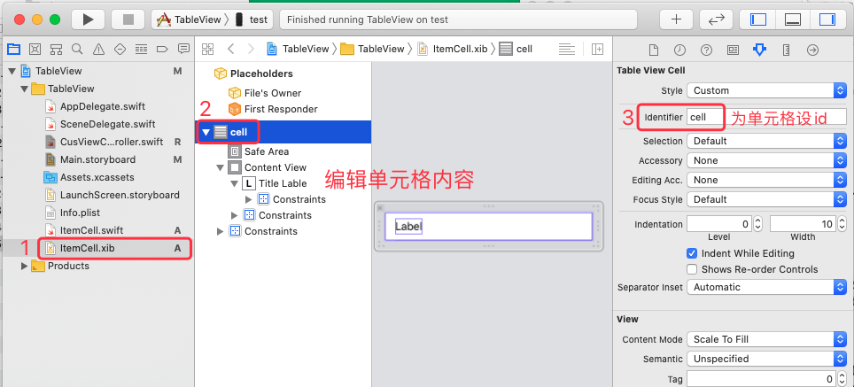
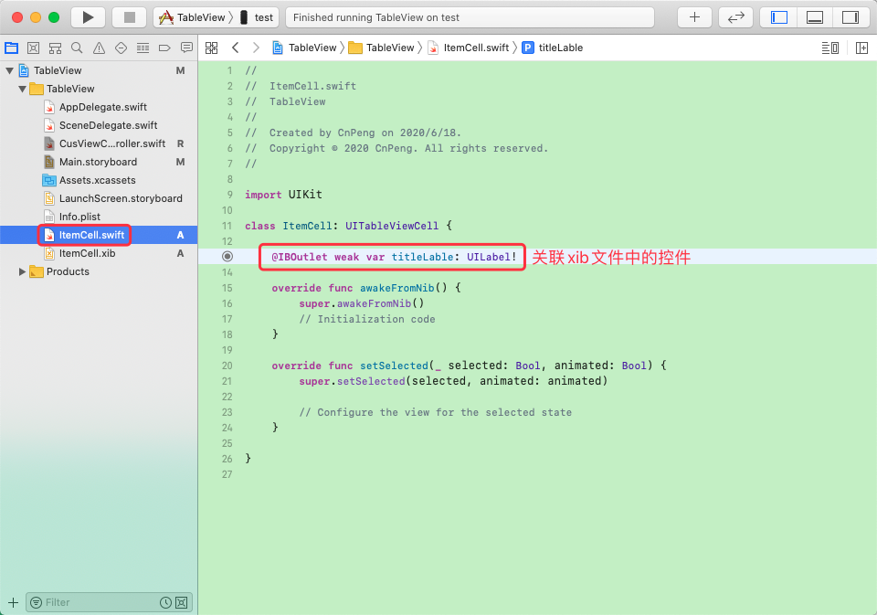
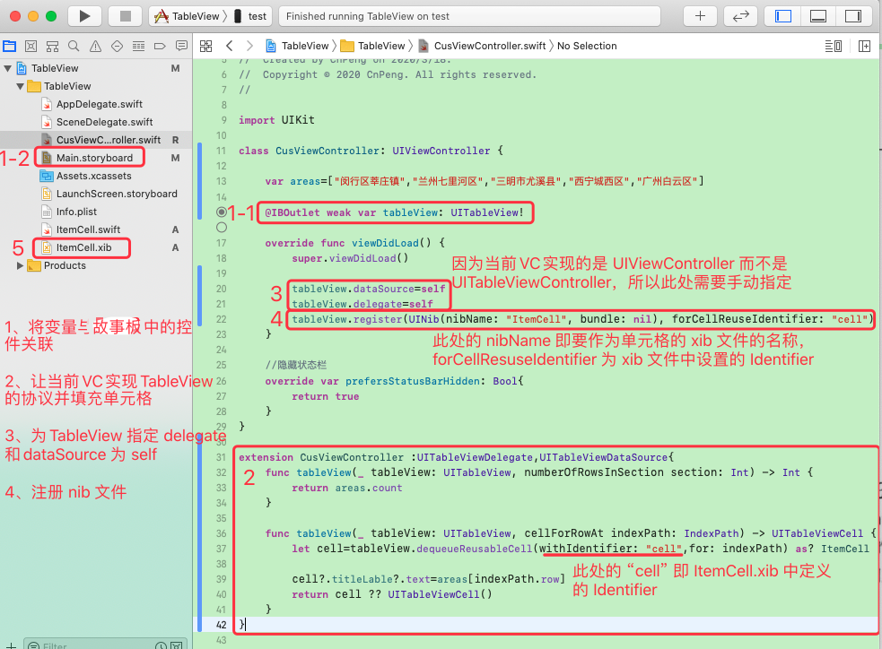

## 1. 引用 xib 

将单元格布局抽取为 xib 文件后，引用方式参考下图：









在通过 `tableView.register()` 注册单元格时，也可以按如下方式写：

```swift
// 需要注意的是，在 xib 中其 Identifier 也设置成了类名。
tableView.register(UINib(nibName:String(describing:MyCell.self),bundle:nil),forCellReuseIdentifier:String(describing:MyCell.self))
```

## 2.其他相关

[1-XIB的创建和使用.md](../xib文件/1-XIB的创建和使用.md)