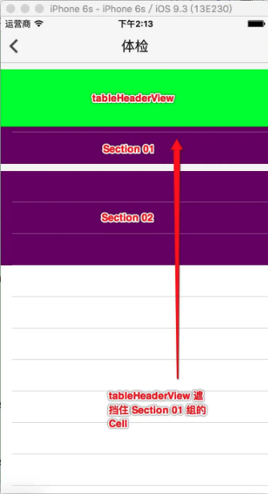
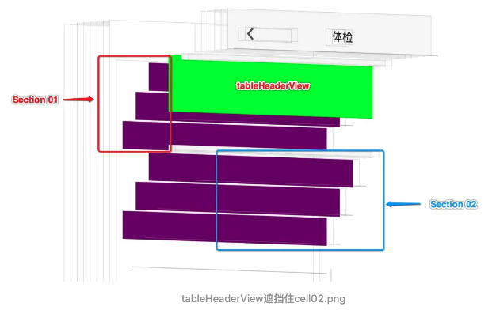

## 1.问题

* 问题现象



* 视图分析



* 问题代码

```swift
tableView.tableHeaderView = headView
headView.frame=CGRect(x:0,y:0,width:Int(UIScreen.main.bounds.width),height:267)
```

tableHeaderView 遮挡单元格的本质是：frame 发生变化之后，视图没有刷新。

## 2.解决方案

### 2.1 frame 能提前确定的情况

先构建好 headView 的 frame , 然后再设置

```swift
headView.frame=CGRect(x:0,y:0,width:Int(UIScreen.main.bounds.width),height:267)
tableView.tableHeaderView = headView
```

### 2.2 frame 动态变化的情况

如果确实需要在 `tableView.tableHeaderView = headView` 之后去调整 frame , 那么在调整完 frame 之后，必须重新调用 `tableView.tableHeaderView = headView` 。如下：

```swift
let headView = FindHeadView(frame:CGRect(x:0,y:0,width:Int(UIScreen.main.bounds.width),height:267))
tableView.tableHeaderView = headView

headView.headCollectionVC?.itemsDelegate.delegate(on: self, block: {
    (self,collectionItems) in
    print("collectionItems:\(collectionItems)")
    headView.hrProgressView.isHidden=collectionItems<=5

    if collectionItems>5{
        headView.frame.height=283
    }
    tableView.tableHeaderView = headView
})
```


[参考：iOS-UITableView 之 tableHeaderView 遮挡后面 cell 的问题](https://www.jianshu.com/p/9250aa13aa85)

