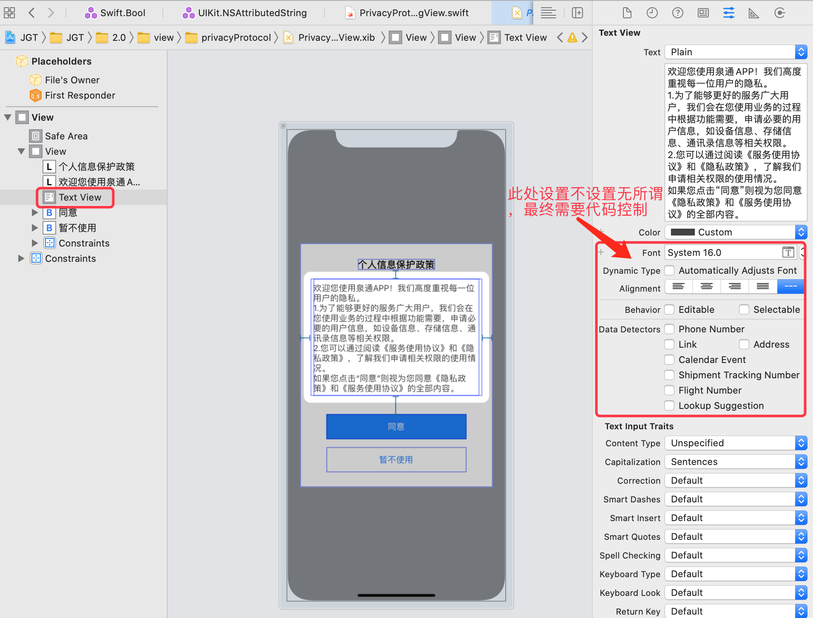
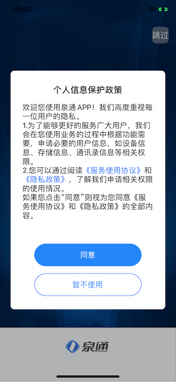

注意：textView 的 `isSelectable`  必须设置为 true，否则 UITextViewDelegate 中的方法不会被触发。


```swift
class PrivacyProtocolDialogView: UIView,XibViewType {
    var contentView: UIView!
    var attachedVc:UIViewController?
    
    /// 暂不使用按钮的点击事件
    var onDisAgree:(()->Void)?
    /// 同意按钮的点击事件
    var onAgree:(()->Void)?
    
    @IBOutlet weak var textView: UITextView!{
        didSet{
            self.textView.isUserInteractionEnabled = true
            // 必须是可选的，否则，UITextViewDelegate 中的内容不被触发
            self.textView.isSelectable = true
            // 文本与容器的边距
            self.textView.textContainerInset = UIEdgeInsets(top: 0,left: 0,bottom: 0,right: 0)
            self.setLinkText()
            self.textView.delegate = self
        }
    }
    @IBOutlet weak var disArgeeBtn: UIButton!{
        didSet{
            self.disArgeeBtn.makeBorder(width: 1, color: UIColor.brand)
        }
    }
    override init(frame: CGRect) {
        super.init(frame: frame)
        self.initSubView()
    }
    
    required init?(coder: NSCoder) {
        super.init(coder: coder)
        self.initSubView()
    }
    
    @IBAction func onAgreeBtnClick(_ sender: UIButton) {
        // 同意按钮被点击了，关闭该视图
        self.onAgree?()
        self.removeFromSuperview()
    }
    
    @IBAction func onDisAgreeBtnClick(_ sender: UIButton) {
        // 暂不使用
        self.onDisAgree?()
        self.removeFromSuperview()
    }
    
    static func show(in vc:UIViewController,onDisAgree:(()->Void)?,onAgree:(()->Void)?){
        let dialogView = PrivacyProtocolDialogView(frame: vc.view.frame)
        dialogView.onDisAgree = onDisAgree
        dialogView.onAgree = onAgree
        dialogView.removeRecur(in: vc)
        vc.view.window?.addSubview(dialogView)
        dialogView.attachedVc = vc
    }
}

extension PrivacyProtocolDialogView:UITextViewDelegate{
    
    func textView(_ textView: UITextView, shouldInteractWith URL: URL, in characterRange: NSRange, interaction: UITextItemInteraction) -> Bool {
        if let scheme = URL.scheme{
            switch scheme {
            case  "serviceProtocol":
                //TODO 通过 vc 跳转到 对应的服务协议页面
                print("服务协议被点击了")
            case "privacyProtocol":
                //TODO 通过 vc 跳转到 对应的隐私协议页面
                print("隐私协议被点击了")
            default:
                break
            }
        }
        
        // 此处 true 和 false 都可以响应点击事件。true 的时候，点击后链接文本背景会有变化；false 时背景无变化
        return false
    }
}

extension PrivacyProtocolDialogView{
    
    func setLinkText(){
        let linkStr = "欢迎您使用泉通APP！我们高度重视每一位用户的隐私。\n1.为了能够更好的服务广大用户，我们会在您使用业务的过程中根据功能需要，申请必要的用户信息，如设备信息、存储信息、通讯录信息等相关权限。\n2.您可以通过阅读《服务使用协议》和《隐私政策》，了解我们申请相关权限的使用情况。\n如果您点击“同意”则视为您同意《服务使用协议》和《隐私政策》的全部内容。"
        
        guard let toIndexObj = linkStr.firstIndex(of: "《") else {
            return
        }
        
        // 计算超链接文本的索引位置
        let firstIndex = linkStr.distance(from:linkStr.startIndex,to:toIndexObj)
        let secondIndex = firstIndex + 8 + 1
        
        let attributedString = NSMutableAttributedString(string: linkStr)
        // 指定超链接文本的链接地址以及超链接文本的范围
        attributedString.addAttribute(NSAttributedString.Key.link, value:  "serviceProtocol://", range: NSRange(location: firstIndex, length: 8) )
        attributedString.addAttribute(NSAttributedString.Key.link, value: "privacyProtocol://", range: NSRange(location: secondIndex, length: 6) )
        // 设置文本字体样式
        attributedString.addAttribute(NSAttributedString.Key.font, value: UIFont.systemFont(ofSize: 16), range: NSRange(location: 0, length: attributedString.length))
    
        // 配置超链接文本色
        self.textView.linkTextAttributes = [NSAttributedString.Key.foregroundColor:UIColor.brand]
        
        // 配置超链接文本色和下划线样式
        //self.textView.linkTextAttributes = [NSAttributedString.Key.foregroundColor:UIColor.brand,NSAttributedString.Key.underlineStyle:NSUnderlineStyle.single.rawValue]
        
        self.textView.attributedText = attributedString
    }
}
```

xib 的结构示意：



最终效果：




在上述`XibViewType` 是一个自定义的包装类，完整实现如下：

```swift

import Foundation
import UIKit

protocol XibViewType: class {
    var contentView: UIView! { get set }
}

extension XibViewType where Self: UIView {
    
    func initSubView(tagType: XibViewTagType = .alert) {
        //提示消息身份标识
        self.tag = tagType.tag
        contentView = loadViewFromNib()
        contentView.layer.masksToBounds = true
        addSubview(contentView)
        addConstraints(childView: contentView, parentView: self)
    }
    
    func loadViewFromNib() -> UIView {
        let className = type(of: self)
        let bundle = Bundle(for: className)
        let name = NSStringFromClass(className).components(separatedBy: ".").last
        let nib = UINib(nibName: name!, bundle: bundle)
        let view = nib.instantiate(withOwner: self, options: nil).first as! UIView
        return view
    }
    
    func addConstraints(childView child: UIView, parentView parent: UIView) {
        child.translatesAutoresizingMaskIntoConstraints = false
        child.leftAnchor.constraint(equalTo: parent.leftAnchor).isActive = true
        child.topAnchor.constraint(equalTo: parent.topAnchor).isActive = true
        child.rightAnchor.constraint(equalTo: parent.rightAnchor).isActive = true
        child.bottomAnchor.constraint(equalTo: parent.bottomAnchor).isActive = true
    }
    
    ///重复过滤
    func removeRecur(in vc: UIViewController) {
        vc.view.window?.subviews
            .filter { $0.tag == self.tag }
            .forEach { $0.removeFromSuperview() }
    }
    
    //重复过滤，当前视图的子视图
    func removeRecur(in view: UIView) {
        view.subviews
            .filter { $0.tag == self.tag }
            .forEach { $0.removeFromSuperview() }
    }
}

enum XibViewTagType {
    case alert
    case subView
    case networkCheck
    case card
    case empty
    
    var tag: Int {
        switch self {
        case .alert:
            return 444
        case .subView:
            return 999
        case .networkCheck:
            return 2
        case .card:
            return 998
        case .empty:
            return 997
        }
    }
}
```

参考文章：

[iOS文本实现超链接](https://blog.csdn.net/MinggeQingchun/article/details/77894277)

[Swift - 给UITextView添加自定义链接，以及链接的点击响应](https://www.hangge.com/blog/cache/detail_1104.html)

[Swift - 修改UITextView中链接的样式（链接颜色、下划线样式）](https://www.hangge.com/blog/cache/detail_1671.html)