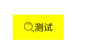
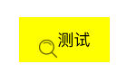
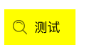

## 1.1 [UIButton的imageEdgeInsets 和 titleEdgeInsets](https://www.cnblogs.com/acBool/p/5671806.html)


我们知道，在UIButton中有一个UILabel和一个UIImageView,同时还有属性： titleEdgeInsets，imageEdgeInsets。介绍下 imageEdgeInsets 和 titleEdgeInsets 的用法。

### 1.1.1 UIEdgeInsets
　
　　首先，titleEdgeInsets 和 imageEdgeInsets 都是 UIEdgeInsets类型。UIEdgeInsets 是一个结构体，定义如下：

```swift
typedef struct UIEdgeInsets {
    CGFloat top, left, bottom, right;  
} UIEdgeInsets;
```

四个值依次是：上、左、下、右，代表的是距离上边界、左边界、下边界、右边界的位移，默认都是0。

示例
　　首先创建一个button，button有image和title，代码如下：

```swift
UIButton *searchBtn = [[UIButton alloc] initWithFrame:CGRectMake(50,100,100,50)];
searchBtn.backgroundColor = [UIColor yellowColor];
[self.view addSubview:searchBtn];
UIImage *searchImage = [UIImage imageNamed:@"search"];
[searchBtn setImage:searchImage forState:UIControlStateNormal];
[searchBtn setTitle:@"测试" forState:UIControlStateNormal];
[searchBtn setTitleColor:[UIColor blackColor] forState:UIControlStateNormal];
```

此时，button的形状是默认的，如下：




设置一下button 的 imageEdgeInsets：

```swift
[searchBtn setImageEdgeInsets:UIEdgeInsetsMake(20, 0, 0, 0)];
```

含义是：image距离上侧的边距增加20，也就是image向下偏移20，此时button的形状如下：




```swift
[searchBtn setImageEdgeInsets:UIEdgeInsetsMake(0, -20, 0, 0)];
```

含义：image距左侧的边距减少20，也就是image向左偏移20，此时button的形状如下：



```swift
[searchBtn setImageEdgeInsets:UIEdgeInsetsMake(0, 0, 0, -20)];
```

含义：image距右侧的距离减少20，也就是image向右偏移20，此时button的形状如下：


```swift
[searchBtn setImageEdgeInsets:UIEdgeInsetsMake(0,0,20,0)];
```

含义：距离下侧的距离增加20，也就是image向上偏移20，此时button的形状如下：


至此，UIButton 的 imageEdgeInsets 里面的四个参数代表的含义已经非常清楚了，同理，titleEdgeInsets的四个参数代表的含义也是一样的。

### 1.1.2 文字和图片位置互换
　　
　　理解了 imageEdgeInsets 和 titleEdgeInsets，现在实现将文字和图片位置互换。

　　第一步：把image移到右面，相当于上侧和下侧不变，左侧增加一段距离，右侧减少一段距离；

　　第二步：把title移到左面，相当于上侧和下侧不变，左侧减少一段距离，右侧增加一段距离；

首先算出图片和文字的宽度：

```swift
CGFloat imageWidth = searchImage.size.width;
[searchBtn.titleLabel sizeToFit];
CGFloat titleWidth = searchBtn.titleLabel.frame.size.width;
```

把image 移到右面：

```swift
[searchBtn setImageEdgeInsets:UIEdgeInsetsMake(0,titleWidth,0,-titleWidth)];
```

把title 移到左面：

```swift
[searchBtn setTitleEdgeInsets:UIEdgeInsetsMake(0,-imageWidth,0,imageWidth)];
```

最后的效果图：


## 1.2 [iOS设置UIButton文字显示位置和字体大小、颜色的方法](http://www.manongjc.com/article/128583.html)

### 1.2.1 iOS设置UIButton的字体大小

```swift
btn.frame = CGRectMake(x, y, width, height);
[btn setTitle: @"search" forState: UIControlStateNormal];
//设置按钮上的自体的大小
//[btn setFont: [UIFont systemFontSize: 14.0]]; //这种可以用来设置字体的大小，但是可能会在将来的SDK版本中去除改方法
//应该使用
btn.titleLabel.font = [UIFont systemFontOfSize: 14.0];
[btn seBackgroundColor: [UIColor blueColor]];
//最后将按钮加入到指定视图superView
[superView addSubview: btn];
```

### 1.2.2 iOS设置UIButton的文字显示位置

```swift
tvnamelabel=[[UIButton alloc]initWithFrame:CGRectMake(5,5,200,40)];
```

这样初始化的button，文字默认颜色是白色的，所有如果背景也是白色的话，是看不到文字的，

```swift
btn.contentHorizontalAlignment=UIControlContentHorizontalAlignmentLeft ;//设置文字位置，现设为居左，默认的是居中
[btn setTitle:@“title”forState:UIControlStateNormal];// 添加文字
```

有些时候我们想让UIButton的title居左对齐，我们设置

```swift
btn.textLabel.textAlignment = UITextAlignmentLeft
```

是没有作用的，我们需要设置

```swift
btn.contentHorizontalAlignment = UIControlContentHorizonAlignmentLeft;
```

但是问题又出来，此时文字会紧贴到做边框，我们可以设置

```swift
btn.contentEdgeInsets = UIEdgeInsetsMake(0,10, 0, 0);
```

使文字距离做边框保持10个像素的距离。

### 1.2.3 iOS设置UIButton的字体颜色

设置UIButton上字体的颜色设置UIButton上字体的颜色，不是用：

```swift
[btn.titleLabel setTextColor:[UIColorblackColor]];
btn.titleLabel.textColor=[UIColor redColor];
```

而是用：

```swift
[btn setTitleColor:[UIColor blackColor]forState:UIControlStateNormal];
```

## 1.3 Swift 实际操作

```swift
// MARK: - 通用视图
extension UIViewController {
    
    /// 提示网络请求失败
    func showNoNetworkTip() {
        DispatchQueue.main.asyncAfter(deadline: DispatchTime.now() + 0.3) {
            // AlertWithCancelView.show(in: self, with: "网络请求失败，请检查网络设置。") {
            //     UIApplication.shared.open(URL.init(string: UIApplication.openSettingsURLString)!)
            // }
            
            let btn = UIButton(frame: CGRect(x: 0, y: 0, width: screen_width, height: 40))
            btn.setTitle ("无网络连接，通行二维码可正常使用！",for:.normal)
            btn.setTitleColor(UIColor.white, for: .normal)
            btn.setImage(UIImage(named: "notice_next"), for: .normal)
            btn.backgroundColor = UIColor(red: 0, green: 0, blue: 0, alpha: 0.15)
            btn.addTarget(self, action: #selector(self.goToNetSettingPage), for: .touchUpInside)
            btn.titleLabel?.font = .n3
            
            let titleW = btn.titleLabel?.frame.size.width ?? 0
            let imageW = btn.imageView?.frame.width ?? 0
            
            btn.imageEdgeInsets = UIEdgeInsets(top: 0, left: titleW , bottom: 0, right: -titleW)
            btn.titleEdgeInsets = UIEdgeInsets(top: 0, left: -imageW, bottom: 0, right: imageW)
    
            guard let window = self.view.window else {
                return
            }
            window.addSubview(btn)
            
            btn.translatesAutoresizingMaskIntoConstraints = false
            btn.leftAnchor.constraint(equalTo: window.leftAnchor).isActive = true
            btn.rightAnchor.constraint(equalTo:window.rightAnchor).isActive = true
            if #available(iOS 11.0, *) {
                btn.topAnchor.constraint(equalTo: window.safeAreaLayoutGuide.topAnchor, constant: 0).isActive = true
            } else {
                btn.topAnchor.constraint(equalTo: window.topAnchor, constant: 24).isActive = true
            }
            btn.heightAnchor.constraint(equalToConstant: 40).isActive = true
        }
    }
    
    /// 打开系统设置
    @objc func goToNetSettingPage(){
        UIApplication.shared.open(URL.init(string: UIApplication.openSettingsURLString)!)
    }
}
```