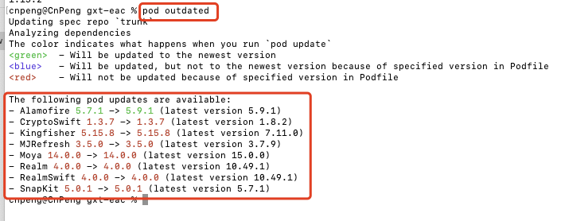
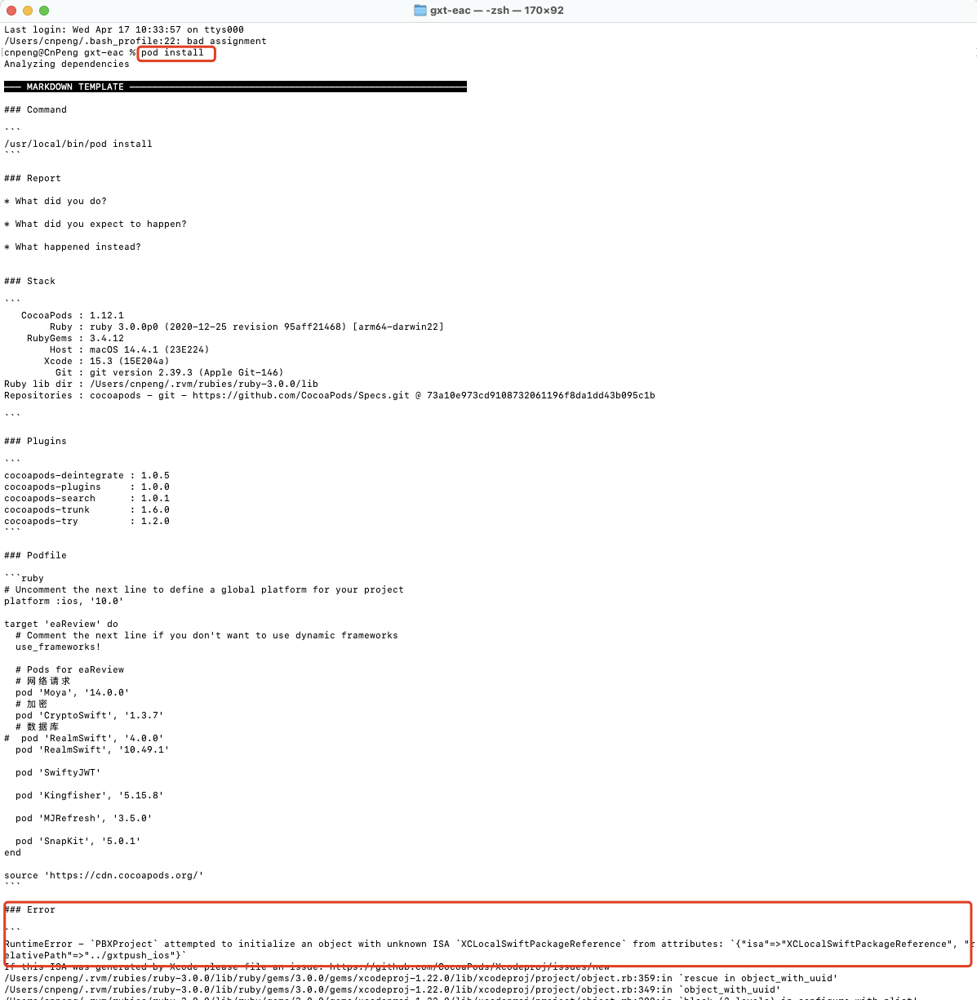
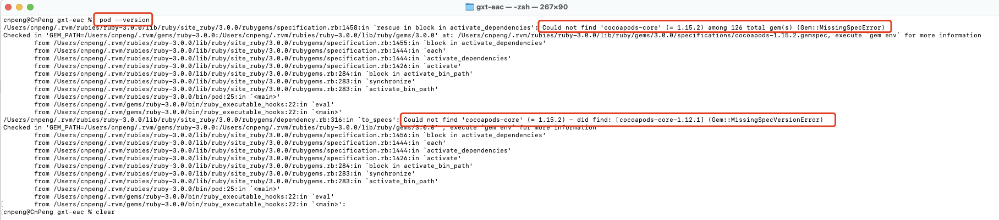
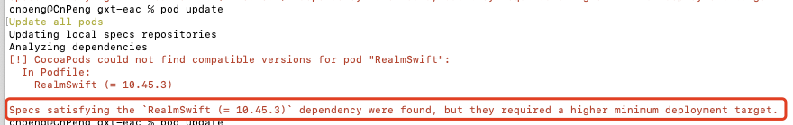
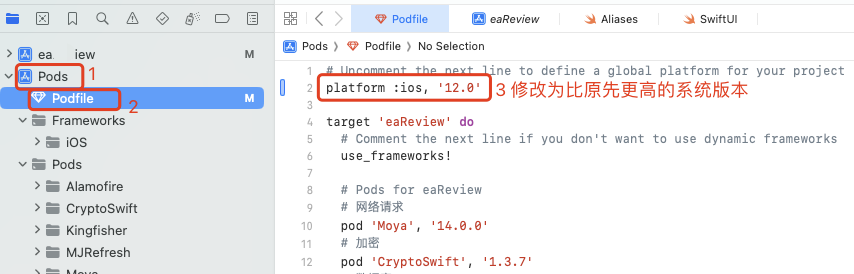

# 1. 001-pod基础命令

## 1.1. 基础命令

在iOS项目中，最常用的方式是通过CocoaPods来管理依赖项的更新。以下是如何使用CocoaPods更新依赖库的步骤：

### 1.1.1. **查看依赖项状态**：

在项目根目录下打开终端，执行以下命令来查看哪些依赖库有可用的更新：

```bash
pod outdated
```

这个命令会列出所有过时的依赖库及其当前版本和最新版本。



### 1.1.2. **更新Podfile**：

如果你想更新所有的依赖库至最新兼容版本，可以直接编辑`Podfile`文件，将具体的版本号替换为`~>`或`^`符号来允许自动更新到最新的次要或主要版本（取决于语义版本控制策略）。


### 1.1.3. **更新依赖**：

更新Podfile之后，保存并关闭文件，然后在终端中运行以下命令来更新依赖库：

```bash
pod update
```

这个命令将会查找 Podfile.lock 中指定的每个依赖库是否有可用的新版本，并安装最新版本。如果指定了具体版本，则只会更新至指定版本。

### 1.1.4. **安装更新**：

在某些情况下，可能需要先清理旧的依赖缓存然后再安装新版本，可以依次执行：

```bash
pod cache clean --all # 清理缓存（非必要步骤，但在某些情况有助于解决依赖问题）
pod install # 安装新的依赖版本
```

### 1.1.5. **验证项目**：

更新完成后，确保打开`.xcworkspace`而不是`.xcodeproj`来加载包含新依赖的项目，并进行构建和测试，确保更新后的依赖库与项目兼容并且没有引入新的问题。

注意：在更新依赖前，请务必阅读新版本的变更日志和发行说明，以了解可能影响现有代码的功能变化、API调整或已知问题。对于生产环境的项目，谨慎对待依赖更新是很重要的，确保新版本经过充分的测试后再投入生产使用。

## 1.2. 依赖库的版本号管理


### 1.2.1. 版本管理


在iOS项目的Podfile中，管理依赖包的版本号可以通过几种不同的语法来实现，具体取决于你希望对版本控制的严格程度。以下是几种常见的指定版本号的方式：

1. **精确版本**：指定确切的版本号。

   ```ruby
   pod 'AFNetworking', '3.2.1'
   ```
   这会锁定AFNetworking库到3.2.1版本。

2. **波浪线(`~>`)操作符**：指定最小版本及其允许的最大次要或补丁版本更新。

   ```ruby
   pod 'AFNetworking', '~> 3.2'
   ```
   这意味着会获取3.2及之后，但低于4.0的所有版本。这允许次要版本和补丁版本的自动更新。

3. **双波浪线(`~~>`)操作符**（不常用，但理解概念）：与单波浪线类似，但在某些特定场景下有细微差别，通常用于Rubygems中。

4. **大于等于号(`>=`)和小于号(`<`)**：结合使用来定义一个版本范围。

   ```ruby
   pod 'AFNetworking', '>= 3.0', '< 4.0'
   ```
   这会安装3.0及以上但低于4.0的任何版本。

5. **逗号分隔的版本范围**：指定多个版本范围。

   ```ruby
   pod 'AFNetworking', '> 2.0', '< 3.0'
   ```
   这将匹配大于2.0且小于3.0的所有版本。

6. **使用标记（如beta或rc版本）**：

   ```ruby
   pod 'Alamofire', '5.0.0-beta.3'
   ```
   直接指定预发布版本。

在编写Podfile时，根据项目需求选择合适的版本控制策略是非常重要的，既可以保持依赖的稳定性，又可以灵活地接收安全更新和新功能。记得在更改Podfile后运行`pod install`或`pod update`命令来应用更改。

### 1.2.2. 更新到最新版本


在 iOS 项目的 Podfile 中，如果您希望某个依赖包总是更新到最新版本，您可以不指定具体的版本号或者指定一个宽松的版本范围。这里有几种方式可以做到这一点：

#### 1.2.2.1. **不指定版本号**：

如果您希望始终使用远程仓库中的最新版本，可以直接写出依赖库的名字，不指定版本号。这种方式适用于快速迭代的开发环境，但不建议在生产环境中使用，因为新版本可能引入未预期的更改。

   ```ruby
   pod 'SomeLibrary'
   ```

#### 1.2.2.2. **使用波浪线(~>)指定版本范围**：

   波浪线操作符可以帮助您指定一个兼容的版本范围。例如，`~> 1.2` 表示会获取大于或等于1.2且小于2.0的所有版本（即1.x的最新版本）。

   ```ruby
   pod 'SomeLibrary', '~> 1.2'
   ```

#### 1.2.2.3. **使用最高版本号**：

   您也可以指定一个明确的最高版本号，如`'~> 2.5.0'`，这会获取从2.5.0开始直到但不包括3.0的任何版本。

#### 1.2.2.4. **定期执行`pod update`**：

   即使在Podfile中指定了版本范围，您仍需要定期执行`pod update SomeLibrary`命令来实际更新到范围内最新的版本。如果您想更新所有依赖到它们的最新兼容版本，可以运行`pod update`而不指定具体库名。

请注意，为了保持项目稳定性和兼容性，通常建议指定一定的版本范围而不是直接使用最新版本。这样可以在享受新功能的同时，减少引入潜在问题的风险。在开发初期或测试环境下使用最新版本可能更为合适，而在准备发布或维护稳定版本时，则应锁定到具体的版本号或较为严格的版本范围。


## 1.3. 常见问题

### 1.3.1. `PBXProject` attempted to initialize an object with unknown ISA

#### 1.3.1.1. 现象

在执行 `pod install` 或 `pod update` 时报错 ：

```
RuntimeError - `PBXProject` attempted to initialize an object with unknown ISA `XCLocalSwiftPackageReference` from attributes: `{"isa"=>"XCLocalSwiftPackageReference", "relativePath"=>"../gxtpush_ios"}`
```

具体如下：



#### 1.3.1.2. 解决

在终端中执行 `gem update xcodeproj` , 然后即可正常执行 `pod update` 或 `pod install` 命令。

参考：[https://github.com/CocoaPods/CocoaPods/issues/12136](https://github.com/CocoaPods/CocoaPods/issues/12136)


### 1.3.2. 找不到合适的 `cocoapods-core`

#### 1.3.2.1. 现象

电脑中原有 1.12.1 版本的  cocoapods , 然后执行 `sudo gem install cocoapods` 命令安装新版 cocoapods 后，再执行 pod 相关命令时报错，错误信息为：

```
Could not find 'cocoapods-core' (= 1.15.2) among 126 total gem(s) (Gem::MissingSpecError)
```

具体如下图：



#### 1.3.2.2. 解决方案

这个错误信息指出在 Ruby 环境中无法找到指定版本（1.15.2）的 `cocoapods-core` gem，但找到了 1.12.1 版本。要解决这个问题，可以尝试以下步骤：

* **升级CocoaPods到最新版本**：
   有时是因为CocoaPods或其依赖项版本不匹配导致的。在终端中执行以下命令以升级CocoaPods到最新版本：

```shell
   gem update cocoapods
```

* **指定版本安装CocoaPods及core**：
   如果需要特定版本，可以明确指定版本安装：

```shell
   gem install cocoapods -v 1.15.2
   gem install cocoapods-core -v 1.15.2
```

* **清理并重新安装**：
   如果仍有问题，可以尝试先清理gem缓存并重新安装CocoaPods：

```shell
   gem cleanup cocoapods
   gem uninstall cocoapods
   gem uninstall cocoapods-core
   gem install cocoapods
```

* **使用RVM切换或管理Ruby版本**：
   因为你的环境是在RVM管理下，确认Ruby版本3.0.0是你期望的版本，并且在这个版本下安装CocoaPods：

```shell
   rvm use ruby-3.0.0
   gem install cocoapods
```

*  **检查GEM_PATH环境变量**：
   根据错误信息，确保GEM_PATH环境变量指向正确的位置。如果有必要，可以修改环境变量，或检查`.rvmrc`、`.ruby-version`等相关文件，确保所用Ruby和gem存储路径正确。

* **排查.rvm/gems/ruby-3.0.0路径下的gemspec文件**：
   检查`.rvm/gems/ruby-3.0.0/specifications`目录下是否存在正确的`cocoapods-1.15.2.gemspec`文件，如果没有，可能是下载或安装过程中出现了问题。

按照以上步骤逐一排查和尝试，通常可以解决找不到指定版本 gem 的问题。如果问题依旧存在，可能需要进一步检查网络状况，或参考官方文档和社区讨论寻求帮助。

> 实际执行到 《指定版本安装CocoaPods及core》 时就已经解决了问题。

### 1.3.3. but they required a higher minimum deployment target


#### 1.3.3.1. 现象

执行 `pod install` 或者 `pod update` 时，提示：

```
Specs satisfying the `XXX (= aa.bb.cc)` dependency were found, but they required a higher minimum deployment target.
```



#### 1.3.3.2. 解决

这是因为项目目标系统版本过低，但依赖包要求更高系统版本，将 `Podfile` 中的系统版本调高即可。

在 `Pods`-`Podfile` 中调高 `platform:ios,` 的版本号（具体版本号根据实际需要进行调整）：




