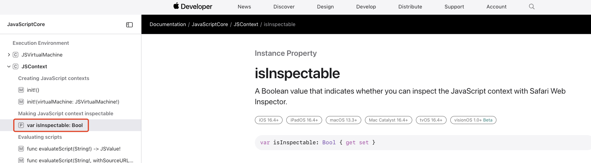

# 1. 002-iOS16.4之后无法使用safari调试的解决方案

## 1.1. 问题现象

iOS 设备系统升级到 16.4 之后，在 Safari 中进行调试时，一直不显示对应的 Web 页面。但是在低版本的 iOS 设备或模拟器上可以正常显示并进行调试。


## 1.2. 问题原因

按照官方文档 [isInspectable | Apple Developer Documentation](https://developer.apple.com/documentation/javascriptcore/jscontext/4111147-isinspectable) 中的描述，从 iOS 16.4 开始 WKWebView 增加了一个属性 `isInspectable`，该属性**用来控制是否可以使用 Safari 检查网页中的 JS Code, HTML 等内容**，该属性值默认 falss-关闭（不允许调试），若需要进行调试，则需要手动开启。




## 1.3. 解决方案

在代码中手动为 webView 实例指定 `isInspectable` 的值为 true：

```oc
// OC
if (@available(iOS 16.4, *)) {
    webView.inspectable = true;
} else {
    // Fallback on earlier versions
}
```


```swift
// Swift
if #available(iOS 16.4,*) {
    webView.isInspectable = true
} else {
    //Fallback on earlier versions
}

```

## 1.4. 参考


* [https://github.com/apache/cordova-ios/issues/1301](https://github.com/apache/cordova-ios/issues/1301)
* [iOS 16.4后 Safari 开发中不能调试Web页面](https://blog.csdn.net/siwen1990/article/details/130363477)