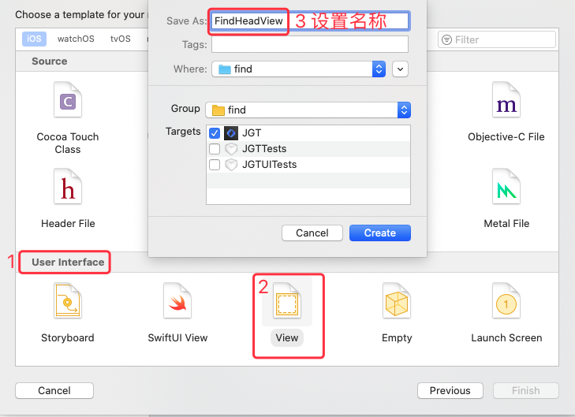

## 1 为 ViewController 创建关联的 xib 文件

`File -> New -> New File `  选择 `Cocoa Touch Class`，然后按照下图操作：


## 2 为 View 创建关联的 xib 文件

### 2.1 创建并关联 xib 文件

创建 xib 文件： `File -> New -> New File `  选择 `User Interface` 中的  `View` ，如下图：
 
 
 
 创建对应的 swift 文件，名称最好与 xib 文件的名称一致，步骤如下：
 
  `File -> New -> New File `  选择 `Cocoa Touch Class`：
  
  
  
  
  
  然后将 xib 文件与 swift 文件关联：
  
  
 
### 2.2 编辑初始化函数
 
 假设我们将上面定义的 xib 作为 TableView 的 tableHeadView ，则代码如下：
 
 ```swift
let headView = FindHeadView(frame:CGRect(x:0,y:0,width:UIScreen.main.bounds.width,height:267))
tableView.tableHeaderView = headView
 ```
 
 但是，我们运行之后会发现，xib 中的子视图并没有显示出来，这是因为我们还没有执行其初始化操作。做初始化时需要在编辑对应 swift 文件的 init 函数。需要编辑的 init 函数如下：
 
 ```swift
override init(frame: CGRect) {
        super.init(frame: frame)
        // 使用代码构建 xib 视图时会走此处逻辑
}
    
 required init?(coder: NSCoder) {
     fatalError("init(coder:) has not been implemented")
     // 关联故事板中的空白 View 到该 xib 视图时使用
 }
 ```
 
 其中，`init(frame: CGRect) ` 的实现如下：
 
```swift
override init(frame: CGRect) {
        super.init(frame: frame)
        initSubView()
}
 
func initSubView() {
      contentView = loadViewFromNib()
      contentView.layer.masksToBounds = true
      addSubview(contentView)
      addConstraints(childView: contentView, parentView: self)
}
    
 func loadViewFromNib() -> UIView {
     let className = type(of: self)
     let bundle = Bundle(for: className)
     let name = NSStringFromClass(className).components(separatedBy: ".").last
     let nib = UINib(nibName: name!, bundle: bundle)
     let view = nib.instantiate(withOwner: self, options: nil).first as! UIView
     return view
}
    
func addConstraints(childView child: UIView, parentView parent: UIView) {
    child.translatesAutoresizingMaskIntoConstraints = false
    child.leftAnchor.constraint(equalTo: parent.leftAnchor).isActive = true
    child.topAnchor.constraint(equalTo: parent.topAnchor).isActive = true
    child.rightAnchor.constraint(equalTo: parent.rightAnchor).isActive = true
    child.bottomAnchor.constraint(equalTo: parent.bottomAnchor).isActive = true
}

//其他相关函数
///重复过滤
func removeRecur(in vc: UIViewController) {
    vc.view.window?.subviews
        .filter { $0.tag == self.tag }
        .forEach { $0.removeFromSuperview() }
}
//重复过滤，当前视图的子视图
func removeRecur(in view: UIView) {
    view.subviews
        .filter { $0.tag == self.tag }
        .forEach { $0.removeFromSuperview() }
}

```

编辑完上面的 init 函数之后，再次运行，tableView 的 head 中就会显示 xib 对应的视图。 

## 3 参考

* [iOS XIB的创建使用](https://www.jianshu.com/p/1a78adb870fa)
* [1-引用xib单元格.md](../TableView/1-引用xib单元格.md)