# 1. 打包和发版

> 更多内容可参考：[Xcode Help](https://help.apple.com/xcode/mac/current/#/dev442d7f2ca) 和 [App Store Connect 帮助](https://help.apple.com/app-store-connect/#/devdc42b26b8)

## 1.1. 登录 AppleID

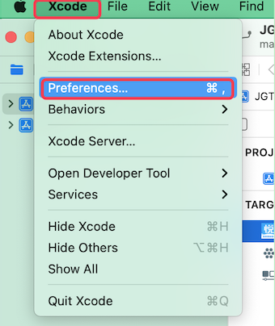

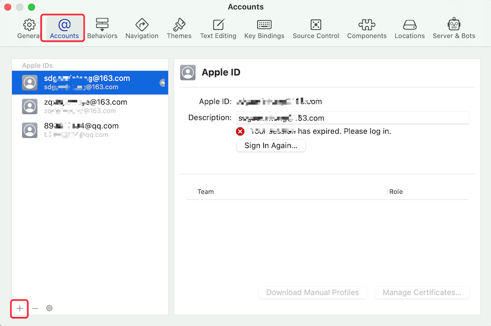

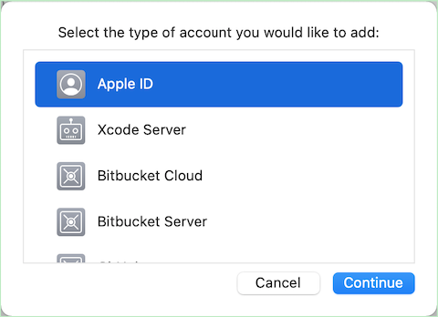

## 1.2. 调整schema

用于确定打出来的包是生产版还是开发版。

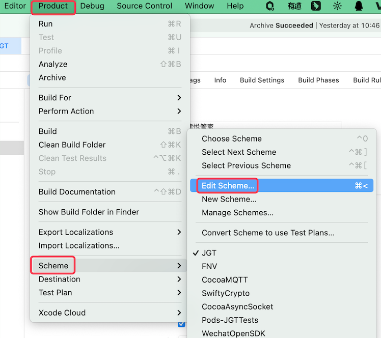

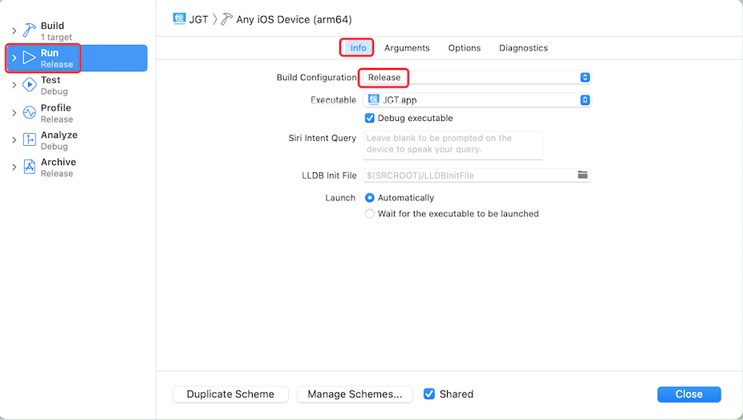

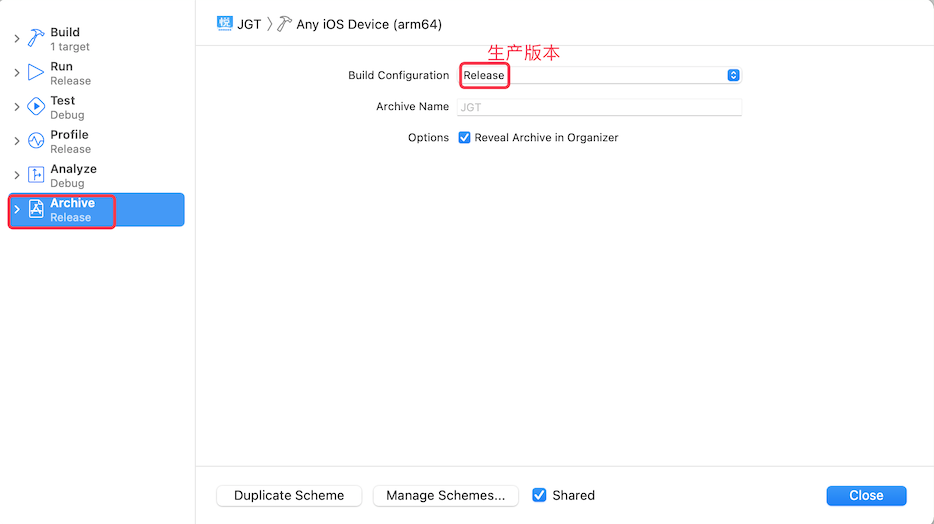

## 1.3. 调整版本号和Team

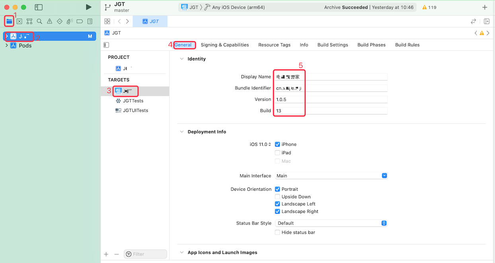

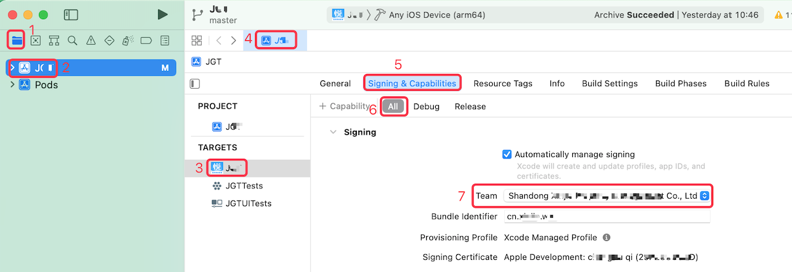

## 1.4. 打包(archive)

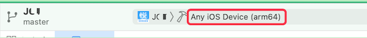

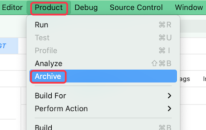

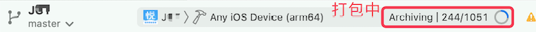

## 1.5. 查看打包文件并分发

> 默认情况下，打包成功后会自动跳转到分发界面，也就是下面的第二幅图。如果没有自动跳转，则通过第一张图的方式进入。

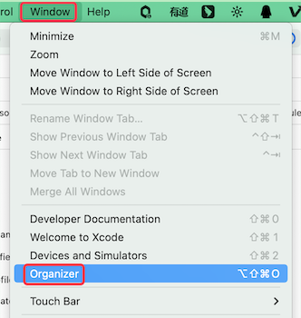

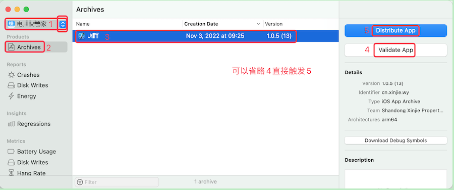

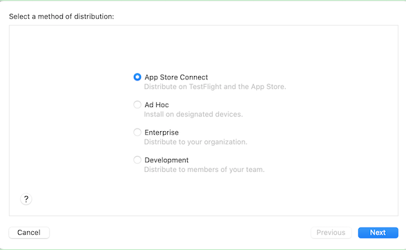

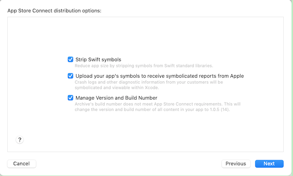

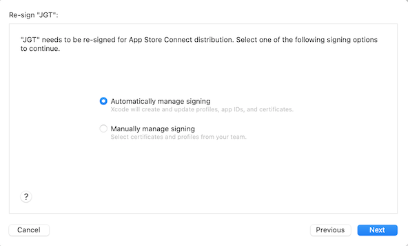

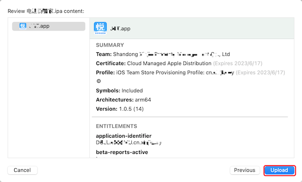

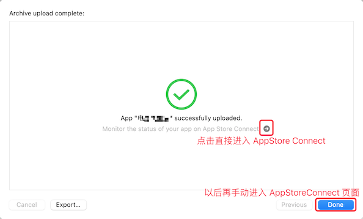

## 1.6. 提交审核

### 1.6.1. 登录并查看

登录 [App Store Connect —— iOS 应用市场](https://appstoreconnect.apple.com/login)：

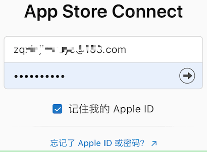

登录之后会看到如下页面，点击 `我的App`：

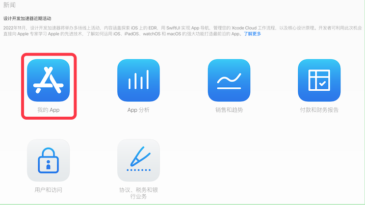

显示已上架的 App：

### 1.6.2. 更新版本

点击上图中需要更新版本的 App 图标，进入 App 详情页面：

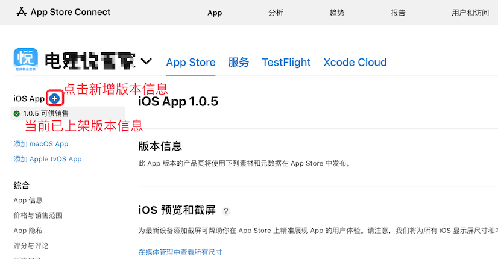

点击上图中的 `+` 添加新的版本 ：

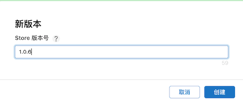

### 1.6.3. 提交新App-待补充

### 1.6.4. 提交审核

点击左侧版本列表中的新增版本号，然后描述该版本的变更内容：

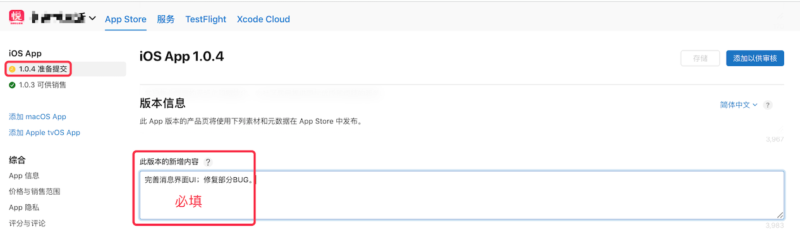

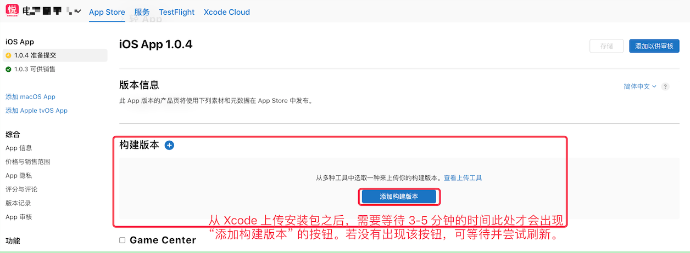

勾选版本，并点击`完成`：

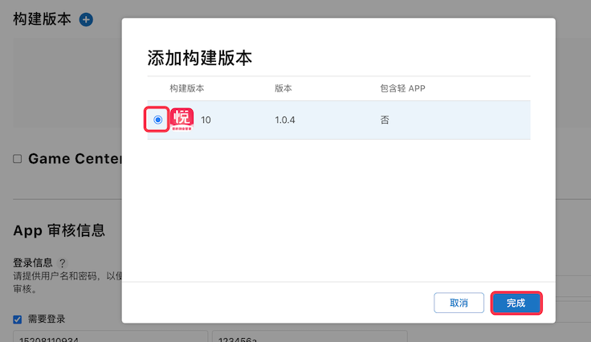

后续会出现多个类似下图的合规证明弹窗，根据自己的实际情况勾选并点击 `下一步`：

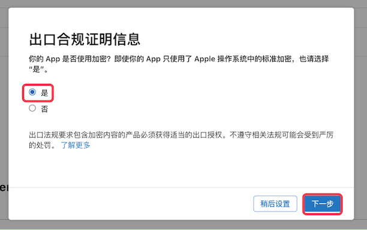

存储当前信息：

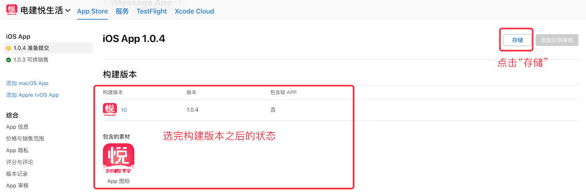

提交审核：

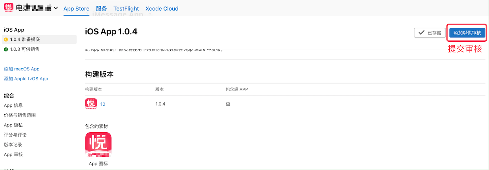

点击上图中的 `添加以供审核` 之后，会进入如下图的新页面，点击右上角的 `提交至App审核` 即可。

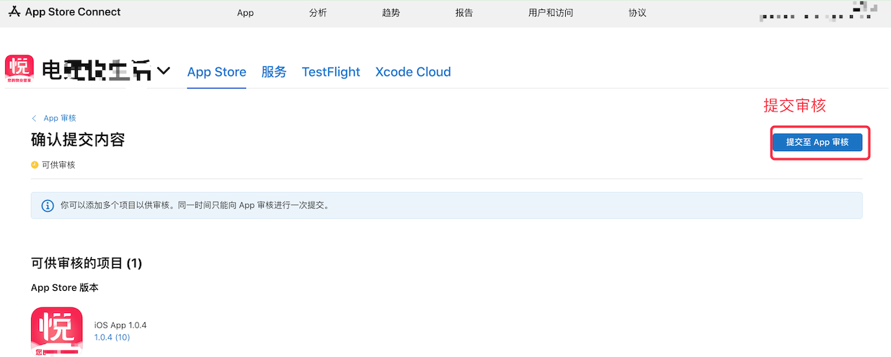

点击之后，界面如下：

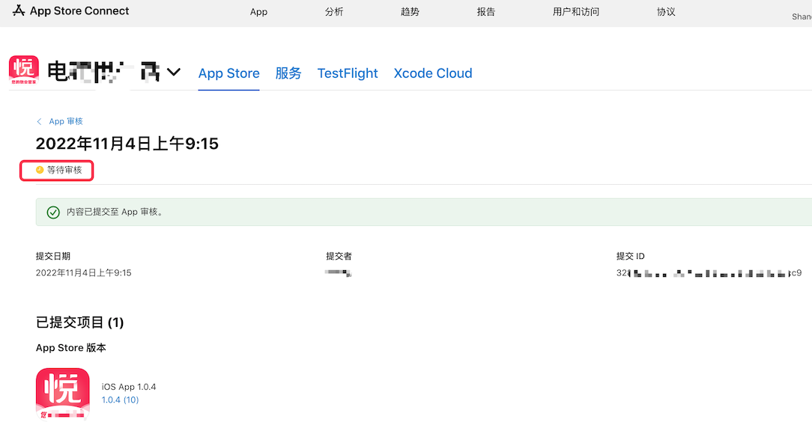

至此，提审完成，我们留意邮箱及页面的审核状态即可。
