创建证书时需要先创建请求文件，然后再去开发者网站创建 AppId，然后再从开发者网站申请对应的证书。

## 1.1 创建证书请求文件

创建证书时需要先从本机的 `钥匙串访问` 中创建一个用于请求证书的 `.certSigningRequest` 文件，如下：

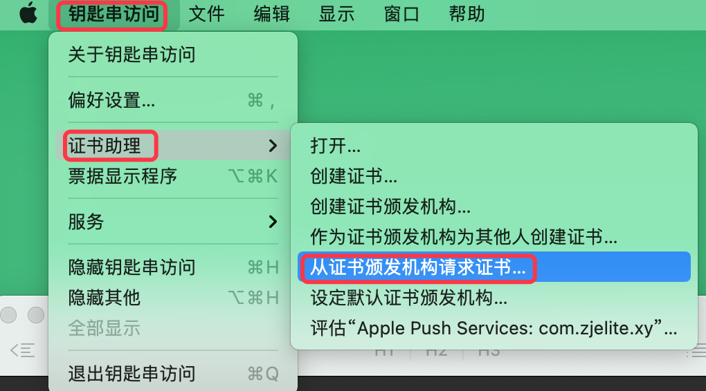

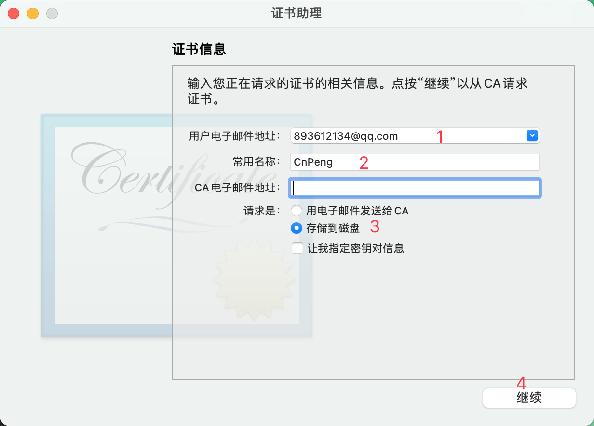

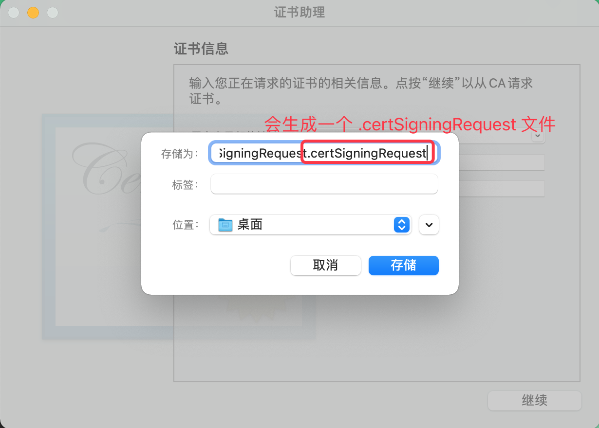

## 1.2 开发者网站创建 APP

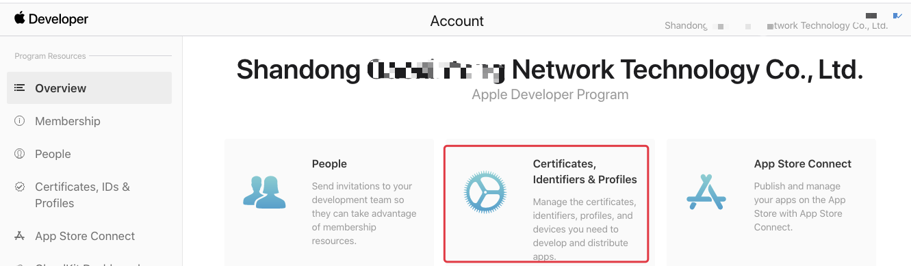

`Identifiers` 选项卡可以查看和创建  APPID：

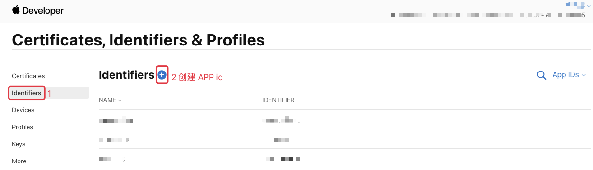

## 1.3 开发者网站创建证书

### 1.3.1 证书分类

常用的 iOS 的证书有三种：开发证书、发布证书、推送证书

* `开发证书`: 即 `Development` ，适用于开发环境，实现将应用安装到苹果真机测试 APP 运行的情况。
* `发布证书`: 即 `Distribution` ，当 App 开发完成需要上架到应用市场时，就必须使用发布证书打包 (打包后的文件为 ipa 格式)，然后才能上传到 App Store 等待审核。一个账号下最多能创建 3 个 `Distribution` 证书。
* `推送证书`: 用于推送通知消息。配置该证书之后，推送的消息就可以在系统栏下拉查看。推送证书又分为：`Apple Push Services` 和 `APNs Development iOS`, 前者用于生产环境，后者用于开发环境。

### 1.3.2 创建推送证书

`Certificates` 选项卡下可以创建和查看证书：

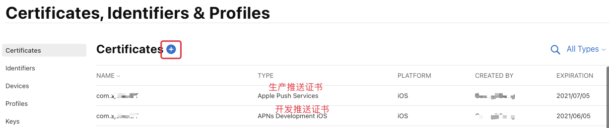

然后在新打开的 `Create a New Certificate` 界面中选择 `Services` 下的内容，如下：

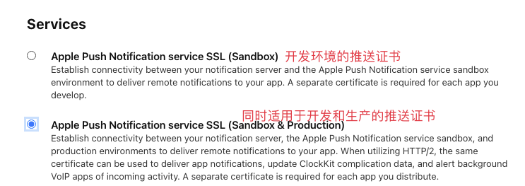

选择完想要创建的证书之后，点击页面右上角的 `continue`，如下：

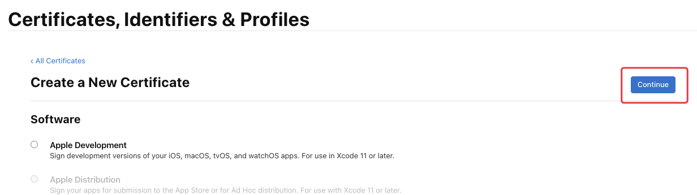

然后选择使用证书的 app:

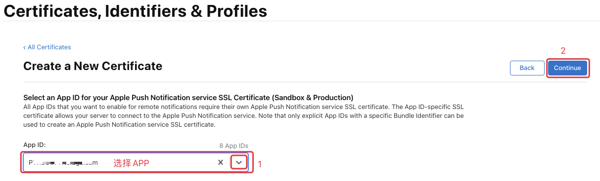

上传之前创建好的  `.certSigningRequest` 文件：

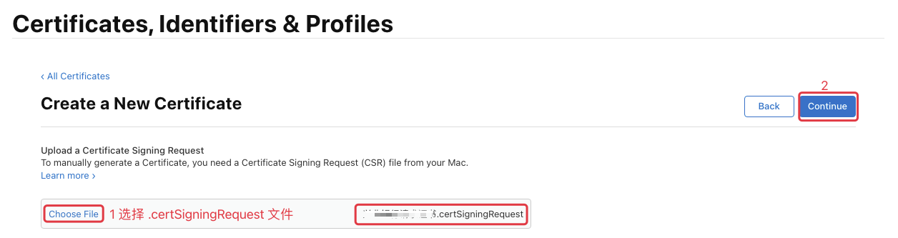

然后会看到下图的样子，点击 `Download` 即可下载该证书：

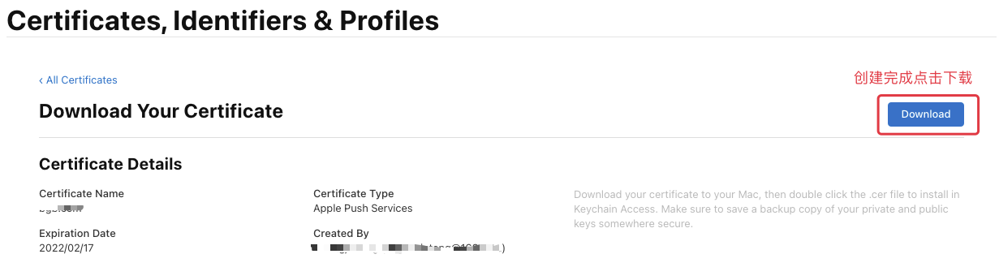

## 参考内容

* [《iOS创建苹果证书、制作p12证书流程》](https://blog.csdn.net/u010263943/article/details/108003540)
