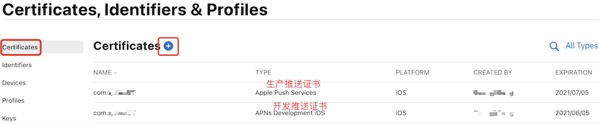
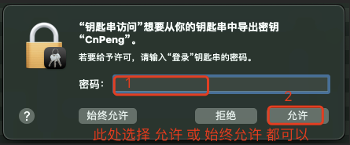

## 1. 创建证书

创建证书时需要先创建请求文件，然后再去开发者网站创建 AppId，然后再从开发者网站申请对应的证书。

### 1.1. 1.1 创建证书请求文件

创建证书时需要先从本机的 `钥匙串访问` 中创建一个用于请求证书的 `.certSigningRequest` 文件，如下：


将 `.certSigningRequest` 文件存储到本地目录，方便后续步骤使用。

### 1.2. 1.2 开发者网站创建 APPID


`Identifiers` 选项卡可以查看和创建  APPID：


### 1.3. 1.3 开发者网站创建证书

#### 1.3.1. 1.3.1 证书分类

常用的 iOS 的证书有三种：开发证书、发布证书、推送证书

* `开发证书`: 即 `Development` ，适用于开发环境，实现将应用安装到苹果真机测试 APP 运行的情况。
* `发布证书`: 即 `Distribution` ，当 App 开发完成需要上架到应用市场时，就必须使用发布证书打包 (打包后的文件为 ipa 格式)，然后才能上传到 App Store 等待审核。一个账号下最多能创建 3 个 `Distribution` 证书。
* `推送证书`: 用于推送通知消息。配置该证书之后，推送的消息就可以在系统栏下拉查看。推送证书又分为：`Apple Push Services` 和 `APNs Development iOS`, 前者用于生产环境，后者用于开发环境。

#### 1.3.2. 1.3.2 创建推送证书


`Certificates` 选项卡下可以创建和查看证书：



然后在新打开的 `Create a New Certificate` 界面中选择 `Services` 下的内容，如下：


选择完想要创建的证书之后，点击页面右上角的 `continue`，如下：


然后选择使用证书的 app:


上传之前创建好的  `.certSigningRequest` 文件：


然后会看到下图的样子，点击 `Download` 即可下载该证书：


下载下来的证书默认名称为 `aps.cer`。

## 2. 导出p12格式

### 2.1. 导入到钥匙串

打开电脑端的 `钥匙串访问` 软件：


点击 `登录`-`我的证书`，将前面下载的 `aps.cer` 证书拖到此处：


拖入成功后，会在上图 3 处显示。同时我们也看到了有红色的错误提示 "证书不受信任"，所以我们右击新导入的证书时，发现右键菜单中并没有 `导出` 选项（下图5处）：


### 2.2. 解决证书不受信任

双击刚才导入的证书（即上一小节中的3），然后选择下图中的 `信任`：


点击下图中 `使用此证书时` 右侧的下拉按钮，然后选择 `始终信任`：


按照提示输入密码:


到此，不受信任的问题已经解决。

### 2.3. 导出p12

> 注意：
> 
> * 如果证书不是在你自己的电脑上创建的，下图中右击依旧不会有 `导出` 选项。此时，可以重新建立证书。
> * 如果证书是自己创建的，但右击还是没有 `导出` 选项，则可以重启 `钥匙串访问` 工具。

在 `登录`-`我的证书` 中右击导入的证书，选择 `导出`。


选择导出格式，输入文件名称，选择输出目录：


输入密码，该密码用于保护证书，需要妥善保存（后续使用该证书时，会用到该密码）：


输入电脑密码：



查看导出的证书：


## 3. 转换成其他格式

在某些场景下， 我们还需要将证书转换成其他格式。如下：

### 3.1. P12 和 base64

不同的终端工具中，命令可能会有所不一致，所以，先通过 `base64 --help` 查看帮助信息，如下：


* P12 -> base64 

```bash
base64 -i 证书名称.p12 -o 输出文件名.输出格式
```


* base64 -> P12

```bash
base64 -D -i cert1.txt -o 证书1.p12 
```

也可以使用 [文件Base64在线编码和解码工具](https://www.hitoy.org/tool/file_base64.php) 来实现转换。

base64 相关命令：


### 3.2. P12(PKCS12) 和 JKS

* P12 -> JKS

```shell
keytool -importkeystore -srckeystore test.p12 -srcstoretype PKCS12 -deststoretype JKS -destkeystore test.jks
```

* JSK ->P12

```shell
keytool -importkeystore -srckeystore test.jks -srcstoretype JKS -deststoretype PKCS12 -destkeystore test1.p12
```

### 3.3. JKS 和 CER

* JKS -> CER

```bash
keytool -export -alias test -keystore test.jks -storepass 123456 -file test.cer
```

* CER -> JKS

```bash
keytool -import -v -alias test -file test.cer -keystore test.jks -storepass 123456 -noprompt
```

### 3.4. PFX(P12) 和 pEM

>使用比较少

* 去除 pem 格式的 key 的密码(输出的密码不输入即可)

```bash
openssl rsa -in test.key -out test1.key
```

* 合并 PEM 格式输出 PFX(p12)

```bash
openssl pkcs12 -export -inkey test1.key -in test.crt -out test.pfx
```

* 指定 intermedian 和 CA

```bash
openssl pkcs12 -export -out test1.pfx -inkey my.private.key -in test.crt -certfile test.crt -CAfile test1.crt
```

* PFX 转回 PEM

```bash
openssl pkcs12 -in cert2.pfx -out cert22.pem -nodes
```

* PEM 转 KEY

```bash
openssl rsa -in test.pem -out test.key
```

### 3.5. DER 与 PEM 转换

* DER -> PEM

```bash
openssl x509 -in cert.crt -inform der -outform pem -out cert.pem
```

* PEM -> DER

```bash
openssl x509 -in cert.crt -outform der-out cert.der
```

### 3.6. CER 与 PEM 转换

* CER -> PEM

```bash
openssl x509 -in cert2.cer -out cert2.pem -outform PEM
```

* PEM–>CERT

```bash
# 这里需要PEM——>PKCS12—–>CRT—–>CER

# PEM-->PKCS12
openssl pkcs12 -export -out cacert.p12 -in cacert.pem

# PKCS12-->CRT
openssl pkcs12 -in cacert.p12 -out mycerts.crt -nokeys -clcerts

# CRT-->CER
openssl x509 -inform pem -in mycerts.crt -outform der -out mycerts.cer
```

### 3.7. JKS 与 PEM 转换

这里可能是上面方法的整合，但为了方便以后开发，还是整合好堆积起来比较美。

* JKS -> PEM

```bash
# JSK转换为PEM需要先，JKS–>P12–>PEM

# jks--->p12[需要注意这里必须add -alias keyOwnerAlias 否则会报错]
keytool -importkeystore -srckeystore sert.jks -destkeystore sert.p12 -srcstoretype jks -deststoretype pkcs12 -alias keyOwnerAlias

# p12--->pem
openssl pkcs12 -in sert.p12 -out sert.pem
```

* PEM -> JKS

```bash
# PEM转换为JKS，需要先PEM—>PFX—->JKS

# PEM--->PFX
openssl pkcs12 -export -out test.pfx -inkey test.key -in test.pem

# PFX--->JKS
keytool -importkeystore -srckeystore test.pfx -destkeystore test.jks -srcstoretype PKCS12 -deststoretype JKS
```

### 3.8. JKS文件转换为KEYSTORE文件

* JKS -> KEYSTORE

```bash
//JKS--->P12
keytool -importkeystore -srckeystore D:\test.keystore -srcstoretype JKS -deststoretype PKCS12 -destkeystore test1.p12
//P12---->KEYSTORE
keytool -v -importkeystore -srckeystore D:\test.p12 -srcstoretype PKCS12 -destkeystore D:\test.keystore -deststoretype JKS
```

* KEYSTORE -> JKS

```bash
# keystore--->crt
keytool -export -alias test -file D:\test.crt -keystore D:\test.keystore

# CRT-->CER
openssl x509 -inform pem -in test.crt -outform der -out test.cer

# CER--->JKS
keytool -import -v -alias test -file test.cer -keystore test.jks -storepass 123456 -noprompt 
```


## 4. 参考内容

* [《iOS创建苹果证书、制作p12证书流程》](https://blog.csdn.net/u010263943/article/details/108003540)
* [证书密钥转换P12,JKS,CER,RFX,PEM](https://www.jianshu.com/p/dff237d75516)
* [证书格式转换-在线版](https://myssl.com/cert_convert.html)