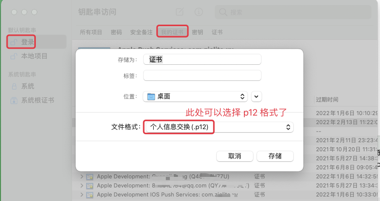

# 1. iOS 苹果钥匙串工具无法导出p12证书的解决

原文：[《iOS苹果证书无法生成.P12文件解决方法》](https://blog.csdn.net/niumanxx/article/details/80584928?utm_medium=distribute.pc_relevant.none-task-blog-BlogCommendFromBaidu-1.control&depth_1-utm_source=distribute.pc_relevant.none-task-blog-BlogCommendFromBaidu-1.control)

> 下文中图片内容基于 Big Sur 11.1 截取，不同系统版本中 `钥匙串访问` 的界面略有不同

一般 `.p12` 文件是给别人使用的，本机必须是专用密钥下的证书才可以生成 `.p12` 文件，也就是说你在 **`所有项目`** 里找到的证书是无法生成 `.P12文` 件的，因为它并不是在 **专用密钥** 下或者它不携带有专用密钥。

在安装证书时，如果将证书安装在系统里目录里，则无法生成 `.P12` 文件。因为用户的专用密钥一般是不会添加到系统密钥里，除非自己手动添加。

## 1.1. 2.1 问题现象

下图是一个无法导出的情况：

`.p12` 格式证书无法选择：

## 1.2. 2.2 解决方法

将证书拖到(或拷贝) **`登录`**里目录下，然后在 `我的证书`、`密钥`、`证书` 三者中的任一选项卡中都可以找到我们的证书文件，右击之后都可以生成 `.P12` 文件，如图

## 1.3. 2.3 总结

`我的证书`、`密钥`、`证书` 三个选项卡中有一个共同特点：**其中的证书携带有专用密钥或在专用密钥下才可以生成 `.P12文件`**，而在 `所有项目` 里找到的证书并没有这一特点。这就是证书无法生成 `.P12` 文件的原因。如下：

看到网上很多解决办法是 Revoke 掉证书重新生成，其实并不需要这么做，除非你的 Bundle ID 注册错了。
