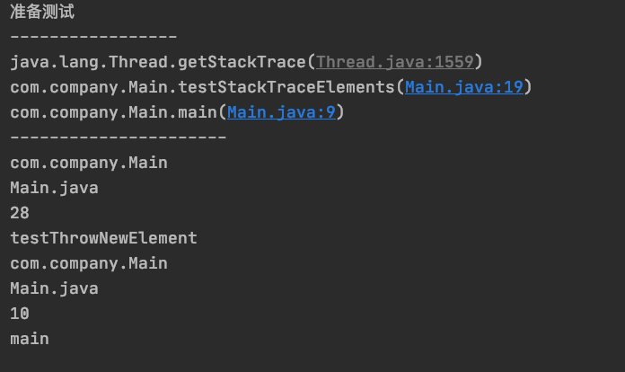

# 1. 8-StackTrace

## 1.1. 什么是StackTrace

StackTrace (堆栈轨迹)存放的就是**方法调用栈**的信息，每次调用一个方法会产生一个方法栈，当前方法调用另外一个方法时会使用栈将当前方法的现场信息保存在此方法栈当中，获取这个栈就可以得到方法调用的详细过程。

例如：异常处理中常用的 `e.printStackTrace()` 实质就是打印异常调用的堆栈信息。

## 1.2. StackTraceElement

### 1.2.1. StackTraceElement简介和源码

StackTraceElement 表示 StackTrace (堆栈轨迹)中的一个方法对象，通过这个对象可以获取调用栈当中的调用过程信息，包括方法的类名、方法名、文件名以及调用的行数。

StackTraceElement 的源码如下：

```java
/* @since  1.4
 * @author Josh Bloch
 */
public final class StackTraceElement implements java.io.Serializable {
    // Normally initialized by VM (public constructor added in 1.5)
    private String declaringClass;
    private String methodName;
    private String fileName;
    private int    lineNumber;

    public StackTraceElement(String declaringClass, String methodName,
                             String fileName, int lineNumber) {
        this.declaringClass = Objects.requireNonNull(declaringClass, "Declaring class is null");
        this.methodName     = Objects.requireNonNull(methodName, "Method name is null");
        this.fileName       = fileName;
        this.lineNumber     = lineNumber;
    }

    public String getFileName() {
        return fileName;
    }

    public int getLineNumber() {
        return lineNumber;
    }

    public String getClassName() {
        return declaringClass;
    }

    public String getMethodName() {
        return methodName;
    }

    public boolean isNativeMethod() {
        return lineNumber == -2;
    }

    public String toString() {
        return getClassName() + "." + methodName +
            (isNativeMethod() ? "(Native Method)" :
             (fileName != null && lineNumber >= 0 ?
              "(" + fileName + ":" + lineNumber + ")" :
              (fileName != null ?  "("+fileName+")" : "(Unknown Source)")));
    }

    public boolean equals(Object obj) {
        if (obj==this)
            return true;
        if (!(obj instanceof StackTraceElement))
            return false;
        StackTraceElement e = (StackTraceElement)obj;
        return e.declaringClass.equals(declaringClass) &&
            e.lineNumber == lineNumber &&
            Objects.equals(methodName, e.methodName) &&
            Objects.equals(fileName, e.fileName);
    }

    public int hashCode() {
        int result = 31*declaringClass.hashCode() + methodName.hashCode();
        result = 31*result + Objects.hashCode(fileName);
        result = 31*result + lineNumber;
        return result;
    }

    private static final long serialVersionUID = 6992337162326171013L;
}
```

### 1.2.2. 获取StackTraceElement

获取 StackTraceElement 的方法有两种，均返回 StackTraceElement 数组，也就是这个栈的信息：

```java
//method 1
Thread.currentThread().getStackTrace()
//method 2
new Throwable().getStackTrace() 
```

## 1.3. 示例

```java
public static void main(String[] args) {
        add();
        testStackTraceElements();
        testThrowNewElement();
    }

    public static void add() {
        System.out.println("准备测试");
    }

    public static void testStackTraceElements() {
        System.out.println("-----------------");
        StackTraceElement[] stackTraceElements = Thread.currentThread().getStackTrace();
        for (int i = 0; i < stackTraceElements.length; i++) {
            System.out.println(stackTraceElements[i]);

        }
    }

    public static void testThrowNewElement() {
        System.out.println("----------------------");
        StackTraceElement[] testThrows = new Throwable().getStackTrace();
        for (int i = 0; i < testThrows.length; i++) {
            System.out.println(testThrows[i].getClassName());
            System.out.println(testThrows[i].getFileName());
            System.out.println(testThrows[i].getLineNumber());
            System.out.println(testThrows[i].getMethodName());


        }
    }
```

可以看到每一个StackTraceElement元素都有获取类名、文件名、所在行数及方法名具体的get方法。

结果如下（在日志中，getStackTrace()方法还是比较常用的）:


