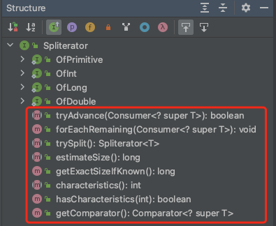

# 1. Spliterator并行遍历

## 1.1. Spliterator 简介

>public interface Spliterator<T>

Iterator 是顺序遍历迭代器，Spliterator 则是可分割 (splitable iterator) 并行迭代器。

jdk1.8 发布后，对于并行处理的能力大大增强，Spliterator 就是为了并行遍历元素而设计的一个迭代器，jdk1.8 中的集合框架中的数据结构都默认实现了spliterator。

## 1.2. Spliterator 接口内部结构



```java
//对单个元素执行给定的动作，如果有剩下元素未处理返回 true，否则返回 false
 boolean tryAdvance(Consumer<? super T> action);

 //对每个剩余元素执行给定的动作，依次处理，直到所有元素已被处理或被异常终止。默认方法调用 tryAdvance 方法
 default void forEachRemaining(Consumer<? super T> action) {
    do { } while (tryAdvance(action));
 }

 //对任务分割，返回一个新的 Spliterator 迭代器
 Spliterator<T> trySplit();

 //用于估算还剩下多少个元素需要遍历
 long estimateSize();

 //当迭代器拥有SIZED特征时，返回剩余元素个数；否则返回-1
 default long getExactSizeIfKnown() {
    return (characteristics() & SIZED) == 0 ? -1L : estimateSize();
 }

  //返回当前对象有哪些特征值
 int characteristics();

 //是否具有当前特征值，特征值取值有：ORDERED、DISTINCT、SORTED、SIZED、NONNULL、IMMUTABLE、CONCURRENT、SUBSIZED
 default boolean hasCharacteristics(int characteristics) {
    return (characteristics() & characteristics) == characteristics;
 }

 //如果 Spliterator 的 list 是通过 Comparator 排序的，则返回 Comparator
 //如果 Spliterator 的 list 是自然排序的 ，则返回 null
 //其他情况下抛错
 default Comparator<? super T> getComparator() {
     throw new IllegalStateException();
 }
```


## 1.3. ArrayList.ArrayListSpliterator

ArrayList.ArrayListSpliterator 直接实现了 Spliterator，其内部实现如下：

```java
static final class ArrayListSpliterator<E> implements Spliterator<E> {
    //用于存放ArrayList对象
   private final ArrayList<E> list;
   //起始位置（包含），advance/split操作时会修改
   private int index;
   //结束位置（不包含），-1 表示到最后一个元素
   private int fence;
   //用于存放list的modCount
   private int expectedModCount;

   ArrayListSpliterator(ArrayList<E> list, int origin, int fence,
                             int expectedModCount) {
            this.list = list;
            this.index = origin;
            this.fence = fence;
            this.expectedModCount = expectedModCount;
        }

   //获取结束位置（存在意义：首次初始化石需对fence和expectedModCount进行赋值）
   private int getFence() {
        int hi;
        ArrayList<E> lst;
        //fence<0时（第一次初始化时，fence才会小于0）：
        if ((hi = fence) < 0) {
            //list 为 null时，fence=0
            if ((lst = list) == null)
                hi = fence = 0;
            else {
            //否则，fence = list的长度。
                expectedModCount = lst.modCount;
                hi = fence = lst.size;
            }
        }
        return hi;
    }

    //分割list，返回一个新分割出的 spliterator 实例
    public ArrayListSpliterator<E> trySplit() {
        //计算中间的位置, hi为当前的结束位置, lo 为起始位置
        int hi = getFence(), lo = index, mid = (lo + hi) >>> 1;
        //当lo>=mid,表示不能在分割，返回null
        //当lo<mid时,可分割，切割（lo，mid）出去，同时更新index=mid
        return (lo >= mid) ? null :
            new ArrayListSpliterator<E>(list, lo, index = mid,expectedModCount);
    }

    //返回true 时，只表示可能还有元素未处理; 返回false 时，没有剩余元素处理了。。。
    public boolean tryAdvance(Consumer<? super E> action) {
         if (action == null)
             throw new NullPointerException();
         //hi为当前的结束位置，i 为起始位置
         int hi = getFence(), i = index;
         //还有剩余元素未处理时
         if (i < hi) {
             //处理i位置，index+1
             index = i + 1;
             @SuppressWarnings("unchecked") 
             E e = (E)list.elementData[i];
             action.accept(e);
             //遍历时，结构发生变更，抛错
             if (list.modCount != expectedModCount)
                 throw new ConcurrentModificationException();
             return true;
         }
         return false;
     }

   //顺序遍历处理所有剩下的元素
   public void forEachRemaining(Consumer<? super E> action) {
       int i, hi, mc; // hoist accesses and checks from loop
       ArrayList<E> lst; Object[] a;
       if (action == null)
           throw new NullPointerException();
       if ((lst = list) != null && (a = lst.elementData) != null) {
           //当fence<0时，表示fence和expectedModCount未初始化，可以思考一下这里能否直接调用getFence()，嘿嘿？
           if ((hi = fence) < 0) {
               mc = lst.modCount;
               hi = lst.size;
           }
           else
               mc = expectedModCount;
           if ((i = index) >= 0 && (index = hi) <= a.length) {
               for (; i < hi; ++i) {
                   @SuppressWarnings("unchecked") E e = (E) a[i];
                   //调用action.accept处理元素
                   action.accept(e);
               }
               //遍历时发生结构变更时抛出异常
               if (lst.modCount == mc)
                   return;
           }
       }
       throw new ConcurrentModificationException();
   }

   public long estimateSize() {
        return (long) (getFence() - index);
    }

    public int characteristics() {
        //打上特征值：、可以返回size
        return Spliterator.ORDERED | Spliterator.SIZED | Spliterator.SUBSIZED;
    }
}
```

测试代码：

```java
List<String>  arrs = new ArrayList<>();
 arrs.add("a");
 arrs.add("b");
 arrs.add("c");
 arrs.add("d");
 arrs.add("e");
 arrs.add("f");
 arrs.add("h");
 arrs.add("i");
 arrs.add("j");

 //此时结果：a:0-9（index-fence）
 Spliterator<String> a =  arrs.spliterator();

 //此时结果：b:4-9,a:0-4
 Spliterator<String> b = a.trySplit();

 //此时结果：c:4-6,b:4-9,a:6-9
 Spliterator<String> c = a.trySplit();

 //此时结果：d:6-7,c:4-6,b:4-9,a:7-9
 Spliterator<String> d = a.trySplit();
```

## 1.4. OfPrimitive

在 Spliterator 内部还有一个衍生的子接口：OfPrimitive

```java
public interface OfPrimitive<T,
        T_CONS,
        T_SPLITR extends Spliterator.OfPrimitive<T, T_CONS, T_SPLITR>>
        extends Spliterator<T> {
    @Override
    T_SPLITR trySplit();
    @SuppressWarnings("overloads")
    boolean tryAdvance(T_CONS action);
    @SuppressWarnings("overloads")
    default void forEachRemaining(T_CONS action) {
        do {
        } while (tryAdvance(action));
    }
}
```

该接口相较于 Spliterator 没有太大的区别，只不过增加了两个泛型声明。该泛型要求在实现接口时必须先声明 `tryAdvance()` 的 action 参数中的元素类型 `T_CONS` 和 `trySplit()` 的返回值中的元素类型 `T_SPLITR`。

基于 OfPrimitive 接口，又衍生出了 OfInt、OfLong、OfDouble 等专门用来处理 int、Long、double 等分割迭代器接口（在 Spliterators 有具体的实现）。

## 1.5. IntArraySpliterator

Spliterator 是接口，在 `public final class Spliterators` 类中提供了该接口的一些实现类。

此处以 `Spliterator.OfInt` 接口的实现类 `IntArraySpliterator` 为例。

```java
//与 ArrayList 不同的是，array 是实现声明的，因此不必担心遍历过程中发生结构变更。
static final class IntArraySpliterator implements Spliterator.OfInt {
    private final int[] array;
    private int index;
    private final int fence;
    //用于记录特征值
    private final int characteristics;

    // 初始构造器
    public IntArraySpliterator(int[] array, int additionalCharacteristics) {
        this(array, 0, array.length, additionalCharacteristics);
    }

    public IntArraySpliterator(int[] array, int origin, int fence, int additionalCharacteristics) {
        this.array = array;
        this.index = origin;
        this.fence = fence;
        this.characteristics = additionalCharacteristics | Spliterator.SIZED | Spliterator.SUBSIZED;
    }

    @Override
    public OfInt trySplit() {
        //分割，上面做过介绍，不在赘述
        int lo = index, mid = (lo + fence) >>> 1;
        return (lo >= mid)
                ? null
                : new IntArraySpliterator(array, lo, index = mid, characteristics);
    }

    @Override
    public void forEachRemaining(IntConsumer action) {
        int[] a; int i, hi; // hoist accesses and checks from loop
        if (action == null)
            throw new NullPointerException();
        if ((a = array).length >= (hi = fence) &&
                (i = index) >= 0 && i < (index = hi)) {
            do { action.accept(a[i]); } while (++i < hi);
        }
    }

    @Override
    public boolean tryAdvance(IntConsumer action) {
        if (action == null)
            throw new NullPointerException();
        if (index >= 0 && index < fence) {
            action.accept(array[index++]);
            return true;
        }
        return false;
    }

    @Override
    public long estimateSize() { return (long)(fence - index); }

    @Override
    public int characteristics() {
        return characteristics;
    }

    @Override
    public Comparator<? super Integer> getComparator() {
        if (hasCharacteristics(Spliterator.SORTED))
            return null;
        throw new IllegalStateException();
    }
}
```

## 1.6. Arrays.spliterator()

在 java.util.Arrays 中有 `spliterator()` 和 `spliterator(,,)` 方法。该方法可以获取元素为数组的  Spliterator 接口实例。

### 1.6.1. Arrays.spliterator() 的内部实现

函数定义如下（以 `int[] array` 为例）：

```java
// 对全部数组元素进行遍历
public static Spliterator.OfInt spliterator(int[] array)

// 对指定范围内的元素进行遍历，包含起始索引 startInclusive，不包含结束索引 endExclusive
public static Spliterator.OfInt spliterator(int[] array, int startInclusive, int endExclusive)
```

以 `spliterator(,,)` 为例，其内部实现为：

```java
public static Spliterator.OfInt spliterator(int[] array, int startInclusive, int endExclusive) {
   return Spliterators.spliterator(array, startInclusive, endExclusive, Spliterator.ORDERED | Spliterator.IMMUTABLE);
}
```

`Spliterators.spliterator(,,,)` 的内部实现如下：

```java
public static Spliterator.OfInt spliterator(int[] array, int fromIndex, int toIndex,int additionalCharacteristics) {
   checkFromToBounds(Objects.requireNonNull(array).length, fromIndex, toIndex);
   return new IntArraySpliterator(array, fromIndex, toIndex, additionalCharacteristics);
}
```

上述代码中，首先会通过 `checkFromToBounds(,,)` 检查传入的 fromIndex、toIndex 是否合法，不合法则抛出异常，其内部实现如下：

```java
  private static void checkFromToBounds(int arrayLength, int origin, int fence) {
        if (origin > fence) {
            throw new ArrayIndexOutOfBoundsException(
                    "origin(" + origin + ") > fence(" + fence + ")");
        }
        if (origin < 0) {
            throw new ArrayIndexOutOfBoundsException(origin);
        }
        if (fence > arrayLength) {
            throw new ArrayIndexOutOfBoundsException(fence);
        }
    }
```

如果 `checkFromToBounds(,,)` 合法则构造一个 `IntArraySpliterator` 实例。

### 1.6.2. IntConsumer

在前面小节中，我们通过 `Arrays.spliterator()` 或 `Arrays.spliterator(,,)` 可以获取到 `Spliterator.OfInt` 实例，如果我们需要调用该实例的 `forEachRemaining()` 或 `tryAdvance()` 方法就需要传入一个 `IntConsumer`类型的参数 action。

`IntConsumer` 的内部定义如下：

```java
public interface IntConsumer {

    // 对给定的 value 执行操作。（value 是数组的元素，该操作不会改变数组元素本身）
    void accept(int value);

    // 执行完 accept 之后再执行新提供的 after 对象中的 accept 方法
    default IntConsumer andThen(IntConsumer after) {
        Objects.requireNonNull(after);
        return (int t) -> { accept(t); after.accept(t); };
    }
}
```

示例：

```java
public void TEST() {
    int[] arr = {1, 2, 3, 4, 5, 6, 7, 8, 9};
    Spliterator.OfInt sInt = Arrays.spliterator(arr, 2, 5);
    IntConsumer consumer = new IntConsumer() {
        @Override
        public void accept(int value) {
            System.out.println(value);
        }
    };
    consumer = consumer.andThen(new IntConsumer() {
        @Override
        public void accept(int value) {
            System.out.println("i am after");
        }
    });
    sInt.tryAdvance(consumer);
}
```

### 1.6.3. 数组并行遍历示例

先定义一个 `SpliteratorThread`:

```java
public class SpliteratorThread<T> extends Thread {
    private Spliterator<T> mSpliterator;
    public SpliteratorThread(Spliterator<T> spliterator) {
        mSpliterator = spliterator;
    }

    @Override
    public void run() {
        super.run();

        if (mSpliterator != null) {
            mSpliterator.forEachRemaining(new Consumer<T>() {
                @Override
                public void accept(T t) {
                    System.out.println( Thread.currentThread().getName() + "-" + t + " ");
                }
            });
        }
    }
}
```

测试函数入口：

```java
public class Client {
    public static void main(String [] args) {
        int [] arr = {1,2,3,4,5,6,7,8,9,10};

        Spliterator<Integer> spliterator0 = Arrays.spliterator(arr);
        Spliterator<Integer> spliterator1 = spliterator0.trySplit();
        Spliterator<Integer> spliterator2 = spliterator1.trySplit();

        Thread t0 = new SpliteratorThread<>(spliterator0);
        t0.setName("t0");

        Thread t1 = new SpliteratorThread<>(spliterator1);
        t1.setName("t1");

        Thread t2 = new SpliteratorThread<>(spliterator2);
        t2.setName("t2");

        t0.start();
        t1.start();
        t2.start();
    }
}
```

输出结果：

```
t1-3
t2-1
t0-6
t2-2
t1-4
t0-7
t1-5
t0-8
t0-9
t0-10
```

通过上述结果可以发现：线程 t0 遍历的元素：6,7,8,9,10；线程 t1 遍历的元素：3,4,5；线程 t2 遍历的元素：1,2。——**每个线程内部元素的遍历是有序的，但是线程的调度是无序的**。

以上结果显示了3个线程并行遍历的流程，这就是分割遍历最常用的场景。

**总结**

* 分割遍历的主要目的是为了实现并行遍历
* 分割遍历是在原数组的基础上进行遍历，遍历的过程中不会对原数组的元素进行修改
* 分割的规则是从待遍历的范围的中间位置进行分割
* 执行 `tryAdvance()` 之后待遍历的位置后移一位


## 1.7. 参考

* [JDK8源码之Spliterator并行遍历迭代器](https://blog.csdn.net/lh513828570/article/details/56673804)
* [Java迭代器spliterator](https://blog.csdn.net/sunboylife/article/details/103307072)

