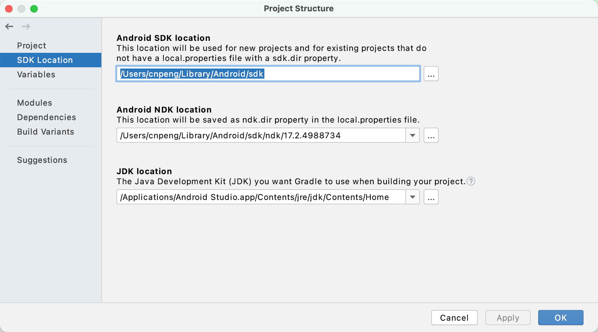

### 1、详细报错信息：

使用 IDEA 运行 Kotlin 程序时出现如下错误：

Error:Cannot run program "/Applications/IntelliJ IDEA CE.app/Contents/jre/jdk/Contents/Home/bin/java" (in directory "/Users/cnpeng/Library/Caches/IdeaIC2018.3/compile-server"): error=2, No such file or directory

### 2、解决办法：

出现该错误是因为 IDEA 关联的 JDK 出现了问题，解决办法如下：

File --> Project Structures --> Project 然后参考下图配置一个 JDK 即可。

