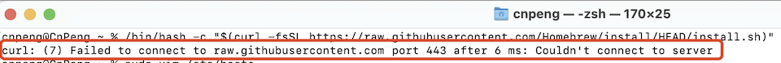
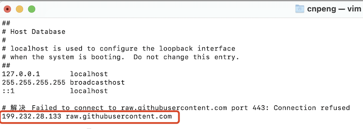
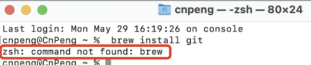
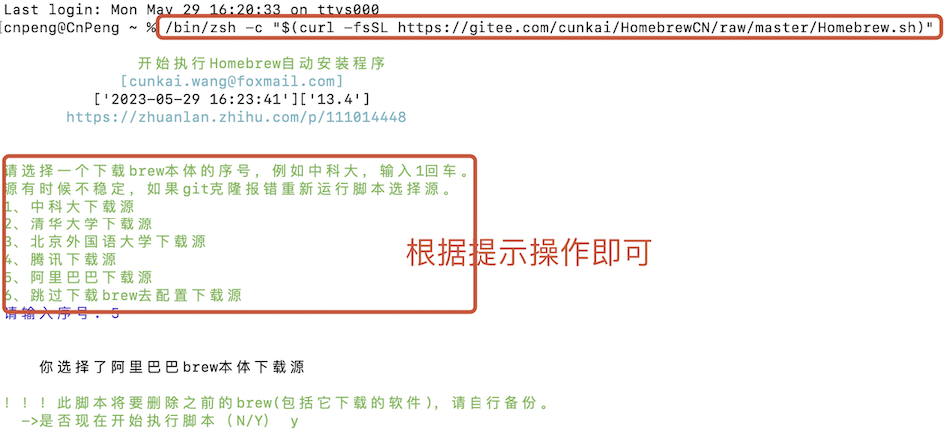

# 1. 000-开发环境配置

## 1.1. 安装 HomeBrew

按照 [官方网站](https://brew.sh/index_zh-cn) 说明，我们直接将下面的命令粘贴到终端即可：

```bash
/bin/bash -c "$(curl -fsSL https://raw.githubusercontent.com/Homebrew/install/HEAD/install.sh)"
```

### 1.1.1. 问题1

#### 1.1.1.1. 问题详细

但粘贴之后会发现有如下报错：

```
curl: (7) Failed to connect to raw.githubusercontent.com port 443 after 6 ms: Couldn't connect to server
```

具体如下图：



#### 1.1.1.2. 解决

此时，我们可以在终端输入如下命令：`sudo vim /etc/hosts` ，进入 hosts 编辑界面，然后在内容中追加：

```bash
199.232.28.133 raw.githubusercontent.com
```

追加之后如下：




完成上述两步操作之后，重新终端中执行安装命令即可正常安装。

### 1.1.2. 问题2

#### 1.1.2.1. 详情

经过前面的步骤后，通过 homeBrew 安装软件时可能还是会出现 `zsh: command not found: brew` 的错误，如下：



#### 1.1.2.2. 解决

切换国内源进行安装，如下：

```bash
/bin/zsh -c "$(curl -fsSL https://gitee.com/cunkai/HomebrewCN/raw/master/Homebrew.sh)"
```

然后根据提示操作即可：



执行完安装操作之后，接着在终端中执行  `source /Users/cnpeng/.zprofile` ，让相关配置立即生效。

## 1.2. 安装 git

### 1.2.1. 安装新版git

> 需要先确保已经安装好了 brew 工具

Xcode 会有自带的 git . 我们也可以在 [官方网站](https://git-scm.com/download/mac) 下载我们所需要的版本。

Mac 电脑可以在终端中通过执行 `brew install git` 来进行安装。


### 1.2.2. 配置命令别名

配置命令别名之后可以简化命令，提升 git 操作的速率

具体参考 `git/基础知识/为git命令创建别名.md` 

## 1.3. 安装 redis

> * 服务端项目需要使用 redis。
> * 安装前需要确保已经完成了 brew 的安装。

参考 [官方文档](https://redis.io/docs/getting-started/installation/install-redis-on-mac-os/) 在终端中输入 `brew install redis` 即可安装。

安装完成后使用 `redis-server` 可启动 redis ，通过 `ctrl+c` 可以关闭。


## 1.4. 安装 golang

### 1.4.1. 安装

参考 [官网](https://golang.google.cn/doc/install) 进行下载和安装。

按照上述地址中的描述，我们双击下载下来的 `go1.20.4.darwin-arm64.pkg` 即可执行 golang 的安装操作。

默认会安装在 `/usr/local/go`，并且会自动将 `/usr/local/go/bin` 目录添加到环境变量中。

为了确保环境变量生效，我们需要重启所有已经打开的终端界面。然后在终端中输入 `go version` 确认是否能正确输出版本，正确输出则表示已经安装成功。


### 1.4.2. 配置国内代理 

在终端中执行如下命令：

```bash
go env -w GOPROXY=https://goproxy.cn
```

如果不执行上述配置，那么在没有科学上网的时，拉取依赖包就会报错，错误信息如下：

```
dial tcp 172.217.163.49:443: i/o timeout
```


## 